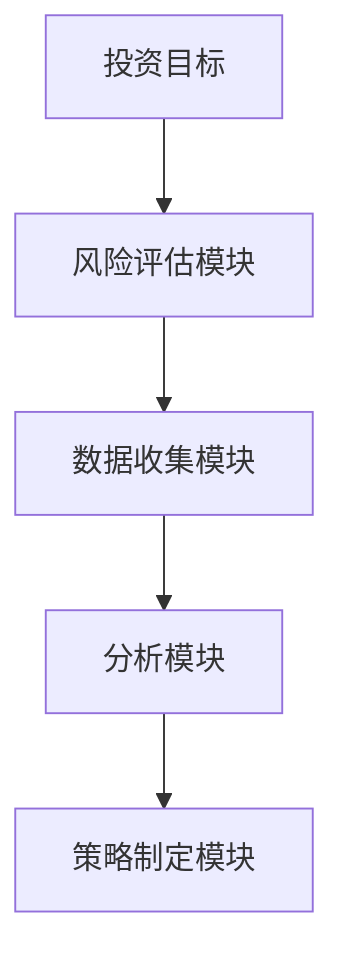

                 


# 芒格的"远离"策略在前沿科技投资中的重要性

> 关键词：芒格，投资策略，远离策略，前沿科技，风险评估

> 摘要：本文探讨了芒格的“远离”策略在前沿科技投资中的重要性。通过分析多元思维模型、风险评估方法和实际案例，展示了如何在高风险领域中应用“远离”策略来保护投资。

---

## 第1章: 芒格的"远离"策略概述

### 1.1 芒格的"远离"策略背景

芒格的“远离”策略是其投资哲学的重要组成部分，强调通过避免高风险领域来保护资本。在前沿科技投资中，如人工智能和区块链，这种策略尤为重要。这些领域的高波动性和不确定性使得“远离”策略成为一种有效的风险管理工具。

#### 问题背景
前沿科技领域技术更新快，市场波动大，投资者容易陷入盲目追涨的误区。芒格的“远离”策略提醒投资者要保持冷静，避免涉足不熟悉的领域。

#### 策略核心思想
芒格强调，投资不仅仅是寻找机会，更是识别和避免潜在风险。通过专注于自身熟悉且风险可控的领域，投资者可以有效降低损失。

#### 应用背景
随着科技的快速发展，投资者面临越来越多的选择，但同时也面临更高的风险。芒格的策略帮助投资者在机会与风险之间找到平衡。

---

### 1.2 芒格的多元思维模型

芒格的多元思维模型是“远离”策略的理论基础，它强调将不同领域的知识结合起来，形成多维度的分析框架。

#### 多元思维模型的定义
多元思维模型是指通过广泛涉猎各个领域的知识，形成一个相互关联的思维网络，从而在决策时能够多角度分析问题。

#### 模型与“远离”策略的关系
多元思维模型帮助投资者识别潜在风险，避免因单一视角导致的错误决策。通过跨领域分析，投资者能够更好地理解科技领域的复杂性。

#### 在科技投资中的应用
例如，在评估一项人工智能技术时，投资者需要考虑技术可行性、市场需求、法律风险等多个方面。多元思维模型帮助投资者全面评估这些因素。

---

## 第2章: 前沿科技投资中的风险分析

### 2.1 前沿科技投资的风险类型

#### 技术风险
技术不成熟或难以实现可能导致投资失败。例如，某些AI技术可能仍处于理论阶段，缺乏实际应用的可行性。

#### 市场风险
市场需求不足或竞争过于激烈可能导致投资失败。例如，区块链技术在某些行业的应用可能因市场饱和而难以成功。

#### 伦理与法律风险
前沿科技如基因编辑和AI可能引发伦理争议，导致法律风险。例如，AI算法的偏见可能引发法律诉讼。

---

### 2.2 风险评估方法

#### 风险矩阵分析
使用矩阵图将风险按概率和影响程度分类，帮助投资者优先处理高风险问题。

#### 风险概率与影响评估
通过量化分析，评估每个风险发生的可能性及其对投资的影响程度。

#### 风险应对策略
制定应对计划，如分散投资、设置止损点等，以降低风险影响。

---

## 第3章: "远离"策略在科技投资中的应用

### 3.1 "远离"策略的实施步骤

#### 确定投资目标
明确投资目标，选择自身熟悉的领域，避免涉足不熟悉的高风险区域。

#### 识别潜在风险
通过多元思维模型识别可能的风险点，评估其对投资的影响。

#### 制定规避策略
根据风险评估结果，制定相应的规避策略，如避免投资高风险领域或选择替代方案。

---

### 3.2 案例分析

#### AI领域的"远离"策略
AI领域技术变化快，风险较高。投资者可以选择避开技术不成熟或竞争激烈的子领域，专注于那些有明确市场需求且技术成熟的项目。

#### 区块链领域的"远离"策略
区块链领域存在技术风险和市场风险。投资者可以避免投资于那些技术不成熟或市场需求不足的项目，选择有明确应用场景且团队实力雄厚的项目。

---

## 第4章: 科技投资中的系统分析与架构设计

### 4.1 系统分析方法

#### 需求分析
明确投资需求，确定分析系统的功能需求。

#### 功能设计
设计系统的功能模块，确保系统能够支持投资分析和风险评估。

#### 架构设计
选择合适的系统架构，确保系统的高效性和可扩展性。

---

### 4.2 系统架构图



---

## 第5章: 项目实战与案例分析

### 5.1 项目环境安装

#### 投资分析工具安装
安装必要的投资分析工具，如数据分析软件和风险评估模型。

#### 数据收集工具配置
配置数据收集工具，确保能够获取所需的数据。

#### 风险评估模型部署
部署风险评估模型，确保系统能够进行实时分析。

---

### 5.2 核心代码实现

#### 风险评估算法

```python
def risk_assessment(technology, market, legal):
    risk_score = 0
    if technology < 0.6:
        risk_score += 1
    if market < 0.5:
        risk_score += 1
    if legal < 0.7:
        risk_score += 1
    return risk_score
```

---

## 第6章: 总结与展望

### 6.1 总结

芒格的“远离”策略在前沿科技投资中具有重要性。通过多元思维模型和风险评估方法，投资者可以更好地识别和规避风险，确保投资的安全性。

### 6.2 展望

随着科技的快速发展，前沿科技投资的风险和机会将更加复杂。未来，“远离”策略的应用将更加广泛，投资者需要不断学习和适应，以应对新的挑战。

---

## 作者：AI天才研究院/AI Genius Institute & 禅与计算机程序设计艺术 /Zen And The Art of Computer Programming

