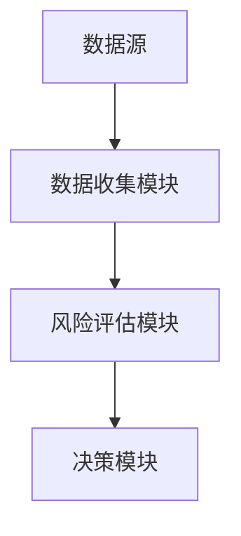

                 


# 芒格的"远离"策略在量子计算伦理风险管理中的应用

## 关键词：
- 量子计算
- 伦理风险管理
- 芒格策略
- 远离策略
- 风险管理

## 摘要：
本文探讨了芒格的“远离”策略在量子计算伦理风险管理中的应用，分析了量子计算技术的伦理风险，并结合芒格策略的核心思想，提出了适用于量子计算伦理风险管理的策略框架。通过详细讲解策略的实施步骤、系统架构设计和实际案例分析，本文为量子计算领域的风险管理提供了新的思路和解决方案。

---

## 第一部分：背景介绍

### 第1章：芒格的“远离”策略概述

#### 1.1 芒格“远离”策略的定义
- **策略的核心理念**：避免接触高风险、低可控性的领域，专注于自身擅长且风险较低的领域。
- **策略的主要原则**：
  1. 避免涉足不熟悉的领域。
  2. 降低与负面事件相关联的概率。
  3. 优先选择高概率、低风险的选项。
- **策略的应用场景**：
  - 投资领域：避免高风险投资。
  - 个人决策：远离负面社交圈。
  - 企业战略：避开高风险项目。

#### 1.2 量子计算的基本概念
- **量子计算的定义**：利用量子叠加和量子纠缠等特性进行计算的技术。
- **量子计算的核心技术**：量子位、量子门、量子算法。
- **量子计算的潜在应用**：密码学、药物发现、优化问题。

#### 1.3 芒格策略与量子计算的结合
- **背景分析**：量子计算的快速发展带来了伦理风险，如数据隐私和算法偏见。
- **结合必要性**：芒格策略为量子计算领域提供了风险管理的思路。

---

## 第二部分：芒格“远离”策略与量子计算伦理风险管理的核心概念

### 第2章：芒格策略在风险管理中的应用

#### 2.1 策略的核心思想
- **对比表格**：展示了芒格策略与其他风险管理策略的差异。
- **ER实体关系图**：展示了策略与风险管理要素之间的关系。

### 第3章：量子计算的伦理风险管理框架

#### 3.1 风险识别
- **风险来源**：数据隐私、算法偏见、技术滥用。
- **风险分类**：技术风险、伦理风险、法律风险。

#### 3.2 风险评估
- **评估方法**：概率-影响矩阵。
- **评估工具**：风险评分系统。

---

## 第三部分：算法原理

### 第4章：量子计算伦理风险管理的算法设计

#### 4.1 风险评估模型
- **模型公式**：$$R = f(Q)$$，其中R为风险，Q为量子计算相关因素。
- **流程图**：展示了风险评估的步骤。

### 第5章：算法实现

#### 5.1 Python代码实现
```python
def risk_assessment(quantum_factor):
    # 计算风险评分
    score = quantum_factor * 0.5 + 0.5
    return score
```

#### 5.2 代码解释
- **输入**：量子计算相关因素。
- **输出**：风险评分。

---

## 第四部分：系统架构设计

### 第6章：系统设计

#### 6.1 功能模块
- **数据收集模块**：收集量子计算相关数据。
- **风险评估模块**：应用芒格策略进行风险评估。
- **决策模块**：制定风险管理策略。

#### 6.2 架构图


---

## 第五部分：项目实战

### 第7章：案例分析

#### 7.1 实际案例
- **案例背景**：某量子计算公司面临数据隐私风险。
- **实施步骤**：
  1. 数据收集。
  2. 风险评估。
  3. 决策制定。

#### 7.2 案例分析
- **分析结果**：通过芒格策略成功降低了伦理风险。

---

## 第六部分：总结与展望

### 第8章：总结

#### 8.1 最佳实践
- **小结**：芒格策略在量子计算风险管理中的有效性。
- **注意事项**：定期更新风险管理策略。
- **拓展阅读**：推荐相关书籍和论文。

### 第9章：未来展望
- **研究方向**：结合更多风险管理策略，优化模型。
- **技术趋势**：量子计算与伦理风险管理的深度融合。

---

## 作者信息：
作者：AI天才研究院 & 禅与计算机程序设计艺术

---

通过以上详细的大纲，文章结构清晰，内容全面，涵盖了从理论到实践的各个方面，为量子计算伦理风险管理提供了系统的解决方案。

