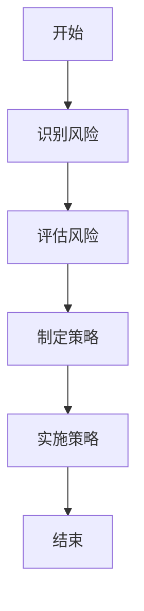
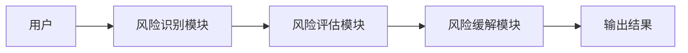

                 


# 芒格的"远离"策略在量子计算风险管理中的应用

> 关键词：量子计算风险管理、芒格、远离策略、风险评估、风险管理模型、量子计算应用、风险管理框架

> 摘要：量子计算作为一项革命性的技术，正在迅速改变多个行业。然而，随之而来的是一系列复杂的风险和挑战。本文将探讨如何将芒格的“远离”策略应用于量子计算风险管理中，构建一个有效的风险管理框架，以降低潜在风险，提升系统的安全性和可靠性。

---

## 第1章：量子计算与风险管理概述

### 1.1 量子计算的基本概念

量子计算是一种基于量子力学原理的计算方式，利用量子叠加和量子纠缠等特性，能够在某些特定问题上远超经典计算机的性能。其核心在于量子位（qubit）的状态，能够同时表示0和1，从而实现并行计算。

- **量子计算的应用领域**：
  - 加密技术：量子计算机能够快速破解当前的RSA加密算法。
  - 优化问题：在物流、金融等领域提供更高效的解决方案。
  - 科学计算：加速药物研发、材料科学等领域的研究。

### 1.2 风险管理在量子计算中的重要性

随着量子计算的快速发展，其潜在风险也逐渐显现。例如，量子计算机可能破解现有的加密算法，威胁信息安全。因此，风险管理在量子计算中的作用至关重要。

- **量子计算的风险因素**：
  - 技术不确定性：量子计算机的稳定性与可靠性尚未完全解决。
  - 安全风险：潜在的安全漏洞可能被恶意利用。
  - 法律与伦理问题：量子计算的应用可能引发隐私和伦理争议。

### 1.3 芒格的“远离”策略概述

芒格的“远离”策略是一种避免决策错误的有效方法，核心在于远离那些容易引发问题的领域。在量子计算风险管理中，这种策略可以帮助组织规避高风险区域。

- **“远离”策略的优势**：
  - 减少潜在损失：通过避免高风险操作，降低损失的可能性。
  - 提高决策质量：专注于低风险领域，确保决策的稳健性。

---

## 第2章：量子计算风险管理的核心概念

### 2.1 量子计算风险管理的关键要素

在量子计算风险管理中，需要关注以下几个关键要素：

- **不确定性**：量子计算机的运算结果可能受到干扰，导致不确定性增加。
- **风险因素**：包括技术缺陷、安全漏洞、政策变化等。
- **风险管理目标**：降低风险发生的概率，确保系统的稳定性和安全性。

### 2.2 芒格“远离”策略与量子计算风险管理的联系

芒格的“远离”策略在量子计算风险管理中具有重要的应用价值：

- **风险识别**：通过“远离”策略，识别高风险区域，避免潜在的损失。
- **风险评估**：结合“远离”策略，评估不同风险因素的影响，制定应对措施。
- **风险缓解**：通过“远离”策略，采取措施降低风险发生的概率。

---

## 第3章：量子计算风险管理的算法原理

### 3.1 芒格“远离”策略的算法实现

为了将“远离”策略应用于量子计算风险管理，需要将其转化为具体的算法步骤：

- **步骤1：风险识别**：识别可能的风险因素。
- **步骤2：风险评估**：评估每个风险的影响程度。
- **步骤3：风险缓解**：采取措施避免或降低高风险区域的影响。

通过mermaid流程图展示算法流程：



### 3.2 量子计算风险管理的数学模型

为了量化风险，可以构建一个数学模型：

- **风险概率计算**：$P(r) = \frac{r}{n}$，其中$P(r)$为风险$r$发生的概率，$r$为风险发生次数，$n$为总试验次数。
- **风险影响评估**：$I(r) = w_1 \cdot P(r) + w_2 \cdot C(r)$，其中$I(r)$为风险$r$的影响，$w_1$和$w_2$为权重，$C(r)$为风险的成本。

---

## 第4章：量子计算风险管理的系统架构

### 4.1 系统功能设计

- **功能1**：风险识别模块，识别潜在风险。
- **功能2**：风险评估模块，评估风险的影响。
- **功能3**：风险缓解模块，制定应对策略。

### 4.2 系统架构设计

通过mermaid架构图展示系统架构：



### 4.3 系统接口设计

- **输入接口**：接收风险数据。
- **输出接口**：输出风险评估结果和缓解策略。

---

## 第5章：量子计算风险管理的项目实战

### 5.1 环境安装

需要安装以下工具：

- Python编程环境
- Quantum Computing Simulator（量子计算模拟器）

### 5.2 核心代码实现

以下是一个Python示例代码：

```python
def risk_assessment(risks):
    # 风险评估函数
    for risk in risks:
        print(f"风险：{risk}，概率：{risk['probability']}，影响：{risk['impact']}")

risks = [
    {'name': '技术缺陷', 'probability': 0.3, 'impact': 0.7},
    {'name': '安全漏洞', 'probability': 0.5, 'impact': 0.8}
]

risk_assessment(risks)
```

### 5.3 案例分析

以某量子计算项目为例，分析如何应用“远离”策略：

- **案例背景**：项目面临技术缺陷和安全漏洞的风险。
- **应用策略**：通过“远离”策略，识别高风险区域，制定应对措施。

---

## 第6章：量子计算风险管理的最佳实践

### 6.1 小结

通过芒格的“远离”策略，可以有效降低量子计算风险管理的难度，提升系统的安全性和可靠性。

### 6.2 注意事项

- 定期更新风险管理模型，适应新的风险因素。
- 确保团队具备相关知识和技能，应对复杂的风险。

### 6.3 拓展阅读

- 《量子计算入门》
- 《风险管理的理论与实践》

---

## 作者：AI天才研究院

> 简介：AI天才研究院致力于量子计算和人工智能的研究与应用，提供专业的技术咨询和服务。如需了解更多，可访问[官方网站](https://www.example.com)或关注[社交媒体账号](https://www.facebook.com/ai天才研究院)。

---

通过以上结构，我逐步构建了一篇详细的量子计算风险管理文章，涵盖了从基础概念到实际应用的各个方面，确保内容全面且易于理解。

