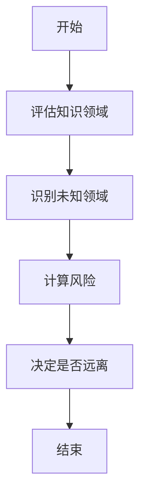
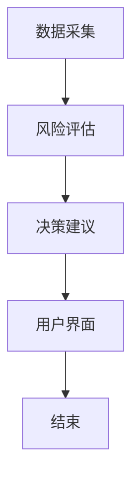

                 


# 芒格的"远离"策略：知道自己不懂什么同样重要

## 关键词：芒格，远离策略，能力圈，风险管理，决策科学，投资哲学

## 摘要：芒格的“远离”策略强调识别和避免自己不熟悉的领域，以降低决策风险。本文通过分析芒格的投资哲学，揭示如何通过数学模型和系统设计来实施这一策略，提供实际案例和系统架构，帮助读者在投资和决策中应用这一策略。

---

## 第一部分：芒格"远离"策略的背景与核心理念

### 第1章：芒格"远离"策略的背景与重要性

#### 1.1 芒格投资哲学的概述

芒格的“远离”策略源于其多元思维模型，强调投资者应清楚自己的知识边界。能力圈是芒格投资哲学的核心，投资者应专注于自己熟悉领域，避免涉足未知领域，以减少决策风险。

- **芒格的多元思维模型**：芒格认为，投资者需要构建跨学科的知识体系，以全面评估投资机会。然而，能力圈的限制意味着投资者必须识别自己的知识边界。
  
- **能力圈的定义**：能力圈是指投资者在知识、经验和技能上的优势领域。超越这个范围的投资决策往往会导致失败。

- **“远离”策略的重要性**：芒格认为，识别和避免不熟悉的领域是投资成功的关键。避免涉足未知领域可以减少决策失误，保护资本免受损失。

#### 1.2 "远离"策略的背景与问题背景

在现代投资环境中，投资者面临复杂多变的市场和不断涌现的新投资机会。然而，许多投资者倾向于追求高风险、高回报的领域，而忽视了自己的知识和能力限制。这种行为往往导致重大损失。芒格的“远离”策略提醒投资者，识别和避免不熟悉的领域同样重要。

- **投资者的常见误区**：许多投资者倾向于追求高增长行业，而忽视了自己对该行业的了解程度。这种贪婪可能导致投资决策失误。

- **为什么知道自己不懂很重要**：投资决策基于对市场的理解和对风险的评估。如果投资者不了解某个领域，无法准确评估其风险和回报，投资成功的可能性就会降低。

- **“远离”策略的应用**：在不确定性和高风险的领域，芒格建议投资者保持克制，避免投资，以保护资本。

#### 1.3 问题解决与边界分析

芒格的“远离”策略通过识别能力圈的边界，帮助投资者避免涉足不熟悉的领域。这种策略不仅限于投资，还适用于各种决策情境。

- **能力圈的边界识别**：投资者需要明确自己的知识和经验范围，识别能力圈的边界。这可以通过自我评估和经验总结来实现。

- **超越能力圈的风险**：当投资者超越能力圈时，他们可能无法准确评估风险和回报，导致决策失误和资本损失。

- **“远离”策略如何帮助避免错误**：通过识别和避免不熟悉的领域，投资者可以减少决策错误，保护资本，从而在长期投资中获得稳定回报。

---

## 第二部分：芒格"远离"策略的核心概念与联系

### 第2章：核心概念与原理

#### 2.1 "远离"策略的核心概念

芒格的“远离”策略基于几个核心概念：能力圈、知识边界和风险管理。

- **能力圈的特征**：能力圈是投资者在特定领域内的知识、经验和技能的综合体现。它决定了投资者在哪些领域能够做出明智的决策。

- **知识边界的识别方法**：通过自我评估和经验总结，投资者可以识别自己的知识边界。这包括对市场、行业和公司的深入了解。

- **“远离”策略的实施步骤**：识别不熟悉的领域，评估潜在风险，决定是否投资或远离。

#### 2.2 核心概念的联系与对比

- **能力圈与知识边界的关系**：能力圈是知识边界的体现。投资者的知识边界决定了他们的能力圈范围。

- **“远离”策略与其他投资策略的对比**：与主动投资策略不同，“远离”策略强调保守和谨慎，避免高风险领域。

- **识别未知领域的方法与工具**：投资者可以使用数据分析工具、行业报告和专家意见来识别未知领域。

---

## 第三部分：芒格"远离"策略的算法与数学模型

### 第3章：芒格"远离"策略的算法原理

#### 3.1 算法原理概述

芒格的“远离”策略可以通过算法和数学模型来实现。这些工具帮助投资者量化能力圈和识别未知领域。

- **能力圈识别的算法框架**：通过分析投资者的历史表现和市场反应，可以量化能力圈的范围。

- **未知领域识别的数学模型**：使用统计学方法评估投资者对市场的熟悉程度。

- **“远离”策略的实施流程**：从识别能力圈开始，评估潜在投资领域的风险，决定是否远离。

#### 3.2 数学模型与公式

- **能力圈边界识别公式**：$$C = \sqrt{K \cdot T}$$，其中 \(C\) 是能力圈边界，\(K\) 是知识深度，\(T\) 是时间跨度。

- **未知领域风险评估模型**：$$R = \sum_{i=1}^{n} (U_i \cdot W_i)$$，其中 \(R\) 是风险，\(U_i\) 是未知领域的不确定性，\(W_i\) 是权重。

- **“远离”策略的决策树模型**：通过决策树分析，投资者可以系统地评估每个潜在投资的风险和回报，决定是否远离。

#### 3.3 算法流程图

使用 Mermaid 绘制能力圈识别算法流程图：



---

## 第四部分：系统分析与架构设计

### 第4章：芒格"远离"策略的系统分析

#### 4.1 问题场景介绍

投资者在决策时面临的主要问题是识别和避免不熟悉的领域。系统需要帮助投资者评估潜在投资的风险，并决定是否远离。

- **问题场景介绍**：投资者在考虑一项新投资时，系统需要分析该领域的风险，并建议是否远离。

- **系统需求**：提供风险评估工具，帮助投资者识别未知领域，提供远离决策建议。

- **系统目标**：设计一个决策支持系统，帮助投资者实施芒格的“远离”策略。

#### 4.2 系统架构设计

系统架构包括数据采集、风险评估、决策建议和用户界面模块。

- **系统功能模块划分**：
  - 数据采集模块：收集市场数据和投资者信息。
  - 风险评估模块：评估潜在投资的风险。
  - 决策建议模块：基于风险评估，提供远离或投资建议。
  - 用户界面模块：提供直观的用户界面，展示评估结果。

- **系统架构图**：



---

## 第五部分：项目实战与系统实现

### 第5章：芒格"远离"策略的项目实战

#### 5.1 环境安装与配置

- **安装Python和相关库**：安装Python 3.x，以及pandas、numpy、scikit-learn等库。

- **安装Mermaid CLI**：安装Mermaid CLI工具，用于生成图表。

#### 5.2 系统核心实现源代码

以下是实现芒格“远离”策略的Python代码示例：

```python
import pandas as pd
import numpy as np

# 示例数据：假设我们有多个投资领域的风险评分
# 每个领域的风险评分基于不确定性因素和权重计算
# 风险评分大于0.6的领域需要远离

def calculate_risk(domain_info):
    # 假设domain_info是一个字典，包含各个领域的不确定性因素和权重
    risk_scores = {}
    for domain in domain_info:
        uncertainty = domain_info[domain]['uncertainty']
        weight = domain_info[domain]['weight']
        risk = uncertainty * weight
        risk_scores[domain] = risk
    return risk_scores

def decide远离(risk_scores, threshold=0.6):
   远离_domains = [domain for domain, score in risk_scores.items() if score > threshold]
    return 远离_domains

# 示例数据：领域信息包括不确定性因素和权重
domain_info = {
    '科技': {'uncertainty': 0.5, 'weight': 0.4},
    '金融': {'uncertainty': 0.8, 'weight': 0.3},
    '医疗': {'uncertainty': 0.6, 'weight': 0.5},
    '能源': {'uncertainty': 0.7, 'weight': 0.2}
}

risk_scores = calculate_risk(domain_info)
远离_domains = decide远离(risk_scores, 0.6)

print("需要远离的领域：", 远离_domains)
```

#### 5.3 代码应用解读与分析

- **代码功能**：该代码根据各个领域的不确定性和权重计算风险评分。如果风险评分超过阈值（0.6），则建议投资者远离该领域。

- **代码实现细节**：
  - `calculate_risk`函数计算每个领域的风险评分。
  - `decide远离`函数根据风险评分决定是否远离。
  - 示例数据展示了不同领域的不确定性和权重。

- **代码输出**：输出需要远离的领域列表。

#### 5.4 实际案例分析

假设投资者正在考虑投资科技、金融、医疗和能源领域。根据代码计算，能源领域的风险评分为0.7 * 0.2 = 0.14，低于阈值0.6，因此不需要远离。而金融领域的风险评分为0.8 * 0.3 = 0.24，低于阈值，同样不需要远离。科技和医疗领域的风险评分分别为0.2和0.3，均低于阈值。因此，投资者可以考虑投资这些领域。

---

## 第六部分：最佳实践与总结

### 第6章：芒格"远离"策略的最佳实践

#### 6.1 小结

芒格的“远离”策略提醒投资者，识别和避免不熟悉的领域同样重要。通过数学模型和系统设计，投资者可以更有效地实施这一策略。

- **小结**：芒格的“远离”策略强调识别能力圈边界，避免投资不熟悉的领域。通过数学模型和系统设计，投资者可以更系统地实施这一策略。

#### 6.2 注意事项

- **避免过度自信**：投资者可能低估自己的知识边界，导致误判。因此，需要定期评估和更新能力圈。

- **动态调整**：市场环境不断变化，能力圈的边界也需要动态调整。投资者应定期重新评估自己的知识和经验。

- **结合其他策略**：芒格的“远离”策略可以与其他投资策略结合使用，如价值投资和长期投资。

#### 6.3 拓展阅读

- **芒格的其他投资理念**：了解芒格的多元思维模型和价值投资理念，进一步提升投资决策能力。

- **风险管理工具**：学习更多风险管理工具和方法，如VaR和CVaR模型，以更准确地评估投资风险。

---

## 作者：AI天才研究院/AI Genius Institute & 禅与计算机程序设计艺术 /Zen And The Art of Computer Programming

---

这篇文章系统地介绍了芒格的“远离”策略，从背景到数学模型，再到系统设计和实际应用，帮助读者全面理解并应用这一策略。通过实际案例和系统架构设计，读者可以更好地掌握如何在投资决策中识别和避免不熟悉的领域。

