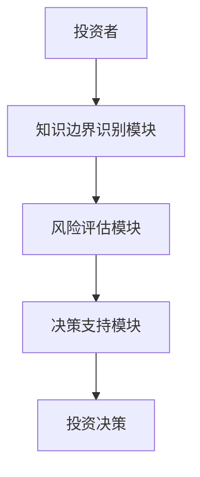

                 


# 芒格的"远离"策略：避开不懂的领域

## 关键词：芒格、远离策略、知识边界、投资决策、风险管理、决策模型

## 摘要：芒格的"远离"策略是一种重要的决策方法，强调在面对未知领域时，主动识别和避开自己不熟悉的知识边界，以降低决策风险。本文将从理论基础、算法原理、系统架构、项目实战等方面详细分析这一策略，并通过实际案例说明其应用。

---

## 第一部分：芒格的"远离"策略背景介绍

### 第1章：问题背景与定义

#### 1.1 投资中的知识边界问题

在投资领域，投资者经常会面临复杂多变的市场环境和众多的投资机会。然而，许多投资者由于知识和经验的限制，往往会在自己不熟悉的领域中做出错误决策。芒格的“远离”策略正是基于这一问题提出的。

#### 1.2 "远离"策略的核心概念

芒格提出的“远离”策略，强调在决策时，应主动识别和避开自己不熟悉的领域，避免因知识不足而引发的风险。这种方法不仅适用于投资领域，还可以应用于个人决策和企业管理。

#### 1.3 知识边界与决策风险的关联

知识边界是投资者在决策过程中面临的最大挑战之一。当投资者涉足自己不熟悉的领域时，决策的不确定性和风险会显著增加。因此，识别和避开知识边界是降低决策风险的重要策略。

### 第2章："远离"策略的核心要素

#### 2.1 知识边界识别

知识边界识别是“远离”策略的第一步。投资者需要通过自我评估和市场分析，确定自己熟悉和不熟悉的领域。这一过程可以通过决策树和知识图谱等工具实现。

#### 2.2 领域复杂性评估

在识别知识边界后，需要对各个领域进行复杂性评估。复杂性评估可以通过领域相关的数学模型和数据分析工具来进行，帮助投资者更好地了解潜在风险。

#### 2.3 决策能力的自我认知

自我认知是“远离”策略的重要组成部分。投资者需要清晰地认识到自己的知识和能力边界，避免因过度自信而进入不熟悉的领域。

---

## 第二部分："远离"策略的理论基础

### 第3章：心理学与决策理论

#### 3.1 人类认知的局限性

人类的认知能力是有限的，尤其是在面对复杂和不确定的环境时。芒格的“远离”策略正是基于这一认知局限性提出的。

#### 3.2 心理偏见对决策的影响

心理偏见（如确认偏见、从众心理等）会影响投资者的决策。芒格的“远离”策略通过避免不熟悉的领域，有效减少了心理偏见对决策的影响。

#### 3.3 理性决策模型与"远离"策略的关系

理性决策模型强调基于事实和逻辑的决策。芒格的“远离”策略通过避免知识边界，帮助投资者更接近理性决策。

### 第4章：投资学中的知识边界理论

#### 4.1 知识边界对投资决策的影响

知识边界会影响投资者对市场的理解和判断。在不熟悉的领域中，投资者往往无法准确评估风险和收益。

#### 4.2 资产定价与知识边界的关系

资产定价需要对市场、行业和公司基本面有深入的理解。在不熟悉的领域中，投资者难以准确评估资产的内在价值。

#### 4.3 投资组合管理中的知识边界策略

在投资组合管理中，投资者应根据自己的知识边界，合理分配资产配置，避免过度集中在不熟悉的领域。

---

## 第三部分："远离"策略的决策模型

### 第5章：知识边界识别的决策树

#### 5.1 决策树的构建过程

决策树是一种常用的决策工具，可以帮助投资者系统地分析和识别知识边界。构建决策树的过程包括定义问题、分析可能的分支、评估每个分支的风险和收益等。

#### 5.2 知识边界的风险评估

通过决策树，投资者可以对每个领域进行风险评估，确定哪些领域属于自己的知识边界。这有助于投资者在决策时做出更明智的选择。

#### 5.3 决策树在投资中的应用

在投资中，决策树可以用于评估不同投资机会的风险和收益。通过识别知识边界，投资者可以避免进入不熟悉的领域，降低投资风险。

### 第6章：知识边界与决策树的mermaid图

```mermaid
graph TD
    A[开始] --> B[识别知识边界]
    B --> C[评估领域复杂性]
    C --> D[判断决策能力]
    D --> E[制定"远离"策略]
    E --> F[实施并监控]
```

### 第7章：决策模型的数学公式

#### 7.1 风险评估公式

$$ R = \sum_{i=1}^{n} P_i \times I_i $$

其中，R为风险值，P_i为第i个领域的概率，I_i为第i个领域的影响力。

#### 7.2 决策树的期望值计算

$$ EV = \sum_{i=1}^{m} P_i \times V_i $$

其中，EV为期望值，P_i为第i个分支的概率，V_i为第i个分支的值。

---

## 第四部分："远离"策略的系统架构

### 第8章：系统功能设计

#### 8.1 知识边界识别模块

知识边界识别模块用于帮助投资者识别和评估自己不熟悉的领域。这可以通过数据分析和知识图谱构建来实现。

#### 8.2 风险评估模块

风险评估模块基于知识边界识别结果，对各个领域进行风险评估，帮助投资者制定相应的风险管理策略。

#### 8.3 决策支持模块

决策支持模块提供基于知识边界识别和风险评估的结果，为投资者提供决策支持和建议。

### 第9章：系统架构设计



### 第10章：系统接口设计

#### 10.1 知识边界识别接口

```python
def identify_boundary(investor Knowledge):
    # 实现知识边界识别逻辑
    return boundary
```

#### 10.2 风险评估接口

```python
def assess_risk(boundary):
    # 实现风险评估逻辑
    return risk_assessment
```

#### 10.3 决策支持接口

```python
def generate_recommendations(risk_assessment):
    # 实现决策支持逻辑
    return recommendations
```

---

## 第五部分："远离"策略的项目实战

### 第11章：环境安装

#### 11.1 技术环境

- Python 3.8+
- Jupyter Notebook
- Mermaid图工具

### 第12章：系统核心实现源代码

#### 12.1 知识边界识别模块

```python
def identify_boundary(investor_Knowledge):
    boundaries = []
    for area in areas:
        if area not in investor_Knowledge:
            boundaries.append(area)
    return boundaries
```

#### 12.2 风险评估模块

```python
def assess_risk(boundary):
    risk = 0
    for area in boundary:
        risk += calculate_risk(area)
    return risk
```

#### 12.3 决策支持模块

```python
def generate_recommendations(risk_assessment):
    recommendations = []
    for area in areas:
        if risk_assessment[area] < threshold:
            recommendations.append(area)
    return recommendations
```

### 第13章：代码应用解读与分析

#### 13.1 知识边界识别模块的实现

知识边界识别模块通过遍历所有领域，检查投资者是否熟悉该领域。如果不熟悉，则将其添加到知识边界列表中。

#### 13.2 风险评估模块的实现

风险评估模块对每个知识边界领域进行风险评估，计算总体风险值。

#### 13.3 决策支持模块的实现

决策支持模块根据风险评估结果，生成投资建议，推荐投资者进入低风险领域。

### 第14章：实际案例分析

#### 14.1 案例背景

假设投资者对科技行业不熟悉，但对金融行业熟悉。通过知识边界识别模块，投资者识别出科技行业是其知识边界。风险评估模块评估科技行业的风险较高，因此决策支持模块建议投资者避开科技行业，专注于金融行业。

### 第15章：项目小结

通过实际案例分析，我们可以看到“远离”策略在投资决策中的有效性。投资者通过识别和避开不熟悉的领域，可以降低投资风险，提高投资收益。

---

## 第六部分：总结与展望

### 第16章：总结

芒格的“远离”策略是一种有效的决策方法，通过识别和避开知识边界，帮助投资者降低决策风险。本文从理论基础、算法原理、系统架构、项目实战等方面详细分析了这一策略，并通过实际案例说明了其应用。

### 第17章：未来展望

未来的研究可以进一步探讨“远离”策略在不同领域的应用，例如企业战略管理、风险管理等领域。同时，随着人工智能和大数据技术的发展，可以开发更智能的知识边界识别工具，帮助投资者更好地实施“远离”策略。

---

## 作者：AI天才研究院/AI Genius Institute & 禅与计算机程序设计艺术/Zen And The Art of Computer Programming

