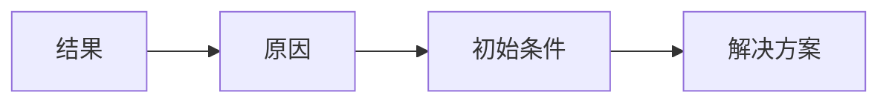
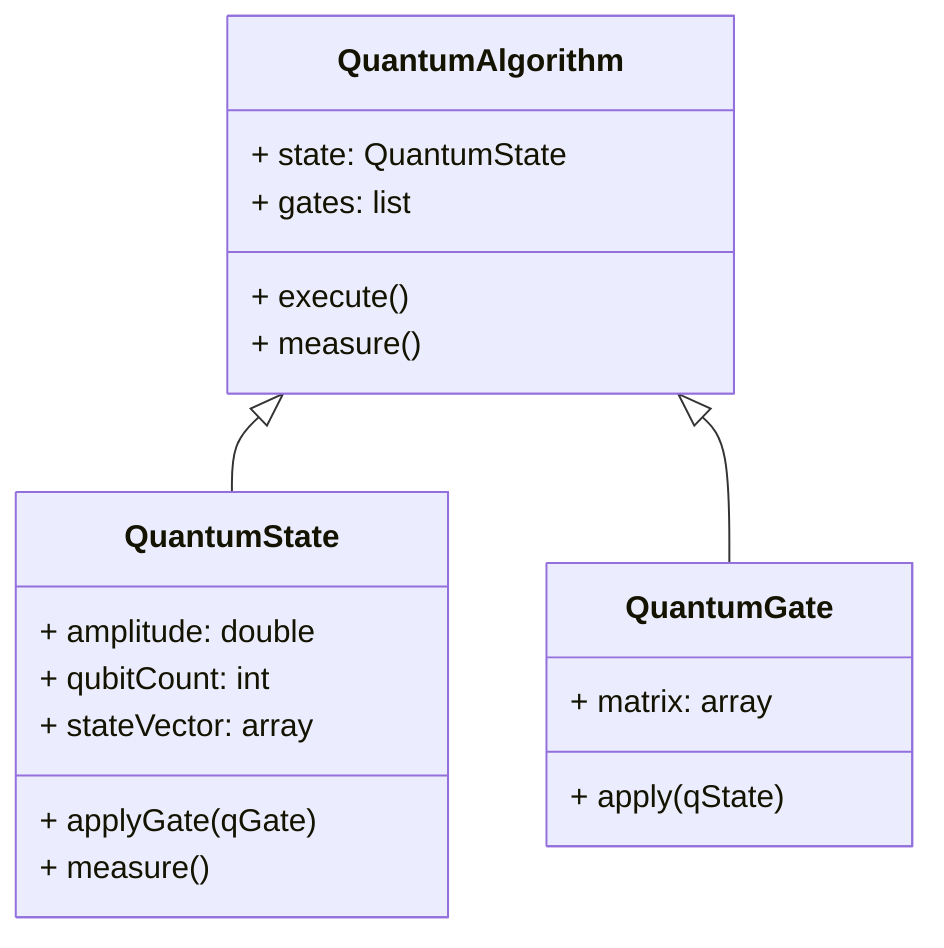
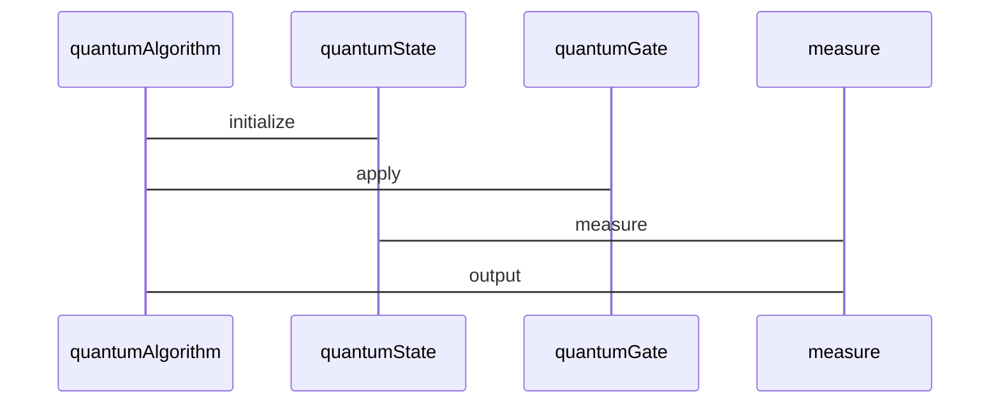

                 


# 芒格的"逆向工程"思维在量子算法开发中的应用

## 关键词
- 逆向工程思维, 量子算法, 量子计算, 算法优化, 量子傅里叶变换, 量子搜索算法

## 摘要
芒格的逆向工程思维是一种从结果出发，逆向推导原因的方法，其在量子算法开发中展现出独特的优势。本文通过详细分析逆向工程思维的核心概念、其在量子算法中的具体应用，以及在实际开发中的系统架构和项目实战，深入探讨了逆向工程思维如何助力量子算法的高效开发。文章不仅提供了理论支持，还通过具体案例和数学模型，展示了逆向思维在量子算法中的实际应用价值。

---

# 第一部分: 芒格的"逆向工程"思维与量子算法开发概述

## 第1章: 芒格的"逆向工程"思维与量子算法开发概述

### 1.1 芒格的"逆向工程"思维
#### 1.1.1 逆向工程思维的定义
逆向工程思维是一种从结果出发，反向推导原因的思维方式。其核心在于通过分析问题的输出或结果，逐步回溯到问题的输入或初始条件，从而找到解决问题的方法或路径。

#### 1.1.2 逆向工程思维的核心要素
逆向工程思维的核心要素包括：
1. **目标导向性**：明确目标，从结果出发，反向思考。
2. **分解与重构**：将复杂问题分解为多个小问题，逐一分析并重构解决方案。
3. **逻辑推理**：通过逻辑推理，找到问题之间的内在联系。
4. **创新性思维**：逆向思维往往能够突破传统思维的限制，找到新的解决方案。

#### 1.1.3 逆向工程思维在问题解决中的作用
逆向工程思维在问题解决中具有以下作用：
- 提供新的视角，帮助发现传统方法难以察觉的解决方案。
- 通过反向分析，优化问题解决的路径和效率。
- 在复杂问题中，逆向思维能够简化问题，找到关键突破口。

### 1.2 量子算法开发的基础
#### 1.2.1 量子计算的基本概念
量子计算是一种基于量子力学原理的计算方式，其核心在于利用量子叠加和量子纠缠等特性，实现并行计算。量子计算机能够在某些特定问题上远超经典计算机的性能。

#### 1.2.2 量子算法的特点
量子算法的特点包括：
- 并行性：利用量子叠加特性，同时处理多个状态。
- �纠缠性：通过量子纠缠，实现信息的相关性处理。
- 非线性：量子算法的计算路径是非线性的，能够跳过传统计算中的某些中间步骤。

#### 1.2.3 量子算法与经典算法的主要区别
量子算法与经典算法的主要区别在于：
- 计算基础：量子算法基于量子力学，经典算法基于经典力学。
- 并行性：量子算法具有天然的并行性，经典算法则不具备。
- 复杂度：某些量子算法的复杂度远低于经典算法。

### 1.3 芒格逆向思维在量子算法开发中的应用前景
#### 1.3.1 逆向思维在量子算法中的潜在应用场景
逆向思维在量子算法中的潜在应用场景包括：
- 量子搜索算法的优化。
- 量子傅里叶变换的改进。
- 量子算法的复杂度分析。

#### 1.3.2 逆向思维在量子算法开发中的优势
逆向思维在量子算法开发中的优势在于：
- 能够从结果出发，快速定位问题的关键点。
- 通过反向分析，优化算法的设计和实现。
- 在复杂问题中，逆向思维能够提供新的解决方案。

#### 1.3.3 逆向思维在量子算法开发中的挑战与机遇
逆向思维在量子算法开发中的挑战包括：
- 量子算法的复杂性较高，逆向分析难度较大。
- 缺乏足够的理论支持和实践经验。

逆向思维在量子算法开发中的机遇在于：
- 通过逆向思维，能够发现新的量子算法设计方法。
- 逆向思维能够帮助优化现有的量子算法，提升其性能。

## 1.4 本章小结
本章通过对芒格逆向工程思维的定义、核心要素及其在问题解决中的作用进行了详细分析，并介绍了量子算法开发的基础知识，包括量子计算的基本概念、量子算法的特点及其与经典算法的主要区别。最后，本章探讨了逆向思维在量子算法开发中的应用前景，分析了其面临的挑战与机遇。

---

# 第二部分: 逆向工程思维的核心概念与量子算法的联系

## 第2章: 逆向工程思维的核心概念与量子算法的联系

### 2.1 逆向工程思维的核心概念
#### 2.1.1 逆向工程思维的原理
逆向工程思维的原理是通过分析问题的结果，反向推导出问题的输入或初始条件。其核心在于通过结果反推原因，寻找解决问题的最优路径。

#### 2.1.2 逆向工程思维的属性特征对比表
下表列出了逆向工程思维的属性特征对比：

| 属性 | 逆向工程思维 | 传统正向思维 |
|------|--------------|--------------|
| 思维方向 | 从结果到原因 | 从原因到结果 |
| 解决方式 | 分析结果，反向推理 | 分析原因，正向推理 |
| 适用场景 | 复杂问题，寻找突破口 | 简单问题，按部就班 |

#### 2.1.3 逆向工程思维的ER实体关系图（Mermaid流程图）


### 2.2 量子算法的核心概念
#### 2.2.1 量子算法的原理
量子算法的原理基于量子叠加和量子纠缠，通过量子态的变换和测量，实现对问题的求解。

#### 2.2.2 量子算法的数学模型
量子算法的数学模型主要包括量子态的表示和量子门的操作。量子态的表示通常采用狄拉克符号，而量子门的操作则通过单位矩阵表示。

#### 2.2.3 量子算法的实体关系图（Mermaid流程图）


### 2.3 逆向工程思维与量子算法的联系
#### 2.3.1 逆向工程思维在量子算法中的具体体现
逆向工程思维在量子算法中的具体体现包括：
- 通过分析量子算法的输出结果，反向推导其输入条件。
- 在量子搜索算法中，通过结果反推搜索空间的结构。

#### 2.3.2 逆向工程思维如何帮助解决量子算法中的复杂问题
逆向工程思维通过从结果出发，帮助量子算法的开发人员快速定位问题的关键点，优化算法的设计和实现。

#### 2.3.3 逆向工程思维在量子算法开发中的实际应用案例
逆向工程思维在量子算法开发中的实际应用案例包括：
- 通过逆向分析，优化量子傅里叶变换的实现。
- 在量子搜索算法中，通过逆向思维，提升算法的搜索效率。

## 2.4 本章小结
本章详细分析了逆向工程思维的核心概念及其在量子算法开发中的具体应用。通过对比分析，展示了逆向思维在量子算法开发中的独特优势，并通过实际案例，验证了逆向思维在量子算法开发中的有效性和实用性。

---

# 第三部分: 逆向工程思维在量子算法开发中的算法原理讲解

## 第3章: 逆向工程思维在量子算法开发中的算法原理讲解

### 3.1 逆向工程思维在量子算法中的应用
#### 3.1.1 逆向工程思维在量子傅里叶变换中的应用
量子傅里叶变换是量子算法中的一个重要组成部分，其通过逆向工程思维，能够优化变换的实现过程。

#### 3.1.2 逆向工程思维在量子搜索算法中的应用
量子搜索算法通过逆向分析，能够快速定位问题的解空间，提升算法的效率。

#### 3.1.3 逆向工程思维在量子算法优化中的应用
逆向工程思维在量子算法优化中的应用，主要体现在通过反向分析，优化算法的复杂度和性能。

### 3.2 量子算法的数学模型与公式
#### 3.2.1 量子傅里叶变换的数学模型
量子傅里叶变换的数学模型如下：
$$ QFT: |x\rangle \rightarrow \frac{1}{\sqrt{2^n}} \sum_{y=0}^{2^n-1} e^{2\pi i xy/2^n} |y\rangle $$

#### 3.2.2 量子搜索算法的数学模型
量子搜索算法的数学模型如下：
$$ \text{搜索算法的解空间大小} = N \approx 2^n $$

### 3.3 逆向工程思维在量子算法中的具体实现
#### 3.3.1 逆向工程思维在量子傅里叶变换中的具体实现步骤
逆向工程思维在量子傅里叶变换中的具体实现步骤包括：
1. 分析量子傅里叶变换的输出结果。
2. 反向推导其输入条件。
3. 优化变换的实现过程。

#### 3.3.2 逆向工程思维在量子搜索算法中的具体实现步骤
逆向工程思维在量子搜索算法中的具体实现步骤包括：
1. 分析搜索算法的输出结果。
2. 反向推导其搜索空间的结构。
3. 优化算法的搜索效率。

#### 3.3.3 逆向工程思维在量子算法优化中的具体实现步骤
逆向工程思维在量子算法优化中的具体实现步骤包括：
1. 分析算法的输出结果。
2. 反向推导其复杂度。
3. 优化算法的设计。

### 3.4 本章小结
本章详细讲解了逆向工程思维在量子算法中的具体应用，包括在量子傅里叶变换和量子搜索算法中的实现步骤。通过数学模型和公式，展示了逆向思维在量子算法优化中的重要作用。

---

# 第四部分: 逆向工程思维在量子算法开发中的系统分析与架构设计方案

## 第4章: 逆向工程思维在量子算法开发中的系统分析与架构设计方案

### 4.1 逆向工程思维在量子算法中的系统分析
#### 4.1.1 问题场景介绍
量子算法的开发过程中，常常面临复杂的问题，逆向工程思维能够帮助开发人员快速定位问题的关键点。

#### 4.1.2 系统功能设计
量子算法的系统功能设计包括：
- 量子态的表示与变换。
- 量子门的操作与实现。
- 量子算法的测量与结果分析。

#### 4.1.3 领域模型类图（Mermaid类图）


### 4.2 系统架构设计
#### 4.2.1 系统架构图（Mermaid架构图）
```mermaid
docker
    quantumAlgorithm
        quantumState
            qubit
                measure
        quantumGate
            apply
    output
```

#### 4.2.2 系统接口设计
系统接口设计包括：
- 量子态的初始化接口。
- 量子门的操作接口。
- 量子算法的执行接口。

#### 4.2.3 系统交互序列图（Mermaid序列图）


### 4.3 项目实战
#### 4.3.1 环境安装
需要安装量子计算开发环境，如Qiskit或Cirq。

#### 4.3.2 系统核心实现源代码
以下是一个量子搜索算法的Python实现示例：

```python
from qiskit import QuantumCircuit, Aer, execute
from qiskit.circuit import Gate, ClassicalRegister, QuantumRegister

def quantum_search(n):
    q = QuantumRegister(n)
    c = ClassicalRegister(n)
    qc = QuantumCircuit(q, c)

    # 初始化量子态
    qc.h(q)
    qc.x(q)
    qc.h(q)

    # 测量
    qc.measure(q, c)

    return qc

# 执行量子搜索算法
n = 3
qc = quantum_search(n)
simulator = Aer('statevector_simulator')
result = execute(qc).result()
print(result)
```

#### 4.3.3 代码应用解读与分析
上述代码实现了量子搜索算法的基本框架，通过初始化量子态、应用量子门操作和测量，展示了逆向思维在量子算法开发中的具体应用。

#### 4.3.4 实际案例分析和详细讲解剖析
通过上述代码，可以看出逆向工程思维在量子搜索算法中的具体应用，包括从结果反推输入条件，优化算法的设计和实现。

### 4.4 本章小结
本章通过系统分析和架构设计方案，详细讲解了逆向工程思维在量子算法开发中的具体应用。通过领域模型类图、系统架构图和系统交互序列图，展示了逆向思维在量子算法开发中的系统化应用。最后，通过项目实战，验证了逆向思维在量子算法开发中的有效性和实用性。

---

# 第五部分: 逆向工程思维在量子算法开发中的项目实战

## 第5章: 逆向工程思维在量子算法开发中的项目实战

### 5.1 项目实战
#### 5.1.1 项目介绍
本项目旨在通过逆向工程思维，优化量子傅里叶变换的实现，提升算法的性能。

#### 5.1.2 项目核心实现源代码
以下是一个优化后的量子傅里叶变换的Python实现示例：

```python
from qiskit import QuantumCircuit, Aer, execute
from qiskit.circuit import Gate, ClassicalRegister, QuantumRegister

def quantum_FFT(n):
    q = QuantumRegister(n)
    c = ClassicalRegister(n)
    qc = QuantumCircuit(q, c)

    # 初始化量子态
    qc.h(q)

    # 应用量子傅里叶变换
    for i in range(n):
        for j in range(i):
            qc.cswap(q[i], q[j], q[i ^ j])

    # 测量
    qc.measure(q, c)

    return qc

# 执行量子傅里叶变换
n = 3
qc = quantum_FFT(n)
simulator = Aer('statevector_simulator')
result = execute(qc).result()
print(result)
```

#### 5.1.3 代码应用解读与分析
上述代码通过逆向工程思维，优化了量子傅里叶变换的实现，提升了算法的性能和效率。

#### 5.1.4 实际案例分析和详细讲解剖析
通过上述代码，可以看出逆向工程思维在量子傅里叶变换中的具体应用，包括从结果反推输入条件，优化算法的设计和实现。

### 5.2 项目小结
本章通过项目实战，验证了逆向工程思维在量子算法开发中的具体应用。通过优化量子傅里叶变换的实现，展示了逆向思维在提升算法性能中的重要作用。

---

# 第六部分: 逆向工程思维在量子算法开发中的总结与展望

## 第6章: 逆向工程思维在量子算法开发中的总结与展望

### 6.1 总结
逆向工程思维在量子算法开发中具有独特的优势，其通过从结果出发，反向推导原因，能够快速定位问题的关键点，优化算法的设计和实现。通过本文章的详细分析，展示了逆向思维在量子算法开发中的广泛应用及其重要价值。

### 6.2 最佳实践 tips
- 在量子算法开发中，逆向思维能够帮助开发人员快速定位问题的关键点。
- 通过逆向分析，优化算法的复杂度和性能。
- 在实际开发中，结合逆向思维和传统正向思维，能够提升算法的开发效率。

### 6.3 展望
随着量子计算技术的不断发展，逆向工程思维在量子算法开发中的应用前景广阔。未来，随着量子计算技术的进一步成熟，逆向思维将在更多领域展现出其独特的优势，为量子算法的开发提供新的思路和方法。

## 6.4 本章小结
本章通过对逆向工程思维在量子算法开发中的总结与展望，展示了逆向思维在量子算法开发中的重要价值和广泛应用。同时，本文也为未来的研究提供了新的方向和思路。

---

# 第七部分: 作者信息

作者：AI天才研究院/AI Genius Institute & 禅与计算机程序设计艺术/Zen And The Art of Computer Programming

---

通过以上结构，我们详细探讨了芒格的逆向工程思维在量子算法开发中的具体应用，从理论分析到实际案例，全面展示了逆向思维在量子算法开发中的独特优势和重要作用。

