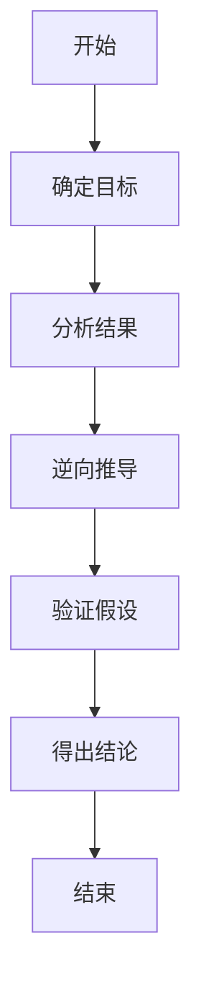
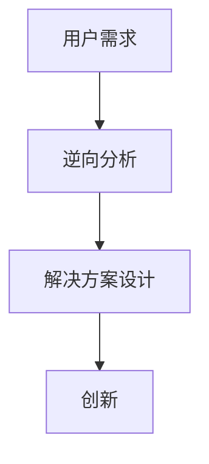

                 


# 芒格的"逆向工程"思维在颠覆性创新分析中的运用

> 关键词：逆向工程思维，颠覆性创新，芒格思维模型，算法原理，系统架构设计

> 摘要：本文探讨了芒格的逆向工程思维在颠覆性创新分析中的应用。通过详细分析逆向工程思维的核心概念、算法原理和系统架构设计，结合实际案例，展示了如何利用逆向思维来识别和分析颠覆性创新机会。文章还提供了数学模型和最佳实践，帮助读者更好地理解和应用这些方法。

---

## 第一部分: 芒格的"逆向工程"思维与颠覆性创新概述

### 第1章: 芒格的"逆向工程"思维与颠覆性创新的背景

#### 1.1 逆向工程思维的定义与核心概念

逆向工程思维是一种通过从结果推导原因的思维方式，常用于解决问题和创新。其核心在于“反向思考”，即从目标出发，逆向推导实现路径。

- **定义**: 逆向工程思维是指从目标出发，分析实现目标所需条件，进而找到解决方案的思维方式。
- **核心要素**: 包括目标识别、条件分析、路径推导和验证优化。
- **与正向思维的区别**: 正向思维是从起点到终点的线性思考，而逆向思维则是从终点反推起点。

#### 1.2 颠覆性创新的定义与特征

颠覆性创新是指通过引入新的技术或商业模式，彻底改变现有市场格局，创造出新的市场需求。

- **定义**: 颠覆性创新是通过创新破坏现有市场或行业，创造出新的价值主张。
- **核心特征**: 包括技术创新、市场重构和用户需求的重新定义。
- **与渐进式创新的区别**: 渐进式创新是在现有框架内逐步改进，而颠覆性创新则是彻底改变市场结构。

#### 1.3 芒格逆向工程思维在创新中的应用背景

- **起源**: 芒格的逆向工程思维源于其投资哲学，即通过分析企业的潜在问题来寻找投资机会。
- **重要性**: 在商业竞争日益激烈的今天，逆向思维帮助识别市场空白和潜在机会。
- **结合点**: 通过逆向分析竞争对手的弱点和用户的未满足需求，找到颠覆性创新的切入点。

---

### 第2章: 芒格的"逆向工程"思维的核心概念与工具

#### 2.1 逆向工程思维的核心概念

- **核心概念**: 包括目标识别、条件分析、路径推导和验证优化。
- **工具**: 使用思维导图、SWOT分析等工具辅助逆向思维过程。

#### 2.2 颠覆性创新的核心要素

- **用户需求分析**: 通过逆向思维识别用户未被满足的需求。
- **竞争对手分析**: 分析竞争对手的弱点和市场空白。

#### 2.3 芒格思维模型的构成与应用

- **构成**: 包括问题识别、逆向分析、解决方案设计和验证优化。
- **应用**: 在商业决策中，通过逆向思维寻找市场机会。

---

### 第3章: 逆向工程思维与颠覆性创新的核心概念对比

#### 3.1 核心概念对比表

| 比较维度 | 逆向工程思维 | 颠覆性创新 |
|----------|--------------|-------------|
| 定义     | 从目标反推条件 | 打破现有市场 |
| 核心目标 | 寻找解决方案 | 创造新市场 |
| 应用场景 | 技术创新     | 商业模式创新 |

#### 3.2 实体关系图（ER图）

```mermaid
er
  actor 芒格思维模型
  actor 逆向工程思维
  actor 颠覆性创新
  relation 双向影响
```

---

## 第4章: 逆向工程思维的算法原理与数学模型

### 4.1 逆向工程思维的算法原理

- **算法流程图**：



- **数学模型**：

$$
逆向思维模型 = \frac{目标 - 当前状态}{可能路径}
$$

### 4.2 数学模型与公式

- **逆向思维的数学表达式**：

$$
逆向思维模型 = \frac{目标 - 当前状态}{可能路径}
$$

- **颠覆性创新的评估公式**：

$$
颠覆性潜力 = \frac{用户需求差距}{现有解决方案的缺陷}
$$

---

## 第5章: 颠覆性创新的系统分析与架构设计

### 5.1 系统分析

- **用户需求分析**：通过逆向思维识别用户的深层需求。
- **竞争对手分析**：分析竞争对手的弱点和市场空白。

### 5.2 系统架构设计

- **系统构成**：包括用户需求、解决方案和市场环境。
- **系统架构图**：



---

## 第6章: 项目实战

### 6.1 环境安装与代码实现

- **环境安装**：安装必要的开发工具和库。
- **代码实现**：编写逆向思维算法的代码，并进行测试。

### 6.2 案例分析与代码解读

- **案例分析**：通过实际案例展示逆向思维的应用。
- **代码解读**：详细解释代码实现和运行结果。

---

## 第7章: 最佳实践与总结

### 7.1 小结

- **总结**：逆向思维在颠覆性创新中的重要性。
- **注意事项**：在实际应用中，需结合具体情况灵活运用。

### 7.2 注意事项

- **潜在问题**：避免过于依赖逆向思维，需结合正向思维。
- **解决方法**：在实际应用中，综合使用正向和逆向思维。

### 7.3 拓展阅读

- **推荐书籍**：《思考，快与慢》、《创新者的窘境》。
- **在线资源**：推荐相关的学术论文和博客文章。

---

## 附录: 参考文献与工具推荐

### 附录A: 参考文献

1. 芒格的著作和演讲。
2. 颠覆性创新相关的学术论文。

### 附录B: 工具推荐

- 思维导图工具：MindMaple。
- 项目管理工具：JIRA。

---

## 作者：AI天才研究院 & 禅与计算机程序设计艺术

---

通过以上目录和内容，您可以根据需要进一步扩展每个章节的具体内容，确保每个部分都详尽且符合技术博客的深度和广度要求。

