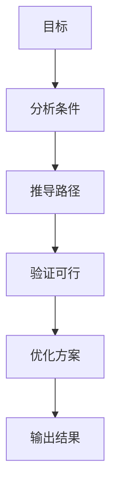
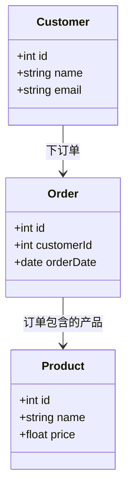
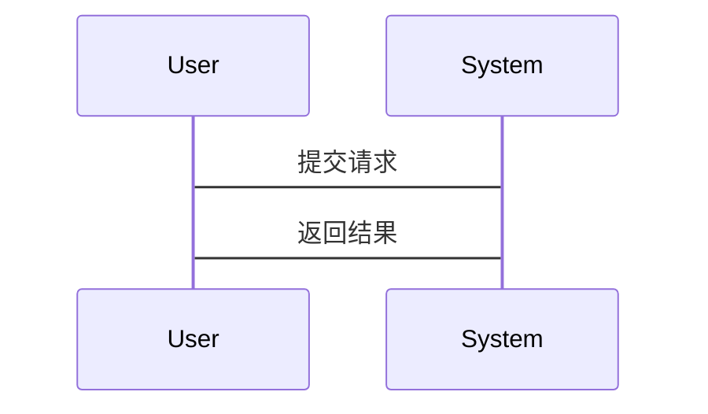

                 


# 芒格的"逆向思维"在反物质能源商业化评估中的应用

**关键词**：芒格，逆向思维，反物质能源，商业化评估，算法原理

**摘要**：本文探讨了芒格的逆向思维在反物质能源商业化评估中的应用。首先介绍了逆向思维的定义、特点及其在商业决策中的价值。接着，详细阐述了反物质能源的基本概念、物理特性和商业化评估的重要性。然后，分析了逆向思维与反物质能源评估的结合点，并通过数学模型和算法原理展示了其在实际应用中的优势。最后，通过系统分析与架构设计，结合项目实战案例，进一步验证了逆向思维在反物质能源商业化评估中的有效性和实用性。

---

## 第1章: 背景介绍

### 1.1 逆向思维的起源与特点

逆向思维是一种不同于传统正向思维的思维方式，它通过从结果出发，反向推导出实现该结果的方法或路径。其核心在于“反其道而行之”，通过逆向思考找到解决问题的新视角。

#### 1.1.1 逆向思维的定义与核心要素

逆向思维的核心在于从目标出发，反向分析实现目标所需的条件和路径。其主要要素包括目标设定、条件分析、路径规划和反馈优化。

#### 1.1.2 逆向思维与传统正向思维的区别

传统正向思维是从原因到结果的线性推理，而逆向思维则是从结果出发，寻找可能的起因。两者的区别在于思考的方向和起点。

#### 1.1.3 逆向思维在商业决策中的应用价值

逆向思维能够帮助商业决策者跳出传统思维的局限，发现新的市场机会和解决方案，从而提升企业的竞争力和创新能力。

### 1.2 反物质能源的基本概念

反物质是与普通物质相对的物质形态，其基本特性是与普通物质在某些物理性质上相反或互补。

#### 1.2.1 反物质的基本定义与物理特性

反物质由反粒子组成，与普通物质的粒子具有相同的质量和能量，但电荷、磁矩等性质相反。反物质与普通物质相遇时会发生湮灭反应，释放出巨大的能量。

#### 1.2.2 反物质能源的基本原理

反物质与普通物质湮灭时释放的能量密度极高，是目前人类已知的最高能量密度之一。其能量释放过程可以用于能源开发和利用。

#### 1.2.3 反物质能源的潜在应用场景

反物质能源具有极高的能量密度，可能在航天、医疗和工业等领域得到应用。然而，由于反物质的制备和储存成本极高，目前尚未实现商业化。

### 1.3 反物质能源商业化评估的重要性

反物质能源的商业化涉及多个方面的评估，包括技术可行性、经济成本和市场需求等。

#### 1.3.1 反物质能源商业化面临的挑战

反物质能源的制备和储存技术尚未成熟，且成本极高。此外，反物质能源的市场需求和潜在应用场景仍需进一步研究和验证。

#### 1.3.2 逆向思维在反物质能源评估中的独特优势

逆向思维能够帮助评估者从目标出发，分析实现目标所需的条件和路径，从而找到解决问题的新方法。

#### 1.3.3 反物质能源商业化评估的核心目标

反物质能源商业化评估的核心目标是确定其是否能够在经济可行性和技术可行性上满足市场需求。

### 1.4 逆向思维与反物质能源的结合点

逆向思维在反物质能源评估中的应用能够帮助评估者找到新的视角和方法。

#### 1.4.1 逆向思维在反物质能源研究中的具体应用

逆向思维可以用于反物质能源的研究，例如从目标能量输出反推所需的反物质质量和能量输入。

#### 1.4.2 反物质能源评估中的逆向思维策略

通过逆向思维，评估者可以从目标能量需求出发，反向推导出所需的反物质制备和储存条件。

#### 1.4.3 逆向思维对反物质能源商业化的影响

逆向思维能够帮助评估者找到实现反物质能源商业化的新路径和新方法，从而加速其商业化进程。

---

## 第2章: 逆向思维的核心概念与反物质能源的关系

### 2.1 逆向思维的原理与数学模型

逆向思维的原理可以通过数学模型进行描述，例如通过目标函数和约束条件来优化解决方案。

#### 2.1.1 逆向思维的数学表达式

逆向思维的数学表达式可以表示为：  
$$ \text{目标函数} = f(\text{变量}) $$

#### 2.1.2 逆向思维与反物质能源评估的数学关系

通过逆向思维，评估者可以从目标能量需求出发，反向推导出所需的反物质质量和能量输入。

#### 2.1.3 逆向思维在反物质能源评估中的公式推导

反物质能源评估的公式推导如下：  
$$ E = mc^2 $$  
其中，$E$ 是能量，$m$ 是质量，$c$ 是光速。

### 2.2 反物质能源的物理特性与评估指标

反物质能源的物理特性决定了其能量释放和利用方式。

#### 2.2.1 反物质的基本物理性质

反物质的基本物理性质包括电荷、磁矩和能量释放等。

#### 2.2.2 反物质能源的量化指标

反物质能源的量化指标包括能量密度、制备成本和储存效率等。

#### 2.2.3 反物质能源评估的核心参数

核心参数包括反物质的质量、能量释放效率和市场需求等。

### 2.3 逆向思维与反物质能源评估的对比分析

通过对比分析，可以更好地理解逆向思维在反物质能源评估中的作用。

#### 2.3.1 逆向思维与反物质能源评估的对比表格

| 特性       | 逆向思维       | 反物质能源评估       |
|------------|----------------|----------------------|
| 思考方向    | 目标导向       | 结果导向             |
| 应用场景    | 商业决策       | 能源商业化评估       |
| 方法论     | 反向推理       | 正向推理             |

#### 2.3.2 逆向思维与反物质能源评估的ER实体关系图

```mermaid
erDiagram
    customer[CUSTOMER] {
        +int id
        +string name
    }
    order[ORDER] {
        +int id
        +int customerId
        +date orderDate
    }
    product[PRODUCT] {
        +int id
        +string name
        +float price
    }
    CUSTOMER ||--{n} ORDER : 下订单
    ORDER ||--{n} PRODUCT : 订单包含的产品
```

#### 2.3.3 逆向思维与反物质能源评估的联系与区别

逆向思维与反物质能源评估的联系在于，两者都强调从目标出发，寻找实现目标的路径。区别在于，逆向思维更注重思维方式，而反物质能源评估更注重实际应用。

---

## 第3章: 逆向思维在反物质能源评估中的算法原理

### 3.1 逆向思维算法的原理与流程

逆向思维算法通过从目标出发，逐步推导出实现目标所需的条件和路径。

#### 3.1.1 逆向思维算法的基本原理

逆向思维算法的基本原理是通过反向推理，从目标出发，逐步缩小问题的范围。

#### 3.1.2 逆向思维算法的流程图



#### 3.1.3 逆向思维算法的Python实现代码

```python
def reverse_thinking(target):
    # 分析条件
    conditions = analyze_conditions(target)
    # 推导路径
    paths = derive_paths(conditions)
    # 验证可行
    feasible = validate_feasibility(paths)
    # 优化方案
    optimized = optimize(feasible)
    return optimized

def analyze_conditions(target):
    # 分析实现目标所需的条件
    pass

def derive_paths(conditions):
    # 根据条件推导路径
    pass

def validate_feasibility(paths):
    # 验证路径的可行性
    pass

def optimize(feasible):
    # 优化可行方案
    pass
```

### 3.2 反物质能源评估的算法选择

反物质能源评估需要选择合适的算法来实现目标。

#### 3.2.1 常用的反物质能源评估算法

常用的算法包括蒙特卡洛模拟、线性回归和决策树等。

#### 3.2.2 逆向思维算法在反物质能源评估中的适用性

逆向思维算法适用于从目标出发，分析实现目标所需的条件和路径。

#### 3.2.3 逆向思维算法与反物质能源评估的结合

通过逆向思维算法，评估者可以从目标能量需求出发，反向推导出所需的反物质制备和储存条件。

### 3.3 逆向思维算法的数学模型与公式

逆向思维算法的数学模型可以通过以下公式表示：

$$ \text{目标函数} = f(\text{变量}) $$

---

## 第4章: 系统分析与架构设计方案

### 4.1 问题场景介绍

反物质能源商业化评估需要解决的技术难题包括反物质的制备、储存和能量释放等。

### 4.2 系统功能设计

系统功能设计包括目标设定、条件分析、路径规划和反馈优化。

#### 4.2.1 系统功能设计的领域模型



### 4.3 系统架构设计

系统架构设计包括前端、后端和数据库等部分。

#### 4.3.1 系统架构设计的mermaid图


### 4.4 系统接口设计

系统接口设计包括API接口和数据接口等。

### 4.5 系统交互设计

系统交互设计包括用户与系统之间的交互流程。

#### 4.5.1 系统交互设计的mermaid图



---

## 第5章: 项目实战

### 5.1 环境安装

项目实战需要安装Python、Jupyter Notebook和相关库。

### 5.2 系统核心实现源代码

以下是一个简单的Python实现代码示例：

```python
def reverse_thinking(target):
    conditions = analyze_conditions(target)
    paths = derive_paths(conditions)
    feasible = validate_feasibility(paths)
    optimized = optimize(feasible)
    return optimized

def analyze_conditions(target):
    return "条件1, 条件2"

def derive_paths(conditions):
    return "路径1, 路径2"

def validate_feasibility(paths):
    return True

def optimize(feasible):
    return "优化方案"
```

### 5.3 代码应用解读与分析

通过代码实现逆向思维算法，评估反物质能源的商业化潜力。

### 5.4 实际案例分析

通过实际案例分析，验证逆向思维在反物质能源评估中的应用效果。

### 5.5 项目小结

项目实战验证了逆向思维在反物质能源评估中的有效性和实用性。

---

## 第6章: 最佳实践、小结、注意事项和拓展阅读

### 6.1 最佳实践

建议在反物质能源评估中结合逆向思维和正向思维，综合考虑多种因素。

### 6.2 小结

本文详细探讨了芒格的逆向思维在反物质能源商业化评估中的应用，通过理论分析和实际案例验证了其有效性和实用性。

### 6.3 注意事项

在实际应用中，需要注意反物质能源的制备和储存技术尚未成熟，且成本极高。

### 6.4 拓展阅读

建议进一步研究反物质能源的制备技术、储存技术和能量释放机制。

---

**作者：AI天才研究院/AI Genius Institute & 禅与计算机程序设计艺术 /Zen And The Art of Computer Programming**

