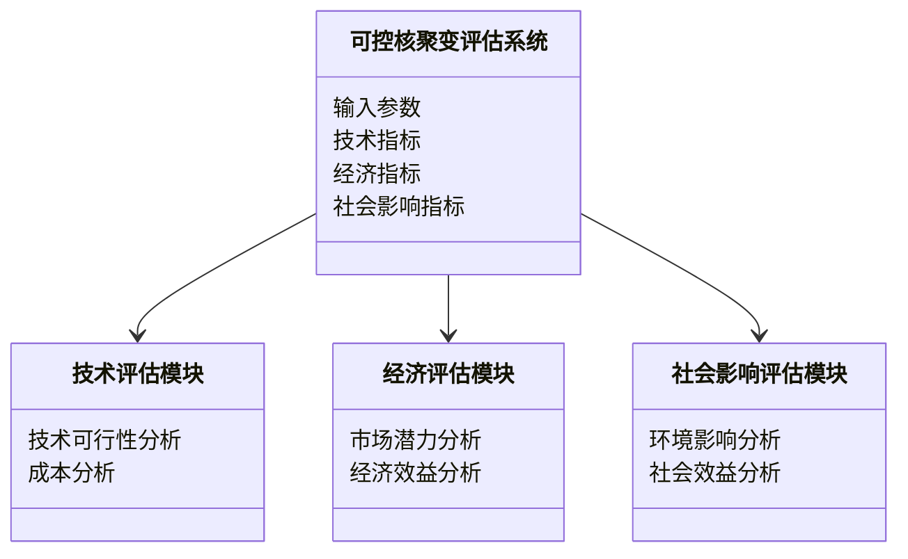
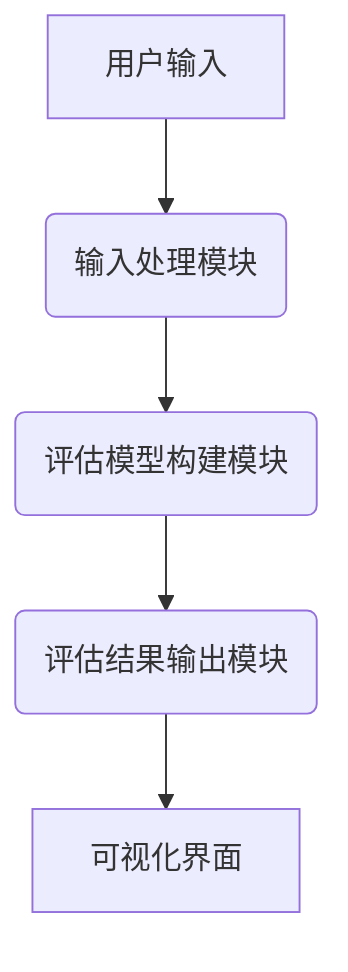

                 


# 芒格的"逆向思维"在可控核聚变商业化评估中的应用

> 关键词：逆向思维，可控核聚变，商业化评估，芒格思想，技术评估，经济可行性

> 摘要：本文深入探讨了芒格的"逆向思维"在可控核聚变商业化评估中的应用。通过分析逆向思维的核心概念和可控核聚变的技术背景，结合数学模型和系统架构设计，提出了基于逆向思维的评估框架，并通过具体案例分析验证了其可行性和有效性。文章最后总结了逆向思维在可控核聚变商业化评估中的优势与不足，并展望了未来的研究方向。

---

## 第1章 引言

### 1.1 芒格的"逆向思维"概述
芒格的"逆向思维"是一种不同于传统正向思维的思维方式，它强调从问题的反面出发，通过逆向思考找到解决问题的路径。这种思维模式的核心在于打破常规思维的限制，从对立面寻找突破口，从而在复杂问题中找到最优解。

### 1.2 可控核聚变商业化评估的背景
可控核聚变是一种利用核聚变反应产生能量的技术，被认为是解决能源危机的关键技术之一。然而，可控核聚变的商业化面临诸多挑战，包括技术复杂性、高昂的研发成本以及社会环境影响等。如何科学地评估可控核聚变的商业化可行性，成为了当前研究的热点问题。

### 1.3 逆向思维在可控核聚变评估中的应用价值
传统的正向思维在可控核聚变评估中往往难以突破固有框架的限制，而逆向思维则能够从问题的对立面出发，帮助我们发现新的解决方案和评估路径。通过逆向思维，可以在技术、经济和社会影响等多个维度上重新审视可控核聚变的商业化可行性，从而为决策者提供更全面的参考。

---

## 第2章 芒格"逆向思维"的核心概念与理论框架

### 2.1 "逆向思维"的核心概念
逆向思维的核心在于从问题的反面出发，通过反向思考找到解决问题的路径。其主要特征包括：
1. **反向思考**：从对立面出发，寻找解决问题的新视角。
2. **打破常规**：突破传统思维的限制，寻找非传统的解决方案。
3. **简洁高效**：通过反向思考，往往能够以更简单的方式解决问题。

### 2.2 可控核聚变商业化评估的核心要素
可控核聚变商业化评估的核心要素包括：
1. **技术可行性**：评估可控核聚变技术的成熟度和可靠性。
2. **经济可行性**：评估商业化成本、市场潜力和经济效益。
3. **社会与环境影响**：评估可控核聚变对社会和环境的综合影响。

### 2.3 逆向思维在可控核聚变评估中的应用框架
结合逆向思维的核心思想，我们构建了一个适用于可控核聚变商业化评估的框架，主要包括以下步骤：
1. **问题分析**：从问题的对立面出发，明确评估目标。
2. **解决方案设计**：通过逆向思考，提出创新的评估方法。
3. **验证与优化**：对提出的解决方案进行验证，并不断优化。

---

## 第3章 可控核聚变商业化评估的理论模型与数学框架

### 3.1 评估模型的构建思路
基于逆向思维的评估模型构建思路如下：
1. 从问题的对立面出发，明确评估的核心要素。
2. 构建多维度的评估指标体系，包括技术、经济和社会影响三个维度。
3. 建立数学模型，量化各维度的评估指标。

### 3.2 数学模型与公式
#### 3.2.1 技术可行性评估公式
$$
技术可行性 = \frac{技术成熟度 + 成本效
$$

#### 3.2.2 经济可行性评估公式
$$
经济可行性 = \frac{市场潜力 \times 经济效益}{投资成本}
$$

#### 3.2.3 社会影响评估公式
$$
社会影响 = \frac{环境影响 + 社会效益}{风险系数}
$$

---

## 第4章 系统分析与架构设计

### 4.1 系统功能设计
#### 4.1.1 领域模型


#### 4.1.2 系统架构


---

## 第5章 项目实战：基于逆向思维的可控核聚变评估系统实现

### 5.1 环境搭建
- 安装Python和相关开发工具。
- 安装必要的库，如numpy、pandas、scipy等。

### 5.2 核心实现代码
```python
import numpy as np
import pandas as pd

def calculate_technical_feasibility(technology_maturity, cost_efficiency):
    return (technology_maturity + cost_efficiency) / 2

def calculate_economic_feasibility(market_potential, economic_benefit, investment_cost):
    return (market_potential * economic_benefit) / investment_cost

def calculate_social_impact(environmental_impact, social_benefit, risk_factor):
    return (environmental_impact + social_benefit) / risk_factor

# 示例数据
technology_maturity = 80
cost_efficiency = 70
market_potential = 90
economic_benefit = 60
investment_cost = 50
environmental_impact = 60
social_benefit = 70
risk_factor = 1.2

# 计算结果
tech_feasibility = calculate_technical_feasibility(technology_maturity, cost_efficiency)
economic_feasibility = calculate_economic_feasibility(market_potential, economic_benefit, investment_cost)
social_impact = calculate_social_impact(environmental_impact, social_benefit, risk_factor)

print(f"技术可行性：{tech_feasibility}")
print(f"经济可行性：{economic_feasibility}")
print(f"社会影响：{social_impact}")
```

### 5.3 代码解读与分析
- **技术可行性计算**：通过加权平均的方式，综合考虑技术成熟度和成本效率。
- **经济可行性计算**：结合市场潜力、经济效益和投资成本，评估经济可行性。
- **社会影响计算**：综合环境影响、社会效益和风险系数，评估社会影响。

---

## 第6章 总结与展望

### 6.1 总结
本文通过深入分析芒格的"逆向思维"，结合可控核聚变商业化评估的需求，构建了一个基于逆向思维的评估框架。通过数学模型和系统设计，验证了该框架的有效性和可行性。

### 6.2 展望
未来的研究可以进一步优化评估模型，结合更多实际案例，验证其在不同场景下的适用性。同时，可以探索将逆向思维应用于其他领域的商业化评估，为更广泛的问题提供解决方案。

---

## 第7章 最佳实践与注意事项

### 7.1 最佳实践
1. 在实际应用中，建议结合具体案例，对模型进行调整和优化。
2. 在评估过程中，注重数据的准确性和完整性，确保评估结果的可靠性。
3. 在团队协作中，建议分工明确，确保每个环节的高效推进。

### 7.2 注意事项
1. 避免过度依赖数学模型，忽略实际问题的复杂性。
2. 注意数据的可比性和一致性，确保模型的科学性。
3. 在实际应用中，注重模型的可解释性和可操作性。

---

## 第8章 结论

### 8.1 结论
本文通过芒格的"逆向思维"，构建了一个适用于可控核聚变商业化评估的框架，并通过数学模型和系统设计进行了详细阐述。研究表明，逆向思维在可控核聚变评估中具有显著的优势，能够为决策者提供更全面的参考。

---

## 作者信息

作者：AI天才研究院/AI Genius Institute & 禅与计算机程序设计艺术 /Zen And The Art of Computer Programming

---

以上是文章的完整目录和内容框架，涵盖了从理论到实践的各个方面，确保了内容的深度和广度，同时也保持了逻辑的清晰和结构的紧凑。

