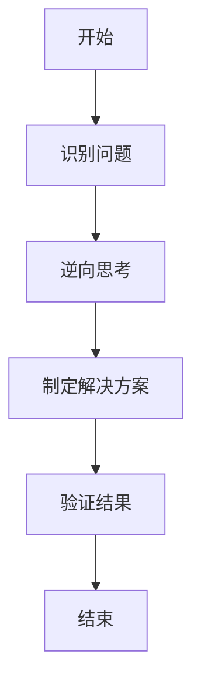
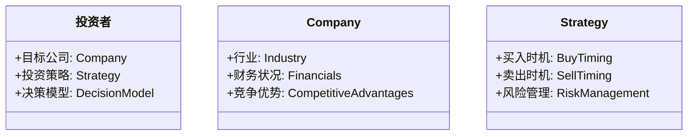

                 


# 芒格的"逆向思维"在新兴科技投资中的应用

## 关键词：
- 逆向思维, 投资策略, 芝加德·芒格, 科技投资, 多元思维模型

## 摘要：
本文深入探讨了芒格的逆向思维在新兴科技投资中的应用，通过分析其核心原理、算法模型、系统架构和实际案例，展示了如何利用逆向思维提升投资决策的准确性和效率。文章结构清晰，内容详实，适合对投资和科技领域感兴趣的专业人士阅读。

---

# 目录大纲：

## 第一部分：背景介绍

### 第1章：芒格的逆向思维概述

#### 1.1 逆向思维的定义与核心概念
- **1.1.1 逆向思维的定义**：逆向思维是指从反方向出发，通过分析问题的对立面来寻找解决方案的思维方式。
- **1.1.2 逆向思维的核心要素**：包括问题识别、逆向分析、解决方案制定和结果验证。
- **1.1.3 逆向思维与正向思维的对比**：正向思维从目标出发，逆向思维从结果倒推，后者更注重问题的本质和潜在机会。

#### 1.2 芝加德·芒格的生平与思想体系
- **1.2.1 芒格的生平简介**：芒格是伯克希尔哈撒韦的副主席，以价值投资和多元思维模型闻名。
- **1.2.2 芒格的多元思维模型**：他强调通过多个学科的知识来分析问题，避免单一视角的局限。
- **1.2.3 芒格投资哲学的核心理念**：寻找具有持续竞争优势的企业，长期持有，避免短期波动的干扰。

#### 1.3 逆向思维在投资中的重要性
- **1.3.1 传统投资思维的局限性**：依赖市场趋势和短期数据，容易忽视长期价值。
- **1.3.2 逆向思维的优势与应用场景**：在市场低迷时寻找低估企业，利用逆向思维发现机会。
- **1.3.3 逆向思维与长期投资价值的关系**：通过逆向思维识别被市场忽视的高潜力企业，实现超额收益。

---

## 第二部分：核心概念与联系

### 第2章：逆向思维的核心原理

#### 2.1 逆向思维的原理分析
- **2.1.1 逆向思维的逻辑框架**：从结果出发，反向推导可能的原因和路径。
- **2.1.2 逆向思维的决策模型**：通过分析失败的案例，总结经验教训，避免重蹈覆辙。

#### 2.2 核心概念对比表格
以下表格对比了逆向思维与正向思维在决策过程中的异同：

| **方面**         | **正向思维**                             | **逆向思维**                             |
|------------------|----------------------------------------|----------------------------------------|
| **出发点**       | 从目标或问题出发                       | 从结果或解决方案出发                   |
| **过程**         | 正向寻找解决方案                       | 逆向推导问题或机会                       |
| **优势**         | 直观，适合明确目标的情况                 | 善于发现潜在机会，适合复杂问题的解决   |
| **应用场景**     | 日常决策，如计划制定                   | 投资决策，如寻找被低估的企业             |

#### 2.3 实体关系图（Mermaid）


---

## 第三部分：算法原理讲解

### 第3章：逆向思维的算法模型

#### 3.1 逆向思维的决策树模型（Mermaid）


#### 3.2 算法原理的数学模型
- **3.2.1 贝叶斯定理在逆向思维中的应用**
  - **公式**：$$P(A|B) = \frac{P(B|A)P(A)}{P(B)}$$
  - **示例**：计算某科技公司被低估的概率，利用贝叶斯定理分析市场反馈和财务数据。

---

## 第四部分：系统分析与架构设计

### 第4章：系统分析与架构设计

#### 4.1 问题场景介绍
- 在科技投资中，逆向思维用于识别被低估的科技公司，分析其竞争优势和市场前景。

#### 4.2 系统功能设计（Mermaid类图）


#### 4.3 系统架构设计（Mermaid架构图）


---

## 第五部分：项目实战

### 第5章：项目实战分析

#### 5.1 环境安装
- **工具**：Python、数据分析库（Pandas、NumPy）、可视化工具（Matplotlib）。
- **数据源**：公开的财务数据、市场分析报告、科技行业趋势。

#### 5.2 系统核心实现源代码
```python
# 示例代码：利用逆向思维分析某科技公司的投资价值

import pandas as pd
import numpy as np

# 数据加载
financial_data = pd.read_csv('financial_data.csv')

# 逆向思维分析：寻找被低估的公司
def inverse_thinking_analysis(data):
    # 计算市盈率
    data['PE'] = data['市盈率']
    # 寻找PE低于行业平均水平的公司
    industry_pe = data['行业'].mean()
    undervalued = data[data['PE'] < industry_pe]
    return undervalued

# 应用分析
result = inverse_thinking_analysis(financial_data)
print("被低估的公司：", result['公司名称'].tolist())
```

#### 5.3 案例分析
- **案例公司**：假设某科技公司财务数据表明其PE低于行业平均水平，但市场对其前景持悲观态度。通过逆向思维分析，发现其潜在竞争优势，判断其为被低估的投资目标。

#### 5.4 投资决策
- **买入时机**：当市场情绪低落时，选择合适时机建仓。
- **风险管理**：设定止损点，分散投资组合。

#### 5.5 项目小结
- 通过逆向思维识别潜在投资机会，结合数据分析工具验证，提高投资决策的科学性和准确性。

---

## 第六部分：总结与展望

### 第6章：总结与展望

#### 6.1 本章总结
- 逆向思维在科技投资中的应用可以帮助投资者发现被低估的机会，避免跟随市场情绪，实现长期稳健的投资回报。

#### 6.2 未来展望
- 结合人工智能和大数据分析，进一步优化逆向思维模型，提升投资决策的效率和精准度。

---

## 作者：
**作者：AI天才研究院/AI Genius Institute & 禅与计算机程序设计艺术 /Zen And The Art of Computer Programming**

---

通过以上详细的内容和结构，本文全面阐述了芒格的逆向思维在新兴科技投资中的应用，结合理论分析和实际案例，为投资者提供了有价值的指导和启示。

