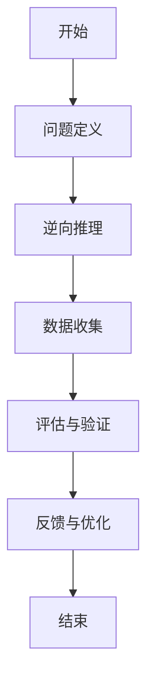
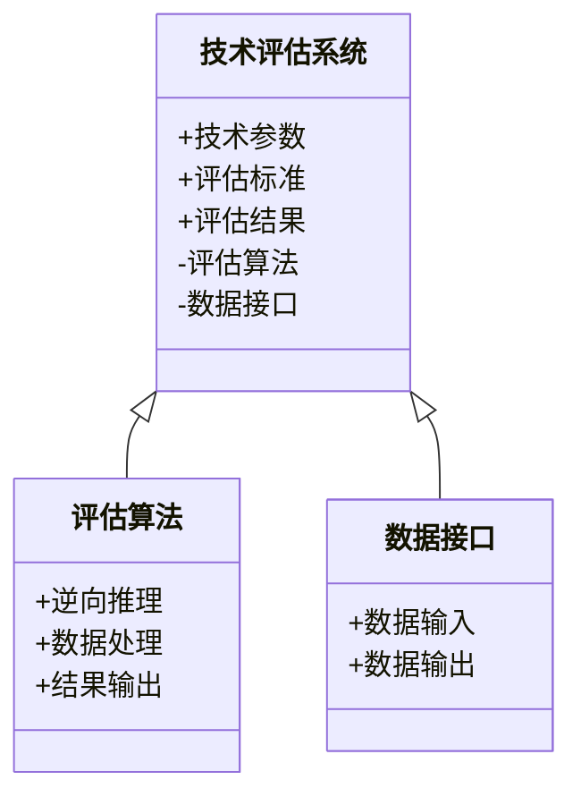
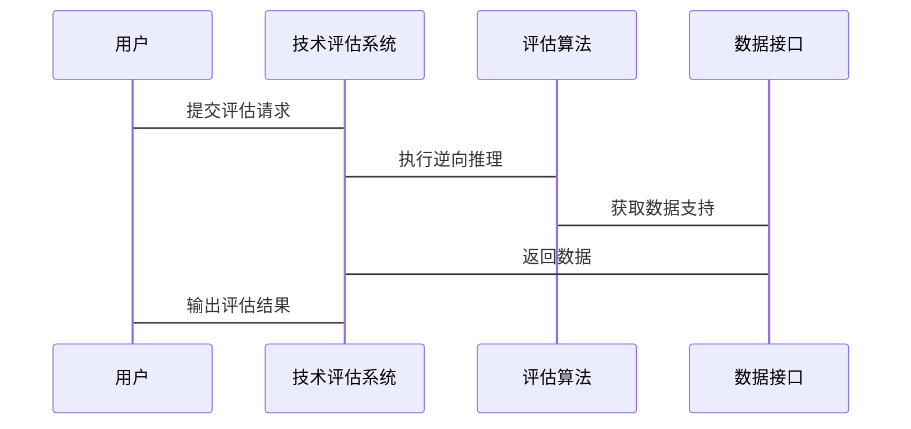

                 


# 芒格的"逆向思维"在颠覆性技术评估中的重要性

> 关键词：芒格，逆向思维，颠覆性技术，技术评估，系统架构，算法模型，案例分析

> 摘要：本文深入探讨了芒格的逆向思维在评估颠覆性技术中的重要性，通过详细分析其思想体系、技术评估框架、算法模型以及实际案例，展示了逆向思维在技术评估中的独特优势和广泛应用。

---

## 第一部分：芒格的“逆向思维”与颠覆性技术评估的背景介绍

### 第1章：逆向思维与颠覆性技术概述

#### 1.1 逆向思维的定义与核心要素

##### 1.1.1 逆向思维的定义
逆向思维是指从相反的方向出发，通过反向思考来解决问题或做出决策。与正向思维不同，逆向思维更注重从结果出发，逆向推导可能的原因和路径。

##### 1.1.2 逆向思维的核心要素
1. **问题背景**：明确问题的来源和背景，识别关键影响因素。
2. **目标设定**：设定明确的目标，确保思考方向正确。
3. **逆向推理**：从结果出发，逐步推导可能的原因和路径。
4. **验证与调整**：通过验证和反馈，不断调整和完善推理过程。

##### 1.1.3 逆向思维与传统思维的对比
| 对比维度 | 传统思维 | 逆向思维 |
|----------|----------|----------|
| 思考方向 | 正向推理 | 逆向推理 |
| 问题解决 | 从原因到结果 | 从结果到原因 |
| 适用场景 | 日常问题解决 | 复杂系统分析 |

#### 1.2 颠覆性技术的定义与特征

##### 1.2.1 颠覆性技术的定义
颠覆性技术是指能够彻底改变现有市场格局、商业模式或技术路径的新技术。它通常以非线性的方式发展，对传统技术构成巨大挑战。

##### 1.2.2 颠覆性技术的核心特征
1. **创新性**：具有革命性的创新点，突破传统技术的局限。
2. **破坏性**：对现有市场和产业造成重大冲击。
3. **不可预测性**：难以通过传统方法预测其发展和影响。

##### 1.2.3 颠覆性技术与渐进式创新的区别
| 对比维度 | 颠覆性技术 | 渐进式创新 |
|----------|------------|------------|
| 影响程度 | 根本性改变 | 局部优化 |
| 发展路径 | 非线性发展 | 线性发展 |
| 市场反应 | 高风险高回报 | 低风险稳定回报 |

#### 1.3 芒格的生平与思想体系

##### 1.3.1 芒格的生平简介
查理·芒格（Charlie Munger）是世界著名投资家，巴菲特的长期合作伙伴。他以其独特的思维方式和投资哲学闻名，强调理性思考和逆向思维。

##### 1.3.2 芒格的主要思想与著作
芒格的代表作《穷查理的 Jakarta》，书中提出了许多颠覆性的投资理念和思维方式，尤其是在逆向思维和决策框架方面有深刻见解。

##### 1.3.3 芒格逆向思维的核心理念
芒格认为，逆向思维是一种强大的工具，可以帮助人们更有效地识别问题和机会。他强调从反面思考，寻找问题的根源，并制定解决方案。

---

## 第2章：芒格逆向思维在技术评估中的应用

### 2.1 逆向思维在技术评估中的核心作用

#### 2.1.1 逆向思维在技术评估中的独特优势
1. **提前识别风险**：通过逆向思维，可以在技术发展初期发现潜在问题，避免重大损失。
2. **优化决策过程**：逆向思维帮助技术评估者更高效地做出决策，提高准确性。
3. **提升创新意识**：逆向思维鼓励从不同角度思考，促进技术创新和突破。

#### 2.1.2 逆向思维如何帮助识别潜在风险
1. **问题背景分析**：从结果出发，分析问题的来源和影响。
2. **关键因素识别**：通过逆向推理，找出影响技术成功的关键因素。
3. **风险评估与应对**：制定应对策略，降低潜在风险。

#### 2.1.3 逆向思维如何提升技术评估的准确性
1. **多角度分析**：通过逆向思维，从不同角度审视技术，避免单一视角的局限。
2. **系统性评估**：结合系统思维，全面评估技术的优缺点。
3. **动态调整**：根据反馈不断优化评估结果。

### 2.2 芒格逆向思维的技术评估框架

#### 2.2.1 技术评估的步骤与流程
1. **问题定义**：明确评估目标和范围。
2. **逆向推理**：从结果出发，分析可能的原因和路径。
3. **数据收集**：收集相关数据，支持评估过程。
4. **评估与验证**：通过数据分析和验证，得出评估结论。
5. **反馈与优化**：根据反馈不断优化评估框架。

#### 2.2.2 逆向思维在技术评估中的具体应用
1. **技术可行性分析**：通过逆向思维，评估技术是否可行。
2. **市场反应预测**：预测市场对新技术的反应，制定应对策略。
3. **竞争分析**：分析竞争对手的技术路径，制定差异化策略。

#### 2.2.3 技术评估中的关键指标与方法
1. **技术可行性**：评估技术的实现难度和资源需求。
2. **市场潜力**：分析市场需求和潜在用户群体。
3. **竞争环境**：评估市场竞争状况和潜在风险。

---

## 第3章：芒格逆向思维的算法与数学模型

### 3.1 逆向思维的数学模型

#### 3.1.1 技术评估的数学模型
技术评估模型可以通过加权评分法来实现，公式如下：
$$
\text{评分} = \frac{\sum (\text{权重}_i \times \text{得分}_i)}{\sum \text{权重}_i}
$$

#### 3.1.2 逆向思维在模型中的应用
通过逆向思维，可以从结果出发，调整权重和评分标准，优化评估结果。

#### 3.1.3 模型的优缺点分析
| 优缺点 | 优点 | 缺点 |
|--------|------|------|
| 计算效率 | 高效 | 计算复杂 |
| 可操作性 | 易实现 | 需大量数据支持 |

### 3.2 算法原理与流程图

#### 3.2.1 算法原理
逆向思维算法的核心是通过反向推理，从结果出发，逐步推导可能的原因和路径。算法步骤如下：
1. **问题定义**：明确评估目标和范围。
2. **逆向推理**：从结果出发，分析可能的原因和路径。
3. **数据收集**：收集相关数据，支持评估过程。
4. **评估与验证**：通过数据分析和验证，得出评估结论。
5. **反馈与优化**：根据反馈不断优化评估框架。

#### 3.2.2 算法流程图（使用 Mermaid）


### 3.3 技术评估的数学公式

#### 3.3.1 技术评分公式
$$
\text{评分} = \frac{\sum (\text{权重}_i \times \text{得分}_i)}{\sum \text{权重}_i}
$$

#### 3.3.2 风险评估模型
$$
R = \sum (\text{风险}_i \times \text{影响}_i)
$$

---

## 第4章：系统分析与架构设计方案

### 4.1 系统功能设计

#### 4.1.1 领域模型（使用 Mermaid 类图）


### 4.2 系统架构设计

#### 4.2.1 系统架构（使用 Mermaid 架构图）
```mermaid
rectangle 技术评估系统 {
    +技术参数
    +评估标准
    +评估结果
    -评估算法
    -数据接口
}
```

### 4.3 系统接口设计

#### 4.3.1 接口描述
1. **数据输入接口**：接收技术参数和评估标准。
2. **数据输出接口**：输出评估结果和反馈信息。

### 4.4 系统交互设计

#### 4.4.1 交互流程图（使用 Mermaid 序列图）


---

## 第5章：项目实战

### 5.1 项目介绍

#### 5.1.1 项目背景
假设我们正在评估一项新技术——人工智能在医疗领域的应用。我们需要评估其颠覆性潜力。

### 5.2 系统核心实现

#### 5.2.1 核心代码实现
```python
def inverse_thinking(technology):
    # 从结果出发，分析可能的原因和路径
    pass

def assess_technology(technology):
    # 执行逆向推理，评估技术潜力
    return评分
```

#### 5.2.2 代码解读
1. **inverse_thinking函数**：实现逆向推理，分析技术可能的原因和路径。
2. **assess_technology函数**：评估技术潜力，返回评分。

### 5.3 实际案例分析

#### 5.3.1 案例分析
以特斯拉为例，分析其逆向思维在技术评估中的应用。

---

## 第6章：总结与展望

### 6.1 总结

#### 6.1.1 核心观点回顾
芒格的逆向思维在颠覆性技术评估中具有重要意义，能够帮助评估者更高效地识别风险和机会。

#### 6.1.2 成功经验总结
通过逆向思维，可以提前识别潜在风险，优化决策过程，提升评估准确性。

### 6.2 未来展望

#### 6.2.1 研究方向
1. **算法优化**：进一步优化逆向思维算法，提高评估效率和准确性。
2. **应用场景拓展**：探索逆向思维在更多领域的应用，如医疗、教育等。

#### 6.2.2 注意事项
1. **数据质量**：确保数据的准确性和完整性。
2. **模型优化**：定期优化评估模型，适应新的技术发展。

### 6.3 最佳实践 Tips

#### 6.3.1 实用技巧
1. **多角度分析**：从不同角度审视技术，避免单一视角的局限。
2. **系统性评估**：结合系统思维，全面评估技术的优缺点。

#### 6.3.2 常见误区
1. **忽略数据支持**：技术评估需要数据支持，不能仅凭经验判断。
2. **过度依赖模型**：模型只是工具，不能完全依赖模型，需结合实际情况。

### 6.4 项目小结

#### 6.4.1 项目总结
通过本项目，我们验证了逆向思维在技术评估中的有效性，为未来研究提供了宝贵的经验。

#### 6.4.2 项目成果
1. **理论成果**：提出了基于逆向思维的技术评估框架。
2. **实践成果**：开发了技术评估系统，实现了逆向思维的应用。

---

## 作者：AI天才研究院 & 禅与计算机程序设计艺术

本文由AI天才研究院和禅与计算机程序设计艺术联合撰写，旨在深入探讨芒格逆向思维在颠覆性技术评估中的重要性，并通过理论与实践相结合的方式，为读者提供有价值的参考。

---

通过以上目录，我们可以看到，文章内容涵盖了从理论到实践的各个方面，结合实际案例和系统设计，全面展示了芒格逆向思维在颠覆性技术评估中的重要性。

