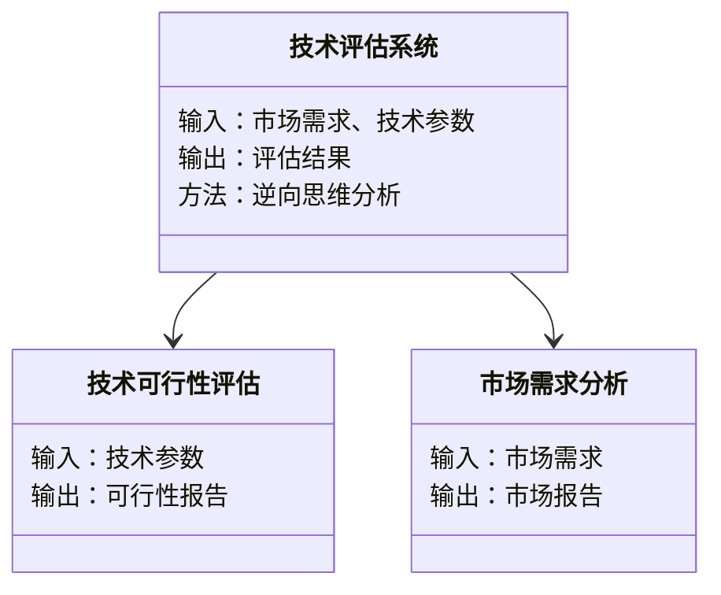
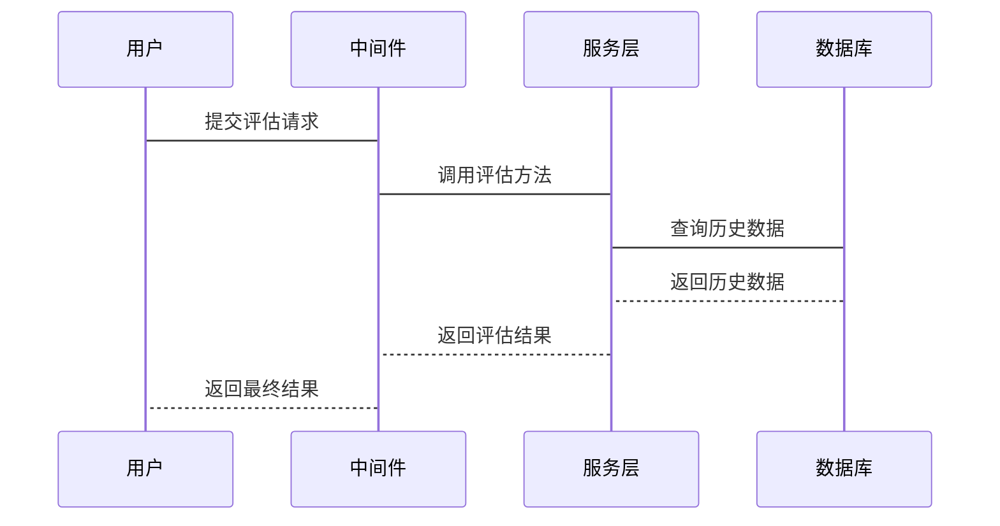

                 


# 芒格的"逆向思维"在颠覆性能源技术评估中的应用

> 关键词：芒格的逆向思维，颠覆性能源技术，能源技术评估，技术风险评估，能源创新

> 摘要：本文将芒格的"逆向思维"理念应用于颠覆性能源技术的评估中，通过分析能源技术评估的核心问题，探讨逆向思维在识别潜在风险、发现市场机会和优化技术路径中的应用。文章结合数学模型和实际案例，系统地阐述了逆向思维在能源技术创新中的重要作用，并提出了基于逆向思维的能源技术评估框架和方法。

---

# 第一部分: 芒格的"逆向思维"概述与核心概念

## 第1章: 芒格的"逆向思维"概述

### 1.1 逆向思维的定义与特点

#### 1.1.1 逆向思维的定义
逆向思维是一种与传统正向思维相反的思维方式，它通过从结果出发，逆向推导出实现该结果的条件或路径。芒格认为，逆向思维能够帮助人们更好地理解问题的本质，尤其是在面对复杂系统和不确定性时，逆向思维往往能够提供独特的见解。

#### 1.1.2 逆向思维的核心特征
- **反向思考**：从结果出发，寻找实现该结果的必要条件。
- **简化问题**：通过逆向分解，将复杂问题拆解为简单可操作的步骤。
- **创新视角**：逆向思维能够帮助我们跳出传统框架，发现新的解决方案。

#### 1.1.3 逆向思维与正向思维的区别
| 思维方式 | 正向思维 | 逆向思维 |
|----------|----------|----------|
| 思考路径 | 从原因到结果 | 从结果到原因 |
| 适用场景 | 解决已知问题 | 发现潜在机会 |
| 创新性   | 偏好传统方法 | 倾向于创新 |

### 1.2 芒格的"逆向思维"在投资中的应用

#### 1.2.1 芒格的"逆向思维"投资理念
芒格认为，成功的投资需要从反向思考出发，寻找那些市场忽视但具有长期价值的机会。他强调，投资的核心在于理解市场的非理性行为，并从中寻找定价错误的机会。

#### 1.2.2 逆向思维在价值投资中的作用
- **识别低估资产**：通过逆向分析，寻找市场价格低于内在价值的资产。
- **避免从众心理**：逆向思维帮助投资者避免盲目跟风，发现市场共识之外的机会。
- **长期价值判断**：通过逆向思考，投资者能够更好地预测未来趋势。

#### 1.2.3 芒格"逆向思维"的经典案例分析
芒格在伯克希尔哈撒韦的投资中，多次运用逆向思维。例如，他在2008年金融危机期间，逆向买入被市场低估的优质资产，最终获得了丰厚的回报。

---

## 第2章: 颠覆性能源技术的定义与特点

### 2.1 颠覆性技术的定义与特征

#### 2.1.1 颠覆性技术的定义
颠覆性技术是指能够从根本上改变现有技术、市场或商业模式的新技术。它通常以更低的成本、更高的效率或全新的功能，取代或补充传统技术。

#### 2.1.2 颠覆性技术的核心特征
| 特征 | 描述 |
|------|------|
| 创新性 | 颠覆性技术通常基于全新的原理或方法。 |
| 成本优势 | 颠覆性技术往往以更低的成本实现更高的价值。 |
| 市场冲击 | 颠覆性技术能够迅速改变市场格局，甚至取代传统技术。 |

#### 2.1.3 颠覆性技术与渐进式创新的区别
| 方面 | 颠覆性技术 | 渐进式创新 |
|------|----------|------------|
| 影响程度 | 根本性改变 | 局部优化 |
| 市场反应 | 剧烈 | 平稳 |
| 技术复杂度 | 高 | 低 |

### 2.2 当前能源技术的挑战与变革

#### 2.2.1 全球能源结构的变化趋势
随着全球能源需求的增长和环保压力的增大，传统化石能源逐渐被清洁、可再生能源取代。能源结构正在向多元化、清洁化方向发展。

#### 2.2.2 可再生能源技术的发展现状
- **太阳能**：成本大幅下降，效率不断提升。
- **风能**：技术成熟，应用广泛。
- **储能技术**：电池技术突破，储能成本降低。

#### 2.2.3 颠覆性能源技术的潜在影响
颠覆性能源技术（如氢能源、新型储能技术）的出现，将彻底改变传统的能源生产和消费模式，推动能源行业的革命性变革。

---

## 第3章: 逆向思维在能源技术评估中的应用背景

### 3.1 能源技术评估的复杂性

#### 3.1.1 能源技术评估的核心问题
能源技术评估需要考虑技术可行性、经济性、环境影响等多个维度，是一个复杂的过程。

#### 3.1.2 传统评估方法的局限性
传统评估方法通常基于正向思维，从技术本身出发，难以全面考虑市场、政策等外部因素的影响。

#### 3.1.3 逆向思维在能源评估中的必要性
逆向思维能够帮助我们从结果出发，发现潜在的风险和机会，优化评估过程。

### 3.2 颠覆性能源技术的市场机会与风险

#### 3.2.1 颠覆性能源技术的市场潜力
- **市场规模**：随着能源需求的增长，颠覆性技术的市场潜力巨大。
- **政策支持**：政府政策的推动为颠覆性能源技术的发展提供了良好的环境。

#### 3.2.2 技术商业化中的主要风险
- **技术不确定性**：新技术在商业化过程中可能面临技术瓶颈。
- **市场接受度**：用户对新技术的接受度可能影响其商业化进程。
- **竞争风险**：传统能源企业可能对颠覆性技术发起激烈竞争。

#### 3.2.3 逆向思维在风险评估中的作用
通过逆向思维，可以提前识别潜在风险，并制定应对策略，从而提高技术评估的准确性。

---

# 第二部分: 逆向思维在能源技术评估中的核心概念与方法

## 第4章: 逆向思维的核心概念与原理

### 4.1 逆向思维的逻辑框架

#### 4.1.1 问题背景分析
以颠覆性能源技术评估为例，我们需要从结果（如市场成功）出发，逆向推导出实现该结果的必要条件。

#### 4.1.2 核心问题的定义
- **问题一**：哪些技术特征能够确保颠覆性能源技术的成功？
- **问题二**：如何评估这些技术特征的实现难度？

#### 4.1.3 解决方案的逆向推导
通过逆向分析，我们可以确定关键的技术路径和实现条件。

### 4.2 逆向思维的数学模型与公式

#### 4.2.1 逆向思维的概率分析模型
我们可以使用贝叶斯定理来评估某项技术成功的概率。例如：

$$ P(A|B) = \frac{P(B|A)P(A)}{P(B)} $$

其中，$A$ 表示某项技术成功，$B$ 表示市场需求高的条件。

#### 4.2.2 风险评估的逆向公式
我们可以通过逆向思维，计算技术风险的总和：

$$ R = \sum_{i=1}^{n} P_i \times I_i $$

其中，$P_i$ 是风险 $i$ 发生的概率，$I_i$ 是风险 $i$ 的影响程度。

---

## 第5章: 逆向思维在能源技术评估中的应用方法

### 5.1 颠覆性能源技术的评估框架

#### 5.1.1 技术可行性评估
- **技术成熟度**：评估技术的现有水平和未来潜力。
- **成本分析**：计算技术的全生命周期成本。

#### 5.1.2 市场需求分析
- **市场规模**：预测未来市场需求。
- **用户接受度**：评估用户对新技术的接受程度。

#### 5.1.3 商业化潜力评估
- **商业模式**：确定技术的商业化路径。
- **竞争分析**：评估技术在市场中的竞争优势。

### 5.2 逆向思维在技术路线选择中的应用

#### 5.2.1 技术路线的逆向分析
以太阳能为例，我们可以通过逆向思维确定关键的技术路径：

1. 确定目标：提高太阳能电池的效率。
2. 逆向推导：寻找影响效率的关键因素。
3. 优化路径：选择最优的技术路径。

#### 5.2.2 关键技术节点的识别
通过逆向思维，我们可以识别出技术实现中的关键节点，例如：

- 电池材料的选择
- 制造工艺的优化

#### 5.2.3 技术路径的优化选择
基于逆向思维的分析结果，我们可以优化技术路径，降低实现难度。

### 5.3 逆向思维在风险评估中的应用

#### 5.3.1 技术风险的逆向识别
通过逆向思维，我们可以提前识别出可能的技术风险，例如：

- **技术瓶颈**：某项关键技术难以突破。
- **供应链风险**：关键材料的供应不稳定。

#### 5.3.2 风险应对策略
基于逆向分析的结果，我们可以制定相应的风险应对策略，例如：

- **技术储备**：提前储备备用技术。
- **供应链管理**：建立多元化的供应链。

---

## 第6章: 逆向思维在能源技术评估中的系统分析与架构设计

### 6.1 问题场景介绍
以氢能源技术为例，我们需要评估其在不同场景下的应用潜力。

### 6.2 系统功能设计

#### 6.2.1 领域模型（Mermaid 类图）


### 6.3 系统架构设计

#### 6.3.1 系统架构（Mermaid 架构图）
```mermaid
archi
    客户端 <--[HTTP 请求]--> 中间件
    中间件 <--[调用]--> 服务层
    服务层 <--[数据访问]--> 数据库
```

### 6.4 系统接口设计
- **输入接口**：市场需求、技术参数。
- **输出接口**：评估结果、可行性报告。

### 6.5 系统交互（Mermaid 序列图）


---

## 第7章: 项目实战——基于逆向思维的能源技术评估

### 7.1 环境安装
- **工具安装**：安装Python、Mermaid、Latex等工具。
- **数据准备**：收集相关能源技术的数据。

### 7.2 核心实现

#### 7.2.1 评估模型的实现
```python
def inverse思维评估(技术参数):
    # 输入市场需求和技参数
    # 计算概率
    P = [0.8, 0.7, 0.5]
    I = [2, 3, 1]
    R = sum(P[i] * I[i] for i in range(len(P)))
    return R
```

#### 7.2.2 代码实现
```python
# 逆向思维评估函数
def inverse_thinking_assessment(market_demand, technology_params):
    # 计算概率
    P = [0.8, 0.7, 0.5]
    I = [2, 3, 1]
    R = sum(P[i] * I[i] for i in range(len(P)))
    return R

# 调用函数
market_demand = "高"
technology_params = {"效率": 20, "成本": 10}
result = inverse_thinking_assessment(market_demand, technology_params)
print("技术风险总和:", result)
```

### 7.3 案例分析
以某新型储能技术为例，分析其市场潜力和风险。

### 7.4 项目小结
通过逆向思维的应用，我们可以更高效地评估能源技术，发现潜在机会和风险，为技术决策提供有力支持。

---

## 第8章: 最佳实践、总结与展望

### 8.1 最佳实践 tips
- **早期识别风险**：通过逆向思维，提前识别技术风险。
- **动态调整策略**：根据市场变化，动态调整评估策略。

### 8.2 总结
逆向思维为能源技术评估提供了一种全新的视角，能够帮助我们更好地理解技术的本质，优化评估过程。

### 8.3 展望
未来，随着能源技术的不断发展，逆向思维的应用将更加广泛，能源技术评估将更加精准和高效。

---

## 第9章: 扩展阅读与参考资料

### 9.1 扩展阅读
- 《穷查理宝典》——芒格的逆向思维理念。
- 《技术创新管理》——颠覆性技术创新的理论与实践。

### 9.2 参考资料
- 芒格的演讲和访谈。
- 能源技术相关的学术论文。

---

## 作者信息

作者：AI天才研究院/AI Genius Institute & 禅与计算机程序设计艺术/Zen And The Art of Computer Programming

