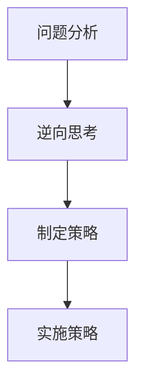

                 

# 芒格的逆向思维：在投资中的应用

> 关键词：芒格，逆向思维，投资哲学，风险管理，投资决策，机会识别

> 摘要：本文深入探讨了查理·芒格的逆向思维在投资中的应用，分析了其思想体系的核心概念，以及如何通过逆向思维识别投资机会、优化投资组合和管理风险。文章结合实际案例，详细阐述了逆向思维的原理和应用，为投资者提供了深刻的见解和实用的策略。

---

## 第1章: 芒格的背景与思想体系

### 1.1 芒格的生平与投资理念

查理·芒格（Charlie Munger）是世界著名投资者和伯克希尔·哈撒韦公司的副主席，被誉为“巴菲特的导师”。芒格的投资理念以“逆向思维”为核心，强调从反方向思考问题，避免常见错误，寻找被市场低估的机会。

#### 1.1.1 查理·芒格的基本介绍

- **生平简介**：芒格出生于1924年，毕业于哈佛大学，后获得加州大学伯克利分校的法律博士学位。
- **投资哲学**：芒格认为，投资不仅仅是寻找机会，更是避免犯错。他强调“机会是留给那些知道如何避免错误的人的”。
- **核心思想**：芒格的思想体系以“多元思维模型”为基础，涵盖心理学、经济学、数学等多个领域。

#### 1.1.2 芒格的投资哲学与思维方式

- **投资哲学**：芒格的投资哲学强调长期价值，注重公司基本面分析和风险管理。
- **思维方式**：芒格倡导“逆向思维”，即从反方向思考问题，寻找市场忽略的机会或风险。

#### 1.1.3 芒格思想的核心概念与特点

- **核心概念**：芒格的核心思想包括“机会成本”、“概率思维”和“安全边际”。
- **特点**：芒格的思想具有系统性、长期性和防御性，强调在不确定中寻找确定性。

---

### 1.2 逆向思维的定义与特点

#### 1.2.1 逆向思维的定义

逆向思维是一种从反方向思考问题的思维方式，强调寻找市场忽视的机会或风险，避免跟随大众的决策。

#### 1.2.2 逆向思维的核心特征

- **反向性**：从相反的角度思考问题。
- **独特性**：通过逆向思维找到与众不同的投资机会。
- **防御性**：通过逆向思维避免常见错误，降低风险。

#### 1.2.3 逆向思维与正向思维的区别与联系

- **区别**：正向思维从正面寻找机会，逆向思维从反面寻找机会。
- **联系**：逆向思维可以作为正向思维的补充，帮助投资者更全面地分析问题。

---

### 1.3 逆向思维在投资中的重要性

#### 1.3.1 投资中的常见误区

- **过度自信**：投资者常常过于自信，忽视潜在风险。
- **从众心理**：跟随市场趋势，可能导致错失机会。
- **短期波动**：过度关注短期波动，忽视长期价值。

#### 1.3.2 逆向思维如何帮助投资者避开误区

- **避免从众心理**：通过逆向思维，投资者可以独立思考，避免跟随市场潮流。
- **识别潜在风险**：逆向思维帮助投资者发现潜在风险，提前采取措施。
- **寻找低估机会**：逆向思维帮助投资者发现市场忽视的机会，获得超额收益。

#### 1.3.3 逆向思维在投资决策中的独特价值

- **提升决策质量**：逆向思维帮助投资者做出更理性的决策。
- **增强风险控制**：通过逆向思维，投资者可以更好地管理风险。
- **创造超额收益**：逆向思维帮助投资者找到市场低估的机会，创造超额收益。

---

## 第2章: 逆向思维的核心原理与框架

### 2.1 逆向思维的核心原理

#### 2.1.1 逆向思维的基本原理

- **反向思考**：从相反的角度思考问题。
- **概率分析**：通过概率分析，评估不同情况的可能性。
- **风险控制**：通过逆向思维，识别和管理潜在风险。

#### 2.1.2 逆向思维的逻辑结构

- **问题分析**：从反方向分析问题，寻找潜在的机会或风险。
- **解决方案**：制定相应的策略，应对潜在风险或抓住机会。

#### 2.1.3 逆向思维的数学模型与公式

- **概率模型**：通过概率模型分析问题，评估不同情况的可能性。
- **数学公式**：例如，期望值公式：$$E = \sum p_i x_i$$，其中 $p_i$ 是概率，$x_i$ 是结果。

### 2.2 逆向思维的框架体系

#### 2.2.1 投资中的逆向思维框架

- **问题分析**：从反方向分析问题，寻找潜在的机会或风险。
- **解决方案**：制定相应的策略，应对潜在风险或抓住机会。

#### 2.2.2 逆向思维的逻辑关系图

#### 2.2.3 逆向思维与投资决策的关系

- **关系**：逆向思维是投资决策的重要组成部分，帮助投资者做出更理性的决策。

### 2.3 逆向思维的数学模型与公式

#### 2.3.1 逆向思维的数学表达式

- **期望值公式**：$$E = \sum p_i x_i$$，其中 $p_i$ 是概率，$x_i$ 是结果。

#### 2.3.2 逆向思维的逻辑关系式

- **概率关系式**：$$p_i = \frac{\text{有利结果数}}{\text{总结果数}}$$

#### 2.3.3 逆向思维的数学模型分析

- **案例分析**：假设某公司的股票价格波动，通过逆向思维分析其潜在风险，使用概率模型评估其下跌的可能性。

---

## 第3章: 逆向思维在投资机会识别中的应用

### 3.1 投资机会识别的基本原则

#### 3.1.1 投资机会识别的核心要素

- **公司基本面**：包括财务状况、行业地位等。
- **市场环境**：包括宏观经济、行业趋势等。
- **竞争优势**：包括公司的核心竞争力。

#### 3.1.2 投资机会识别的常见方法

- **基本面分析**：分析公司的财务报表、行业地位等。
- **技术分析**：通过股票价格走势预测未来走势。
- **市场情绪分析**：分析市场情绪，寻找被低估的机会。

#### 3.1.3 逆向思维在机会识别中的作用

- **发现低估机会**：通过逆向思维，发现市场忽视的机会。
- **避免从众心理**：通过逆向思维，避免跟随市场潮流，寻找真正的投资机会。

---

### 3.2 逆向思维在投资机会评估中的应用

#### 3.2.1 投资机会评估的逆向思维框架

- **问题分析**：从反方向分析问题，寻找潜在的机会或风险。
- **解决方案**：制定相应的策略，应对潜在风险或抓住机会。

#### 3.2.2 逆向思维在风险评估中的应用

- **概率分析**：通过概率模型分析风险的可能性。
- **风险控制**：通过逆向思维，制定风险管理策略。

#### 3.2.3 逆向思维在收益评估中的应用

- **收益预测**：通过逆向思维，预测未来收益。
- **风险调整收益**：通过逆向思维，调整收益预测，考虑潜在风险。

---

### 3.3 实际案例分析

#### 3.3.1 某行业投资机会的逆向思维分析

- **案例背景**：某行业面临市场低迷，但某公司具有强大的竞争优势。
- **逆向思维分析**：通过逆向思维，发现该公司的潜在机会，预测其未来收益。

#### 3.3.2 某公司投资机会的逆向思维评估

- **案例背景**：某公司股票价格被市场低估。
- **逆向思维评估**：通过逆向思维，评估其潜在收益，制定投资策略。

#### 3.3.3 案例分析总结与启示

- **总结**：逆向思维帮助投资者发现市场忽视的机会，创造超额收益。
- **启示**：投资者应学会从反方向思考问题，避免跟随市场潮流，寻找真正的投资机会。

---

## 第4章: 逆向思维在投资组合管理中的应用

### 4.1 投资组合管理的基本原理

#### 4.1.1 投资组合管理的核心要素

- **资产配置**：决定投资组合中各类资产的比例。
- **风险控制**：通过分散投资降低风险。
- **收益目标**：设定投资组合的收益目标。

#### 4.1.2 投资组合管理的常见策略

- **分散投资**：通过投资不同资产降低风险。
- **定期调整**：根据市场变化调整投资组合。
- **定投策略**：定期定额投资，分散风险。

#### 4.1.3 逆向思维在投资组合管理中的作用

- **优化资产配置**：通过逆向思维，优化资产配置，降低风险。
- **制定风险管理策略**：通过逆向思维，制定风险管理策略，应对潜在风险。

---

### 4.2 逆向思维在投资组合优化中的应用

#### 4.2.1 逆向思维在资产配置中的应用

- **资产配置策略**：通过逆向思维，优化资产配置，降低风险。
- **行业选择**：选择被市场忽视的行业，寻找低估的机会。

#### 4.2.2 逆向思维在风险控制中的应用

- **风险管理策略**：通过逆向思维，制定风险管理策略，应对潜在风险。
- **分散投资**：通过分散投资降低风险。

#### 4.2.3 逆向思维在收益最大化中的应用

- **收益目标设定**：通过逆向思维，设定收益目标，制定投资策略。
- **优化投资组合**：通过逆向思维，优化投资组合，实现收益最大化。

---

### 4.3 实际案例分析

#### 4.3.1 某投资组合的逆向思维优化

- **案例背景**：某投资组合风险较高，收益不稳定。
- **逆向思维优化**：通过逆向思维，优化资产配置，降低风险，提高收益。

#### 4.3.2 某行业投资组合的逆向思维调整

- **案例背景**：某行业面临市场低迷，投资组合表现不佳。
- **逆向思维调整**：通过逆向思维，调整投资策略，抓住行业低估的机会。

#### 4.3.3 案例分析总结与启示

- **总结**：逆向思维帮助投资者优化投资组合，降低风险，提高收益。
- **启示**：投资者应学会从反方向思考问题，优化投资组合，实现收益最大化。

---

## 第5章: 逆向思维在风险管理中的应用

### 5.1 风险管理的基本原理

#### 5.1.1 风险管理的核心要素

- **风险识别**：识别潜在风险。
- **风险评估**：评估风险的可能性和影响。
- **风险管理策略**：制定应对风险的策略。

#### 5.1.2 风险管理的常见方法

- **风险分散**：通过分散投资降低风险。
- **风险对冲**：通过对冲交易降低风险。
- **风险规避**：避免投资高风险资产。

#### 5.1.3 逆向思维在风险管理中的作用

- **发现潜在风险**：通过逆向思维，发现潜在风险，制定应对策略。
- **优化风险管理策略**：通过逆向思维，优化风险管理策略，降低风险。

---

### 5.2 逆向思维在风险管理中的具体应用

#### 5.2.1 逆向思维在风险识别中的应用

- **风险识别策略**：通过逆向思维，识别潜在风险。
- **风险评估方法**：通过逆向思维，评估风险的可能性和影响。

#### 5.2.2 逆向思维在风险应对中的应用

- **风险管理策略**：通过逆向思维，制定应对风险的策略。
- **风险控制措施**：通过逆向思维，制定风险控制措施，降低风险。

#### 5.2.3 逆向思维在风险监控中的应用

- **风险监控方法**：通过逆向思维，监控潜在风险。
- **风险预警机制**：通过逆向思维，建立风险预警机制，及时应对风险。

---

### 5.3 实际案例分析

#### 5.3.1 某公司的风险管理案例

- **案例背景**：某公司面临市场风险，投资组合表现不佳。
- **逆向思维应用**：通过逆向思维，识别潜在风险，制定应对策略，降低风险，提高收益。

#### 5.3.2 某行业的风险管理案例

- **案例背景**：某行业面临经济衰退，市场风险加剧。
- **逆向思维应用**：通过逆向思维，优化风险管理策略，降低风险，实现投资目标。

#### 5.3.3 案例分析总结与启示

- **总结**：逆向思维帮助投资者发现潜在风险，制定应对策略，降低风险，提高收益。
- **启示**：投资者应学会从反方向思考问题，优化风险管理策略，实现长期投资目标。

---

## 第6章: 投资哲学与风险管理总结

### 6.1 投资哲学的核心思想

- **长期投资**：注重长期价值，避免短期波动。
- **价值投资**：寻找被市场低估的机会，注重公司基本面。
- **风险管理**：通过逆向思维，优化风险管理策略，降低风险。

### 6.2 逆向思维与投资哲学的结合

- **结合点**：逆向思维是投资哲学的重要组成部分，帮助投资者做出更理性的决策。
- **应用**：通过逆向思维，投资者可以更好地理解投资哲学，实现长期投资目标。

### 6.3 投资风险管理的最佳实践

- **风险意识**：投资者应具备风险意识，注重风险管理。
- **逆向思维**：通过逆向思维，发现潜在风险，制定应对策略。
- **长期视角**：从长期视角出发，制定投资策略，实现投资目标。

---

## 作者：AI天才研究院/AI Genius Institute & 禅与计算机程序设计艺术 /Zen And The Art of Computer Programming

---

这篇文章详细探讨了芒格的逆向思维在投资中的应用，结合实际案例和理论分析，为投资者提供了深刻的见解和实用的策略。通过逆向思维，投资者可以更好地识别投资机会、优化投资组合和管理风险，实现长期的投资目标。

