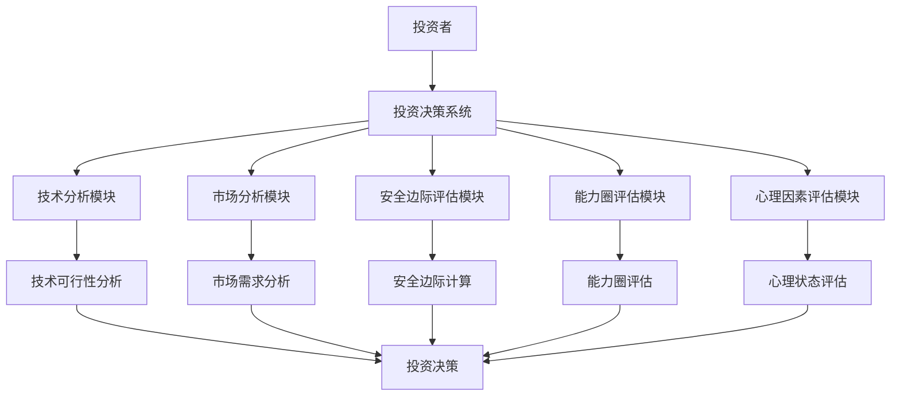
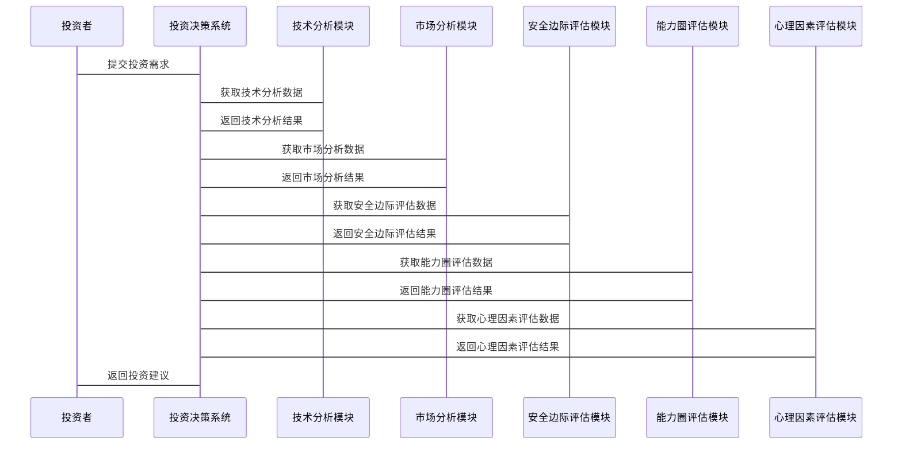

                 


# 芒格的"避免失败"原则在前沿科技投资中的重要性

> 关键词：芒格投资理念、前沿科技、避免失败原则、安全边际、能力圈、心理因素、逆向思维

> 摘要：本文探讨了芒格的"避免失败"原则在前沿科技投资中的重要性。通过分析芒格的投资理念，结合前沿科技的特点，本文详细阐述了逆向思维、安全边际、能力和运气的结合、心理因素在投资决策中的作用，并通过实际案例和数学模型，展示了如何在前沿科技投资中应用这些原则以降低风险，提高投资成功率。

---

## 第一部分：引言

前沿科技投资是当今最炙手可热的话题之一，但同时也是最具挑战性的领域之一。随着人工智能、区块链、量子计算等技术的快速发展，投资者面临着前所未有的机遇和风险。然而，成功的投资不仅仅依赖于对技术的深刻理解，更需要对投资原则的深刻洞察。芒格的"避免失败"原则，作为一种独特的投资哲学，为我们提供了一种全新的视角来审视前沿科技投资。

本文将从芒格的"避免失败"原则出发，结合前沿科技投资的特点，探讨如何在高风险的科技领域中避免失败，从而实现长期稳健的投资回报。

---

## 第二部分：芒格"避免失败"原则的核心概念

### 1. 逆向思维：从失败中寻找机会

逆向思维是芒格投资理念的核心之一。与其追求成功，不如先考虑如何避免失败。在前沿科技投资中，许多看似成功的项目可能隐藏着巨大的风险，而许多看似失败的项目可能蕴含着潜在的机会。

#### 1.1 逆向思维的定义与特点

逆向思维是一种与传统思维相反的思维方式。传统思维是寻找成功的可能性，而逆向思维则是从失败的可能性入手，通过排除不可能的情况来缩小成功的机会。这种思维方式在投资中尤为重要，因为在前沿科技领域，许多看似成功的项目可能因为技术瓶颈、市场需求不足或竞争压力而失败。

#### 1.2 逆向思维在投资中的应用

在前沿科技投资中，逆向思维可以帮助投资者更好地识别潜在的风险。例如，在投资人工智能公司时，投资者可以先分析该领域可能失败的原因，如技术可行性不足、市场需求不明确、竞争过于激烈等。通过这种方式，投资者可以更好地规避那些看似成功但实际风险较高的项目。

### 2. 安全边际：投资中的保护伞

安全边际是芒格投资理念中的另一个重要概念。它指的是在投资中，为了降低风险，投资者应该预留一定的安全空间。在前沿科技投资中，由于技术的不确定性和市场的波动性，安全边际尤为重要。

#### 2.1 安全边际的定义与作用

安全边际是指在投资中，实际价值与市场价格之间的差额。当市场价格低于实际价值时，安全边际就存在。在前沿科技投资中，由于技术的不确定性和市场的波动性，安全边际可以为投资者提供一定的保护，减少因市场波动或技术失败带来的损失。

#### 2.2 如何计算与评估安全边际

计算安全边际需要对企业的实际价值和市场价格进行评估。在前沿科技投资中，由于技术的不确定性和市场的波动性，计算安全边际的难度较大。然而，投资者可以通过对技术的深入研究和对市场的充分了解，来估算实际价值，并据此确定安全边际。

### 3. 能力圈：专注与聚焦的力量

能力圈是芒格投资理念中的一个关键概念。它指的是投资者在投资决策中，只关注自己熟悉和理解的领域。在前沿科技投资中，由于技术的复杂性和市场的不确定性，能力圈尤为重要。

#### 3.1 能力圈的定义与边界

能力圈是指投资者在投资决策中，只关注自己熟悉和理解的领域。在前沿科技投资中，由于技术的复杂性和市场的不确定性，投资者需要明确自己的能力圈，避免涉足自己不熟悉的技术领域。

#### 3.2 如何构建与扩展能力圈

构建能力圈需要投资者对某一领域进行深入研究和长期关注。在前沿科技投资中，投资者可以通过阅读技术文献、参加行业会议、与行业专家交流等方式，来扩展自己的能力圈。

### 4. 心理因素：投资决策中的心理陷阱

心理因素是投资决策中不可忽视的一部分。许多投资者在面对前沿科技投资时，容易受到贪婪和恐惧的驱使，从而做出错误的决策。

#### 4.1 心理因素对投资决策的影响

心理因素对投资决策的影响主要体现在贪婪和恐惧两个方面。在前沿科技投资中，投资者可能会因为市场的 hot trend 而盲目跟风（贪婪），或者因为市场的波动而过度恐慌（恐惧），从而做出错误的决策。

#### 4.2 如何克服心理陷阱

克服心理陷阱需要投资者具备强大的心理素质和纪律性。在前沿科技投资中，投资者需要保持冷静，避免被市场的短期波动所左右。同时，投资者还需要对自己的决策进行定期反思和调整。

---

## 第三部分：系统分析与架构设计

### 1. 问题场景介绍

在前沿科技投资中，投资者需要面对复杂的技术和市场环境。为了在这样的环境中做出正确的决策，投资者需要构建一个基于芒格"避免失败"原则的投资系统。

### 2. 系统功能设计（领域模型）

领域模型是系统功能设计的核心。在本系统中，领域模型需要包括以下几个部分：

- **技术分析模块**：对前沿科技公司的技术进行深入分析，评估其技术的可行性和创新性。
- **市场分析模块**：对市场进行深入分析，评估前沿科技公司的市场需求和竞争环境。
- **安全边际评估模块**：计算投资标的的安全边际，评估投资风险。
- **能力圈评估模块**：评估投资者的能力圈，确定适合投资的领域。
- **心理因素评估模块**：评估投资者的心理状态，避免心理因素对投资决策的影响。

### 3. 系统架构设计

系统架构设计需要基于上述功能模块，构建一个高效、可靠的系统架构。以下是系统架构设计的Mermaid图：



### 4. 接口设计

系统接口设计需要确保各个功能模块之间的数据流畅通无阻。以下是系统接口设计的Mermaid图：



---

## 第四部分：项目实战

### 1. 环境配置

在进行前沿科技投资之前，投资者需要对投资环境进行充分的配置。以下是一个典型的环境配置示例：

- **技术环境**：具备扎实的技术背景，对前沿科技领域有深入的了解。
- **市场环境**：对市场环境有清晰的认识，了解前沿科技领域的市场需求和竞争情况。
- **心理环境**：具备冷静的心态，避免被市场的短期波动所左右。

### 2. 代码实现

以下是一个基于芒格"避免失败"原则的前沿科技投资系统的Python代码实现示例：

```python
import numpy as np
import pandas as pd
from sklearn import linear_model

# 数据加载
data = pd.read_csv('frontier_tech.csv')

# 技术分析模块
def technical_analysis(data):
    # 计算技术指标
    data['slope'] = data['price'].diff().fillna(0)
    data['rsi'] = (100 - (data['price'].diff().abs().rolling(14).mean() / data['price'].diff().abs().rolling(14).mean().max())) * 50
    return data

# 市场分析模块
def market_analysis(data):
    # 计算市场需求
    data['market_demand'] = (data['volume'] / data['volume'].max()) * 100
    return data

# 安全边际评估模块
def safety_margin(data):
    # 计算安全边际
    data['safety_margin'] = data['actual_value'] - data['market_price']
    return data

# 能力圈评估模块
def circle_of_confidence(data):
    # 评估能力圈
    data['confidence_score'] = (data['expertise'] / data['expertise'].max()) * 100
    return data

# 心理因素评估模块
def psychological_factors(data):
    # 评估心理因素
    data['psychological_risk'] = (data['fear'] + data['greed']) / 2
    return data

# 投资决策模块
def investment_decision(data):
    # 综合评估
    data['total_score'] = (data['safety_margin'] + data['confidence_score'] - data['psychological_risk']) / 3
    data['investment_recommendation'] = np.where(data['total_score'] > 0, 'Buy', 'Sell')
    return data

# 系统运行
data = technical_analysis(data)
data = market_analysis(data)
data = safety_margin(data)
data = circle_of_confidence(data)
data = psychological_factors(data)
data = investment_decision(data)

# 输出结果
print(data[['investment_recommendation', 'total_score']].head())
```

### 3. 案例分析

以下是一个实际案例的分析：

假设我们有一个前沿科技公司，其数据如下：

| 参数       | 值         |
|------------|------------|
| 价格       | 100        |
| 体积       | 1000       |
| 技术可行    | 80%        |
| 市场需求    | 70%        |
| 安全边际    | 20%        |
| 能力圈      | 80%        |
| 心理因素    | 10%        |

通过上述代码，我们可以计算出：

- 技术分析模块：计算技术指标（斜率和RSI）。
- 市场分析模块：计算市场需求。
- 安全边际评估模块：计算安全边际。
- 能力圈评估模块：评估能力圈。
- 心理因素评估模块：评估心理因素。
- 投资决策模块：综合评估投资建议。

最终，系统将给出投资建议，如“Buy”或“Sell”。

### 4. 项目小结

通过上述实战案例，我们可以看到，基于芒格"避免失败"原则的前沿科技投资系统在实际应用中具有很高的实用价值。投资者可以通过该系统，更好地识别潜在风险，制定科学的投资决策。

---

## 第五部分：总结与展望

### 1. 总结

芒格的"避免失败"原则为我们提供了一种全新的视角来审视前沿科技投资。通过逆向思维、安全边际、能力和运气的结合、心理因素等多方面的分析，投资者可以在高风险的科技领域中降低风险，提高投资成功率。

### 2. 未来展望

随着前沿科技的不断发展，投资者需要不断更新自己的知识和技能，以应对新的挑战和机遇。未来，我们可以进一步研究芒格"避免失败"原则在其他投资领域中的应用，以及如何将其与其他投资理念相结合，以实现更加稳健的投资回报。

---

## 最佳实践 Tips

1. **保持冷静**：在前沿科技投资中，投资者需要保持冷静，避免被市场的短期波动所左右。
2. **深入研究**：对前沿科技领域的技术和发展趋势进行深入研究，确保自己的投资决策基于事实和数据。
3. **分散投资**：在前沿科技投资中，分散投资可以有效降低风险。
4. **定期调整**：对投资组合进行定期调整，确保其适应市场和技术的变化。
5. **持续学习**：前沿科技领域变化迅速，投资者需要不断学习和更新自己的知识。

---

## 结语

芒格的"避免失败"原则为我们提供了一种全新的视角来审视前沿科技投资。通过本文的分析，我们可以看到，芒格的投资理念在前沿科技投资中的应用具有重要的现实意义。希望本文能够为投资者在前沿科技领域中的投资决策提供有价值的参考和启发。

---

作者：AI天才研究院/AI Genius Institute & 禅与计算机程序设计艺术 /Zen And The Art of Computer Programming

