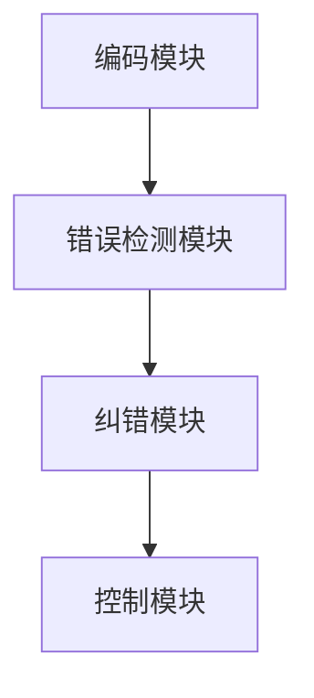

                 


# 《芒格的"避免失败"原则在量子纠错技术投资中的应用》

---

## 关键词：芒格原则, 量子纠错技术, 量子计算, 投资策略, 风险管理

---

## 摘要：  
本文探讨了芒格的“避免失败”原则在量子纠错技术投资中的应用，分析了量子纠错技术的核心原理、算法实现、数学模型以及其在量子计算中的重要性。通过结合风险管理与量子技术，本文提出了如何在投资决策中避免失败，从而优化量子技术的投资策略。文章内容涵盖量子纠错技术的基本概念、算法原理、系统架构、项目实战以及投资策略的系统性分析。

---

# 第1章: 芒格的"避免失败"原则与量子纠错技术概述

## 1.1 芒格的"避免失败"原则  
芒格的“避免失败”原则强调在投资中避免重大损失，而非追求超额收益。这一原则的核心在于通过严格的筛选标准和风险管理，降低投资失败的概率。对于量子纠错技术的投资，这一原则同样适用。  

### 1.1.1 投资中的风险管理原则  
芒格认为，投资的本质是管理风险，而非追求收益。通过避免明显的风险和不确定性，投资者可以最大限度地减少损失，从而在长期获得稳健的回报。  

### 1.1.2 避免重大损失的思维方式  
芒格强调避免“大错”，而非追求“小对”。这种思维方式适用于量子纠错技术投资，因为量子技术的不确定性较高，技术失败可能导致重大损失。  

### 1.1.3 芒格原则在量子技术投资中的应用  
在量子纠错技术的投资中，芒格的“避免失败”原则可以帮助投资者识别高风险的技术路径，避免投资于不成熟或不可行的技术，从而降低整体投资风险。  

## 1.2 量子纠错技术的基本概念  

### 1.2.1 量子计算的基本原理  
量子计算利用量子叠加和量子纠缠的特性，通过量子位（qubit）进行计算。与经典计算机的二进制位不同，量子位可以同时表示0和1，从而实现并行计算。  

### 1.2.2 量子纠错技术的定义  
量子纠错技术是指通过编码和纠错算法，检测和纠正量子计算中的错误，以确保量子计算的准确性。  

### 1.2.3 量子纠错技术的重要性  
由于量子位的脆弱性，外界干扰或内部噪声可能导致量子态的错误。量子纠错技术是确保量子计算稳定性和可靠性的关键。  

## 1.3 量子纠错技术的核心挑战  

### 1.3.1 量子纠错技术的三大核心挑战  
1. **错误检测与纠正**：量子纠错需要在不破坏量子态的情况下检测和纠正错误。  
2. **技术成熟度**：当前量子纠错技术尚不成熟，距离实际应用仍有一定距离。  
3. **资源消耗**：量子纠错需要额外的量子位和计算资源，这可能影响量子计算的效率。  

### 1.3.2 技术成熟度与投资风险的平衡  
投资者需要在技术成熟度和投资风险之间找到平衡点。过早投资可能面临技术失败的风险，而过晚投资则可能失去市场先机。  

### 1.3.3 量子纠错技术的未来发展与投资机会  
随着量子计算技术的不断发展，量子纠错技术将逐渐成熟。投资者需要关注技术进展，寻找具有潜力的量子纠错技术公司或项目。  

---

# 第2章: 芒格原则与量子纠错技术的联系  

## 2.1 芒格原则在量子纠错技术投资中的应用  

### 2.1.1 风险管理与量子纠错技术的关联  
芒格的“避免失败”原则强调风险管理，而量子纠错技术的核心目标之一就是降低量子计算的错误率，从而降低技术风险。  

### 2.1.2 避免失败策略在量子技术投资中的体现  
通过严格筛选量子纠错技术的可行性，投资者可以避免投资于技术不成熟或不可行的项目，从而降低投资失败的概率。  

### 2.1.3 芒格原则如何帮助投资者评估量子纠错技术的风险  
芒格的原则提供了评估量子纠错技术风险的框架，包括技术可行性、团队能力、市场需求等因素。  

## 2.2 量子纠错技术的核心挑战与投资策略  

### 2.2.1 量子纠错技术的三大核心挑战  
1. **错误检测与纠正**：需要开发高效的纠错算法和实验装置。  
2. **技术成熟度**：当前量子纠错技术尚不成熟，距离实际应用仍有一定距离。  
3. **资源消耗**：量子纠错需要额外的量子位和计算资源，这可能影响量子计算的效率。  

### 2.2.2 技术成熟度与投资风险的平衡  
投资者需要在技术成熟度和投资风险之间找到平衡点。过早投资可能面临技术失败的风险，而过晚投资则可能失去市场先机。  

### 2.2.3 量子纠错技术的未来发展与投资机会  
随着量子计算技术的不断发展，量子纠错技术将逐渐成熟。投资者需要关注技术进展，寻找具有潜力的量子纠错技术公司或项目。  

---

# 第3章: 量子纠错技术的核心算法与数学模型  

## 3.1 量子纠错算法的基本原理  

### 3.1.1 量子纠错算法的分类  
1. **表面码（Surface Code）**：一种基于二维量子位的纠错码，具有较高的容错能力。  
2. **里德码（Reed-Muller Code）**：一种适用于量子纠错的二元纠错码。  
3. **海德尔码（Hybrid Code）**：结合了表面码和里德码的优点，具有更高的纠错能力。  

### 3.1.2 表面码（Surface Code）的基本原理  
表面码通过在二维量子位阵列中引入逻辑门，检测和纠正量子位的错误。其纠错能力依赖于量子位的排列和逻辑门的设计。  

### 3.1.3 逻辑门与量子纠错的关系  
逻辑门是量子纠错算法的核心组件。通过逻辑门的组合，可以实现错误检测和纠正功能。  

## 3.2 量子纠错的数学模型  

### 3.2.1 量子态的表示与叠加原理  
量子态可以用向量表示，例如 $|0\rangle = \begin{bmatrix} 1 \\ 0 \end{bmatrix}$ 和 $|1\rangle = \begin{bmatrix} 0 \\ 1 \end{bmatrix}$。叠加态可以表示为 $|+\rangle = \frac{1}{\sqrt{2}}(|0\rangle + |1\rangle)$。  

### 3.2.2 纠错码的数学表达  
纠错码可以通过生成矩阵 $G$ 和校验矩阵 $H$ 表示。编码过程为 $c = Gk$，解码过程为 $s = Hc$。  

### 3.2.3 量子纠错的逻辑门操作  
量子逻辑门（如CNOT门、Hadamard门）用于实现量子态的变换和纠错操作。  

## 3.3 量子纠错算法的实现步骤  

### 3.3.1 状态编码  
将原始量子态编码为纠错码，以便检测和纠正错误。  

### 3.3.2 错误检测  
通过校验矩阵 $H$ 检测量子态中的错误。  

### 3.3.3 错误纠正  
根据检测到的错误，应用相应的纠错逻辑门，恢复原始量子态。  

---

# 第4章: 量子纠错技术的系统架构与实现  

## 4.1 系统架构设计  

### 4.1.1 系统功能模块  
1. **编码模块**：实现量子态的编码。  
2. **错误检测模块**：检测量子态中的错误。  
3. **纠错模块**：纠正错误，恢复原始量子态。  
4. **控制模块**：协调各模块的运行。  

### 4.1.2 系统架构图  


### 4.1.3 数据流与交互流程  
1. 编码模块将原始量子态编码为纠错码。  
2. 错误检测模块检测量子态中的错误。  
3. 纠错模块纠正错误，恢复原始量子态。  
4. 控制模块协调各模块的运行。  

## 4.2 系统接口设计  

### 4.2.1 接口描述  
1. **编码接口**：接收原始量子态，返回纠错码。  
2. **错误检测接口**：接收纠错码，返回错误位置。  
3. **纠错接口**：接收错误位置，返回恢复后的量子态。  

### 4.2.2 接口交互流程  
1. 编码模块调用编码接口，将原始量子态编码为纠错码。  
2. 错误检测模块调用错误检测接口，检测量子态中的错误。  
3. 纠错模块调用纠错接口，纠正错误，恢复原始量子态。  

## 4.3 系统实现与测试  

### 4.3.1 系统实现  
编写量子纠错算法的Python代码，实现编码、错误检测和纠错功能。  

### 4.3.2 系统测试  
通过模拟量子态中的错误，测试系统的纠错能力。  

---

# 第5章: 项目实战  

## 5.1 环境安装  

### 5.1.1 安装Python环境  
安装Python 3.8及以上版本，并安装必要的库（如NumPy、Qiskit）。  

### 5.1.2 安装量子计算库  
安装Qiskit库，用于量子计算模拟。  

## 5.2 系统核心实现  

### 5.2.1 编码模块实现  
编写Python代码，实现量子态的编码。  

```python
import numpy as np

def encode(qubit):
    # 编码函数，将单量子位编码为纠错码
    return np.array([qubit, 1])
```

### 5.2.2 错误检测模块实现  
编写Python代码，实现错误检测。  

```python
def detect_error(code_word):
    # 错误检测函数，返回错误位置
    return np.argmax(code_word)
```

### 5.2.3 纠错模块实现  
编写Python代码，实现错误纠正。  

```python
def correct_error(code_word, error_pos):
    # 错误纠正函数，返回恢复后的量子态
    corrected_word = code_word.copy()
    corrected_word[error_pos] ^= 1
    return corrected_word
```

## 5.3 案例分析与总结  

### 5.3.1 案例分析  
通过模拟量子态中的错误，测试系统的纠错能力。  

### 5.3.2 项目总结  
总结项目实现的过程，分析系统的优缺点，提出改进建议。  

---

# 第6章: 总结与展望  

## 6.1 总结  
本文探讨了芒格的“避免失败”原则在量子纠错技术投资中的应用，分析了量子纠错技术的核心原理、算法实现、系统架构以及投资策略。通过结合风险管理与量子技术，本文提出了如何在投资决策中避免失败，从而优化量子技术的投资策略。  

## 6.2 展望  
随着量子计算技术的不断发展，量子纠错技术将逐渐成熟。投资者需要关注技术进展，寻找具有潜力的量子纠错技术公司或项目。未来的研究方向包括量子纠错算法的优化、系统架构的改进以及投资策略的创新。  

---

# 第7章: 注意事项与拓展阅读  

## 7.1 注意事项  
1. **技术风险**：量子纠错技术尚不成熟，投资需谨慎。  
2. **市场风险**：量子计算市场尚未成熟，需关注市场需求变化。  
3. **伦理风险**：量子计算可能对数据安全和隐私保护构成威胁。  

## 7.2 拓展阅读  
1. **量子计算入门**：建议阅读《量子计算入门》。  
2. **风险管理经典书籍**：建议阅读《投资最重要的简单真理》。  
3. **量子纠错技术论文**：建议阅读相关学术论文。  

---

# 作者：AI天才研究院/AI Genius Institute & 禅与计算机程序设计艺术 /Zen And The Art of Computer Programming

