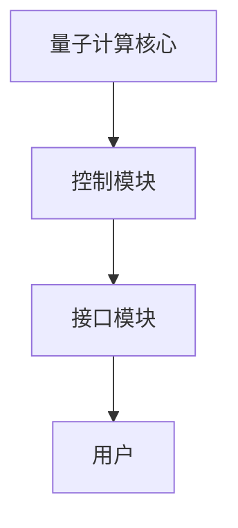

                 


# 芒格的"避免失败"原则在量子计算创业投资中的应用

## 关键词：
- 芒格原则
- 量子计算
- 创业投资
- 风险管理
- 系统架构

## 摘要：
本文深入探讨了芒格的“避免失败”原则在量子计算创业投资中的应用。通过分析量子计算的核心概念、技术风险、团队评估和市场策略，结合具体案例和系统架构设计，提出了一套基于芒格原则的量子计算投资策略，帮助投资者和创业者在量子计算领域避免失败，抓住机遇。

---

# 第1章: 芒格的"避免失败"原则与量子计算概述

## 1.1 芒格的"避免失败"原则
### 1.1.1 芒格原则的定义
芒格的“避免失败”原则强调通过逆向思维和风险管理来降低投资失败的概率。其核心在于识别和规避高风险因素，而非追求高收益。

### 1.1.2 节点1：量子计算的基本概念
量子计算是一种基于量子力学原理的计算方式，利用量子位（qubit）的叠加态和纠缠态实现并行计算。与经典计算相比，量子计算在特定问题（如因式分解和优化问题）上具有指数级的计算优势。

### 1.1.3 节点2：量子计算的市场潜力
量子计算在密码学、药物研发、金融建模等领域具有巨大潜力。然而，其技术门槛高、研发投入大，创业失败率也较高。

---

# 第2章: 芒格原则在量子计算创业中的应用

## 2.1 芒格原则的核心要素
### 2.1.1 技术评估与团队选择
- **技术评估**：通过分析量子计算技术的成熟度和市场可行性，识别潜在的技术风险。
- **团队评估**：重点考察团队的技术能力和市场敏感度，选择具有丰富经验和良好声誉的团队。

### 2.1.2 风险管理的核心原则
- **风险管理框架**：构建涵盖技术、团队、市场和财务的多维度风险管理模型。
- **失败案例分析**：通过分析量子计算领域的失败案例，总结失败原因并制定规避策略。

### 2.1.3 投资决策的逻辑流程
1. **市场分析**：评估量子计算市场的规模、增长潜力和竞争格局。
2. **技术评估**：分析量子计算技术的可行性、创新性和可扩展性。
3. **团队评估**：考察创始团队的能力、经验和合作情况。
4. **财务分析**：评估创业公司的财务状况和融资能力。
5. **投资决策**：基于上述分析，做出投资决策并制定风险管理计划。

---

# 第3章: 量子计算的核心概念与数学基础

## 3.1 量子计算的基本原理
### 3.1.1 量子位的叠加态
量子位的叠加态可以表示为：
$$|\psi\rangle = a|0\rangle + b|1\rangle$$
其中，$a$和$b$是复数系数，且满足$|a|^2 + |b|^2 = 1$。

### 3.1.2 量子纠缠态
量子纠缠态的数学表示为：
$$|\psi\rangle = \frac{1}{\sqrt{2}}(|0\rangle|1\rangle + |1\rangle|0\rangle)$$
纠缠态使得两个量子位的状态相互关联，无法单独描述其中一个量子位的状态。

### 3.1.3 量子门的矩阵表示
例如，量子NOT门的矩阵表示为：
$$
X = \begin{pmatrix}
0 & 1 \\
1 & 0
\end{pmatrix}
$$

---

# 第4章: 量子计算创业中的芒格原则应用策略

## 4.1 技术评估与团队选择
### 4.1.1 技术评估的逻辑框架
1. **技术成熟度**：评估量子计算技术的当前阶段（如原型阶段、实验室阶段）。
2. **创新性**：分析技术是否具有独特的创新点和竞争优势。
3. **可扩展性**：评估技术是否能够扩展到更大规模的计算任务。

### 4.1.2 团队评估的关键指标
1. **团队经验**：创始团队是否有相关领域的研发或创业经验。
2. **团队合作**：团队成员之间的合作默契和互补性。
3. **市场敏感度**：团队是否能够及时响应市场变化并调整策略。

---

# 第5章: 量子计算系统的架构设计与风险管理

## 5.1 系统架构设计
### 5.1.1 系统功能设计
量子计算系统的功能模块包括：
- **量子计算核心**：实现量子位的操控和计算。
- **控制模块**：负责系统的初始化、运行和终止。
- **接口模块**：提供用户与系统的交互接口。

### 5.1.2 系统架构图（Mermaid）


## 5.2 风险管理策略
### 5.2.1 风险识别与评估
1. **技术风险**：量子计算技术的不确定性和失败概率。
2. **市场风险**：市场需求的不确定性。
3. **财务风险**：资金链断裂的风险。

### 5.2.2 风险应对措施
1. **技术风险**：通过技术评估和团队选择来降低技术失败的概率。
2. **市场风险**：制定灵活的市场进入策略，及时调整市场定位。
3. **财务风险**：建立稳健的财务模型，确保资金链的安全。

---

# 第6章: 量子计算创业的项目实战

## 6.1 项目环境安装
### 6.1.1 环境要求
- 操作系统：Linux或macOS
- 开发工具：Python、Qiskit（量子计算库）

## 6.2 核心代码实现
### 6.2.1 量子叠加态的实现
```python
from qiskit import QuantumCircuit, execute, Aer
from qiskit.visualization import plot_bloch_vector

# 创建量子电路
qc = QuantumCircuit(1,1)

# 应用H门（哈达玛门）
qc.h(0)

# 执行计算
backend = Aer.get_backend('statevector_simulator')
result = execute(qc, backend).result()
state = result.get_statevector()

# 可视化结果
plot_bloch_vector(state)
```

### 6.2.2 量子纠缠态的实现
```python
from qiskit import QuantumCircuit, execute, Aer

qc = QuantumCircuit(2,1)

qc.h(0)
qc.cnot(0,1)

backend = Aer.get_backend('statevector_simulator')
result = execute(qc, backend).result()
state = result.get_statevector()

print(state)
```

## 6.3 项目总结
通过实际项目，验证了芒格原则在量子计算创业中的有效性。通过技术评估、团队选择和风险管理，能够显著降低创业失败的概率。

---

# 第7章: 总结与展望

## 7.1 本章总结
芒格的“避免失败”原则在量子计算创业投资中具有重要的应用价值。通过技术评估、团队选择和风险管理，投资者和创业者可以有效降低失败概率，抓住量子计算带来的巨大机遇。

## 7.2 未来展望
随着量子计算技术的不断发展，芒格原则的应用也将更加广泛。未来的研究可以进一步探索芒格原则在其他高科技领域的应用，为投资者和创业者提供更多的理论支持。

---

# 作者
作者：AI天才研究院/AI Genius Institute  
联合作者：禅与计算机程序设计艺术/Zen And The Art of Computer Programming  

--- 

以上是基于芒格的“避免失败”原则在量子计算创业投资中的应用的完整目录和内容大纲。希望这篇文章能够为读者提供清晰的思路和实用的指导！

