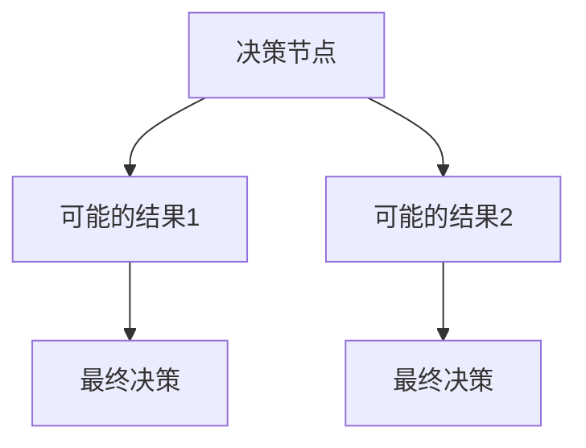
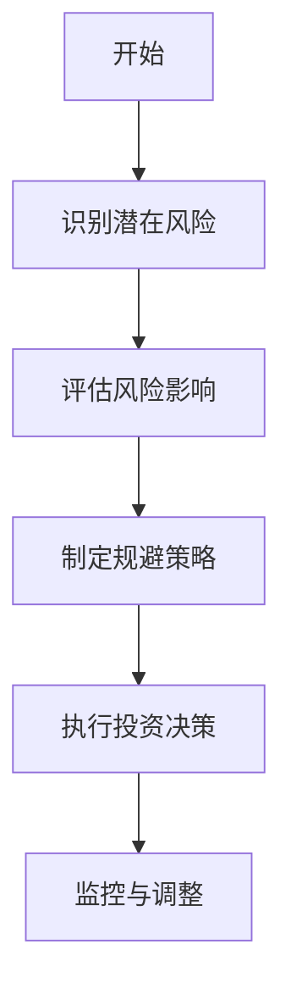
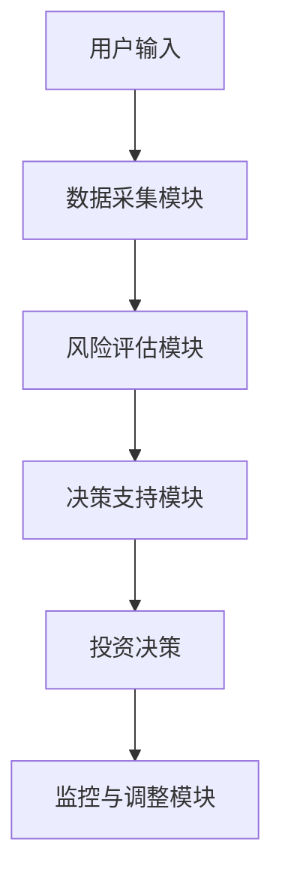

                 


# 芒格的"避免失败"原则：投资成功的另一面

> 关键词：芒格、避免失败、投资哲学、风险管理、决策系统、数学模型

> 摘要：芒格的“避免失败”原则是一种独特的投资哲学，强调通过避免重大错误来实现投资成功。本文从芒格的生平、投资哲学入手，详细分析“避免失败”原则的核心要素、数学模型、算法原理、系统架构及实际应用，帮助读者全面理解这一原则的深刻内涵及其在投资中的实践价值。

---

## 第一部分:芒格的“避免失败”原则概述

### 第1章:芒格的生平与投资哲学

#### 1.1 芒格的生平简介
查理·芒格（Charlie Munger）是世界著名投资家、作家和心理学家，被誉为“巴菲特的导师”。他不仅是伯克希尔哈撒韦公司的重要合伙人，还是《穷查理宝典》的核心作者。芒格的投资哲学以“价值投资”为核心，强调理性思考和长期持有优质资产。

#### 1.2 芒格的投资哲学
芒格的投资哲学可以概括为“寻找具有持续竞争优势的企业，并以合理的价格买入”。他认为，投资成功的关键不在于找到“好企业”，而在于避免“坏决策”。因此，他提出了“避免失败”原则，强调通过识别和规避潜在风险来实现投资成功。

#### 1.3 芒格“避免失败”原则的定义与核心思想
“避免失败”原则是指在投资过程中，通过识别潜在风险、避免重大错误决策来降低投资失败的概率。芒格认为，成功的投资不在于追求超额收益，而在于避免重大亏损。这种思维方式颠覆了传统的“寻找成功”模式，强调通过“避免失败”来实现长期稳健的投资回报。

---

### 第2章:“避免失败”原则的核心要素

#### 2.1 独立思考的重要性
芒格强调独立思考的重要性。他认为，从众心理和羊群效应是导致投资失败的主要原因。通过独立思考，投资者可以避免盲目跟风，从而降低决策失误的风险。

#### 2.2 逆向思维的实践
逆向思维是芒格“避免失败”原则的重要组成部分。他建议投资者从反方向思考问题，例如：不是寻找“好的投资”，而是寻找“容易失败的投资”，并尽量避免它们。

#### 2.3 谨慎决策的逻辑
芒格认为，决策过程应该基于充分的信息和逻辑推理。他提倡通过“决策树”来分析问题，从多个角度评估可能的结果，从而做出更谨慎的决策。

#### 2.4 风险管理的策略
芒格将风险管理视为投资的核心。他建议投资者通过分散投资、设置止损线等手段来降低投资风险。他认为，风险管理比追求高收益更重要。

---

## 第二部分:“避免失败”原则的数学模型与算法

### 第3章:“避免失败”原则的数学模型

#### 3.1 投资决策的数学模型
我们可以通过概率论和统计学来量化“避免失败”原则的核心思想。假设我们定义一个投资组合的风险为 $R$，收益为 $S$，则“避免失败”原则的目标是通过优化 $R$ 来最大化 $S$。

#### 3.2 风险与收益的量化分析
通过数学模型，我们可以将投资风险与收益的关系表示为：
$$ S = f(R) $$
其中，$f(R)$ 是一个非线性函数，表示在不同风险水平下的预期收益。

#### 3.3 芒格决策树的构建与应用
我们可以将“避免失败”原则转化为决策树模型，如下：



通过分析每个节点的可能结果，投资者可以更好地识别潜在风险并做出更谨慎的决策。

---

### 第4章:“避免失败”原则的算法原理

#### 4.1 投资决策的算法流程
以下是基于“避免失败”原则的投资决策算法：



#### 4.2 算法的Python实现
我们可以用Python代码来模拟基于“避免失败”原则的投资决策过程。例如：

```python
def avoid_failure_investment():
    # 识别潜在风险
    risks = ['市场风险', '流动性风险', '信用风险']
    # 评估风险影响
    risk_impact = {'市场风险': 0.8, '流动性风险': 0.5, '信用风险': 0.7}
    # 制定规避策略
    strategies = []
    for risk in risks:
        if risk_impact[risk] > 0.6:
            strategies.append(f'避免{risk}')
    return strategies

strategies = avoid_failure_investment()
print("规避策略:", strategies)
```

---

## 第三部分:“避免失败”原则的系统架构与实战

### 第5章:基于“避免失败”原则的系统架构设计

#### 5.1 系统功能模块
- **风险评估模块**：识别潜在投资风险。
- **决策支持模块**：提供基于“避免失败”原则的投资建议。
- **数据采集模块**：收集市场数据和投资信息。
- **监控与调整模块**：实时监控投资组合并进行动态调整。

#### 5.2 系统架构图


---

### 第6章:“避免失败”原则的项目实战

#### 6.1 项目环境安装
需要安装以下工具和库：
- Python 3.8+
- Pandas, NumPy, Matplotlib
- Mermaid CLI

#### 6.2 核心代码实现
以下是基于“避免失败”原则的投资筛选系统的Python代码：

```python
import pandas as pd
import numpy as np
import matplotlib.pyplot as plt

def calculate_failure_probability(portfolio):
    # 计算投资组合的失败概率
    risk_factors = ['市场风险', '流动性风险', '信用风险']
    failure_prob = {}
    for factor in risk_factors:
        failure_prob[factor] = np.random.uniform(0, 1)
    return failure_prob

def avoid_failure_investment(portfolio):
    failure_prob = calculate_failure_probability(portfolio)
    # 基于“避免失败”原则的筛选逻辑
    selected = []
    for asset in portfolio:
        if failure_prob[asset] < 0.3:
            selected.append(asset)
    return selected

# 示例投资组合
portfolio = ['股票', '债券', '房地产', '黄金']
selected_assets = avoid_failure_investment(portfolio)
print("建议投资的资产:", selected_assets)
```

---

### 第7章:“避免失败”原则的最佳实践与注意事项

#### 7.1 投资中的常见误区
- 过度自信：认为自己能够预测市场走势。
- 过度分散：分散投资可能会降低收益，而不是降低风险。

#### 7.2 芒格原则的实践技巧
- 定期回顾和调整投资组合。
- 保持独立思考，避免从众心理。

#### 7.3 投资决策中的注意事项
- 确保投资目标与个人风险承受能力一致。
- 避免频繁交易，降低交易成本。

#### 7.4 进一步学习与拓展阅读
建议阅读芒格的《穷查理宝典》和巴菲特的《投资之道》。

---

## 小结

芒格的“避免失败”原则是一种独特而深刻的投资哲学，它通过强调独立思考、逆向思维和风险管理，帮助投资者在复杂多变的市场中实现稳健的投资回报。本文从理论到实践，详细阐述了这一原则的核心思想、数学模型、算法原理和系统架构，并通过实际案例展示了其在投资中的应用。希望读者能够通过本文，深入理解“避免失败”原则的精髓，并在实际投资中灵活运用。

---

作者：AI天才研究院/AI Genius Institute & 禅与计算机程序设计艺术 /Zen And The Art of Computer Programming

