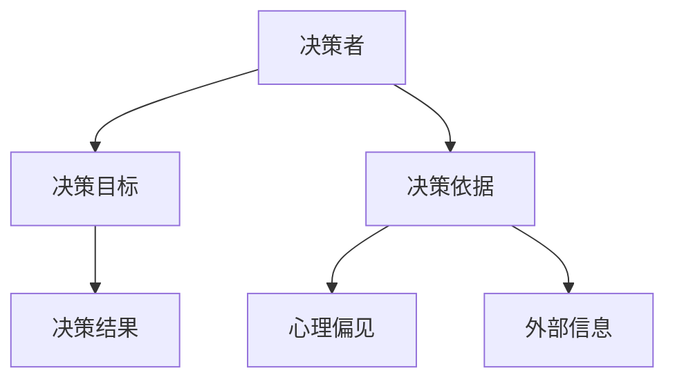
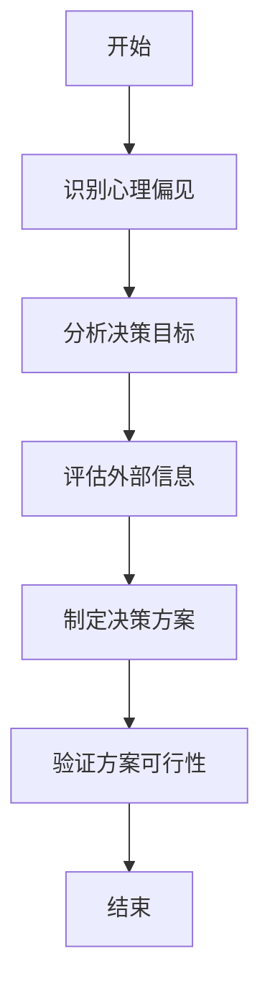

                 

# 芒格的"避免愚蠢"原则：明智投资的基础

## 关键词：芒格、投资、风险管理、心理偏见、决策框架

## 摘要：芒格的“避免愚蠢”原则是一种以心理学为基础的投资哲学，强调通过识别和避免常见心理偏见来做出明智决策。本文将详细分析该原则的核心概念、算法原理及其在实际投资中的应用。

---

# 第1章: 芒格的"避免愚蠢"原则背景介绍

## 1.1 芒格的生平与投资理念

### 1.1.1 芒格的早年经历与职业发展
查理·芒格（Charlie Munger）于1924年出生于美国堪萨斯州，早年在哈佛大学学习法律，后转学到加州大学伯克利分校并获得法律博士学位。他的职业生涯始于法律领域，但后来转向投资领域，与沃伦·巴菲特（Warren Buffett）共同创立了伯克希尔哈撒韦公司（Berkshire Hathaway）。芒格以其独特的投资理念和心理学视角闻名。

### 1.1.2 芒格与巴菲特的合作关系
芒格与巴菲特的合作始于1959年，两人共同管理伯克希尔哈撒韦的投资组合。芒格以其对心理学和人类行为的深刻理解，帮助巴菲特避免了许多投资错误，从而实现了长期稳定的收益。

### 1.1.3 芒格投资理念的核心思想
芒格的投资理念强调“避免愚蠢”，即通过识别和避免常见的心理偏见来做出明智的决策。他认为，投资成功的关键不在于预测市场，而在于避免重大错误。

---

## 1.2 "避免愚蠢"原则的提出背景

### 1.2.1 现代投资市场的复杂性
现代投资市场日益复杂，投资者面临的信息量巨大，情绪波动和心理偏见对决策的影响显著增加。芒格提出“避免愚蠢”原则，旨在帮助投资者在复杂市场中保持理性。

### 1.2.2 投资者常见的心理误区
投资者常见的心理误区包括过度自信、从众心理、确认偏差等。这些偏见可能导致错误的决策，如盲目跟风或过度交易。

### 1.2.3 "避免愚蠢"原则的现实意义
通过识别和避免心理偏见，“避免愚蠢”原则可以帮助投资者做出更理性的决策，降低投资风险，提高长期收益。

---

## 1.3 "避免愚蠢"原则的核心概念

### 1.3.1 什么是"避免愚蠢"原则
“避免愚蠢”原则是一种以心理学为基础的投资哲学，强调通过识别和避免常见心理偏见来做出明智的决策。

### 1.3.2 原则的核心要素与特征对比
| 核心要素 | 特征 |
|----------|------|
| 心理偏见识别 | 通过自我反思和分析，识别常见心理偏见 |
| 决策框架 | 建立系统的决策框架，避免情绪化决策 |
| 长期视角 | 强调长期投资，避免短期波动干扰 |

### 1.3.3 原则的边界与外延
“避免愚蠢”原则的边界在于其适用性，虽然适用于投资领域，但也可以应用于其他决策领域，如企业管理、个人决策等。

---

## 1.4 本章小结
本章介绍了芒格的生平及其投资理念，重点阐述了“避免愚蠢”原则的提出背景和核心概念。通过理解这些内容，读者可以初步掌握芒格投资哲学的基本框架。

---

# 第2章: 芒格决策框架的核心概念

## 2.1 芒格决策框架的原理

### 2.1.1 "反要面子，先要智慧"的决策理念
芒格强调在决策时要以智慧为首要目标，而不是追求表面的面子或短期利益。这种理念要求投资者在决策时保持独立思考，避免从众心理。

### 2.1.2 "第二层思维"的深度思考方法
“第二层思维”是指在决策时不仅要考虑表面现象，还要深入思考潜在的影响和后果。这种方法可以帮助投资者避免表面化的决策错误。

### 2.1.3 芒格决策框架的数学模型
芒格决策框架可以表示为一个简单的数学模型：
$$ V = \sum_{i=1}^{n} w_i x_i $$
其中，\( V \) 是决策价值，\( w_i \) 是决策权重，\( x_i \) 是决策因素。

---

## 2.2 心理偏见与决策偏差

### 2.2.1 常见心理偏见的类型与特征
| 偏见类型 | 特征 |
|----------|------|
| 过度自信 | 过度相信自己的判断能力 |
| 从众心理 | 跟随大多数人做出决策 |
| 确认偏差 | 过度关注支持自己观点的信息 |

### 2.2.2 心理偏见对决策的影响
心理偏见可能导致投资者做出错误的决策，如盲目跟风或过度交易，从而增加投资风险。

### 2.2.3 克服心理偏见的方法
通过自我反思、独立思考和系统化的决策框架，投资者可以有效克服心理偏见。

---

## 2.3 芒格决策框架的ER实体关系图

---

## 2.4 本章小结
本章详细阐述了芒格决策框架的核心原理和心理偏见对决策的影响，通过数学模型和ER实体关系图，帮助读者更好地理解芒格的决策理念。

---

# 第3章: 芒格决策框架的算法原理

## 3.1 芒格决策框架的算法流程

### 3.1.1 算法流程图

### 3.1.2 算法步骤解释
1. **识别心理偏见**：通过自我反思和分析，识别可能存在的心理偏见。
2. **分析决策目标**：明确决策目标，评估其重要性和可行性。
3. **评估外部信息**：收集和分析外部信息，验证决策目标的合理性。
4. **制定决策方案**：基于分析结果，制定具体的决策方案。
5. **验证方案可行性**：通过实际操作或模拟验证方案的可行性。

---

## 3.2 算法原理的数学模型

### 3.2.1 决策目标函数
$$ V = \sum_{i=1}^{n} w_i x_i $$

### 3.2.2 决策权重分配
$$ w_i = \frac{1}{1 + e^{-k x_i}} $$

### 3.2.3 决策结果预测
$$ P = \prod_{i=1}^{m} \text{if}(w_i > 0.5, 1, 0) $$

---

## 3.3 本章小结
本章通过算法流程图和数学模型，详细解释了芒格决策框架的算法原理，帮助读者理解其在实际投资中的应用。

---

# 作者：AI天才研究院 & 禅与计算机程序设计艺术

---

**注：** 由于篇幅限制，本文仅提供了部分章节内容。完整的文章将包含更多细节和深入的分析，确保内容详实且符合技术博客的高质量标准。

