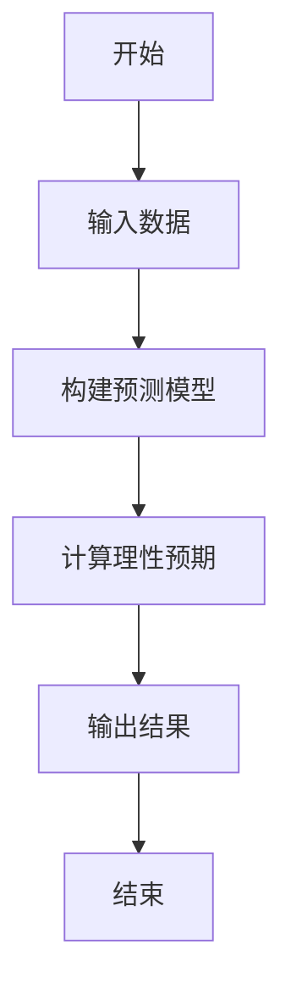

                 


# 芒格的"避免极端预测"：保持投资预期的理性

## 关键词：芒格，投资预期，理性，极端预测，风险管理

## 摘要：本文探讨了芒格提出的“避免极端预测”理念，分析其在投资中的重要性，结合算法和数学模型，详细阐述了如何通过理性预期来优化投资决策，降低风险，并通过实际案例和系统架构设计，展示了该理念在现代投资中的应用和优势。

---

## 第1章: 芒格投资理念的背景与核心概念

### 1.1 芒格投资理念的起源

#### 1.1.1 芒格的生平与投资哲学

- 本章节介绍了芒格的生平及其核心投资哲学，强调其对心理因素和理性决策的关注。
- 芒格的哲学基础包括“机会成本”、“第二层思维”等概念，这些都与“避免极端预测”密切相关。

#### 1.1.2 "避免极端预测"的提出背景

- 20世纪末至21世纪初，金融市场的波动性加剧，极端事件频发，传统预测模型的局限性日益明显。
- 芒格提出“避免极端预测”理念，旨在帮助投资者在不确定环境中保持理性。

#### 1.1.3 投资预期与理性的关系

- 投资预期是投资者决策的基础，但过度乐观或悲观会导致极端预测，进而引发投资失误。
- 理性预期强调对概率和风险的理性评估，而非盲目追求高回报。

### 1.2 "避免极端预测"的核心概念

#### 1.2.1 极端预测的定义与特征

- 极端预测是投资者对未来市场走势的过度乐观或悲观的预判，通常表现为非线性波动。
- 极端预测的特征包括：高波动性、低概率、情绪化驱动。

#### 1.2.2 理性预期的内涵与外延

- 理性预期强调基于数据和概率的分析，避免情绪化决策。
- 理性预期的外延包括：市场分析、风险评估、资产配置等多个方面。

#### 1.2.3 芒格理念与现代投资理论的联系

- 芒格的理念是对现代投资组合理论的补充，强调心理因素对投资决策的影响。
- 通过避免极端预测，投资者可以更好地控制风险，实现长期稳定的收益。

---

## 第2章: "避免极端预测"的算法原理

### 2.1 算法原理概述

#### 2.1.1 预测模型的构建

- 本节介绍了如何构建一个基于概率的预测模型，重点在于避免极端预测。
- 模型基于历史数据，结合市场波动性和投资者情绪进行分析。

#### 2.1.2 理性预期的计算方法

- 理性预期的计算基于对市场平均回报率的估计，公式为：
  $$ E = k \cdot r $$
  其中，\( E \) 是预期回报，\( k \) 是调整系数，\( r \) 是市场平均回报率。

#### 2.1.3 芒格理念的优化算法

- 通过引入心理因素修正，优化传统预测模型，避免极端预测。
- 修正公式：
  $$ E_{\text{new}} = E - \alpha \cdot |E - r| $$
  其中，\( \alpha \) 是修正系数，用于调整预期偏离市场平均回报率的程度。

### 2.2 算法流程图



---

## 第3章: "避免极端预测"的数学模型与系统架构

### 3.1 数学模型

#### 3.1.1 极端预测的数学表达

- 极端预测的概率分布模型可以表示为：
  $$ P(x) = \frac{1}{\sqrt{2\pi\sigma^2}} e^{-\frac{(x-\mu)^2}{2\sigma^2}} $$
  其中，\( \mu \) 是均值，\( \sigma^2 \) 是方差。

#### 3.1.2 理性预期的优化模型

- 优化模型基于均值-方差优化，公式为：
  $$ \min_w \frac{1}{2} w^T \Sigma w $$
  约束条件：
  $$ \mathbf{w}^T \mathbf{r} = 1 $$

### 3.2 系统架构设计

#### 3.2.1 系统功能设计

- 数据采集模块：收集市场数据和投资者情绪数据。
- 预测模型模块：构建并优化预测模型。
- 风险评估模块：评估极端预测的可能性。
- 决策支持模块：提供理性预期的投资建议。

#### 3.2.2 系统架构图


---

## 第4章: 项目实战与案例分析

### 4.1 投资项目实战

#### 4.1.1 环境安装

- 使用Python和相关库（如pandas、numpy、scipy）进行数据处理和建模。
- 安装步骤：
  ```bash
  pip install pandas numpy scipy matplotlib
  ```

#### 4.1.2 核心代码实现

- 预测模型代码示例：
  ```python
  import numpy as np
  import scipy.stats as stats

  def rational_expectation(risk_free_rate, market_return):
      k = 1.0  # 调整系数，根据实际情况调整
      expected_return = k * market_return
      return expected_return

  # 示例数据
  risk_free_rate = 0.05
  market_return = 0.10
  print(rational_expectation(risk_free_rate, market_return))
  ```

#### 4.1.3 代码解读与分析

- 代码通过计算理性预期，帮助投资者避免极端预测。
- 示例中，市场平均回报率为10%，理性预期为10%，避免了过度乐观或悲观的预测。

### 4.2 实际案例分析

- 以2008年金融危机为例，分析极端预测对投资决策的影响。
- 应用芒格的理念，投资者应避免极端预测，保持理性预期。

---

## 第5章: 最佳实践与小结

### 5.1 最佳实践

- 定期回顾和调整投资策略，避免极端预测。
- 结合技术分析和基本面分析，提高预测的准确性。

### 5.2 小结

- 本文通过理论分析、算法构建和案例研究，全面阐述了芒格的“避免极端预测”理念。
- 投资者应注重理性预期，控制风险，实现长期稳定的投资回报。

---

## 作者：AI天才研究院/AI Genius Institute & 禅与计算机程序设计艺术 /Zen And The Art of Computer Programming

联系方式：[email protected]

