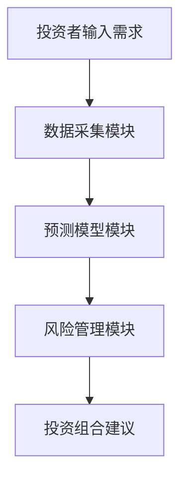
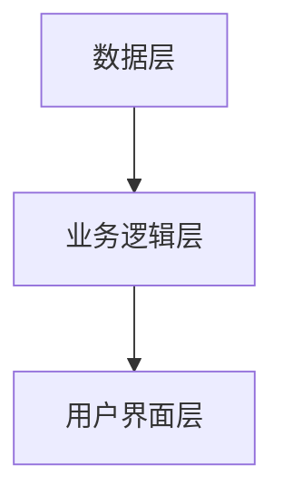
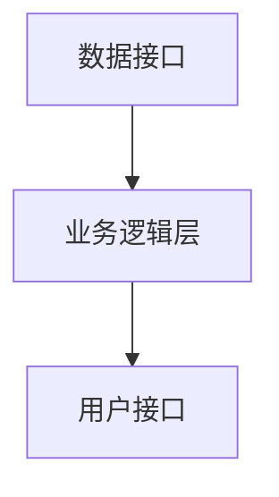

                 


# 芒格的"避免极端预测"：保持投资预期的理性

## 关键词：芒格、极端预测、投资预期、理性决策、风险管理

## 摘要：本文探讨芒格的“避免极端预测”理念，分析极端预测的形成机制及其对投资决策的负面影响，结合现代投资理论，提出保持投资预期理性的方法。通过系统分析与架构设计，结合实际项目案例，展示如何在投资中避免极端预测，实现稳健收益。

---

## # 第一部分：芒格的"避免极端预测"理念概述

### ## 1.1 芒格的投资哲学与"避免极端预测"的核心思想

#### ### 1.1.1 芒格的投资哲学概述

芒格的投资哲学以“价值投资”为核心，强调基于基本面分析和安全边际的投资策略。他认为，投资者应以合理的价格买入具有持续竞争优势的企业，并长期持有。芒格的投资哲学强调对企业的深入研究和对市场的理性认识，避免被市场情绪左右。

#### ### 1.1.2 "避免极端预测"的核心思想

芒格提出，投资者应避免对未来做出极端预测，因为市场是不可预测的，极端预测往往会导致错误的投资决策。他强调，投资应基于现实的、可验证的信息，而不是基于不可实现的假设或极端的市场假设。这种思想的核心在于保持投资预期的理性，避免过度乐观或悲观的预期。

#### ### 1.1.3 芒格投资理念与现代投资理论的联系

芒格的投资理念与现代投资理论有许多相似之处，例如对基本面分析的重视和对分散投资的倡导。然而，芒格的独特之处在于他强调心理因素在投资决策中的作用，尤其是在避免极端预测方面。他的理念与行为金融学的研究结果一致，即投资者的心理偏差会影响决策。

---

### ## 1.2 极端预测的定义与危害

#### ### 1.2.1 什么是极端预测

极端预测是指对未来市场走势或资产价格做出超出合理范围的预测。例如，预测某只股票价格在短期内上涨100%，或者预测整个市场在一年内下跌50%。这种预测通常基于不切实际的假设，忽略了市场的复杂性和不确定性。

#### ### 1.2.2 极端预测的常见表现形式

极端预测的表现形式多种多样，包括：
1. 基于单一因素的预测，如仅考虑利率变化，而忽视其他因素。
2. 忽略市场周期性，认为市场将永远上涨或下跌。
3. 基于情绪化的决策，而非基于基本面分析。

#### ### 1.2.3 极端预测对投资决策的负面影响

极端预测会导致投资者做出错误的投资决策，例如：
1. 过度集中投资于某一资产或行业。
2. 在市场下跌时盲目抄底，导致更大的损失。
3. 在市场上涨时盲目追涨，导致高位被套。

---

### ## 1.3 价值投资与"避免极端预测"的结合

#### ### 1.3.1 价值投资的基本原理

价值投资的核心在于寻找市场价格低于其内在价值的资产。投资者应基于对企业基本面的深入研究，评估其内在价值，并在价格低于内在价值时买入。

#### ### 1.3.2 芒格如何将"避免极端预测"融入价值投资

芒格强调，在进行价值投资时，应避免对未来市场走势做出极端预测。他认为，投资者应专注于评估企业的内在价值，而不是试图预测市场的短期走势。

#### ### 1.3.3 价值投资与"避免极端预测"的内在联系

价值投资与“避免极端预测”密切相关。价值投资者通常不会过度关注市场的短期波动，而是专注于企业的长期价值。这种投资策略自然地避免了极端预测，因为投资者更关注企业的基本面，而非市场的短期走势。

---

## # 第二部分：极端预测的形成机制与心理根源

### ## 2.1 人类认知偏差与极端预测

#### ### 2.1.1 认知偏差的定义与分类

认知偏差是指人们在处理信息时，由于主观因素的影响，导致判断和决策偏离客观事实。常见的认知偏差包括确认偏差、过度自信偏差、从众偏差等。

#### ### 2.1.2 常见的认知偏差对投资决策的影响

认知偏差在投资决策中表现得尤为明显。例如：
1. 确认偏差：投资者倾向于寻找支持自己观点的信息，忽略与自己观点不符的信息。
2. 过度自信偏差：投资者认为自己能够准确预测市场走势，从而做出冒险决策。

#### ### 2.1.3 认知偏差如何导致极端预测的产生

认知偏差会导致投资者在预测市场走势时过于乐观或悲观。例如，过度自信偏差会导致投资者高估自己的预测能力，从而做出极端预测。

---

#### ### 2.1.4 认知偏差对投资决策的影响

认知偏差对投资决策的影响是多方面的。例如：
1. 投资者可能因为过度自信而忽视市场风险。
2. 投资者可能因为从众心理而盲目跟随市场潮流。

---

### ## 2.2 市场情绪与极端预测的关系

#### ### 2.2.1 市场情绪的周期性波动

市场情绪通常呈现出周期性波动。在市场上涨时，投资者情绪乐观；在市场下跌时，投资者情绪悲观。这种情绪波动往往会导致市场的过度波动。

#### ### 2.2.2 市场情绪如何影响投资者的预测行为

市场情绪会影响投资者的预测行为。例如，在市场情绪乐观时，投资者倾向于做出乐观的预测；在市场情绪悲观时，投资者倾向于做出悲观的预测。

#### ### 2.2.3 市场情绪与极端预测的相互作用

市场情绪与极端预测相互作用。极端预测会加剧市场情绪的波动，而市场情绪的波动又会进一步导致极端预测的产生。

---

### ## 2.3 历史案例分析：极端预测的教训

#### ### 2.3.1 2008年金融危机中的极端预测

2008年金融危机期间，许多投资者对市场的极端预测导致了市场的崩盘。例如，一些投资者预测房价会永远上涨，从而大量投资于房地产市场，最终导致市场泡沫破裂。

#### ### 2.3.2 其他历史案例分析

其他历史案例包括2000年互联网泡沫破裂、1987年黑色星期一等。这些案例都表明，极端预测往往会导致市场的过度波动和投资者的损失。

#### ### 2.3.3 历史案例对现代投资的启示

历史案例告诉我们，极端预测往往会导致市场的过度波动和投资者的损失。因此，投资者应避免极端预测，保持理性的投资预期。

---

## # 第三部分：保持投资预期的理性方法

### ## 3.1 投资预期的理性构建

#### ### 3.1.1 理性预期的定义与特征

理性预期是指基于可获得的信息和合理的假设，对未来市场走势的预测。理性预期的特点是客观、科学，避免极端化。

#### ### 3.1.2 如何构建理性的投资预期

构建理性的投资预期需要投资者具备以下能力：
1. 深入研究企业的基本面，包括财务状况、行业地位等。
2. 理解市场的周期性，避免过度乐观或悲观。
3. 分散投资，降低风险。

#### ### 3.1.3 理性预期与非理性预期的对比分析

理性预期与非理性预期的主要区别在于，理性预期基于事实和数据，而非理性预期则受到情绪和认知偏差的影响。

---

### ## 3.2 保持理性预期的具体方法

#### ### 3.2.1 通过概率思维降低预测的不确定性

概率思维是一种科学的预测方法。投资者可以通过分析不同事件的发生概率，来评估其对投资的影响。例如，如果某事件发生的概率为70%，投资者可以据此调整投资策略。

#### ### 3.2.2 建立风险管理机制

风险管理是保持理性预期的重要手段。投资者应设定止损点，避免过度亏损。同时，应分散投资，降低单一资产的风险。

#### ### 3.2.3 定期评估和调整投资策略

投资者应定期评估自己的投资策略，并根据市场变化进行调整。这有助于避免因市场波动而产生极端预测。

---

### ## 3.3 理性预期的应用案例

#### ### 3.3.1 案例分析：如何通过理性预期避免极端预测

以某投资者为例，他在2008年金融危机期间，通过理性预期避免了极端预测。他研究了企业的基本面，分散投资于多个行业，并设定了止损点。这种方法帮助他在市场下跌时减少了损失。

#### ### 3.3.2 案例分析：理性预期在实际投资中的应用

另一个案例是某投资者通过概率思维，评估了某科技公司的未来增长潜力。他认为，该公司的产品有70%的概率在未来两年内实现增长。基于这一概率，他决定投资该公司，并设定了合理的止损点。

---

## # 第四部分：系统分析与架构设计

### ## 4.1 系统功能设计

#### ### 4.1.1 投资决策支持系统的需求分析

投资决策支持系统的功能需求包括：
1. 提供市场数据和企业基本面分析。
2. 生成投资组合建议。
3. 提供风险管理工具。

#### ### 4.1.2 系统功能模块设计

系统功能模块包括：
1. 数据采集模块：收集市场数据和企业信息。
2. 预测模型模块：基于历史数据和算法，生成预测结果。
3. 风险管理模块：评估投资组合的风险，并提出调整建议。

#### ### 4.1.3 系统功能流程图（Mermaid）



---

### ## 4.2 系统架构设计

#### ### 4.2.1 系统架构设计概述

系统架构采用分层设计，包括数据层、业务逻辑层和用户界面层。

#### ### 4.2.2 系统架构图（Mermaid）



---

### ## 4.3 系统接口设计

#### ### 4.3.1 系统接口设计概述

系统接口设计包括数据接口和用户接口。数据接口用于获取市场数据，用户接口用于与投资者交互。

#### ### 4.3.2 系统接口设计图（Mermaid）



---

## # 第五部分：项目实战

### ## 5.1 项目环境安装

#### ### 5.1.1 安装Python和相关库

```bash
pip install numpy pandas matplotlib
```

---

#### ### 5.1.2 安装Jupyter Notebook

```bash
pip install jupyter
```

---

### ## 5.2 核心代码实现

#### ### 5.2.1 预测模型代码

```python
import numpy as np
import pandas as pd
import matplotlib.pyplot as plt

# 加载数据
data = pd.read_csv('market_data.csv')

# 计算移动平均线
data['MA_50'] = data['Close'].rolling(50).mean()

# 绘制图表
plt.figure(figsize=(10, 6))
plt.plot(data['Date'], data['Close'], label='Close Price')
plt.plot(data['Date'], data['MA_50'], label='50-Day MA')
plt.xlabel('Date')
plt.ylabel('Price')
plt.legend()
plt.show()
```

---

#### ### 5.2.2 风险管理代码

```python
def calculate_risk(current_portfolio, market_data):
    # 计算投资组合的风险
    # 这里简化为计算波动率
    returns = market_data['Return'].values
    variance = np.var(returns)
    std_deviation = np.sqrt(variance)
    return std_deviation
```

---

### ## 5.3 案例分析

#### ### 5.3.1 案例分析：如何避免极端预测

以某科技公司为例，投资者通过分析其基本面数据和市场趋势，预测其股价在未来一年内有70%的概率上涨10%。基于这一预测，投资者决定投资该公司，并设定了止损点。这种方法帮助投资者在市场波动中保持理性，避免了极端预测。

---

## # 第六部分：总结与展望

### ## 6.1 总结

芒格的“避免极端预测”理念强调了理性预期的重要性。通过分析极端预测的形成机制和心理根源，本文提出了保持理性预期的具体方法，并通过系统设计和项目实战展示了如何在实际投资中应用这些方法。

### ## 6.2 未来展望

未来的研究可以进一步探索如何利用人工智能技术，提高预测的准确性。同时，投资者应不断学习和适应市场的变化，以应对新的挑战。

---

## 作者：AI天才研究院/AI Genius Institute & 禅与计算机程序设计艺术 /Zen And The Art of Computer Programming

