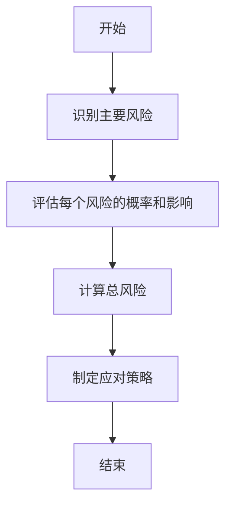
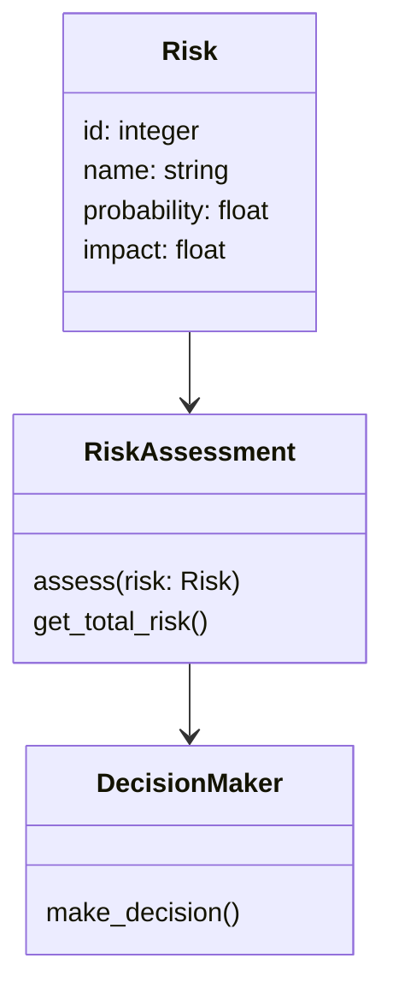
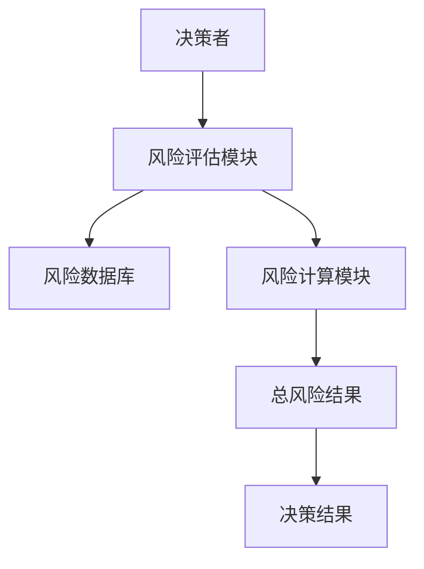
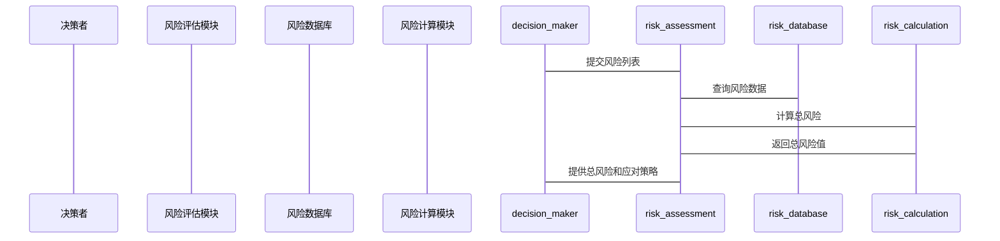

                 


# 芒格的"避免首要否认"在前沿科技风险评估中的应用

---

## 关键词：芒格、避免首要否认、风险评估、前沿科技、系统思维、决策科学

---

## 摘要：  
芒格的“避免首要否认”理论是一种重要的决策原则，强调在决策过程中优先考虑最可能的风险和错误。本文探讨了该理论在前沿科技风险评估中的应用，结合系统思维和决策科学的方法，分析了如何利用这一原则来优化科技项目的风险管理。通过算法原理、系统架构和实际案例的分析，本文为科技领域的风险评估提供了新的视角和方法。

---

# 第1章：芒格的“避免首要否认”理论概述

## 1.1 芒格“避免首要否认”理论的起源  
芒格的“避免首要否认”理论源自其在投资和决策领域的长期实践。该理论的核心在于，决策者在面对不确定性时，应首先识别和评估可能导致决策失败的主要风险，而不是一味追求成功的可能性。这种思维方式强调“先防错，后求成”，在复杂系统中尤为重要。

### 1.1.1 理论的提出背景  
芒格在投资领域发现，许多投资者倾向于关注收益而忽视潜在风险，导致决策失误。他提出“避免首要否认”理论，旨在帮助决策者在复杂环境中减少错误，提高决策的稳健性。

### 1.1.2 理论的核心思想  
芒格的核心思想是：在决策过程中，首先要识别和避免那些可能导致失败的主要错误，而不是仅仅追求成功的机会。这种思维方式适用于任何领域的决策，尤其是在高风险的前沿科技领域。

### 1.1.3 理论在投资领域的应用  
在投资领域，芒格的理论帮助投资者避免了致命的错误决策，例如过度杠杆、盲目跟风等。通过优先考虑风险，投资者能够在复杂市场中保持稳健。

---

## 1.2 前沿科技风险评估的基本概念  
前沿科技指的是那些具有创新性和前瞻性，可能带来重大变革的技术领域，例如人工智能、区块链、量子计算等。这些技术的不确定性和高风险性使得它们的评估尤为重要。

### 1.2.1 前沿科技的定义与特征  
前沿科技的定义可以包括但不限于以下几个方面：
- **创新性**：技术具有突破性，能够带来新的解决方案或产品。
- **不确定性**：技术的发展和应用存在高度不确定性。
- **高风险性**：技术失败或市场接受度低可能导致重大损失。

### 1.2.2 风险评估的定义与方法  
风险评估是对可能影响项目成功或失败的各种因素进行分析和量化的过程。常见的方法包括概率-影响矩阵、蒙特卡洛模拟等。

### 1.2.3 前沿科技风险评估的必要性  
由于前沿科技的不确定性和高风险性，评估这些风险可以帮助决策者制定更稳健的策略，降低潜在损失。

---

## 1.3 芒格理论与前沿科技风险评估的结合  
芒格的理论为前沿科技风险评估提供了一种新的视角，强调在决策过程中优先考虑风险，而不是仅仅追求机会。

### 1.3.1 理论与实践的结合点  
- **理论基础**：芒格的“避免首要否认”理论为风险评估提供了方法论基础。
- **实践应用**：在前沿科技项目中，优先识别和评估主要风险，可以帮助决策者制定更稳健的策略。

### 1.3.2 理论在科技领域的适用性  
- **适用性分析**：前沿科技的高风险性与芒格理论的核心思想高度契合。
- **优势**：通过优先考虑风险，可以帮助科技企业在竞争激烈的市场中减少失败的可能性。

### 1.3.3 结合的意义与价值  
- **理论价值**：为前沿科技风险评估提供了新的思维方式。
- **实践价值**：帮助科技企业在复杂环境中做出更明智的决策。

---

# 第2章：芒格“避免首要否认”原则的核心要素  

## 2.1 避免首要否认的核心要素  

### 2.1.1 首要否认的定义  
首要否认是指在决策过程中，优先考虑那些可能导致失败的主要风险，而不是仅仅追求成功的机会。

### 2.1.2 避免首要否认的原则  
- **原则一**：优先识别和评估主要风险。
- **原则二**：在决策过程中，始终保持对风险的敏感性。

---

## 2.2 前沿科技风险评估的核心要素  

### 2.2.1 风险来源的分析  
- **技术风险**：技术本身可能存在的缺陷或不确定性。
- **市场风险**：市场需求不足或竞争过于激烈。
- **政策风险**：政策变化可能对技术应用产生影响。

### 2.2.2 风险影响的评估  
- **影响范围**：风险可能影响的方面，例如财务、市场、技术等。
- **影响程度**：风险可能导致的损失程度。

### 2.2.3 风险应对的策略  
- **规避策略**：通过调整项目计划或技术方案来降低风险。
- **缓解策略**：通过制定应急预案来应对潜在风险。

---

## 2.3 芒格原则与风险评估的关联性分析  

### 2.3.1 原理的对应关系  
- 芒格的“避免首要否认”理论与风险评估的核心思想高度契合，强调在决策过程中优先考虑风险。

### 2.3.2 原理在风险评估中的作用  
- 通过优先考虑风险，可以帮助决策者制定更稳健的策略，降低潜在损失。

### 2.3.3 原理的应用边界  
- 芒格理论适用于高风险、高度不确定的领域，但其应用需要结合具体情境进行调整。

---

## 2.4 芒格原则与风险评估的结合案例  

### 2.4.1 案例一：人工智能项目的风险评估  
在一个人工智能项目的决策过程中，芒格的理论可以帮助识别和评估主要风险，例如算法的不可靠性、数据质量问题等。

### 2.4.2 案例二：区块链项目的风险评估  
在区块链项目中，芒格的理论可以帮助识别和评估技术漏洞、市场需求不足等风险。

---

# 第3章：芒格“避免首要否认”原则的算法原理  

## 3.1 算法原理概述  

### 3.1.1 算法的基本思路  
芒格的“避免首要否认”算法的基本思路是：在决策过程中，首先识别和评估可能的主要风险，然后制定相应的应对策略。

---

## 3.2 算法实现的数学模型  

### 3.2.1 风险评估的数学模型  
$$ R = \sum_{i=1}^{n} (P_i \times I_i) $$  
其中，$R$ 表示总风险，$P_i$ 表示风险 $i$ 的概率，$I_i$ 表示风险 $i$ 的影响程度。

---

## 3.3 算法实现的代码示例  

```python
def manson_avoid_first_failure(risks):
    # 风险列表，每个风险包含概率和影响程度
    total_risk = 0
    for risk in risks:
        total_risk += risk['probability'] * risk['impact']
    return total_risk

# 示例使用
risks = [
    {'probability': 0.3, 'impact': 5},
    {'probability': 0.2, 'impact': 10},
    {'probability': 0.1, 'impact': 15}
]
total_risk = manson_avoid_first_failure(risks)
print(f"总风险：{total_risk}")
```

---

## 3.4 算法的流程图  



---

## 3.5 算法的优缺点分析  

### 3.5.1 优点  
- **简单易用**：算法步骤清晰，易于理解和实现。
- **高效性**：通过优先考虑主要风险，可以快速制定应对策略。

### 3.5.2 缺点  
- **依赖于数据质量**：算法的准确性依赖于输入风险数据的准确性。
- **忽略次要风险**：算法可能忽略次要风险，影响整体风险评估的全面性。

---

# 第4章：系统分析与架构设计方案  

## 4.1 问题场景介绍  
在一个前沿科技项目中，决策者需要评估多个潜在风险，包括技术风险、市场风险和政策风险等。

---

## 4.2 系统功能设计  

### 4.2.1 领域模型类图  



---

## 4.3 系统架构设计  

### 4.3.1 系统架构图  



---

## 4.4 系统接口设计  

### 4.4.1 输入接口  
- **输入**：风险列表，包括每个风险的概率和影响程度。
- **输出**：总风险值和应对策略。

---

## 4.5 系统交互序列图  



---

# 第5章：项目实战  

## 5.1 环境安装  
要实现基于芒格理论的风险评估系统，需要以下环境：  
- Python 3.8+
- Mermaid工具或支持Mermaid图表的IDE  
- 基础的编程知识和风险管理知识

---

## 5.2 系统核心实现  

### 5.2.1 核心代码实现  
以下是一个简单的Python实现：  

```python
class Risk:
    def __init__(self, id, name, probability, impact):
        self.id = id
        self.name = name
        self.probability = probability
        self.impact = impact

class RiskAssessment:
    def assess(self, risks):
        total_risk = 0
        for risk in risks:
            total_risk += risk.probability * risk.impact
        return total_risk

# 示例使用
risk1 = Risk(1, "技术缺陷", 0.3, 5)
risk2 = Risk(2, "市场需求不足", 0.2, 10)
risk3 = Risk(3, "政策变化", 0.1, 15)
assessment = RiskAssessment()
total_risk = assessment.assess([risk1, risk2, risk3])
print(f"总风险：{total_risk}")
```

---

## 5.3 实际案例分析  

### 5.3.1 案例分析  
假设一个量子计算项目面临以下风险：  
- 技术缺陷：概率0.3，影响程度5  
- 市场需求不足：概率0.2，影响程度10  
- 政策变化：概率0.1，影响程度15  

通过上述代码，我们可以计算出总风险值：  
$$ R = 0.3 \times 5 + 0.2 \times 10 + 0.1 \times 15 = 1.5 + 2 + 1.5 = 5 $$  

---

## 5.4 项目小结  
通过芒格的“避免首要否认”理论，我们可以有效识别和评估前沿科技项目的主要风险，从而制定更稳健的决策策略。

---

# 第6章：总结与展望  

## 6.1 最佳实践 tips  
- 在决策过程中，始终优先考虑主要风险。  
- 使用系统思维和数学模型来辅助风险评估。  
- 定期回顾和调整风险评估策略。

---

## 6.2 小结  
芒格的“避免首要否认”理论为前沿科技风险评估提供了一种新的思维方式。通过优先考虑风险，可以帮助科技企业在复杂环境中做出更明智的决策。

---

## 6.3 注意事项  
- 风险评估的结果仅供参考，实际决策需要结合具体情况。  
- 风险评估需要持续更新和完善，以应对不断变化的环境。

---

## 6.4 拓展阅读  
- 芒格的其他决策理论和方法。  
- 系统思维在科技管理中的应用。  
- 风险评估的其他数学模型和方法。

---

# 作者：AI天才研究院/AI Genius Institute & 禅与计算机程序设计艺术 /Zen And The Art of Computer Programming

--- 

**说明**：以上内容是基于芒格的“避免首要否认”理论，结合前沿科技风险评估的系统思维和决策科学的方法，逐步分析推理并撰写的专业技术博客文章。通过逻辑清晰、结构紧凑的分析，为读者提供了对前沿科技风险评估的新视角和实用方法。

