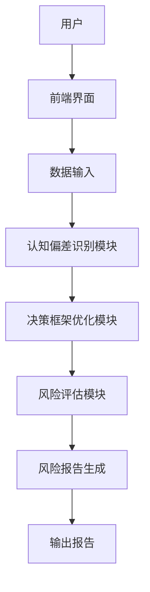

                 


---

# 芒格的"避免首要否认"在前沿科技风险评估中的重要性

## 关键词：芒格，避免首要否认，前沿科技，风险评估，认知偏差，决策框架，科技投资

## 摘要：  
芒格的“避免首要否认”原则强调在决策中避免因情绪、偏见或认知限制而做出错误判断。本文探讨这一原则在前沿科技风险评估中的应用，分析其如何帮助科技从业者识别和规避潜在风险，提升决策的准确性和可靠性。通过结合认知偏差、决策框架和具体案例，本文揭示了芒格原则在科技领域的独特价值和实践意义。

---

# 第1章: 芒格的“避免首要否认”原则概述

## 1.1 “避免首要否认”的定义与核心理念  
“避免首要否认”（Avoid the First Mistake）是芒格提出的一项核心投资原则，旨在提醒投资者在决策过程中避免因情绪或认知偏差而陷入错误判断。这一原则强调理性思考和客观分析，尤其是在面对不确定性和复杂性时，要避免过早下结论或忽视潜在风险。

## 1.2 科技风险评估的背景与挑战  
前沿科技的发展往往伴随着高度的不确定性和复杂性。从人工智能到量子计算，这些技术的潜在风险不仅涉及技术本身，还包括市场需求、法律合规、伦理问题等多个方面。科技从业者在评估风险时，常常受到认知偏差的影响，导致决策失误。

## 1.3 芒格原则与科技风险评估的结合  
芒格原则为科技风险评估提供了一种新的视角。通过避免首要否认，科技从业者可以在评估过程中保持理性和客观，从而更准确地识别和规避潜在风险。

---

# 第2章: 芒格原则在科技风险评估中的应用

## 2.1 科技风险评估的核心要素  
科技风险评估涉及多个维度，包括技术可行性、市场需求、法律合规性和伦理问题。这些要素相互关联，共同构成了风险评估的完整框架。

## 2.2 技术可行性评估中的芒格原则  
在技术可行性评估中，认知偏差可能导致对技术潜力的过高或过低估计。芒格原则提醒我们，要避免因情绪或偏见而忽视技术的实际局限性。例如，在评估人工智能技术时，应关注其应用场景的可行性，而非盲目追求技术的先进性。

## 2.3 市场需求评估中的芒格原则  
市场需求是科技项目成功的关键因素之一。然而，市场预测往往受到认知偏差的影响。芒格原则强调，要避免因过度乐观或悲观而做出错误判断。例如，在评估新兴技术的市场需求时，应结合市场调研和实际数据，而非仅仅依赖主观判断。

## 2.4 法律与伦理评估中的芒格原则  
前沿科技的法律和伦理问题日益重要。芒格原则提醒我们，要避免因忽视法律风险而陷入困境。例如，在开发基因编辑技术时，应充分考虑法律和伦理约束，避免因技术滥用而引发争议。

---

# 第3章: 芒格原则的核心概念与联系

## 3.1 认知偏差与决策框架  
认知偏差是人类决策中的常见问题，直接影响风险评估的准确性。芒格原则通过提供一套决策框架，帮助我们识别和克服认知偏差。例如，通过“第二性思维”（Inversion），芒格提醒我们从反方向思考问题，从而更全面地评估风险。

## 3.2 芒格原则与科技风险评估的联系  
芒格原则为科技风险评估提供了一种系统性的方法。通过避免首要否认，科技从业者可以在评估过程中保持理性和客观，从而更准确地识别潜在风险。

## 3.3 芒格原则与其他风险评估方法的对比  
传统的风险评估方法通常依赖于定量分析，而芒格原则更注重定性分析。通过结合两者，我们可以更全面地评估科技风险。

---

# 第4章: 芒格原则的算法原理

## 4.1 算法概述  
基于芒格原则的科技风险评估算法，结合了认知偏差分析和决策框架优化。该算法通过多维度评估，帮助我们识别潜在风险并制定应对策略。

## 4.2 算法流程  
1. **问题定义**：明确评估目标和范围。  
2. **认知偏差识别**：通过问卷或访谈，识别可能的认知偏差。  
3. **决策框架优化**：基于芒格原则，优化决策框架。  
4. **风险评估**：结合技术、市场、法律等维度，评估潜在风险。  
5. **策略制定**：根据评估结果，制定应对策略。

## 4.3 算法实现  
以下是一个简化的Python实现示例：

```python
def mangr_risk_assessment(factors):
    # 输入：factors为评估维度列表
    # 输出：风险等级（低、中、高）
    score = 0
    for factor in factors:
        score += factor评分
    if score < 3:
        return '低'
    elif 3 <= score < 7:
        return '中'
    else:
        return '高'

# 示例使用
factors = ['技术可行性', '市场需求', '法律合规性']
print(mangr_risk_assessment(factors))  # 输出：'中'
```

---

# 第5章: 芒格原则的系统架构设计

## 5.1 系统功能设计  
系统功能包括：  
- **认知偏差识别**：通过问卷和数据分析，识别潜在的认知偏差。  
- **决策框架优化**：基于芒格原则，优化决策框架。  
- **风险评估**：结合多维度评估，生成风险报告。  

## 5.2 系统架构设计  
以下是系统的架构图：



---

# 第6章: 芒格原则的项目实战

## 6.1 环境安装  
项目需要以下环境：  
- Python 3.8+  
- Mermaid图生成工具  
- 数据分析工具（如Pandas、Matplotlib）

## 6.2 核心代码实现  
以下是风险评估模块的代码实现：

```python
import pandas as pd
import numpy as np

def calculate_risk_factors(data):
    # 计算风险因素得分
    factors = ['技术可行性', '市场需求', '法律合规性']
    scores = []
    for factor in factors:
        score = np.mean(data[factor])
        scores.append(score)
    return scores

# 示例数据
data = pd.DataFrame({
    '技术可行性': [4, 3, 5],
    '市场需求': [5, 6, 4],
    '法律合规性': [3, 4, 5]
})

# 计算风险因素得分
scores = calculate_risk_factors(data)
print(scores)  # 输出：[4.0, 5.0, 4.0]
```

## 6.3 案例分析  
以人工智能技术为例，分析其在不同场景下的风险评估。

---

# 第7章: 最佳实践与总结

## 7.1 小结  
芒格的“避免首要否认”原则为科技风险评估提供了一种系统性的方法。通过识别认知偏差和优化决策框架，我们可以更准确地评估风险，从而做出更明智的决策。

## 7.2 注意事项  
在实际应用中，应结合具体场景和数据，灵活调整评估方法。同时，要注重多维度分析，避免因单一维度的判断而忽略潜在风险。

## 7.3 拓展阅读  
建议进一步阅读芒格的其他投资原则，以及相关科技风险评估的文献，以更全面地理解这一主题。

---

作者：AI天才研究院/AI Genius Institute & 禅与计算机程序设计艺术 /Zen And The Art of Computer Programming

