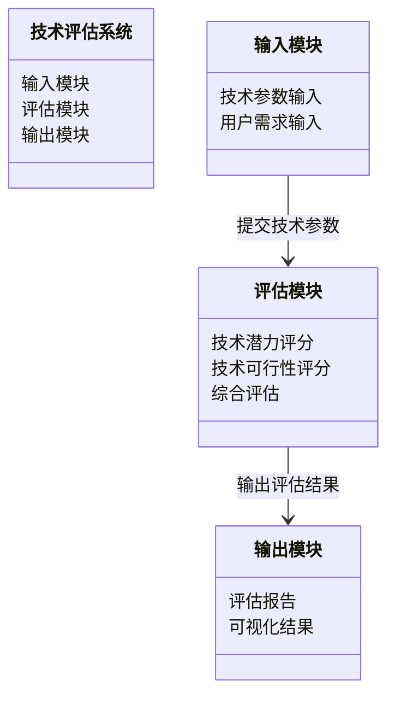

                 


```markdown
# 芒格的"避免首要否认"在新技术评估中的重要性

## 关键词：芒格，避免首要否认，新技术评估，技术决策，评估方法，系统架构，算法原理

## 摘要：芒格的“避免首要否认”是一种在决策中避免先入为主否定态度的思维方式，本文将深入探讨该理念在新技术评估中的应用。通过分析其核心概念、算法原理、数学模型、系统架构，结合实际案例，展示如何在新技术评估中应用芒格的思维方式，以做出更明智的技术决策。

---

# 第1章：芒格的“避免首要否认”概述

## 1.1 芒格的“避免首要否认”理念

### 1.1.1 芒格的“避免首要否认”定义
芒格的“避免首要否认”（Avoid the First-Order Denial）是指在面对信息或决策时，避免因先入为主的观念或情绪而立即否定某个事物。这种思维方式强调理性分析和开放态度，旨在减少决策中的偏见和误判。

### 1.1.2 该理念的核心思想
该理念的核心在于鼓励决策者在面对新技术时，不急于否定或接受，而是通过系统性分析来评估其价值和可行性。这种思维方式有助于避免因主观偏见或经验限制而做出错误决策。

### 1.1.3 该理念在决策中的应用
在技术决策中，芒格的理念提醒我们不要因技术的复杂性或与现有认知的冲突而排斥新技术。相反，应通过详细的分析和验证来评估其潜力和风险。

## 1.2 新技术评估的重要性

### 1.2.1 技术评估的基本概念
新技术评估是通过对技术的性能、可行性、潜力和风险进行分析，以确定其在特定场景下的适用性和价值。

### 1.2.2 技术评估的常见误区
- 过度依赖经验：因经验不足或经验误导而低估新技术的潜力。
- 忽略风险：未充分考虑新技术的潜在风险，导致决策失误。
- 过度乐观：对新技术的潜力过于乐观，忽视其实际可行性。

### 1.2.3 技术评估的流程与方法
技术评估通常包括需求分析、技术分析、风险评估和成本效益分析等步骤。这些步骤需要结合定量和定性方法，确保评估的全面性和准确性。

## 1.3 芒格理念与新技术评估的结合

### 1.3.1 理念在技术评估中的应用
在新技术评估中，芒格的“避免首要否认”理念强调保持开放和理性的态度，避免因先入为主的观念而排斥新技术。这种态度有助于更客观地分析技术的优缺点。

### 1.3.2 技术评估中的常见问题
- 过度关注技术的理论优势，忽视实际应用场景。
- 未充分考虑技术的可实现性和实施成本。
- 忽略技术的潜在风险和不确定性。

### 1.3.3 芒格理念如何解决这些问题
通过芒格理念，评估者能够在评估过程中保持开放态度，避免因主观偏见而忽略技术的实际价值。同时，通过系统性分析，能够更全面地识别技术的风险和潜力。

---

# 第2章：新技术评估的核心概念与联系

## 2.1 核心概念原理

### 2.1.1 技术评估的基本要素
技术评估的基本要素包括技术性能、实施成本、应用场景、潜在风险和用户需求等。这些要素相互关联，共同影响技术的评估结果。

### 2.1.2 技术的生命周期模型
技术的生命周期通常包括引入、成长、成熟和衰退四个阶段。在不同阶段，技术的评估重点和方法也会有所不同。

### 2.1.3 技术评估的关键维度
- **技术性能**：技术的功能和性能是否满足需求。
- **实施成本**：技术的实施是否经济可行。
- **应用场景**：技术是否适用于目标场景。
- **潜在风险**：技术是否具有可预测和可管理的风险。
- **用户需求**：技术是否符合用户的实际需求。

## 2.2 核心概念对比分析

### 2.2.1 不同技术评估方法的对比
| 评估方法 | 优点 | 缺点 |
|----------|------|------|
| 传统成本-收益分析 | 方法简单，易于操作 | 忽略技术的潜在风险 |
| 技术可行性分析 | 强调技术的可行性 | 缺乏对成本的深入分析 |
| 芒格的“避免首要否认” | 保持开放态度，避免误判 | 需结合其他评估方法 |

### 2.2.2 传统评估方法与芒格理念的对比
- **传统方法**：注重定量分析，可能忽视定性因素。
- **芒格理念**：强调定性分析，注重主观判断的合理性。

### 2.2.3 各种评估方法的优缺点
- **优点**：传统方法结构清晰，芒格理念更具灵活性。
- **缺点**：传统方法可能忽视潜在风险，芒格理念需要结合其他方法。

## 2.3 ER实体关系图

```mermaid
erDiagram
    customer[客户] {
        <属性>
        id : integer
        name : string
        email : string
    }
    technology[技术] {
        <属性>
        id : integer
        name : string
        description : string
        cost : float
        risk : string
    }
    assessment[评估] {
        <属性>
        id : integer
        customer_id : integer
        technology_id : integer
        result : string
        date : date
    }
    customer --> assessment : 进行评估
    technology --> assessment : 评估的技术
```

---

# 第3章：新技术评估的算法原理

## 3.1 算法原理概述

### 3.1.1 算法的基本思想
新技术评估算法的基本思想是通过多维度分析，综合评估技术的优缺点，以确定其适用性和潜力。

### 3.1.2 算法的输入输出
- **输入**：技术性能、实施成本、应用场景、潜在风险。
- **输出**：技术评估结果（高、中、低潜力）。

## 3.2 算法的数学模型

### 3.2.1 技术潜力评分公式
$$ \text{技术潜力评分} = \frac{\text{技术性能} \times \text{应用场景} \times (1 - \text{潜在风险})}{\text{实施成本} + 1} $$

### 3.2.2 技术可行性评分公式
$$ \text{技术可行性评分} = \frac{\text{技术性能} \times (1 - \text{实施成本})}{\text{潜在风险} + 1} $$

### 3.2.3 综合评估公式
$$ \text{综合评估结果} = \text{技术潜力评分} \times 0.6 + \text{技术可行性评分} \times 0.4 $$

---

# 第4章：系统架构与设计

## 4.1 问题场景介绍

### 4.1.1 系统功能需求
- 技术评估模块：输入技术参数，输出评估结果。
- 报告生成模块：自动生成评估报告。
- 用户界面：用户友好的交互界面。

## 4.2 系统功能设计

### 4.2.1 系统功能模块


## 4.3 系统架构设计

### 4.3.1 系统架构图
```mermaid
containerDiagram
    container Web前端 {
        用户界面
    }
    container 评估系统 {
        输入模块
        评估模块
        输出模块
    }
    container 数据库 {
        技术参数
        用户需求
        评估结果
    }
    用户界面 --> 评估系统 : 提交请求
    评估系统 --> 数据库 : 查询技术参数
    评估系统 --> 数据库 : 存储评估结果
```

---

# 第5章：项目实战与案例分析

## 5.1 项目环境配置

### 5.1.1 环境需求
- 操作系统：Linux/Windows/MacOS
- 开发工具：Python 3.8+，Jupyter Notebook
- 数据库：MySQL/MongoDB

## 5.2 核心代码实现

### 5.2.1 技术潜力评分函数
```python
def calculate_technology_potential(technology_performance, application_scenario, potential_risk):
    return (technology_performance * application_scenario * (1 - potential_risk)) / (implementation_cost + 1)
```

### 5.2.2 技术可行性评分函数
```python
def calculate_technology_feasibility(technology_performance, implementation_cost, potential_risk):
    return (technology_performance * (1 - implementation_cost)) / (potential_risk + 1)
```

### 5.2.3 综合评估函数
```python
def comprehensive_assessment(technology_potential, technology_feasibility):
    return technology_potential * 0.6 + technology_feasibility * 0.4
```

---

# 第6章：总结与最佳实践

## 6.1 总结

### 6.1.1 芒格理念的重要性
芒格的“避免首要否认”理念提醒我们在技术评估中保持开放态度，避免因主观偏见而误判技术价值。

### 6.1.2 实际应用中的注意事项
- 结合定量和定性分析。
- 定期更新评估模型。
- 鼓励团队协作和知识共享。

## 6.2 最佳实践 tips

### 6.2.1 保持开放心态
在技术评估中，始终保持开放和理性的态度，避免因先入为主的观念而排斥新技术。

### 6.2.2 定期回顾与优化
定期回顾评估结果，结合新技术的发展和实际情况，不断优化评估方法和模型。

### 6.2.3 鼓励知识共享
通过团队协作和知识共享，提升技术评估的全面性和准确性。

---

## 作者：AI天才研究院 & 禅与计算机程序设计艺术
```

