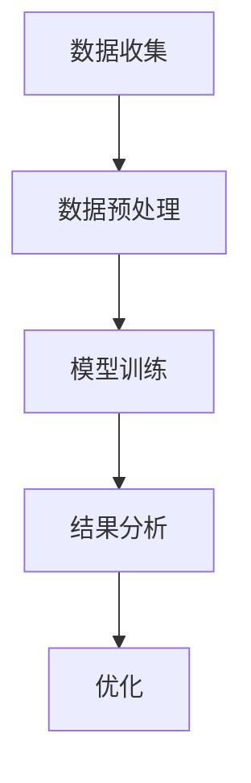
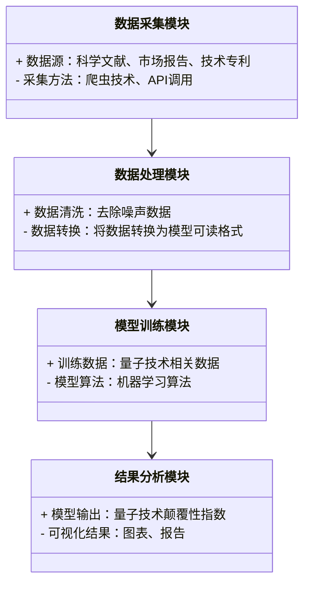
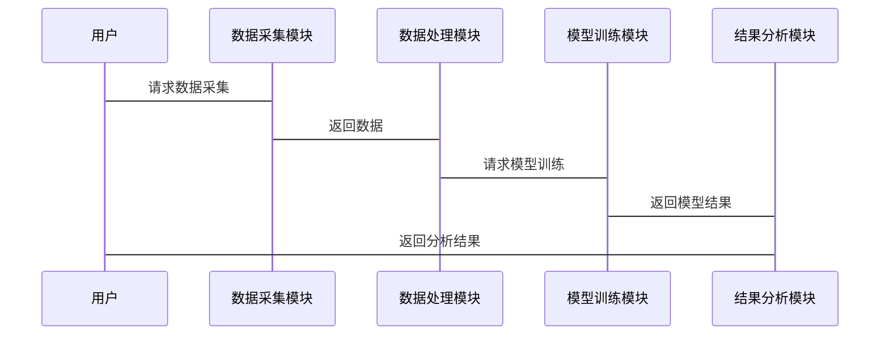

                 


# 芒格的"避免首要否认"在量子技术颠覆性评估中的重要性

## 关键词：芒格，避免首要否认，量子技术，颠覆性评估，技术分析，风险管理，创新思维

## 摘要：本文探讨了芒格的“避免首要否认”思维在量子技术颠覆性评估中的应用，分析了量子技术的基本原理及其颠覆性潜力，详细阐述了如何将芒格的思维方式与量子技术评估相结合，提出了基于“避免首要否认”的评估框架和算法模型，最后通过实际案例展示了这种方法在量子技术评估中的实际应用和价值。

---

## 第一部分: 芒格的"避免首要否认"与量子技术评估背景

### 第1章: 芒格的"避免首要否认"概述

#### 1.1 芒格"避免首要否认"的定义与核心理念
芒格的“避免首要否认”是一种思维方式，强调在决策过程中避免过早否定任何可能性，保持开放和客观的态度。这种方法要求我们在面对不确定性和复杂问题时，全面考虑各种可能性，避免因为先入为主的观念而错过重要的信息和机会。

#### 1.2 量子技术的基本原理与颠覆性潜力
量子技术，尤其是量子计算，基于量子力学原理，利用量子叠加和量子纠缠等现象，能够在某些计算任务上远超经典计算机的性能。量子技术的颠覆性潜力体现在其对现有技术的替代可能性，尤其是在密码学、材料科学、药物研发等领域具有革命性的应用潜力。

#### 1.3 本章小结
芒格的“避免首要否认”思维方式与量子技术的颠覆性评估密切相关。在评估量子技术的潜力时，我们需要避免因为传统思维的限制而忽视其潜在的价值和应用。

---

## 第二部分: "避免首要否认"与量子技术评估的核心概念

### 第2章: "避免首要否认"在量子技术评估中的应用

#### 2.1 "避免首要否认"的评估框架
为了将“避免首要否认”应用于量子技术评估，我们需要构建一个全面的评估框架，包括以下几个方面：
1. **技术评估**：分析量子技术的科学原理、技术成熟度和应用场景。
2. **市场评估**：研究市场需求、竞争格局和潜在的市场机会。
3. **风险评估**：识别技术实现中的风险和挑战，评估其对市场和行业的潜在影响。
4. **机会评估**：基于“避免首要否认”的思维，挖掘量子技术可能带来的颠覆性机会。

#### 2.2 量子技术颠覆性评估的维度
量子技术的颠覆性评估可以从以下几个维度进行：
1. **技术维度**：量子计算的性能是否显著优于经典计算。
2. **市场维度**：量子技术是否能够满足特定行业的需求。
3. **经济维度**：量子技术的商业化成本和经济效益。

#### 2.3 "避免首要否认"与量子技术评估的关系
通过“避免首要否认”的思维方式，我们可以更好地理解量子技术的潜力和挑战，避免因为传统思维的局限性而低估其价值。同时，这种方法可以帮助我们在评估过程中保持开放和客观，发现潜在的机会和风险。

---

## 第三部分: 量子技术颠覆性评估的算法原理

### 第3章: 量子技术颠覆性评估的算法模型

#### 3.1 评估算法的步骤与流程
量子技术颠覆性评估的算法模型可以分为以下几个步骤：
1. **数据收集**：收集量子技术相关的科学文献、市场报告、技术专利等数据。
2. **数据预处理**：对收集的数据进行清洗和整理，提取关键特征。
3. **模型训练**：基于机器学习算法，构建量子技术颠覆性评估的模型。
4. **结果分析**：对模型的输出进行分析，评估量子技术的颠覆性潜力。

#### 3.2 基于"避免首要否认"的评估模型
为了更好地应用“避免首要否认”的思维方式，我们需要构建一个基于多维度评估的模型。该模型包括以下几个核心要素：
1. **技术可行性**：评估量子技术在技术实现上的可行性。
2. **市场潜力**：评估量子技术在市场中的潜力。
3. **风险评估**：评估量子技术实现过程中可能面临的风险。

#### 3.3 算法流程图（Mermaid）


---

## 第四部分: 数学模型与公式解析

### 第4章: 量子技术评估的数学模型

#### 4.1 量子技术颠覆性指数计算公式
为了量化量子技术的颠覆性潜力，我们可以构建一个颠覆性指数模型。该模型基于以下几个因素：
1. **技术成熟度**（T）：反映量子技术的技术成熟程度。
2. **市场潜力**（M）：反映量子技术在市场中的潜力。
3. **风险因素**（R）：反映量子技术实现过程中可能面临的风险。

颠覆性指数（D）的计算公式如下：
$$
D = \frac{T \times M \times (1 - R)}{1 + T + M}
$$

其中：
- T的取值范围为0到1，表示技术成熟度。
- M的取值范围为0到1，表示市场潜力。
- R的取值范围为0到1，表示风险因素。

---

## 第五部分: 系统分析与架构设计

### 第5章: 量子技术颠覆性评估系统设计

#### 5.1 项目介绍
为了实现量子技术颠覆性评估，我们开发了一个基于“避免首要否认”思维的评估系统。该系统包括以下几个模块：
1. **数据采集模块**：负责收集量子技术相关的数据。
2. **数据处理模块**：对数据进行清洗和预处理。
3. **模型训练模块**：基于机器学习算法，构建评估模型。
4. **结果分析模块**：对模型的输出进行分析和解读。

#### 5.2 系统功能设计
系统功能设计基于领域模型，如以下Mermaid类图所示：


#### 5.3 系统架构设计
系统架构设计基于微服务架构，如以下Mermaid架构图所示：
```mermaid
client --> 数据采集模块
client --> 数据处理模块
client --> 模型训练模块
client --> 结果分析模块
```

#### 5.4 系统接口设计
系统接口设计包括以下几个部分：
1. 数据采集模块接口：负责数据的采集和存储。
2. 数据处理模块接口：负责数据的清洗和预处理。
3. 模型训练模块接口：负责模型的训练和输出。

#### 5.5 系统交互设计
系统交互设计基于Mermaid序列图，如以下所示：


---

## 第六部分: 项目实战

### 第6章: 量子技术颠覆性评估系统实现

#### 6.1 环境安装
为了实现量子技术颠覆性评估系统，我们需要安装以下工具和库：
- Python编程语言
- 机器学习库（如scikit-learn、TensorFlow）
- 数据处理库（如Pandas、NumPy）
- 可视化库（如Matplotlib、Seaborn）

#### 6.2 核心实现代码
以下是量子技术颠覆性评估系统的核心代码实现：
```python
import numpy as np
import pandas as pd
from sklearn import linear_model

# 数据采集模块
def collect_data():
    # 示例：从CSV文件中读取数据
    data = pd.read_csv('quantumTechnology.csv')
    return data

# 数据处理模块
def preprocess_data(data):
    # 数据清洗
    data.dropna(inplace=True)
    # 数据标准化
    data = (data - data.mean()) / data.std()
    return data

# 模型训练模块
def train_model(data):
    # 线性回归模型
    model = linear_model.LinearRegression()
    model.fit(data[['T', 'M']], data['D'])
    return model

# 结果分析模块
def analyze_results(model, data):
    # 预测结果
    predictions = model.predict(data[['T', 'M']])
    # 可视化结果
    plt.scatter(data['D'], predictions)
    plt.xlabel('实际值')
    plt.ylabel('预测值')
    plt.show()

# 主函数
def main():
    data = collect_data()
    processed_data = preprocess_data(data)
    model = train_model(processed_data)
    analyze_results(model, processed_data)

if __name__ == "__main__":
    main()
```

#### 6.3 代码应用解读与分析
上述代码实现了一个简单的量子技术颠覆性评估系统。数据采集模块从CSV文件中读取数据，数据处理模块对数据进行清洗和标准化，模型训练模块使用线性回归模型进行训练，结果分析模块对模型的输出进行可视化分析。

#### 6.4 实际案例分析
通过实际案例分析，我们可以验证模型的有效性。例如，假设我们有一个量子计算公司的数据，我们可以通过模型预测其颠覆性潜力，并根据模型的输出结果制定相应的战略决策。

#### 6.5 项目小结
通过本项目的实现，我们可以看到“避免首要否认”的思维方式在量子技术颠覆性评估中的重要性。模型的输出结果可以帮助我们更好地理解量子技术的潜力和挑战，从而制定更加科学的决策。

---

## 第七部分: 总结与最佳实践

### 第7章: 总结与小结

#### 7.1 总结
通过本文的探讨，我们可以看到芒格的“避免首要否认”思维方式在量子技术颠覆性评估中的重要性。在评估过程中，我们需要保持开放和客观的态度，全面考虑各种可能性，避免因为传统思维的限制而忽视量子技术的潜力。

#### 7.2 最佳实践 tips
- 在评估量子技术时，保持开放和客观的态度。
- 综合考虑技术、市场和风险等多个维度。
- 使用科学的模型和工具进行评估。

#### 7.3 未来研究方向
- 研究如何将“避免首要否认”思维方式应用于其他领域的颠覆性评估。
- 探讨量子技术在更多领域的应用潜力。

#### 7.4 拓展阅读
- 《芒格投资体系的思维框架》
- 《量子计算：原理与应用》
- 《颠覆性创新：理论与实践》

---

## 作者：AI天才研究院/AI Genius Institute & 禅与计算机程序设计艺术 /Zen And The Art of Computer Programming

---

通过本文的探讨，我们深入分析了芒格的“避免首要否认”思维方式在量子技术颠覆性评估中的应用。通过构建全面的评估框架、设计科学的算法模型、实现实际的评估系统，我们可以更好地理解和评估量子技术的潜力和挑战。希望本文的分析和实践能够为读者提供有价值的参考和启发。

