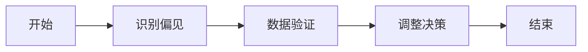
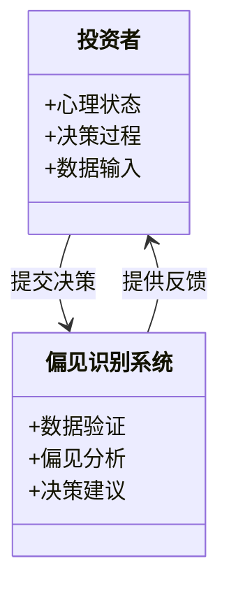

                 

# 《芒格的"避免首要否认"：克服投资中的心理偏见》

> 关键词：芒格，心理偏见，投资决策，认知偏差，避免首要否认，理性投资

> 摘要：本文探讨了芒格提出的“避免首要否认”概念，分析了心理偏见在投资中的影响，并提供了克服这些偏见的方法和策略。通过详细讲解相关理论、数学模型和实际案例，本文为投资者提供了提升决策质量的实用指导。

---

## 第一章：芒格的生平与投资哲学

### 1.1 芒格的早年经历
 查理·芒格是世界著名投资者和思想家，出生于1924年，现为伯克希尔哈撒韦公司的副主席。芒格在哈佛大学学习法律，后转向商业投资领域，逐渐形成了独特的投资哲学。

### 1.2 芒格的投资理念
芒格强调价值投资，主张以合理的价格买入优质资产。他提出“格雷厄姆-多德式思维”，即通过深入分析企业基本面来做出投资决策。

### 1.3 心理偏见的定义
心理偏见是人们在决策过程中由于认知局限或情感影响而产生的系统性错误判断。这些偏见会影响投资决策，导致错误选择。

---

## 第二章：心理偏见的分类与影响

### 2.1 心理偏见的分类
- **认知性偏见**：如确认偏见、选择性知觉。
- **情感性偏见**：如过度自信、从众心理。
- **行为性偏见**：如损失厌恶、羊群效应。

### 2.2 心理偏见对投资决策的影响
- 认知性偏见导致投资者过度自信，忽视潜在风险。
- 情感性偏见使投资者在市场波动中做出非理性决策。
- 行为性偏见影响投资者的买卖时机选择。

### 2.3 常见心理偏见案例
- **过度自信偏见**：投资者高估自己分析能力，过度交易。
- **沉没成本偏见**：继续投入失败项目，避免承认错误。
- **羊群效应**：跟风投资，忽视独立判断。

---

## 第三章：“避免首要否认”的核心概念与联系

### 3.1 “避免首要否认”的定义
“避免首要否认”是指在决策过程中，主动识别和克服首先生效的偏见，确保决策的客观性和理性。

### 3.2 核心概念与联系
- **首要否认**：指先入为主的观念或假设，导致决策偏差。
- **偏见消除**：通过自我反思和数据验证，减少偏见影响。

### 3.3 投资中的应用
- **自我反思**：定期回顾决策，识别偏见。
- **数据验证**：用数据支持假设，避免主观判断。

---

## 第四章：算法原理与数学模型

### 4.1 投资决策流程

### 4.2 数学模型
- **概率模型**：计算偏见导致错误决策的概率。
- **统计模型**：分析历史数据，识别偏见模式。

### 4.3 例子
假设某投资者倾向于选择增长股，但忽视了公司的财务健康状况。通过数据分析，发现这些公司的债务过高，风险较大，从而修正了初始决策。

---

## 第五章：系统分析与架构设计

### 5.1 系统模型

### 5.2 系统架构

---

## 第六章：项目实战与案例分析

### 6.1 案例分析
分析某科技公司投资案例，展示如何通过“避免首要否认”识别和克服偏见，做出更理性的投资决策。

### 6.2 工具与方法
- 使用数据分析工具验证假设。
- 通过团队讨论减少个人偏见。

---

## 第七章：总结与展望

### 7.1 最佳实践
- 定期回顾和调整投资策略。
- 保持学习，识别新偏见。

### 7.2 小结
通过克服心理偏见，投资者可以做出更理性的决策，提高投资回报。

### 7.3 注意事项
- 偏见消除需要持续努力。
- 数据分析需结合实际情况。

### 7.4 拓展阅读
推荐相关书籍和资源，进一步深入学习。

---

## 作者信息

作者：AI天才研究院/AI Genius Institute & 禅与计算机程序设计艺术 /Zen And The Art of Computer Programming

---

以上是文章的完整目录和内容概要，接下来将按照这个结构撰写完整的技术博客文章。

