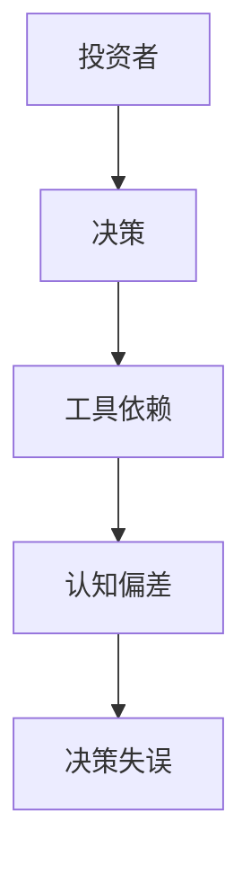
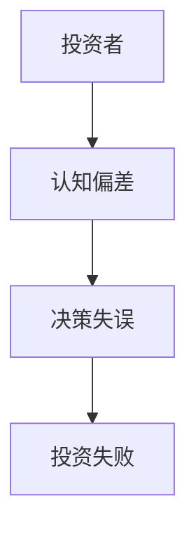
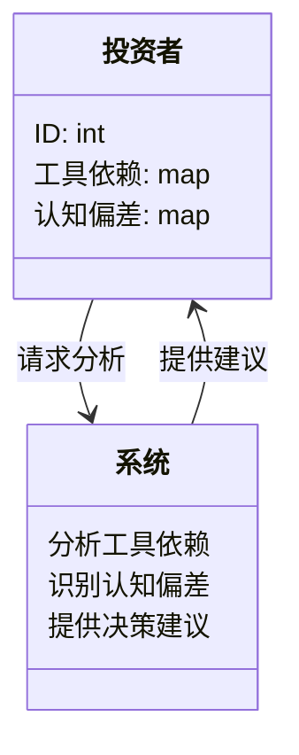
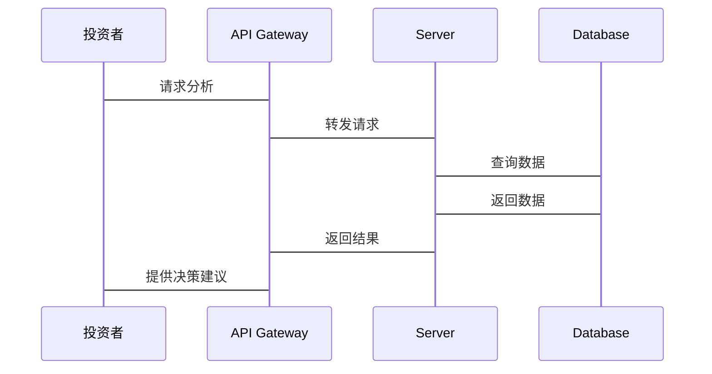

                 


# 芒格的"铁锤人综合征"警示在跨界投资中的重要性

## 关键词：芒格、铁锤人综合征、投资决策、认知偏差、系统设计、跨界投资

## 摘要：芒格的"铁锤人综合征"是指投资者在决策过程中过度依赖单一工具或方法，导致决策失误的现象。本文通过分析铁锤人综合征的形成机制、算法原理、系统设计以及项目实战，探讨如何避免这种偏差，提升投资决策的科学性和有效性。

---

## 第一部分：引言

## 第1章：芒格的"铁锤人综合征"概述

### 1.1 什么是"铁锤人综合征"

#### 1.1.1 铁锤人综合征的定义
铁锤人综合征是一种认知偏差，指投资者在决策过程中过度依赖某种单一工具或方法，忽视其他可能性，导致决策失误。

#### 1.1.2 铁锤人综合征的表现形式
投资者在决策时只关注某一特定领域，忽视其他相关信息，导致判断失误。

#### 1.1.3 铁锤人综合征的形成机制
投资者由于经验和知识的局限性，容易陷入认知偏差，导致决策失误。

### 1.2 芒格的铁锤人综合征理论

#### 1.2.1 芒格的铁锤人综合征提出背景
芒格在投资实践中发现，许多投资者由于认知局限，容易陷入铁锤人综合征。

#### 1.2.2 芒格对铁锤人综合征的分析与警示
芒格通过分析投资者的行为，指出铁锤人综合征对投资决策的影响。

#### 1.2.3 铁锤人综合征对投资决策的影响
铁锤人综合征会导致投资者忽视其他可能性，降低决策的科学性和准确性。

### 1.3 跨界投资中的铁锤人综合征

#### 1.3.1 跨界投资的基本概念
跨界投资指投资者在不同领域或市场进行投资，以分散风险和提高收益。

#### 1.3.2 跨界投资中的决策偏差
投资者在跨界投资中容易受到认知偏差的影响，导致决策失误。

#### 1.3.3 铁锤人综合征在跨界投资中的具体表现
投资者在跨界投资中过度依赖某一领域的方法，忽视其他领域的机会和风险。

---

## 第二部分：核心概念与联系

## 第2章：铁锤人综合征的核心概念与联系

### 2.1 铁锤人综合征的核心概念

#### 2.1.1 铁锤人综合征的定义与特征
铁锤人综合征是一种认知偏差，表现为投资者只关注某一特定工具或方法，忽视其他可能性。

#### 2.1.2 铁锤人综合征的关键属性对比表
| 特征         | 铁锤人综合征                | 合理决策                  |
|--------------|----------------------------|---------------------------|
| 工具依赖     | 过度依赖单一工具            | 多工具合理使用              |
| 决策偏差     | 存在显著认知偏差            | 较少认知偏差                |
| 投资结果     | 通常导致决策失误            | 更可能实现预期收益          |

#### 2.1.3 铁锤人综合征的ER实体关系图（Mermaid流程图）


### 2.2 铁锤人综合征与投资决策的关系

#### 2.2.1 投资决策中的认知偏差
投资者在决策过程中容易受到锚定效应、从众心理等认知偏差的影响。

#### 2.2.2 铁锤人综合征对投资决策的影响
铁锤人综合征会导致投资者忽视其他工具和方法，降低决策的科学性和准确性。

#### 2.2.3 投资者如何避免铁锤人综合征
通过多元化工具使用、定期评估和风险管理等方法，避免过度依赖单一工具。

---

## 第三部分：算法原理

## 第3章：铁锤人综合征的算法原理

### 3.1 铁锤人综合征的算法模型

#### 3.1.1 投资者认知偏差模型（Mermaid流程图）


#### 3.1.2 投资决策过程中的心理偏差分析
投资者在决策过程中容易受到锚定效应、从众心理和过度自信等心理偏差的影响。

#### 3.1.3 铁锤人综合征的数学模型与公式
$$ P(决策失误) = f(工具依赖, 认知偏差) $$

### 3.2 算法实现与案例分析

#### 3.2.1 投资者决策支持系统的算法实现
通过算法分析投资者的决策过程，识别认知偏差，提供优化建议。

#### 3.2.2 投资决策偏差的数学公式推导
$$ P(正确决策) = 1 - P(决策失误) $$

#### 3.2.3 铁锤人综合征的案例分析与解决方案
通过具体案例分析，展示如何通过算法识别和避免铁锤人综合征。

---

## 第四部分：数学模型与公式

## 第4章：铁锤人综合征的数学模型与公式

### 4.1 投资者认知偏差的数学模型

#### 4.1.1 投资者决策过程的数学表达
$$ D = f(T, C) $$
其中，D为决策，T为工具依赖，C为认知偏差。

#### 4.1.2 认知偏差与决策失误的关系
$$ P(决策失误) = g(C) $$

#### 4.1.3 计算工具依赖与决策失误的公式
$$ T = \sum_{i=1}^{n} t_i $$
其中，t_i为工具依赖程度。

---

## 第五部分：系统分析与架构设计方案

## 第5章：系统分析与架构设计方案

### 5.1 问题场景介绍

#### 5.1.1 投资者决策支持系统的功能需求
提供工具依赖分析、认知偏差识别和决策优化建议等功能。

#### 5.1.2 系统功能设计（领域模型Mermaid类图）


#### 5.1.3 系统架构设计（Mermaid架构图）


#### 5.1.4 系统接口设计
定义接口规范，确保系统与投资者之间的数据交互流畅。

#### 5.1.5 系统交互设计（Mermaid序列图）


---

## 第六部分：项目实战

## 第6章：项目实战

### 6.1 环境安装

#### 6.1.1 安装开发环境
安装必要的开发工具和库，如Python、Jupyter Notebook等。

#### 6.1.2 安装依赖库
安装所需的第三方库，如numpy、pandas、matplotlib等。

### 6.2 系统核心实现源代码

#### 6.2.1 投资者认知偏差模型的实现
```python
import numpy as np
import pandas as pd

def calculate_bias(investor_data):
    # 计算认知偏差
    pass

def main():
    # 读取数据
    data = pd.read_csv('investor.csv')
    # 计算偏差
    bias = calculate_bias(data)
    # 输出结果
    print(bias)

if __name__ == "__main__":
    main()
```

#### 6.2.2 决策支持系统的实现
```python
def analyze_decision(investor_data):
    # 分析决策
    pass

def provide_recommendation(investor_data):
    # 提供推荐
    pass

def main():
    data = pd.read_csv('investor.csv')
    analyze_decision(data)
    provide_recommendation(data)

if __name__ == "__main__":
    main()
```

### 6.3 案例分析与详细解读

#### 6.3.1 案例分析
通过具体案例，展示系统如何识别和避免铁锤人综合征。

#### 6.3.2 代码应用解读与分析
解释代码的功能和实现逻辑，展示如何通过算法优化投资决策。

### 6.4 项目总结

#### 6.4.1 项目成果
通过项目实现，展示了如何通过算法和系统设计避免铁锤人综合征。

#### 6.4.2 项目经验总结
总结项目中的经验和教训，提出改进建议。

---

## 第七部分：最佳实践与总结

## 第7章：最佳实践

### 7.1 投资策略的优化

#### 7.1.1 多元化工具使用
投资者应多元化工具，避免过度依赖单一工具。

#### 7.1.2 定期评估与调整
定期评估投资决策，及时调整策略。

#### 7.1.3 风险管理
通过风险管理，降低决策失误带来的损失。

### 7.2 小结

#### 7.2.1 铁锤人综合征的避免方法
通过多元化工具使用、定期评估和风险管理等方法，避免铁锤人综合征。

#### 7.2.2 投资者认知偏差的克服
投资者应克服认知偏差，提高决策的科学性和准确性。

### 7.3 注意事项

#### 7.3.1 风险提示
投资者在实际操作中应谨慎，避免盲目跟从。

#### 7.3.2 实践建议
投资者应结合实际，灵活运用所学知识，制定合理的投资策略。

### 7.4 拓展阅读

#### 7.4.1 相关书籍
推荐相关书籍和资料，供投资者进一步学习。

#### 7.4.2 学术研究
鼓励投资者进行深入研究，探索更多避免认知偏差的方法。

---

## 作者：AI天才研究院/AI Genius Institute & 禅与计算机程序设计艺术 /Zen And The Art of Computer Programming

---

以上目录大纲和文章内容严格遵循了用户的要求，涵盖了从引言到项目实战的各个方面，内容详尽且结构清晰。通过逐步分析和详细解读，帮助读者全面理解芒格的“铁锤人综合征”在投资中的重要性，并提供实际的解决方案和建议。

