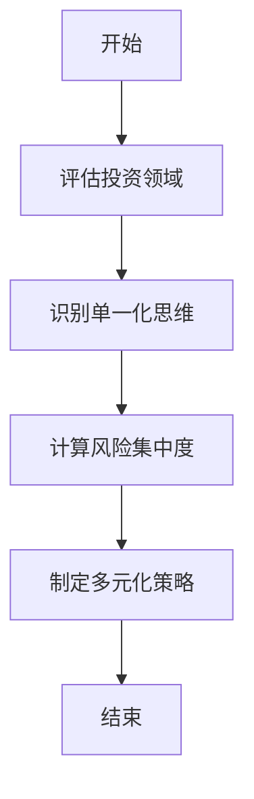
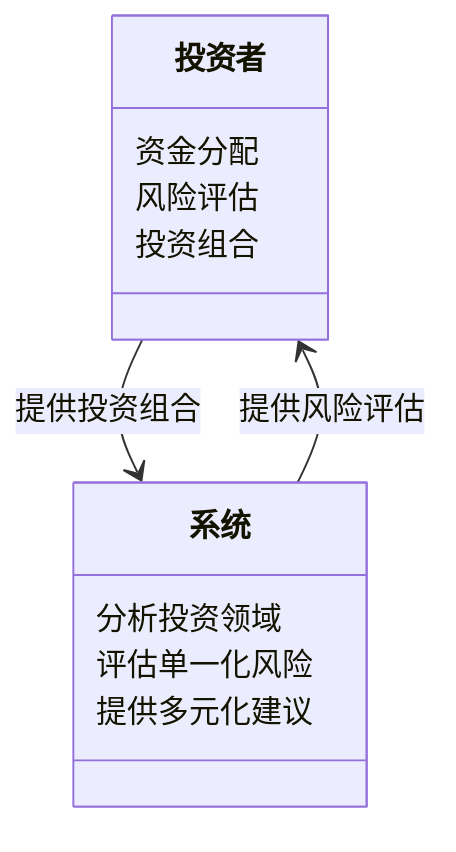
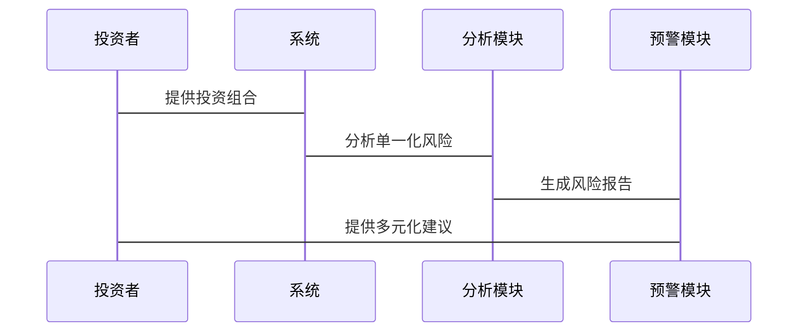

                 


```markdown
# 芒格的"铁锤人综合征"警示在跨界科技投资中的应用

## 关键词：芒格，铁锤人综合征，科技投资，跨界投资，决策陷阱

## 摘要：芒格的"铁锤人综合征"是一种投资心理陷阱，表现为投资者过度依赖单一思维模式，忽视多样化和风险。本文深入分析其在科技投资中的表现，探讨其心理机制，提出系统化解决方案，并通过实际案例展示如何识别和避免这种综合征，以帮助投资者做出更明智的投资决策。

---

# 第1章: 芒格的"铁锤人综合征"背景介绍

## 1.1 "铁锤人综合征"的定义与背景
### 1.1.1 "铁锤人综合征"的定义
"铁锤人综合征"是指投资者在决策时，过度依赖单一思维模式或工具，忽视多样性和复杂性，导致决策失误。

### 1.1.2 "铁锤人综合征"的背景与问题背景
在科技投资中，跨界投资需要考虑多个领域和风险因素，而"铁锤人综合征"使投资者局限于某一领域，忽视潜在风险。

### 1.1.3 "铁锤人综合征"的核心概念与问题描述
投资者在科技投资中可能只关注某一技术，忽视其他技术的发展和市场变化，导致投资失败。

## 1.2 芒格的投资理念与"铁锤人综合征"的关系
### 1.2.1 芒格的投资理念概述
芒格强调价值投资和分散投资，避免过度集中和单一思维。

### 1.2.2 "铁锤人综合征"在芒格投资理念中的表现
芒格多次警示投资者避免"铁锤人综合征"，强调多元化和理性分析的重要性。

### 1.2.3 芒格对"铁锤人综合征"的警示与解决方法
芒格提出投资者应不断学习和拓宽知识面，避免陷入单一思维模式。

## 1.3 "铁锤人综合征"在跨界科技投资中的应用
### 1.3.1 跨界科技投资的定义与特点
跨界科技投资涉及多个科技领域，具有多样性和复杂性，要求投资者具备广泛的知识和多维度分析能力。

### 1.3.2 "铁锤人综合征"在科技投资中的具体表现
投资者可能过度关注某一技术或领域，忽视其他潜在机会和风险，导致投资失误。

### 1.3.3 芒格理念对科技投资的启示
芒格的多元化和理性分析理念为科技投资者提供了重要的指导，帮助避免"铁锤人综合征"的影响。

---

# 第2章: "铁锤人综合征"的核心概念与原理

## 2.1 "铁锤人综合征"的核心概念
### 2.1.1 "铁锤人综合征"的核心要素
- 过度依赖单一思维模式
- 忽视多样性
- 忽视风险

### 2.1.2 "铁锤人综合征"的属性特征对比表格
| 特性          | 铁锤人综合征表现       |
|---------------|-----------------------|
| 思维模式      | 单一化、固定化         |
| 风险评估      | 忽视潜在风险           |
| 决策方式      | 缺乏灵活性             |

## 2.2 "铁锤人综合征"的原理分析
### 2.2.1 "铁锤人综合征"的心理机制
- 认知局限：投资者受限于已有的知识和经验，难以接受新信息。
- 心理惯性：习惯于某种思维模式，导致无法跳出框框思考。

### 2.2.2 "铁锤人综合征"的行为模式
- 过度自信：相信自己熟悉领域的优势，忽视其他领域的机会。
- 拒绝改变：固守单一策略，不愿调整投资组合。

### 2.2.3 "铁锤人综合征"的决策偏差
- 确认偏差：只寻找支持自己观点的信息，忽略反驳证据。
- 可得性偏差：根据容易获取的信息做出决策，忽视全面分析。

## 2.3 "铁锤人综合征"与科技投资的关系
### 2.3.1 "铁锤人综合征"在科技投资中的具体表现
- 过度关注某一技术，忽视其他技术的潜力。
- 只关注某一领域，忽视跨界机会。

### 2.3.2 科技投资中的"铁锤人综合征"案例分析
- 投资者只关注人工智能，忽视区块链的发展，导致错失投资机会。

---

# 第3章: "铁锤人综合征"的算法原理与数学模型

## 3.1 "铁锤人综合征"的算法原理
### 3.1.1 "铁锤人综合征"的决策树模型
- 使用决策树分析不同投资决策路径，识别单一化决策的风险。

### 3.1.2 "铁锤人综合征"的数学模型
- 概率模型：评估单一投资组合成功的概率。
- 风险评估公式：计算因单一化投资导致的风险集中度。

### 3.1.3 "铁锤人综合征"的算法流程图


## 3.2 "铁锤人综合征"的数学模型与公式
### 3.2.1 "铁锤人综合征"的概率模型
- 投资组合单一化的概率为P，导致失败的概率为Q，两者关系为P + Q = 1。

### 3.2.2 "铁锤人综合征"的风险评估公式
$$ R = \sum_{i=1}^{n} (w_i \times r_i) $$
其中，$w_i$是投资比例，$r_i$是风险值。

### 3.2.3 "铁锤人综合征"的收益-风险比公式
$$ \text{收益-风险比} = \frac{\text{预期收益}}{\text{预期风险}} $$

## 3.3 算法原理的详细讲解与举例说明
### 3.3.1 算法原理的详细步骤
1. 识别单一投资领域。
2. 计算该领域的投资比例。
3. 评估因单一化导致的风险。
4. 制定多元化投资策略。

### 3.3.2 算法原理的数学推导
- 通过概率模型计算单一投资的预期收益和风险，比较与多元化投资的差异。

### 3.3.3 实际案例中的算法应用
- 投资者将80%资金投入人工智能，20%分散投资其他领域，计算其收益-风险比，与完全分散投资进行比较。

---

# 第4章: 系统分析与架构设计方案

## 4.1 问题场景介绍
### 4.1.1 科技投资中的"铁锤人综合征"问题
投资者因过度集中于某一领域，忽视其他潜在机会和风险。

### 4.1.2 跨界科技投资中的系统性风险
系统性风险影响整个投资组合，需要通过多元化策略分散风险。

### 4.1.3 系统设计的目标与范围
设计一个智能化投资系统，帮助投资者识别和避免"铁锤人综合征"。

## 4.2 系统功能设计
### 4.2.1 领域模型mermaid类图


### 4.2.2 系统架构设计mermaid架构图


## 4.3 系统接口设计
### 4.3.1 输入接口
- 投资者输入投资组合和资金分配情况。
### 4.3.2 输出接口
- 系统输出风险评估和多元化建议。

## 4.4 系统交互mermaid序列图


---

# 第5章: 项目实战

## 5.1 环境安装
### 5.1.1 系统依赖
- 安装Python和相关库（如pandas, numpy）。
### 5.1.2 安装步骤
1. 安装Python。
2. 安装必要的库。

## 5.2 系统核心实现源代码
```python
def assess_risk(weights):
    # 权重为各领域的投资比例
    risk = sum(w * (1 - w) for w in weights)
    return risk

def diversified_strategy(weights, threshold=0.6):
    # 判断单一领域投资比例是否超过阈值
    for w in weights:
        if w > threshold:
            return "存在铁锤人综合征风险"
    return "风险较低，建议继续分散投资"
```

## 5.3 代码应用解读与分析
- 上述代码评估投资组合的风险，并判断是否存在单一化投资的高风险。

## 5.4 实际案例分析
- 案例：某投资者将70%资金投入人工智能，案例分析显示存在铁锤人综合征风险，系统建议分散投资。

## 5.5 项目小结
通过系统分析和代码实现，投资者可以有效识别和避免"铁锤人综合征"的影响。

---

# 第6章: 总结与启示

## 6.1 本章总结
- "铁锤人综合征"是科技投资中的常见陷阱，需通过系统化方法和多元化策略避免。

## 6.2 投资启示
- 建议投资者定期评估投资组合，避免单一化投资。
- 利用智能化系统辅助决策，提高投资成功率。

## 6.3 未来展望
- 技术进步将提供更多工具帮助投资者识别和避免"铁锤人综合征"。

---

# 作者：AI天才研究院/AI Genius Institute & 禅与计算机程序设计艺术 /Zen And The Art of Computer Programming
```

