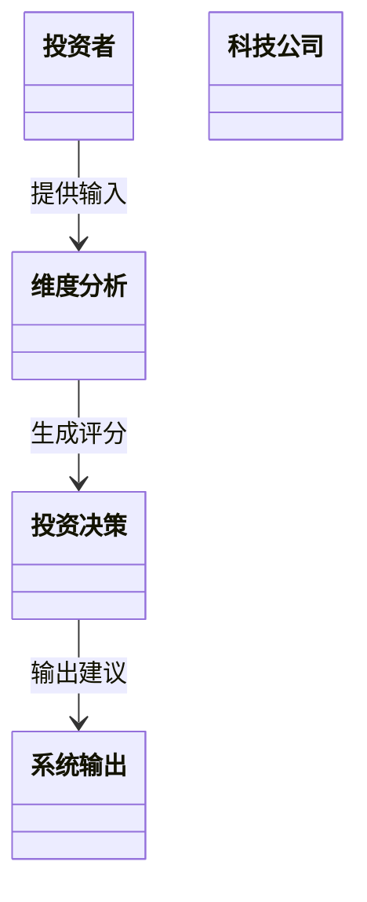
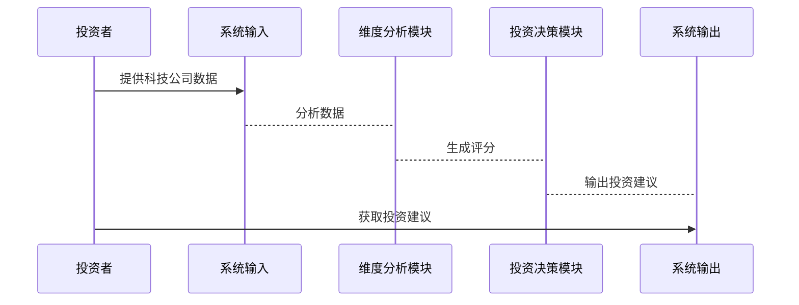

                 


# 芒格的"铁锤人综合征"警示在跨维度科技投资中的应用

---

## 关键词：
芒格，铁锤人综合征，跨维度科技投资，多维度分析，算法模型，投资决策

---

## 摘要：
本文以芒格提出的“铁锤人综合征”为核心，探讨其在跨维度科技投资中的应用。通过分析科技投资的多维度特性，揭示单一维度决策的局限性，并提出基于多维度分析的算法模型和优化策略，帮助投资者避免“铁锤人综合征”的陷阱，实现更科学的投资决策。

---

## 正文：

### 第1章：芒格“铁锤人综合征”的概念与背景

#### 1.1 “铁锤人综合征”的定义与核心概念

##### 1.1.1 “铁锤人综合征”的定义
“铁锤人综合征”是芒格提出的一个隐喻，指投资者只用一种工具（如单一的投资策略或思维方式）解决问题，导致决策偏差和投资失误。这种综合征源于人类认知的局限性和心理偏差。

##### 1.1.2 “铁锤人综合征”的成因与表现
- **成因**：投资者往往倾向于寻找能够验证自己观点的证据，忽视反面信息，导致认知偏差。
- **表现**：在投资中，表现为过度依赖某一指标或方法，忽视其他重要维度的信息。

##### 1.1.3 “铁锤人综合征”在投资中的具体表现
- 过度关注技术指标，忽视市场风险。
- 仅依赖财务数据，忽略公司管理能力。
- 过分依赖历史表现，忽视未来变化。

#### 1.2 芒格投资理念的核心思想

##### 1.2.1 芒格的投资哲学概述
芒格强调多元思维模型，认为投资者需要从多个维度分析问题，避免单一维度的决策偏差。

##### 1.2.2 芒格对“铁锤人综合征”的警示
芒格多次提醒投资者不要成为“铁锤人”，要保持开放和多元的思维方式。

##### 1.2.3 芒格投资理念的现代意义
在科技投资高度复杂化的今天，芒格的理念更具现实意义，帮助投资者应对多维度挑战。

#### 1.3 跨维度科技投资的背景与现状

##### 1.3.1 跨维度投资的定义与特点
- **定义**：指从多个维度（技术、市场、财务、管理等）综合分析和评估投资标的。
- **特点**：复杂性高、信息量大、决策难度大。

##### 1.3.2 科技投资的多维度分析
- 技术维度：技术领先性、创新性。
- 市场维度：市场规模、竞争格局。
- 财务维度：盈利能力、成长性。
- 管理维度：团队能力、战略规划。

##### 1.3.3 跨维度投资中的常见问题
- 信息过载：难以整合多维度信息。
- 决策疲劳：复杂性导致决策效率下降。
- 单一思维：忽视其他维度的重要性。

---

### 第2章：跨维度科技投资中的“铁锤人综合征”警示

#### 2.1 科技投资的维度分解

##### 2.1.1 技术维度
- **技术领先性**：技术是否处于行业前沿。
- **创新性**：是否具备持续创新能力。

##### 2.1.2 市场维度
- **市场规模**：目标市场的容量。
- **竞争格局**：竞争程度和主要竞争对手情况。

##### 2.1.3 财务维度
- **盈利能力**：收入、利润情况。
- **成长性**：未来增长潜力。

##### 2.1.4 管理维度
- **团队能力**：管理团队的经验和能力。
- **战略规划**：公司战略的清晰度和可行性。

#### 2.2 跨维度投资中的“铁锤人综合征”风险

##### 2.2.1 单一维度决策的局限性
- 仅关注技术优势，忽视市场风险。
- 过分依赖财务数据，忽略管理问题。

##### 2.2.2 多维度分析的必要性
- 综合考虑多个维度，避免决策偏差。

##### 2.2.3 跨维度投资中的平衡策略
- 通过权重分配，平衡各维度的重要性。
- 定期复盘，调整分析维度。

---

### 第3章：算法模型与决策优化

#### 3.1 多维度分析模型的构建

##### 3.1.1 模型的输入维度
- 技术、市场、财务、管理。

##### 3.1.2 模型的输出结果
- 综合评分、投资建议。

##### 3.1.3 模型的评估标准
- 准确性、稳定性、可解释性。

#### 3.2 算法模型的优化策略

##### 3.2.1 基于权重的优化方法
- 根据各维度的重要性分配权重。

##### 3.2.2 灵敏度分析与调整
- 评估各维度对最终结果的影响程度。

##### 3.2.3 群决策模型的应用
- 结合多个专家意见，优化决策。

#### 3.3 数学模型与公式

##### 3.3.1 多维度评分公式
$$ \text{总评分} = \sum_{i=1}^{n} w_i \cdot x_i $$

其中：
- $w_i$：第$i$个维度的权重。
- $x_i$：第$i$个维度的评分。

##### 3.3.2 示例计算
假设某科技公司技术、市场、财务、管理评分分别为80、70、60、90，权重分别为0.3、0.3、0.2、0.2。则总评分为：
$$ 0.3 \times 80 + 0.3 \times 70 + 0.2 \times 60 + 0.2 \times 90 = 75 $$

---

### 第4章：系统分析与架构设计

#### 4.1 问题场景介绍
- 科技投资决策系统的开发，旨在帮助投资者进行多维度分析。

#### 4.2 项目介绍
- 开发一个基于多维度分析的投资决策支持系统。

#### 4.3 系统功能设计

##### 4.3.1 领域模型（Mermaid 类图）


#### 4.4 系统架构设计（Mermaid 架构图）


#### 4.5 系统接口设计
- 输入接口：接收投资者输入和科技公司数据。
- 输出接口：提供投资建议和评分。

#### 4.6 系统交互（Mermaid 序列图）


---

### 第5章：项目实战

#### 5.1 环境安装
- 安装Python和必要的库（如Pandas、Scikit-learn）。

#### 5.2 核心代码实现

##### 5.2.1 多维度评分函数
```python
def calculate_score(company_data, weights):
    score = 0
    for i in range(len(company_data)):
        score += company_data[i] * weights[i]
    return score
```

##### 5.2.2 权重分配
```python
weights = [0.3, 0.3, 0.2, 0.2]
company_data = [80, 70, 60, 90]
score = calculate_score(company_data, weights)
print(score)  # 输出：75
```

#### 5.3 实际案例分析
- 以某科技公司为例，分析其技术、市场、财务、管理维度的评分，并生成投资建议。

#### 5.4 代码应用解读与分析
- 详细解释代码的功能和实现逻辑。

---

### 第6章：总结与展望

#### 6.1 最佳实践 tips
- 多维度分析是跨维度科技投资的关键。
- 定期复盘和调整分析维度。

#### 6.2 小结
- 通过多维度分析和算法优化，避免“铁锤人综合征”的影响。

#### 6.3 注意事项
- 投资者需保持开放和多元的思维方式。
- 系统设计需注重各维度的权重分配和灵敏度分析。

#### 6.4 拓展阅读
- 推荐阅读芒格的《穷查理宝典》。
- 关注科技投资领域的最新研究和实践。

---

## 作者：
AI天才研究院/AI Genius Institute  
禅与计算机程序设计艺术/Zen And The Art of Computer Programming

