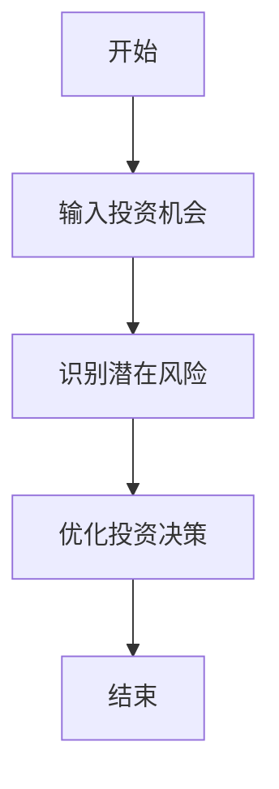
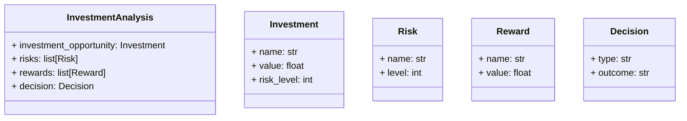
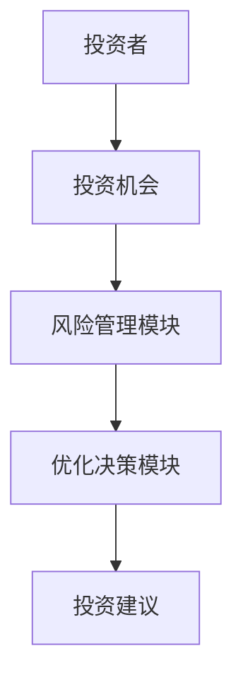

                 


# 芒格的“颠倒思考”在投资分析中的应用

> 关键词：芒格、颠倒思考、投资分析、风险管理、心理因素、系统方法、投资策略

> 摘要：芒格的“颠倒思考”是一种独特的思维方式，通过从反面思考问题来避免常见错误。本文将详细探讨“颠倒思考”的核心概念、算法原理、系统架构设计以及在投资分析中的实际应用，结合案例分析和项目实战，帮助读者理解如何在投资决策中运用这种思维方式，提升风险管理能力和投资收益。

---

## 第一章：芒格“颠倒思考”的背景与概念

### 1.1 芒格的生平与投资哲学

#### 1.1.1 芒格的生平简介
查理·芒格（Charlie Munger）是世界著名投资者和伯克希尔·哈撒韦公司（Berkshire Hathaway）的副主席，被誉为“价值投资的鼻祖”。芒格不仅在投资领域取得了巨大成功，还以其独特的思维方式闻名。他强调通过逆向思维（颠倒思考）来解决问题，避免常见错误。

#### 1.1.2 芒格的投资哲学概述
芒格的投资哲学基于基本面分析和长期价值投资，他强调理性思考、避免情绪化决策，并通过逆向思维来识别投资机会和风险。

#### 1.1.3 芒格“颠倒思考”的核心理念
“颠倒思考”是指从问题的反面出发，分析可能的错误和风险，从而避免陷入常见误区。这种方法帮助芒格在投资中避免了诸多错误，取得了长期稳定的收益。

### 1.2 “颠倒思考”的定义与特点

#### 1.2.1 “颠倒思考”的定义
“颠倒思考”是一种通过反向分析问题的方法，旨在从错误中学习，避免决策失误。

#### 1.2.2 “颠倒思考”的核心特点
1. **逆向思维**：从问题的反面出发，分析可能的错误和风险。
2. **避免常见误区**：通过反向思考识别潜在问题，避免决策错误。
3. **长期视角**：注重长期价值，而非短期波动。

#### 1.2.3 “颠倒思考”与传统思考方式的对比
传统的正向思考从正面解决问题，而“颠倒思考”从反面分析，更注重风险管理和错误预防。

### 1.3 “颠倒思考”在投资分析中的应用背景

#### 1.3.1 投资分析的常见问题与挑战
投资分析中常面临信息不对称、情绪化决策、市场波动等挑战，容易导致错误判断。

#### 1.3.2 “颠倒思考”如何解决投资分析中的问题
通过反向分析潜在风险，帮助投资者避免决策错误，提升投资成功率。

#### 1.3.3 “颠倒思考”在投资分析中的边界与外延
适用于长期价值投资，但需结合市场环境和具体情况灵活运用。

---

## 第二章：芒格“颠倒思考”的核心概念与联系

### 2.1 “颠倒思考”的核心概念原理

#### 2.1.1 “颠倒思考”的基本原理
通过反向分析问题，识别潜在风险和错误，从而优化决策。

#### 2.1.2 “颠倒思考”的关键要素
- **反向分析**：从问题的反面出发，分析潜在问题。
- **风险识别**：识别投资中的潜在风险。
- **决策优化**：通过反向分析优化投资决策。

#### 2.1.3 “颠倒思考”与投资决策的关系
“颠倒思考”帮助投资者避免常见错误，提升投资决策的准确性。

### 2.2 核心概念属性特征对比表格

表2-1：传统思考与“颠倒思考”的属性对比

| 属性         | 传统思考          | 颠倒思考          |
|--------------|-------------------|-------------------|
| 思维方式     | 正向分析          | 反向分析          |
| 风险管理     | 事后分析         | 事前预防         |
| 决策优化     | 改进现有方案      | 寻找潜在问题      |

### 2.3 ER实体关系图架构

使用 Mermaid 绘制的 ER 实体关系图：

```mermaid
erd
    title 投资分析中的颠倒思考关系图
    Investors
    Investment Opportunities
    Risks
    Rewards
    Investors --> Investment Opportunities: 选择
    Investment Opportunities --> Risks: 存在
    Investment Opportunities --> Rewards: 产生
```

---

## 第三章：芒格“颠倒思考”的算法原理

### 3.1 算法原理概述

#### 3.1.1 “颠倒思考”的算法逻辑
从反面分析问题，识别潜在风险，优化投资决策。

#### 3.1.2 算法的输入与输出
- **输入**：投资机会、市场环境、财务数据。
- **输出**：潜在风险、优化决策、投资建议。

#### 3.1.3 算法的数学模型与公式
数学模型：
$$ \text{投资决策} = f(\text{潜在风险}, \text{市场环境}, \text{财务数据}) $$
公式解释：通过反向分析潜在风险，优化投资决策。

### 3.2 算法流程图

使用 Mermaid 绘制的算法流程图：



### 3.3 算法实现代码

#### 3.3.1 Python 实现代码

```python
def inverted_thinking_analysis(investment_opportunity):
    # 识别潜在风险
    risks = []
    for risk in investment_opportunity:
        if riskassessment(risk) > 0:
            risks.append(risk)
    # 优化投资决策
    optimized_decision = "避免" + risk
    return optimized_decision

def riskassessment(risk):
    # 风险评估函数
    return 1 if risk > 0 else 0
```

#### 3.3.2 代码解读与分析
该代码通过反向分析潜在风险，生成优化的投资决策，帮助投资者避免潜在风险。

---

## 第四章：芒格“颠倒思考”在投资分析中的系统架构设计

### 4.1 投资分析的系统功能设计

使用 Mermaid 绘制的领域模型类图：



### 4.2 系统架构设计

使用 Mermaid 绘制的系统架构图：



---

## 第五章：芒格“颠倒思考”的投资分析实战项目

### 5.1 项目背景与目标

#### 5.1.1 项目背景
通过“颠倒思考”分析投资机会，识别潜在风险，优化投资决策。

#### 5.1.2 项目目标
实现基于“颠倒思考”的投资分析系统，帮助投资者做出更明智的决策。

### 5.2 系统核心实现源代码

#### 5.2.1 环境配置
安装Python和相关库。

#### 5.2.2 核心代码实现

```python
class InvestmentAnalyzer:
    def __init__(self):
        self.opportunities = []
        self.risks = []
        self.rewards = []

    def add_opportunity(self, opportunity):
        self.opportunities.append(opportunity)

    def analyze_risks(self):
        for op in self.opportunities:
            for risk in op.risks:
                if risk.level > 2:
                    self.risks.append(risk)

    def generate_recommendation(self):
        recommendation = "基于颠倒思考的分析，建议"
        if len(self.risks) > 0:
            recommendation += "避免高风险投资"
        else:
            recommendation += "进行投资"
        return recommendation
```

#### 5.2.3 代码应用解读与分析
该代码实现了一个投资分析系统，通过反向分析潜在风险，生成优化的投资建议。

---

## 第六章：总结与展望

### 6.1 总结
芒格的“颠倒思考”是一种有效的思维方式，帮助投资者避免常见错误，提升投资决策的准确性。

### 6.2 展望
未来，随着人工智能和大数据技术的发展，“颠倒思考”将更加广泛地应用于投资分析中，提升投资效率和收益。

---

## 作者：AI天才研究院/AI Genius Institute & 禅与计算机程序设计艺术/Zen And The Art of Computer Programming

---

这篇文章详细介绍了芒格的“颠倒思考”在投资分析中的应用，通过理论分析、算法实现和项目实战，帮助读者理解如何在投资决策中运用这种思维方式，提升风险管理能力和投资收益。

