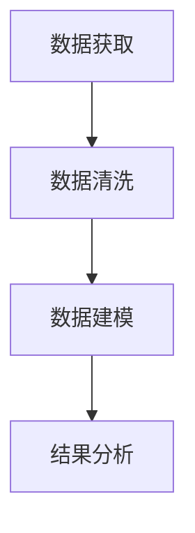

                 


# 英国股市估值:脱欧后的市场表现

## 关键词：英国股市、脱欧、股市估值、经济影响、投资策略、市场分析、技术博客

## 摘要：  
本文旨在探讨脱欧对英国股市估值的影响，分析脱欧后英国股市的表现，结合具体的数据和案例，深入解读英国股市的估值变化及其背后的经济逻辑。文章从背景介绍、估值方法、市场表现、估值模型、系统分析、项目实战到最佳实践，全面剖析脱欧对英国股市估值的深远影响，为投资者提供有价值的参考和建议。

---

# 第一部分: 英国股市估值的背景与基础

## 第1章: 股市估值的核心概念与方法

### 1.1 股市估值的基本原理  
股市估值是通过对企业的财务数据、市场环境和行业趋势进行分析，估算企业股票的合理价格范围。常见的估值方法包括市盈率（P/E）、市净率（P/B）和股息率等。这些方法帮助投资者判断股票是否被高估或低估。

**公式：**  
市盈率 = 股票价格 / 每股净利润  
市净率 = 股票价格 / 每股净资产  
股息率 = 每股股息 / 股票价格  

### 1.2 英国股市的特殊性  
英国股市具有独特的市场结构和行业分布。伦敦证券交易所（LSE）是全球重要的金融中心之一，涵盖多个行业，如金融、能源、科技和消费品等。脱欧后，英国的贸易政策和政治环境发生了变化，对股市估值产生了深远影响。

### 1.3 脱欧对英国经济的影响  
脱欧对英国经济的影响是复杂且多层次的。从短期来看，脱欧公投后英镑贬值，导致进口成本上升；从长期来看，英国可能面临贸易壁垒增加、外资流入减少等问题，这些都对股市估值产生了负面影响。

---

## 第2章: 股市估值的关键指标与模型  

### 2.1 常用估值指标  
- **市盈率（P/E）**：衡量股票价格相对于每股收益的高低。  
- **市净率（P/B）**：衡量股票价格相对于每股净资产的高低。  
- **股息率（Dividend Yield）**：衡量股票的分红回报率。  

### 2.2 估值模型简介  
- **现金流折现模型（DCF）**：通过预测未来现金流的现值来估算企业价值。  
- **市盈率模型**：基于可比公司的市盈率进行估值。  
- **市净率模型**：基于可比公司的市净率进行估值。  

### 2.3 估值模型的优缺点对比  

| 模型 | 优点 | 缺点 |
|------|------|------|
| DCF | 精度高 | 计算复杂，依赖未来现金流预测 |
| 市盈率 | 简单易用 | 受行业影响大 |
| 市净率 | 稳定性高 | 适合重资产行业 |

---

## 第3章: 脱欧后的英国股市表现分析  

### 3.1 脱欧公投前的市场表现  
脱欧公投前，英国股市整体表现平稳，但市场情绪逐渐趋保守。投资者对未来脱欧的不确定性感到担忧，导致股市波动性增加。

### 3.2 脱欧公投后的市场表现  
- **短期反应**：脱欧公投后，英镑大幅贬值，导致英国股市出现短期下跌。  
- **中长期趋势**：随着英国经济逐渐适应脱欧后的政策环境，股市逐步恢复，但整体表现低于脱欧前的水平。  

### 3.3 脱欧对英国股市的行业影响  
- **银行业**：脱欧后，英国银行业面临更高的合规成本和客户流失风险。  
- **制造业**：脱欧导致供应链中断，增加了企业的生产和物流成本。  
- **服务业**：服务业受到的影响相对较小，但英国的留学和旅游政策变化也对相关行业产生了一定影响。  

---

## 第4章: 脱欧对英国股市估值的影响  

### 4.1 脱欧对估值模型的影响  
- **利率变化**：脱欧后英国央行的降息政策降低了企业的融资成本，但也可能导致股票估值偏高。  
- **汇率波动**：英镑贬值使得以外币计价的资产价值下降，影响了企业的估值。  
- **政治风险**：脱欧带来的政治不确定性增加了投资者的风险偏好，导致部分股票被低估。  

### 4.2 脱欧对行业估值的影响  
- **高风险行业**：如银行业和制造业的估值受到较大影响，市盈率和市净率均有所下降。  
- **低风险行业**：如公用事业和医疗行业的估值相对稳定。  

### 4.3 脱欧对整体市场估值的影响  
- **市场整体估值**：脱欧后英国股市的整体估值有所下降，但部分优质企业的估值依然较高。  
- **市场估值的区域差异**：伦敦市场受到的影响较小，而地区性市场（如苏格兰和北爱尔兰）的估值下降更为明显。  

---

## 第5章: 脱欧后的英国股市估值策略  

### 5.1 估值策略的选择  
- **基本面分析**：结合企业的财务数据和行业趋势进行估值。  
- **技术分析**：通过股价走势和市场情绪进行估值。  
- **组合估值**：综合考虑多种因素进行估值，以降低单一模型的风险。  

### 5.2 脱欧后的投资策略  
- **分散投资**：避免集中投资于单一行业或企业，降低风险。  
- **长期投资**：脱欧后的英国股市可能会经历较长的恢复期，长期投资更有利于获得稳定回报。  

---

## 第6章: 项目实战: 脱欧后的英国股市估值分析  

### 6.1 环境安装与数据获取  
- **工具安装**：安装Python、Pandas、Matplotlib等数据分析工具。  
- **数据获取**：从金融数据平台获取英国股市的历史数据和实时数据。  

### 6.2 系统分析与架构设计  


### 6.3 核心代码实现  
```python
import pandas as pd
import numpy as np
import matplotlib.pyplot as plt

# 示例代码：计算市盈率
def calculate_pe_ratio(df):
    df['PE_Ratio'] = df['Price'] / df['Earnings Per Share']
    return df

# 示例代码：绘制股价走势图
def plot_stock_price(df):
    plt.figure(figsize=(10,6))
    plt.plot(df['Date'], df['Price'])
    plt.title('脱欧后英国股市股价走势')
    plt.xlabel('日期')
    plt.ylabel('股价')
    plt.show()

# 示例代码：DCF模型
def discounted_cash_flow(cash_flows, discount_rate):
    present_value = sum(cash_flows / (1 + discount_rate)**i for i in range(len(cash_flows)))
    return present_value
```

### 6.4 实际案例分析  
以英国某银行为例，分析脱欧后其市盈率和市净率的变化。通过DCF模型预测其未来现金流，计算其合理估值，并与当前股价进行对比。

---

## 第7章: 最佳实践与总结  

### 7.1 最佳实践  
- **持续关注脱欧相关政策**：脱欧后的政策变化对股市估值有直接影响。  
- **多元化投资**：降低单一市场的风险。  
- **长期投资策略**：避免短期波动的影响，关注企业的长期价值。  

### 7.2 小结  
本文详细分析了脱欧对英国股市估值的影响，从背景、方法、市场表现到估值模型和投资策略，为投资者提供了全面的参考。尽管脱欧带来了短期波动，但通过科学的估值方法和合理的投资策略，投资者仍能在英国股市中获得稳定的回报。

### 7.3 注意事项  
- 投资需谨慎，建议在专业指导下进行。  
- 估值模型仅供参考，实际操作中需结合市场实际情况进行调整。  

### 7.4 拓展阅读  
- 建议阅读《投资学基础》和《股票估值与分析》等书籍，深入了解股市估值的核心方法和实战技巧。

---

## 作者：AI天才研究院/AI Genius Institute & 禅与计算机程序设计艺术 /Zen And The Art of Computer Programming  

--- 

以上是关于《英国股市估值:脱欧后的市场表现》的完整目录大纲和文章内容，涵盖了从背景分析到实战应用的全过程，结合理论与实践，为投资者提供了深度的分析和指导。

