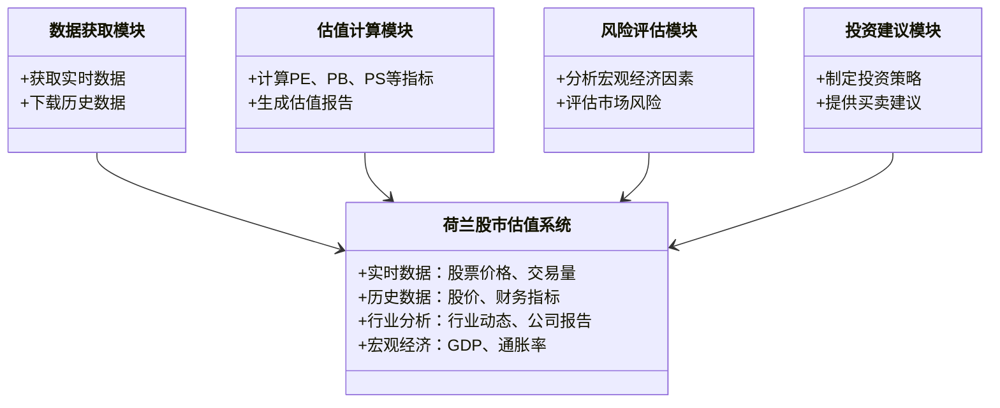
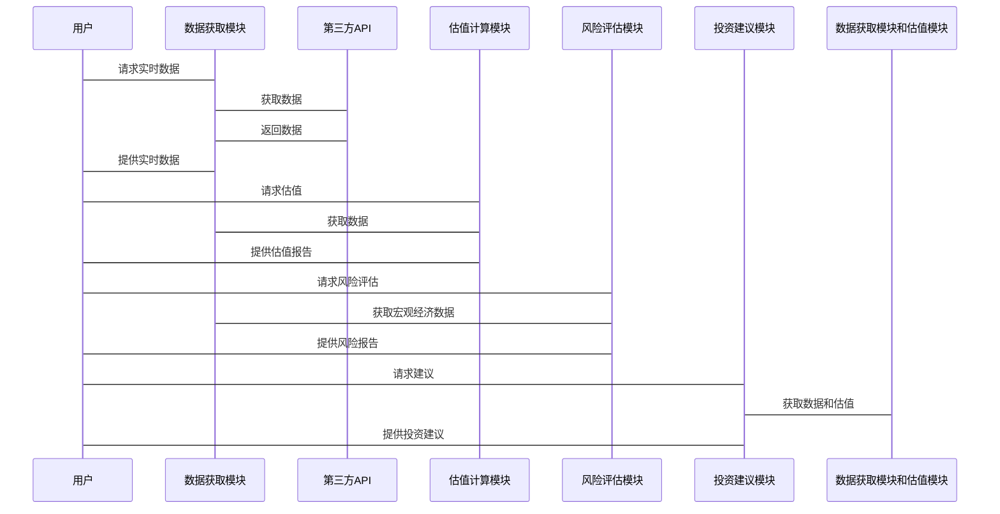

                 


# 荷兰股市估值: 小国大经济的投资价值

> 关键词：荷兰股市，股市估值，宏观经济，投资策略，技术分析，价值投资

> 摘要：本文深入分析荷兰股市的估值方法，探讨其作为小国却拥有强大经济的原因。通过宏观经济分析、行业研究和实际案例，揭示荷兰股市的投资价值和策略。

---

## 第一部分: 荷兰股市估值的背景与基础

### 第1章: 荷兰经济与股市的概述

#### 1.1 荷兰经济的背景
##### 1.1.1 荷兰的经济特点
荷兰经济以多元化和创新性著称，涵盖能源、金融、制造和科技等多个领域。其经济结构稳固，且在全球供应链中占据重要地位。

##### 1.1.2 荷兰在国际经济中的地位
荷兰是欧盟的重要成员国，其经济政策和市场动态对欧洲乃至全球具有显著影响。其开放的贸易政策和强大的金融体系使其成为国际投资的热点。

##### 1.1.3 荷兰经济的多元化与创新性
荷兰通过技术创新和产业升级，保持了经济的持续增长。其在绿色能源和可持续发展方面的投资为其经济增添了新的增长点。

#### 1.2 荷兰股市的基本情况
##### 1.2.1 荷兰主要的股票交易所
荷兰的主要股票交易所是阿姆斯特丹证交所（AEX），涵盖广泛的金融产品，包括股票、债券和衍生品。

##### 1.2.2 荷兰股市的历史与发展
荷兰股市历史悠久，经历了多次变革和整合，现已成为欧洲重要的金融中心之一。其市场规模虽小，但流动性高，交易活跃。

##### 1.2.3 荷兰股市的主要指数
荷兰的主要指数是AEX指数，反映了荷兰股市的整体表现。该指数包含25家权重最大的公司，涵盖多个行业。

#### 1.3 荷兰经济与股市的关系
##### 1.3.1 经济指标对股市的影响
GDP增长、失业率和通胀率等宏观经济指标直接影响股市表现。荷兰的经济稳定使其股市具有较高的抗风险能力。

##### 1.3.2 荷兰股市对全球经济的依赖
作为小国，荷兰股市容易受到全球市场波动的影响。但其在某些行业（如能源和科技）的全球影响力，为其股市提供了增长动力。

##### 1.3.3 荷兰股市的稳定性与风险
荷兰股市以其稳定性著称，但同时也面临汇率波动和国际经济波动的风险。投资者需关注这些因素对估值的影响。

---

## 第二部分: 股市估值的核心概念与方法

### 第2章: 股市估值的核心概念与方法

#### 2.1 股市估值的基本原理
##### 2.1.1 估值的基本概念
股市估值是通过分析公司财务数据和市场因素，确定其股票的合理价格。常见方法包括基本面分析和技术分析。

##### 2.1.2 估值的目的是什么
估值旨在帮助投资者发现价值被低估或高估的股票，制定合理的投资策略。准确的估值能降低投资风险，提高回报率。

##### 2.1.3 估值的基本方法
基本面分析和贴现现金流模型（DCF）是最常用的估值方法。基本面分析关注公司的财务指标，DCF则基于未来现金流的现值。

#### 2.2 荷兰股市估值的独特性
##### 2.2.1 小国大经济的特点
荷兰股市规模小，但公司在全球市场中占据重要地位，尤其是能源和科技行业。这种格局使其股市具有独特的投资价值。

##### 2.2.2 荷兰股市的独特优势
荷兰公司在创新和国际化方面表现突出，这为投资者提供了多元化的投资选择。同时，荷兰政府的政策支持也为股市提供了稳定环境。

##### 2.2.3 荷兰股市的风险与机遇
尽管荷兰股市稳定，但其对全球经济波动的敏感性也带来了风险。投资者需平衡风险与收益，寻找长期增长的机会。

#### 2.3 常用的估值指标与方法
##### 2.3.1 市盈率（PE）
市盈率=股价/每股收益。反映市场对公司盈利能力的评价。低PE可能表示低估，高PE可能表示高估或高增长预期。

##### 2.3.2 市净率（PB）
市净率=股价/每股净资产。适用于评估资产密集型行业的公司，如银行和能源公司。

##### 2.3.3 市销率（PS）
市销率=股价/每股收入。适用于成长型企业，尤其是收入稳定但利润较低的公司。

##### 2.3.4 股息率
股息率=每股股息/股价。衡量股票的分红回报率，高股息率可能表明低估或保守派息政策。

##### 2.3.5 现金流分析
现金流分析关注公司产生的现金流量，反映公司的盈利能力和流动性。正向现金流通常意味着公司具备支付股息和扩张的能力。

#### 2.4 荷兰股市估值的行业分析
##### 2.4.1 能源行业
荷兰是欧洲重要的能源枢纽，能源公司如壳牌在行业中占据重要地位。能源行业的估值受油价波动影响较大，需关注公司的储量和成本控制。

##### 2.4.2 金融行业
荷兰的银行和保险公司是金融行业的主要组成部分。金融行业的估值通常关注ROE和资本充足率等指标。

##### 2.4.3 制造业
荷兰的制造业以高端产品著称，如航空航天和精密仪器。这些公司的估值通常基于技术创新和市场地位。

##### 2.4.4 科技行业
荷兰的科技公司尤其在半导体和软件开发领域表现突出。科技行业的估值注重研发投入和未来增长潜力。

##### 2.4.5 公用事业
公用事业公司如能源供应商的估值通常较为稳定，受政策和需求影响较大。这类公司的股息率通常较高。

#### 2.5 荷兰股市的宏观经济分析
##### 2.5.1 宏观经济对股市的影响
荷兰的宏观经济指标如GDP、通胀和失业率直接影响股市。稳定的宏观经济环境有助于股市的长期增长。

##### 2.5.2 荷兰宏观经济的特殊性
荷兰的经济政策和地理位置使其在欧盟中具有特殊地位。其对国际贸易的依赖也带来了外部风险。

##### 2.5.3 荷兰股市的风险管理
投资者需关注宏观经济风险，如汇率波动和全球经济下行。分散投资和风险评估是有效的风险管理策略。

---

## 第三部分: 荷兰股市估值的系统分析与架构设计

### 第3章: 系统分析与架构设计

#### 3.1 系统分析
##### 3.1.1 问题场景介绍
投资者需要一个系统来分析荷兰股市的估值情况，包括实时数据、历史走势和行业分析。

##### 3.1.2 项目介绍
设计一个荷兰股市估值系统，帮助投资者进行实时数据获取、估值计算和投资决策支持。

#### 3.2 系统功能设计
##### 3.2.1 功能模块
- 数据获取模块：实时获取荷兰股市数据。
- 估值计算模块：使用PE、PB等指标进行估值。
- 风险评估模块：分析宏观经济因素对股市的影响。
- 投资建议模块：基于分析结果提供投资策略。

##### 3.2.2 领域模型（mermaid类图）


#### 3.3 系统架构设计
##### 3.3.1 架构图（mermaid架构图）


#### 3.4 系统接口设计
##### 3.4.1 API接口
- 数据接口：从第三方数据供应商获取实时和历史数据。
- 计算接口：接受股票代码，返回估值指标。
- 建议接口：根据分析结果，返回投资建议。

##### 3.4.2 数据库设计
- 表结构：股票信息表、估值指标表、宏观经济表。
- 数据关系：股票信息关联估值指标和宏观经济因素。

#### 3.5 系统交互设计
##### 3.5.1 交互流程图（mermaid序列图）


---

## 第四部分: 项目实战与案例分析

### 第4章: 项目实战

#### 4.1 环境安装
##### 4.1.1 安装Python
使用Python 3.8及以上版本，安装Anaconda或Miniconda。

##### 4.1.2 安装相关库
安装pandas、numpy、yfinance、scikit-learn等库，用于数据处理和分析。

#### 4.2 核心实现
##### 4.2.1 数据获取
使用yfinance库获取荷兰股市数据，包括实时价格和历史数据。

##### 4.2.2 估值计算
编写函数计算PE、PB等指标，生成估值报告。

##### 4.2.3 风险评估
基于宏观经济数据，评估市场风险，使用随机森林等机器学习模型进行预测。

#### 4.3 实际案例分析
##### 4.3.1 案例选择
以壳牌公司为例，分析其估值情况。

##### 4.3.2 数据分析
获取壳牌的历史数据，计算PE、PB等指标，分析其走势。

##### 4.3.3 投资建议
基于分析结果，提供投资建议，如买入、持有或卖出。

#### 4.4 项目小结
通过实际案例，验证系统的有效性和实用性，总结经验教训，优化系统设计。

---

## 第五部分: 最佳实践、小结与拓展

### 第5章: 最佳实践与注意事项

#### 5.1 投资策略
##### 5.1.1 长期投资与价值投资
荷兰股市的稳定性适合长期投资，关注公司的基本面和长期增长潜力。

##### 5.1.2 技术分析与基本面分析结合
结合技术分析和基本面分析，提高投资决策的准确性。

##### 5.1.3 风险控制
设定止损点，分散投资，避免过度集中于单一行业或公司。

#### 5.2 小结
荷兰股市以其稳定性和多样性，为投资者提供了丰富的投资机会。准确的估值和风险管理是成功投资的关键。

#### 5.3 注意事项
##### 5.3.1 宏观经济风险
关注全球经济和政策变化，避免单一因素影响投资决策。

##### 5.3.2 行业风险
不同行业受经济周期影响不同，需分散投资以降低风险。

##### 5.3.3 数据依赖
依赖可靠的数据源，确保分析结果的准确性。

#### 5.4 拓展阅读
##### 5.4.1 荷兰经济史
深入理解荷兰的经济演变，有助于更好地把握股市趋势。

##### 5.4.2 估值方法论
学习更多估值方法，如相对估值和绝对估值，提高分析能力。

##### 5.4.3 投资心理学
了解投资者心理，避免情绪化决策，保持理性判断。

---

## 第六部分: 附录与参考文献

### 6.1 附录
#### 6.1.1 Python代码示例
```python
import yfinance as yf
import pandas as pd
import numpy as np

def calculate_pe_ticker(ticker):
    df = yf.Ticker(ticker).info
    pe = df['forwardPE']
    return pe

# 示例：计算壳牌的市盈率
pe = calculate_pe_ticker('Shell')
print(f"壳牌的市盈率为：{pe}")
```

#### 6.1.2 数据可视化代码
```python
import matplotlib.pyplot as plt

# 绘制AEX指数历史走势
aex_data = yf.download('^AEX', start='2020-01-01', end='2023-12-31')
aex_data['Close'].plot(figsize=(10,6))
plt.title('AEX指数历史走势')
plt.xlabel('日期')
plt.ylabel('股价')
plt.show()
```

### 6.2 参考文献
- 荷兰央行报告
- 芝加哥商学院投资学教材
- 国际货币基金组织（IMF）报告
- 纽约证券交易所估值指南

---

## 作者：AI天才研究院/AI Genius Institute & 禅与计算机程序设计艺术 /Zen And The Art of Computer Programming

---

本文通过系统分析和实际案例，深入探讨了荷兰股市的估值方法和投资策略。结合宏观经济分析和行业研究，揭示了荷兰股市的投资价值和潜在机会。希望读者能通过本文，掌握荷兰股市估值的核心方法，并在实际投资中灵活运用。

