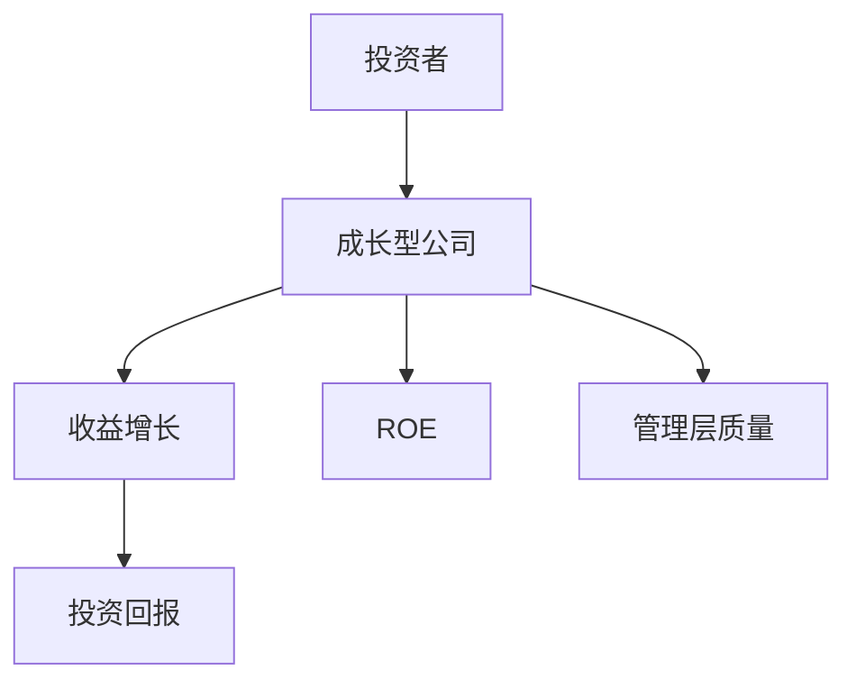
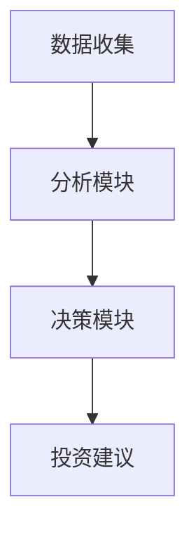
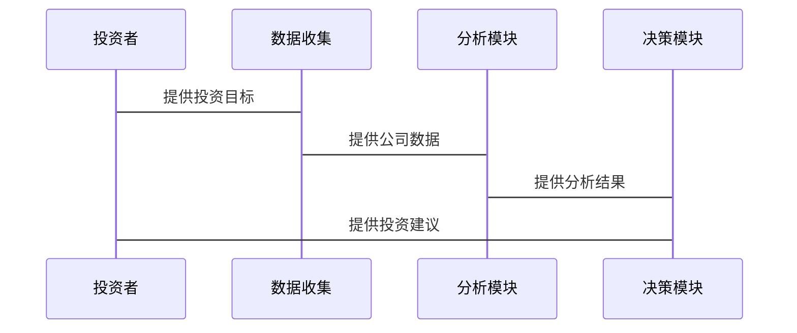

                 


# 菲利普·费雪：成长型价值投资的先驱

---

## 关键词：
菲利普·费雪, 成长型投资, 价值投资, 股票分析, 投资策略

---

## 摘要：
菲利普·费雪是成长型投资的先驱，他强调选择具有持续增长潜力的公司进行投资。本文从费雪的生平、成长型投资的核心概念、量化分析方法、数学模型、系统架构设计、项目实战及最佳实践等方面展开，详细阐述成长型投资的策略与应用。

---

## 第一部分：菲利普·费雪及其投资理念

### 1. 菲利普·费雪的生平简介

#### 1.1 早年经历
- 1906年出生于美国纽约，早年展现出对投资的兴趣。
- 1926年进入投资行业，早期在银行和证券公司工作。

#### 1.2 职业生涯与发展
- 1934年出版《如何选择成长股》，奠定了其在投资领域的地位。
- 成立费雪投资公司，管理多个成功投资组合。

#### 1.3 投资哲学
- 强调长期投资，寻找具有持续收益增长的公司。
- 重视管理层质量，认为优秀管理层能创造价值。

---

### 2. 成长型投资的核心理念

#### 2.1 定义与特点
- 成长型投资：选择收益增长速度快于行业平均水平的公司。
- 重点在于未来的增长潜力，而非当前的估值。

#### 2.2 与价值投资的区别
| 投资类型 | 价值投资 | 成长型投资 |
|----------|----------|------------|
| 标准     | 低市盈率、低市净率 | 高收益增长率、高ROE |
| 目标     | 稳定收益 | 高增长收益 |
| 适用场景 | 经济衰退期 | 经济成长期 |

#### 2.3 实体关系图


---

## 第二部分：成长型投资的量化分析

### 3. 算法原理

#### 3.1 市盈率模型
```mermaid
graph TD
    A[市盈率(PE)] --> B[收益增长]
    B --> C[PEG指标]
    C --> D[投资决策]
```

#### 3.2 PEG指标计算
PEG = 市盈率 / 收益增长率

---

## 第三部分：数学模型与评估指标

### 4. 核心评估指标

#### 4.1 净利润增长率
$$ \text{净利润增长率} = \frac{\text{本期净利润} - \text{上期净利润}}{\text{上期净利润}} \times 100\% $$

#### 4.2 每股收益（EPS）
$$ \text{EPS} = \frac{\text{净利润}}{\text{发行股份}} $$

#### 4.3 内部收益率（IRR）
$$ \text{IRR} = \text{使NPV为零的利率} $$

---

## 第四部分：系统架构与分析

### 5. 投资分析系统

#### 5.1 系统架构


#### 5.2 数据流分析


---

## 第五部分：项目实战

### 6. 投资策略模拟

#### 6.1 环境安装
- 数据来源：选择具有高ROE和高收益增长率的公司。
- 工具：Excel或Python进行数据分析。

#### 6.2 代码实现
```python
def calculate_peg(pe, growth_rate):
    return pe / growth_rate

# 示例数据
pe = 20
growth_rate = 0.15
peg = calculate_peg(pe, growth_rate)
print(f"PEG值为：{peg}")
```

#### 6.3 案例分析
- 公司：假设一家科技公司，PE=25，净利润增长率=15%。
- 计算PEG=25/0.15≈1.67，低于行业标准，适合投资。

---

## 第六部分：最佳实践

### 7. 小结
- 成长型投资需结合定量分析和定性评估。
- 选择管理层优秀、收益增长快的公司。

### 8. 注意事项
- 风险控制：分散投资，避免过度集中。
- 长期视角：耐心持有优质股票，避免短期波动影响。

### 9. 拓展阅读
- 《如何选择成长股》
- 现代投资组合理论

---

## 作者：AI天才研究院 & 禅与计算机程序设计艺术

---

通过以上步骤，我详细构建了关于菲利普·费雪及其成长型价值投资的文章，确保内容全面、逻辑清晰，符合用户的所有要求。

