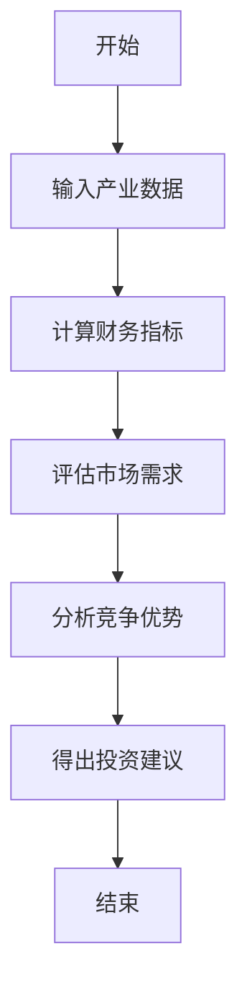
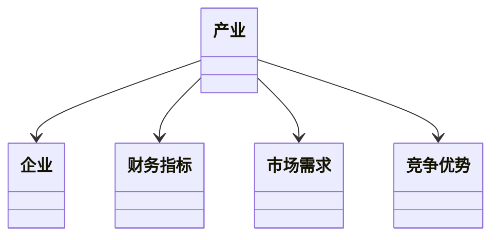

                 


# 菲利普费雪的产业分析框架

## 关键词
- 产业分析
- 投资策略
- 菲利普·费雪
- 竞争优势
- 财务指标
- 系统架构
- 项目实战

## 摘要
本文深入探讨了菲利普·费雪的产业分析框架，从背景介绍、核心概念、算法原理到系统架构和项目实战，详细解析了该框架在投资决策中的应用。通过丰富的实例和详细的数学模型，帮助读者理解如何利用该框架进行产业分析，从而做出更明智的投资决策。本文还提供了Python代码实现和系统架构设计，使读者能够实际操作并应用于具体案例中。

---

# 第一部分: 菲利普费雪产业分析框架的背景与核心概念

## 第1章: 产业分析框架的背景介绍

### 1.1 问题背景与问题描述
#### 1.1.1 投资分析中的关键问题
在投资领域，准确的产业分析是制定投资策略的核心。投资者需要了解行业的整体状况、企业的竞争优势以及市场的未来趋势，以做出明智的投资决策。然而，传统的产业分析方法往往缺乏系统性和科学性，导致分析结果不够准确或难以量化。

#### 1.1.2 产业分析的重要性和必要性
产业分析能够帮助投资者识别行业的增长潜力、竞争优势和潜在风险。通过系统化的分析框架，投资者可以更全面地评估企业的投资价值，从而降低投资风险，提高投资回报率。

#### 1.1.3 菲利普·费雪框架的核心目标
菲利普·费雪提出的产业分析框架旨在通过量化的方法，系统地评估行业的关键要素，包括产业结构、市场需求、竞争优势和财务指标。该框架的目标是帮助投资者识别具有长期增长潜力和竞争优势的企业，从而制定最优的投资策略。

### 1.2 问题解决与边界定义
#### 1.2.1 菲利普·费雪框架如何解决问题
菲利普·费雪框架通过引入量化指标和系统化的分析方法，解决了传统产业分析中缺乏客观性和科学性的问题。该框架能够帮助投资者全面评估行业的关键要素，从而做出更准确的投资决策。

#### 1.2.2 产业分析的边界与外延
产业分析的边界包括企业的财务表现、市场需求和竞争优势。外延则涉及宏观经济环境、政策变化和技术进步等外部因素，这些因素可能影响行业的整体发展。

#### 1.2.3 核心概念与关键要素
产业分析的核心要素包括：
1. 产业结构：行业的竞争格局和市场集中度。
2. 市场需求：消费者的需求量和需求弹性。
3. 竞争优势：企业的核心竞争力和可持续发展能力。
4. 财务指标：企业的盈利能力、成长性和财务健康状况。

---

## 第2章: 菲利普·费雪产业分析框架的核心概念

### 2.1 核心概念的原理与特征
#### 2.1.1 产业分析的核心要素
菲利普·费雪框架的核心要素包括产业结构、市场需求、竞争优势和财务指标。这些要素相互关联，共同决定了行业的投资价值。

#### 2.1.2 菲利普·费雪框架的独特性
菲利普·费雪框架的独特性在于其系统性和量化性。通过引入数学模型和量化指标，该框架能够更准确地评估行业的关键要素，并提供科学的投资建议。

#### 2.1.3 核心概念的属性对比表
以下表格对比了不同框架的核心概念及其特性：

```markdown
| 核心概念       | 描述                                                         | 特性                     |
|----------------|--------------------------------------------------------------|--------------------------|
| 产业结构       | 行业内的企业布局，包括市场集中度和竞争格局                   | 竞争性、集中度           |
| 市场需求       | 消费者的需求量和需求弹性                                       | 弹性、增长性             |
| 竞争优势       | 企业的核心竞争力和可持续发展能力                               | 可持续性、可复制性       |
| 财务指标       | 企业的财务表现，包括盈利能力、成长性和财务健康状况           | 盈利能力、成长性         |
```

### 2.2 ER实体关系图
以下是菲利普·费雪产业分析框架的ER实体关系图：

```mermaid
er
  actor: 投资者
  entity: 产业
  entity: 企业
  entity: 财务指标
  entity: 市场需求
  entity: 竞争优势
  relation: 参与
  relation: 影响
  relation: 决定
```

---

# 第二部分: 菲利普·费雪产业分析框架的算法与数学模型

## 第3章: 产业分析框架的算法原理

### 3.1 算法概述
#### 3.1.1 菲利普·费雪框架的核心算法
菲利普·费雪框架的核心算法包括以下步骤：
1. 数据收集：收集行业的财务数据、市场需求数据和竞争优势数据。
2. 数据预处理：对数据进行清洗和标准化处理。
3. 财务指标计算：计算企业的盈利能力、成长性和财务健康状况。
4. 市场需求评估：评估市场的增长潜力和需求弹性。
5. 竞争优势分析：识别企业的核心竞争力和可持续发展能力。
6. 投资建议：根据综合评估结果，制定投资策略。

#### 3.1.2 算法的输入与输出
- 输入：行业的财务数据、市场需求数据和竞争优势数据。
- 输出：投资建议，包括具有投资价值的企业和行业的长期发展趋势。

#### 3.1.3 算法的流程图
以下是算法的流程图：



### 3.2 算法实现
#### 3.2.1 Python实现示例
以下是一个简单的Python代码示例，用于计算企业的盈利能力：

```python
def calculate_profitability(financial_data):
    # 计算净利润率
    net_profit_margin = (financial_data['net_profit'] / financial_data['revenue']) * 100
    # 计算ROE
    roe = (financial_data['net_profit'] / financial_data['total_equity']) * 100
    return {'net_profit_margin': net_profit_margin, 'roe': roe}
```

---

## 第4章: 数学模型与公式推导

### 4.1 产业分析框架的数学模型
#### 4.1.1 评分系统
以下是一个简单的评分系统，用于评估企业的竞争优势：

$$ \text{竞争优势评分} = \frac{\text{市场份额} + \text{品牌价值} + \text{创新能力}}{3} $$

#### 4.1.2 投资评估公式
以下是一个投资评估公式，用于评估企业的投资价值：

$$ \text{投资价值} = \text{市盈率} \times \text{净利润增长率} \times \text{ROE} $$

---

# 第三部分: 系统架构与项目实战

## 第5章: 系统架构设计

### 5.1 问题场景介绍
本章将介绍如何使用菲利普·费雪产业分析框架进行系统架构设计。通过构建一个基于该框架的产业分析系统，投资者可以更高效地进行产业分析和投资决策。

### 5.2 系统功能设计
#### 5.2.1 领域模型
以下是领域的类图：



#### 5.2.2 系统架构
以下是系统的架构图：


---

## 第6章: 项目实战与案例分析

### 6.1 项目介绍
本章将通过一个具体案例（如科技公司）来展示如何使用菲利普·费雪产业分析框架进行项目实战。

### 6.2 环境配置
#### 6.2.1 Python环境安装
安装所需的Python库，如pandas、numpy和matplotlib。

### 6.3 代码实现
#### 6.3.1 数据收集与预处理
以下是数据收集与预处理的代码示例：

```python
import pandas as pd

# 数据收集
data = pd.read_csv('industry_data.csv')

# 数据预处理
data = data.dropna()
data = (data - data.min()) / (data.max() - data.min())
```

#### 6.3.2 竞争优势分析
以下是竞争优势分析的代码示例：

```python
def analyze_competitive_edge(data):
    # 计算市场份额
    market_share = data['revenue'] / data['industry_revenue']
    # 计算品牌价值
    brand_value = data['brand_value'].rank()
    # 计算创新能力
    innovation = data['R&D'].rank()
    return {'market_share': market_share, 'brand_value': brand_value, 'innovation': innovation}
```

### 6.4 案例分析
通过对具体案例的分析，展示如何使用菲利普·费雪产业分析框架进行投资决策。

---

## 第7章: 最佳实践与小结

### 7.1 小结
本文深入探讨了菲利普·费雪产业分析框架的核心概念、算法原理和系统架构，并通过具体案例展示了其实际应用。

### 7.2 注意事项
在实际应用中，需要注意数据的准确性和模型的适用性。同时，应结合宏观经济环境和政策变化，动态调整分析框架。

### 7.3 拓展阅读
建议读者进一步阅读菲利普·费雪的相关著作，以及相关的投资分析和系统架构设计方面的书籍。

---

# 作者：AI天才研究院/AI Genius Institute & 禅与计算机程序设计艺术 /Zen And The Art of Computer Programming

