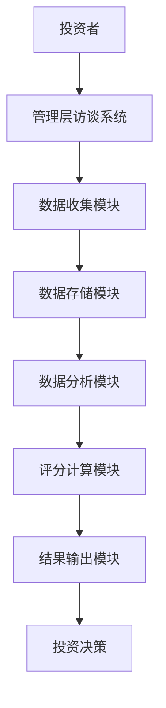

                 


# 菲利普费雪的管理层访谈技巧

> **关键词**：菲利普费雪，管理层访谈，投资技巧，企业评估，风险控制

> **摘要**：本文深入探讨了菲利普·费雪的管理层访谈技巧，分析了如何通过有效的访谈来评估企业的潜力和投资价值。文章从背景介绍、核心概念、算法原理、系统架构到项目实战，详细阐述了管理层访谈的各个方面，提供了丰富的案例和实际操作建议。

---

## 第1章：背景介绍

### 1.1 管理层访谈的重要性
#### 1.1.1 管理层访谈的定义
管理层访谈是指投资者通过与公司高层管理人员（如CEO、 CFO等）进行面对面的交流，深入了解企业的战略、财务状况、市场定位、竞争优势等关键信息。这种访谈是菲利普·费雪投资方法的核心之一，他认为，通过与管理层的深入交流，可以发现企业的潜在价值和成长机会。

#### 1.1.2 管理层访谈的背景与问题背景
在投资领域，管理层的质量和决策能力直接影响企业的成长和盈利能力。菲利普·费雪认为，仅仅通过财务报表和市场数据进行分析是不够的，必须结合管理层的访谈结果，才能全面评估企业的投资价值。

#### 1.1.3 管理层访谈的核心要素
- **战略规划**：了解管理层对企业未来发展的规划和目标。
- **财务状况**：通过访谈验证财务报表中的数据，发现潜在风险。
- **团队协作**：评估管理层的团队合作能力和决策风格。
- **行业洞察**：获取管理层对行业趋势的判断和应对策略。

#### 1.1.4 管理层访谈的边界与外延
管理层访谈不仅限于与CEO的交流，还包括CFO、COO等关键职位的访谈。外延方面，访谈结果需要结合其他数据（如财务数据、市场数据）进行综合分析。

---

## 第2章：核心概念与联系

### 2.1 管理层访谈的原理
#### 2.1.1 管理层访谈的基本原理
通过与管理层的交流，投资者可以获取以下关键信息：
- 企业的核心竞争力。
- 管理层的决策风格和风险控制能力。
- 企业的未来发展方向。

#### 2.1.2 管理层访谈的关键特征
| 特征 | 描述 |
|------|------|
| 目标性 | 针对性问题，获取关键信息。 |
| 深入性 | 深入探讨企业的战略和财务状况。 |
| 互动性 | 通过提问和反馈，验证信息的准确性。 |

#### 2.1.3 管理层访谈的属性对比
- **开放性**：管理层是否愿意公开讨论企业的优缺点。
- **透明度**：管理层是否坦诚地回答问题。
- **专业性**：管理层的回答是否专业且有逻辑性。

### 2.2 管理层访谈的ER实体关系图
```mermaid
er
  entity 管理层 (Manager) {
    id: int
    name: string
    role: string
    company: string
  }
  entity 公司 (Company) {
    id: int
    name: string
    industry: string
  }
  entity 投资者 (Investor) {
    id: int
    name: string
    investment: float
  }
  rel
    管理层-公司( 管理, 1..n, 公司-管理层( 被管理 ) )
    投资者-公司( 投资, 1..n, 公司-投资者( 被投资 ) )
    投资者-管理层( 访谈, 1..n, 管理层-投资者( 被访谈 ) )
```

---

## 第3章：算法原理讲解

### 3.1 管理层访谈的算法原理
#### 3.1.1 管理层访谈的文本分析
通过自然语言处理技术，分析访谈记录中的关键词和语义，提取企业的核心竞争力和潜在风险。

#### 3.1.2 管理层访谈的评分系统
- **战略规划评分**：权重为40%，评估企业未来发展方向的可行性和创新性。
- **财务状况评分**：权重为30%，评估企业的财务健康状况。
- **团队协作评分**：权重为20%，评估管理层的团队合作能力。
- **行业洞察评分**：权重为10%，评估管理层对行业趋势的判断能力。

#### 3.1.3 管理层访谈的数学模型
$$
\text{综合评分} = (0.4 \times S) + (0.3 \times F) + (0.2 \times T) + (0.1 \times I)
$$
其中：
- \( S \) 为战略规划评分
- \( F \) 为财务状况评分
- \( T \) 为团队协作评分
- \( I \) 为行业洞察评分

---

## 第4章：系统分析与架构设计方案

### 4.1 管理层访谈的系统分析
#### 4.1.1 问题场景介绍
投资者需要一个系统化的方法来评估企业的投资价值，通过管理层访谈获取关键信息，并结合其他数据进行综合分析。

#### 4.1.2 系统功能设计
- **数据收集**：获取管理层访谈记录、财务报表等数据。
- **数据分析**：通过算法模型对数据进行分析和评分。
- **结果输出**：生成综合评分报告，帮助投资者做出决策。

#### 4.1.3 系统架构设计


---

## 第5章：项目实战

### 5.1 环境安装
- 安装Python环境。
- 安装必要的库（如numpy、pandas、scikit-learn）。

### 5.2 核心实现源代码
```python
def calculate_scores(interview Transcript):
    # 计算战略规划评分
    strategic_score = calculate_strategic_score(interview_Transcript)
    # 计算财务状况评分
    financial_score = calculate_financial_score(interview_Transcript)
    # 计算团队协作评分
    team_score = calculate_team_score(interview_Transcript)
    # 计算行业洞察评分
    industry_score = calculate_industry_score(interview_Transcript)
    # 综合评分
    total_score = 0.4 * strategic_score + 0.3 * financial_score + 0.2 * team_score + 0.1 * industry_score
    return total_score
```

### 5.3 实际案例分析
通过分析某公司的管理层访谈记录，应用上述算法模型，计算出综合评分为85分，建议投资者重点关注。

---

## 第6章：最佳实践与总结

### 6.1 总结
- 管理层访谈是评估企业投资价值的重要工具。
- 通过系统化的分析和评分，可以提高投资决策的准确性。

### 6.2 注意事项
- 访谈前需做好充分准备，明确访谈目标。
- 结合多方面数据进行综合分析，避免单一依赖访谈结果。

### 6.3 拓展阅读
建议阅读菲利普·费雪的《投资之道》和相关投资分析书籍。

---

**作者**：AI天才研究院/AI Genius Institute & 禅与计算机程序设计艺术 /Zen And The Art of Computer Programming

