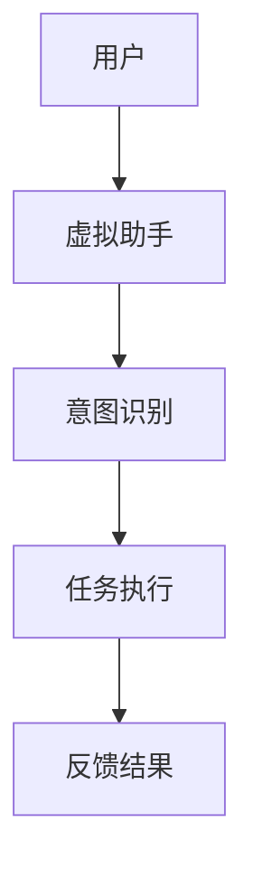
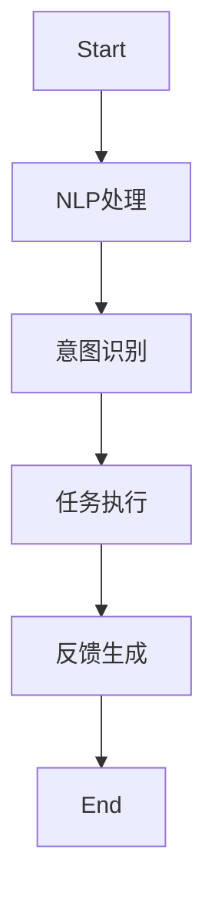
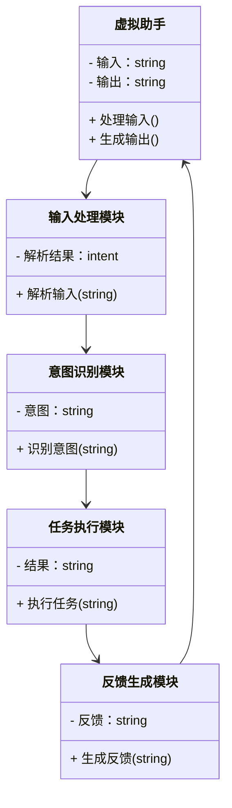
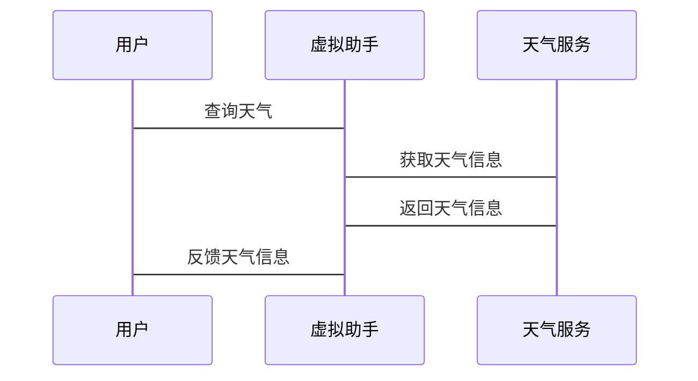

                 


# 虚拟助手AI Agent：从Siri到更智能的未来

## 关键词：虚拟助手、AI Agent、Siri、自然语言处理、机器学习、对话系统

## 摘要：
这篇文章探讨了虚拟助手AI Agent的发展历程，从Siri到现代智能助手的技术演变。文章详细分析了AI Agent的核心技术，包括自然语言处理、机器学习和对话系统，并通过系统架构设计、算法实现和项目实战等部分，深入解读其工作原理。最后，文章展望了AI Agent的未来发展趋势和挑战，为读者提供了全面的技术视角和实践指导。

---

## 第一部分：虚拟助手AI Agent的背景与概念

### 第1章：AI Agent的基本概念与背景

#### 1.1 虚拟助手的定义与历史发展

##### 1.1.1 虚拟助手的定义
虚拟助手（AI Agent）是一种基于人工智能技术的交互式应用程序，能够通过自然语言处理（NLP）理解用户意图，并通过执行预定义任务或调用其他服务来满足用户需求。例如，Siri、Alexa和Google Assistant等。

##### 1.1.2 从Siri到现代AI Agent的发展历程
虚拟助手的概念起源于2010年苹果公司推出的Siri，它最初是一个独立的应用程序。随着技术的进步，Siri被集成到iOS系统中，成为iPhone和iPad的内置功能。随后，亚马逊推出了Alexa，谷歌推出了Google Assistant，微软推出了Cortana，标志着虚拟助手进入了智能化和多样化发展的阶段。

##### 1.1.3 虚拟助手的分类与应用场景
虚拟助手可以根据功能、平台和用户群体进行分类：
- **按功能**：信息查询、任务执行、娱乐互动。
- **按平台**：移动端、智能家居、车载系统。
- **按用户群体**：个人用户、企业用户、开发者。

应用场景包括：
- 个人助手：日程管理、信息查询、天气预报。
- 智能家居：控制家电、灯光、安防系统。
- 企业级应用：会议安排、客户关系管理。

#### 1.2 AI Agent的核心技术基础

##### 1.2.1 自然语言处理（NLP）技术
自然语言处理是虚拟助手理解用户输入的关键技术，主要包括：
- **分词**：将输入文本分割成有意义的词语。
- **实体识别**：识别文本中的实体（如人名、地名、日期）。
- **意图识别**：确定用户的意图，如“查询天气”。
- **语义理解**：理解用户需求的深层含义。

##### 1.2.2 机器学习与深度学习
机器学习和深度学习为虚拟助手提供了学习和改进的能力：
- **训练数据**：使用大量的对话数据训练模型，使其能够理解用户的意图。
- **模型优化**：通过反馈机制不断优化模型，提高准确率和响应速度。

##### 1.2.3 对话系统与交互设计
对话系统负责生成自然流畅的回复，交互设计则关注用户体验，包括：
- **多轮对话**：支持连续的上下文交互。
- **情感分析**：识别用户情绪，提供更贴心的服务。
- **语音合成**：将文本转化为自然的语音输出。

#### 1.3 虚拟助手的市场现状与未来趋势

##### 1.3.1 当前市场的主要参与者
目前市场上的主要虚拟助手包括：
- **Siri**：苹果公司的智能助手，集成于iOS、macOS等系统。
- **Alexa**：亚马逊的智能音箱核心功能，支持智能家居控制。
- **Google Assistant**：谷歌的智能助手，深度集成于Google生态系统。
- **Microsoft Cortana**：微软的个人助手，支持跨平台使用。

##### 1.3.2 技术进步对虚拟助手的影响
- **模型优化**：基于Transformer的模型（如BERT、GPT）提升了理解和生成能力。
- **多模态交互**：支持语音、视觉等多种交互方式。
- **个性化服务**：通过用户数据提供更精准的服务。

##### 1.3.3 未来的智能化发展方向
未来的虚拟助手将更加智能化，具备以下特点：
- **自主学习**：能够通过自我学习不断优化性能。
- **跨平台协作**：支持不同平台和设备的无缝协作。
- **情感智能**：具备更强的情感理解和共情能力。

### 第2章：AI Agent的核心概念与技术原理

#### 2.1 AI Agent的核心概念

##### 2.1.1 问题背景与问题描述
虚拟助手需要解决的核心问题是如何通过自然语言处理和机器学习技术，准确理解用户意图并执行相应的操作。

##### 2.1.2 问题解决的思路与方法
- **输入处理**：解析用户的自然语言输入，提取关键信息。
- **任务执行**：调用相应服务或应用编程接口（API）完成任务。
- **反馈输出**：以自然语言形式反馈结果或确认用户意图。

##### 2.1.3 核心概念的边界与外延
- **边界**：虚拟助手的功能范围和适用场景。
- **外延**：与其他AI技术（如计算机视觉）的结合应用。

#### 2.2 核心概念的属性特征对比

##### 2.2.1 对比表格：AI Agent与传统程序的差异
| 特性                | 传统程序                 | AI Agent                |
|---------------------|--------------------------|--------------------------|
| 用户交互方式         | 命令行或图形界面           | 自然语言交互             |
| 学习能力             | 无                      | 可通过机器学习优化性能   |
| 意外情况处理         | 预定义规则               | 可适应部分未知情况       |

##### 2.2.2 通过Mermaid流程图展示概念间的实体关系


### 第3章：AI Agent的算法原理与数学模型

#### 3.1 算法原理

##### 3.1.1 使用Mermaid流程图展示算法步骤


##### 3.1.2 用Python代码实现核心算法
```python
import numpy as np

def nlp_process(text):
    # 简单的分词处理
    words = text.split()
    return words

def intent_recognition(words):
    # 简单的意图识别，假设每个词对应一个意图
    intent = words[0]
    return intent

def execute_task(intent):
    # 模拟任务执行
    if intent == '天气':
        return '查询天气'
    elif intent == '时间':
        return '显示时间'
    else:
        return '未知意图'

def feedback(result):
    # 模拟反馈生成
    return f"完成任务：{result}"

# 示例
user_input = "今天天气怎么样？"
result = nlp_process(user_input)
intent = intent_recognition(result)
task_result = execute_task(intent)
final_feedback = feedback(task_result)
print(final_feedback)
```

#### 3.2 数学模型与公式

##### 3.2.1 算法的数学模型
自然语言处理中的词嵌入（Word Embedding）可以通过以下方式表示：
$$ \text{词向量} = W_{\text{word}} \cdot x $$
其中，$W_{\text{word}}$是词嵌入矩阵，$x$是输入词的独热编码。

##### 3.2.2 详细公式推导与举例说明
以BERT模型为例，输入的文本经过分词和编码后，通过多层Transformer结构进行处理，最终生成词表示：
$$ \text{输出} = \text{BERT}(\text{输入}) $$

### 第4章：AI Agent的系统架构与设计

#### 4.1 系统架构设计

##### 4.1.1 系统功能模块划分
虚拟助手的系统架构通常包括以下模块：
- **输入处理模块**：接收用户输入并解析。
- **意图识别模块**：识别用户意图。
- **任务执行模块**：根据意图调用相应服务。
- **反馈生成模块**：生成并输出反馈信息。

##### 4.1.2 使用Mermaid类图展示领域模型


#### 4.2 系统接口设计与交互流程

##### 4.2.1 系统接口设计
虚拟助手需要与多种外部服务进行交互，例如：
- **天气服务API**：获取天气数据。
- **日历API**：管理日程安排。
- **音乐播放器API**：控制音乐播放。

##### 4.2.2 系统交互的Mermaid序列图


---

## 第二部分：AI Agent的算法实现与系统设计

### 第5章：AI Agent的项目实战

#### 5.1 环境安装与配置

##### 5.1.1 安装Python环境
安装Python 3.8或更高版本，推荐使用Anaconda或virtualenv进行虚拟环境管理。

##### 5.1.2 安装依赖库
安装必要的Python库，如numpy、pandas、transformers（用于NLP处理）。

##### 5.1.3 配置API密钥
配置天气API、图灵机器人API等第三方服务的API密钥。

#### 5.2 系统核心功能实现

##### 5.2.1 自然语言处理模块
使用预训练的中文模型（如BERT）进行分词和意图识别。

##### 5.2.2 任务执行模块
根据识别的意图调用相应API，例如查询天气、设置提醒等。

##### 5.2.3 反馈生成模块
将任务执行结果转化为自然语言反馈给用户。

#### 5.3 代码实现与解读

##### 5.3.1 简单实现示例
```python
import requests

def get_weather(city):
    # 天气API的请求URL
    url = f"http://api.weatherapi.com/v1/current.json?city={city}"
    response = requests.get(url)
    return response.json()

def main():
    city = input("请输入城市名：")
    weather = get_weather(city)
    print(f"当前{city}的温度是{weather['temp']}摄氏度。")

if __name__ == "__main__":
    main()
```

##### 5.3.2 代码分析与优化
- **代码结构**：模块化设计，便于扩展和维护。
- **异常处理**：添加错误处理，如网络错误、API返回错误。
- **性能优化**：缓存频繁访问的数据，减少API调用次数。

#### 5.4 案例分析与详细讲解

##### 5.4.1 实际案例分析
以查询天气为例，展示从用户输入到反馈输出的完整流程。

##### 5.4.2 代码实现细节
- 输入处理：支持中文输入，自动解析城市名。
- API调用：使用天气API获取实时天气数据。
- 反馈生成：根据天气数据生成自然语言反馈。

#### 5.5 项目小结
通过项目实战，我们了解了虚拟助手的核心实现过程，包括自然语言处理、API调用和反馈生成。这些步骤展示了AI Agent从理解用户需求到执行任务并反馈结果的完整流程。

### 第6章：AI Agent的未来趋势与挑战

#### 6.1 未来发展趋势

##### 6.1.1 技术进步推动智能化
- **模型优化**：更强大的模型（如GPT-3、GPT-4）将提升对话质量。
- **多模态交互**：结合视觉、触觉等多感官输入，提供更丰富的交互体验。
- **个性化服务**：基于用户行为和偏好，提供更个性化的服务。

##### 6.1.2 智能家居与物联网的深度融合
虚拟助手将成为智能家居的核心控制中枢，实现设备间的协同工作。

#### 6.2 当前面临的技术挑战

##### 6.2.1 意图识别的准确性
- **模糊表达**：用户可能使用模糊或不完整的语言，导致意图识别困难。
- **上下文理解**：复杂对话中的上下文理解仍需改进。

##### 6.2.2 数据隐私与安全
- **数据收集**：虚拟助手需要收集大量用户数据，引发隐私问题。
- **数据泄露**：如何保护用户数据不被滥用是关键挑战。

#### 6.3 伦理与法律问题

##### 6.3.1 数据使用的伦理问题
- **透明度**：用户需要了解数据的使用方式和范围。
- **数据共享**：如何在数据共享和隐私保护之间找到平衡。

##### 6.3.2 法律法规的适应
- **数据保护法**：如GDPR等法规对数据处理有严格要求。
- **责任归属**：虚拟助手在错误决策中的责任归属问题。

### 第7章：最佳实践与小结

#### 7.1 最佳实践

##### 7.1.1 开发建议
- **模块化设计**：确保代码易于维护和扩展。
- **错误处理**：全面考虑各种异常情况，提供友好的反馈机制。
- **性能优化**：优化API调用和数据处理效率，提升用户体验。

##### 7.1.2 用户体验优化
- **简洁明了**：设计直观的交互界面，降低用户使用门槛。
- **情感化设计**：通过语气和用词提升用户的情感体验。
- **多语言支持**：扩展支持多种语言，扩大用户群体。

#### 7.2 小结与展望
虚拟助手AI Agent作为人工智能技术的重要应用，正在改变我们的生活方式和工作方式。随着技术的不断进步，未来的虚拟助手将更加智能、便捷，并在更多领域发挥重要作用。

---

## 作者：AI天才研究院 & 禅与计算机程序设计艺术

