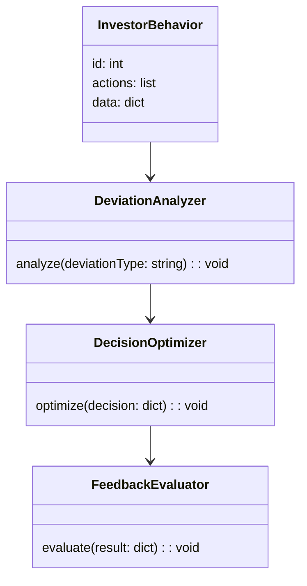
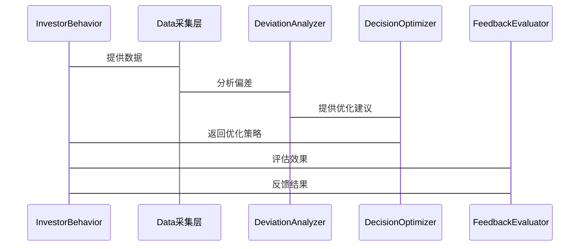

                 


# 行为金融学：理解并克服投资中的心理偏差

## 关键词：行为金融学, 心理偏差, 投资决策, 理性与非理性, 前景理论, 心理账户, 决策优化

## 摘要：行为金融学通过分析投资者的心理偏差，揭示理性决策的局限性，并提供克服这些偏差的方法。本文深入探讨了确认偏差、损失厌恶等常见心理偏差，结合前景理论和心理账户等模型，分析其对投资决策的影响，并提供实际策略来优化决策过程。

---

## 第一部分：行为金融学的背景与基础

### 第1章：行为金融学概述

#### 1.1 行为金融学的定义与核心概念

- 1.1.1 传统金融学的局限性
  - 假设投资者是理性的，市场是有效的。
  - 无法解释实际市场中的异常现象，如市场泡沫和恐慌。

- 1.1.2 行为金融学的定义与研究范围
  - 研究投资者心理、情感和行为如何影响决策和市场。
  - 包括认知偏差、情绪和社交因素。

- 1.1.3 行为金融学与心理学的交叉
  - 基于心理学理论，如认知心理学和行为心理学。
  - 应用实验和数据分析方法。

#### 1.2 投资中的心理偏差

- 1.2.1 心理偏差的分类与表现
  - 认知偏差：确认偏差、过度自信。
  - 情感偏差：损失厌恶、从众心理。
  - 行为偏差：惯性效应、社会认同效应。

- 1.2.2 常见心理偏差对投资决策的影响
  - 确认偏差导致投资者忽视不利信息。
  - 损失厌恶导致投资者过度规避风险。
  - 过度自信导致投资者高估自己的判断能力。

- 1.2.3 心理偏差的边界与外延
  - 心理偏差在不同文化、市场中的表现差异。
  - 结合市场环境和个人特质的影响。

#### 1.3 行为金融学的研究方法

- 1.3.1 实验法与案例分析法
  - 通过实验室实验观察投资者行为。
  - 通过实际案例分析偏差的现实表现。

- 1.3.2 数据分析与统计建模
  - 使用大数据分析投资者行为模式。
  - 应用统计模型验证偏差的影响。

- 1.3.3 行为金融学模型的构建
  - 结合心理学理论和金融市场数据。
  - 构建行为模型解释投资者行为。

---

## 第二部分：心理偏差的分析与克服

### 第2章：常见心理偏差及其影响

#### 2.1 确认偏差

- 2.1.1 确认偏差的表现形式
  - 选择性信息处理，倾向于寻找支持已有观点的信息。
  - 忽略或贬低与现有观点不符的信息。

- 2.1.2 确认偏差对投资决策的影响
  - 导致投资组合过于集中，增加风险。
  - 阻碍及时调整投资策略，错失良机。

- 2.1.3 克服确认偏差的方法
  - 主动寻求反向信息，平衡观点。
  - 使用决策框架，确保全面分析。

#### 2.2 损失厌恶

- 2.2.1 损失厌恶的定义与特征
  - 投资者对损失的敏感度远高于收益。
  - 损失厌恶导致风险厌恶，影响投资决策。

- 2.2.2 损失厌恶对投资行为的影响
  - 投资者倾向于规避高风险投资，错失高回报机会。
  - 导致市场波动，特别是在恐慌时抛售资产。

- 2.2.3 如何应对损失厌恶
  - 采用风险平价策略，分散投资。
  - 设定止损点，控制风险敞口。

#### 2.3 过度自信

- 2.3.1 过度自信的表现与原因
  - 过度自信导致高估自己的判断能力。
  - 常见于成功经验的投资者，导致自我强化。

- 2.3.2 过度自信对投资决策的影响
  - 导致过度交易，增加交易成本。
  - 难以接受错误，坚持错误决策。

- 2.3.3 克服过度自信的策略
  - 定期回顾和反思投资决策。
  - 建立决策日志，记录决策依据和结果。

---

## 第三部分：行为金融学的理论模型

### 第3章： prospect theory

#### 3.1  prospect theory 的基本原理

- 3.1.1 前景理论的提出背景
  - 传统预期效用理论无法解释实际投资行为。
  - 提供一个更符合现实的决策模型。

- 3.1.2 前景理论的核心假设
  - 分支函数：损失和收益的非线性价值函数。
  - 概率加权：投资者对小概率事件的过度反应。

- 3.1.3 前景理论的数学模型
  $$ V(P) = \sum_{i=1}^{n} w_i u(x_i) $$
  其中，\( w_i \) 是概率权重，\( u(x_i) \) 是效用函数。

#### 3.2  mental accounting 理论

- 3.2.1 心理账户的定义与特征
  - 投资者将资金分成不同的心理账户，影响决策。
  - 账户间的资金转移受心理因素影响。

- 3.2.2 心理账户对投资行为的影响
  - 不同账户的资金分配影响整体投资策略。
  - 心理账户的错觉导致决策偏差。

- 3.2.3 如何优化心理账户管理
  - 设定明确的投资目标和预算。
  - 定期审查和调整心理账户结构。

---

## 第四部分：行为金融学在投资中的应用

### 第4章：投资者行为分析与决策优化

#### 4.1 投资者认知偏差的识别与调整

- 4.1.1 认知偏差的识别方法
  - 通过自我反思和他人反馈。
  - 使用行为测试和数据分析工具。

- 4.1.2 认知调整的策略与技巧
  - 培养批判性思维，避免自我确认。
  - 使用决策框架，确保全面分析。

- 4.1.3 认知偏差对投资组合的影响
  - 导致资产配置不合理，增加风险。
  - 影响风险管理和收益预期。

#### 4.2 投资决策框架的优化

- 4.2.1 优化决策框架的原则
  - 基于事实和数据，而非直觉和情绪。
  - 设定明确的目标和风险管理策略。

- 4.2.2 常见决策框架的优缺点
  - 基于价值投资：优点是长期稳定，缺点是短期波动大。
  - 技术分析：优点是捕捉短期趋势，缺点是容易受市场情绪影响。

- 4.2.3 如何构建科学的决策框架
  - 结合基本面分析和市场情绪分析。
  - 使用行为金融学模型辅助决策。

---

## 第五部分：系统分析与架构设计

### 第5章：行为金融学系统架构

#### 5.1 问题场景介绍

- 投资者行为分析系统的设计目标。
- 系统需要解决的主要问题：心理偏差影响决策。

#### 5.2 系统功能设计

- 系统功能模块：
  - 数据采集：收集投资者行为数据。
  - 分析模块：识别和分类心理偏差。
  - 优化模块：提供决策优化建议。
  - 反馈模块：评估优化效果。

- 领域模型（Mermaid 类图）：


#### 5.3 系统架构设计

- 系统架构（Mermaid 架构图）：
```mermaid
architectural
    Data采集层 --> 分析层 --> 优化层 --> 反馈层
```

#### 5.4 系统接口设计

- 接口定义：
  - 数据采集接口：接收投资者行为数据。
  - 分析接口：返回偏差类型和程度。
  - 优化接口：提供优化策略和建议。
  - 反馈接口：评估优化效果并反馈。

#### 5.5 系统交互设计

- 交互流程（Mermaid 序列图）：


---

## 第六部分：项目实战

### 第6章：投资者行为分析系统实现

#### 6.1 环境安装

- 系统环境：
  - Python 3.8+
  - 数据库：MySQL 或 PostgreSQL
  - 开发工具：PyCharm 或 VS Code

#### 6.2 核心代码实现

- 数据采集模块：
```python
import sqlite3

def collect_data():
    conn = sqlite3.connect('investor.db')
    cursor = conn.cursor()
    cursor.execute('CREATE TABLE IF NOT EXISTS behavior (id INTEGER PRIMARY KEY, action TEXT, timestamp TEXT)')
    # 示例数据插入
    cursor.execute('INSERT INTO behavior VALUES(1, "buy", "2023-10-01")')
    conn.commit()
    conn.close()
```

- 分析模块：
```python
from sklearn import cluster

def analyze_behavior(data):
    model = cluster.KMeans(n_clusters=3)
    model.fit(data)
    return model.labels_
```

- 优化模块：
```python
def optimize_decision(decision, risk_level):
    if risk_level == 'high':
        return 'Diversify portfolio'
    else:
        return 'Concentrate investments'
```

#### 6.3 案例分析

- 案例背景：
  - 投资者 A：过度自信，频繁交易。
  - 投资者 B：损失厌恶，规避风险。

- 案例分析：
  - 分析模块识别出投资者 A 的确认偏差和过度自信。
  - 优化模块建议投资者 A 采用分散投资策略，设定止损点。

#### 6.4 项目小结

- 项目成果：
  - 成功构建投资者行为分析系统。
  - 提供有效的决策优化策略。

- 项目总结：
  - 行为金融学理论在实际中的应用价值。
  - 系统设计的关键点和实现难点。

---

## 第七部分：总结与展望

### 第7章：总结与展望

#### 7.1 总结

- 行为金融学的核心：理解投资者心理偏差。
- 克服偏差的关键：认知调整和决策优化。

#### 7.2 未来展望

- 结合人工智能和大数据技术，进一步优化行为分析系统。
- 开发个性化投资决策辅助工具，帮助投资者克服心理偏差。

---

## 作者：AI天才研究院/AI Genius Institute & 禅与计算机程序设计艺术 /Zen And The Art of Computer Programming

---

通过以上结构，文章系统地介绍了行为金融学的核心概念、常见心理偏差、理论模型，以及实际应用中的策略和系统设计。结合案例分析和项目实战，帮助读者深入理解并掌握克服投资心理偏差的方法。

