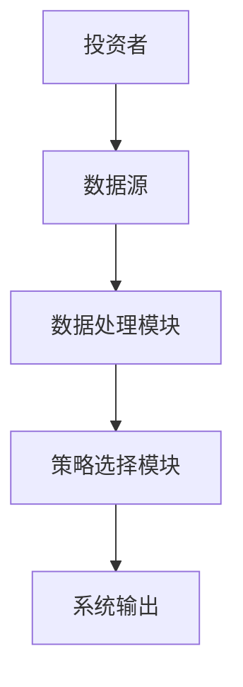

                 


# 被动指数投资 vs 主动管理：哪种更适合当前市场环境

> 关键词：被动指数投资, 主动管理, 市场环境, 投资策略, 被动与主动对比

> 摘要：本文通过分析被动指数投资和主动管理的核心概念、数学模型及当前市场环境的影响，探讨在当前市场环境下哪种投资策略更优。

---

# 第1章: 被动指数投资与主动管理概述

## 1.1 被动指数投资的定义与特点

### 1.1.1 被动投资的核心概念
被动投资是一种投资策略，其核心是通过跟踪特定市场指数（如标普500指数）来实现投资收益。被动投资者相信市场是有效的，因此无法通过主动选股或时机选择获得超额收益。

### 1.1.2 指数基金的定义与特点
指数基金是一种跟踪特定市场指数的基金，其特点包括：
- **分散投资**：包含多个资产，降低单一资产的风险。
- **低费用**：由于被动管理，费用较低。
- **简单易懂**：投资者无需分析个股，只需选择指数即可。

### 1.1.3 被动投资的优势与局限性
- **优势**：
  - 费用低，长期复利效应显著。
  - 风险分散，波动性较低。
  - 操作简单，适合长期投资。
- **局限性**：
  - 无法获得超额收益。
  - 在市场大幅波动时，可能面临较大回撤。

### 1.2 主动管理的定义与特点

### 1.2.1 主动管理的核心概念
主动管理是一种投资策略，通过分析市场趋势、个股基本面和宏观经济环境，主动选股和调整投资组合以实现超额收益。

### 1.2.2 主动管理的策略与方法
- **基本面分析**：通过分析公司财务报表、行业地位等因素选择个股。
- **技术分析**：通过分析价格走势和成交量预测市场走势。
- **行业轮动**：根据经济周期变化，投资于表现较好的行业。

### 1.2.3 主动管理的优势与局限性
- **优势**：
  - 可能获得超额收益。
  - 灵活性高，可根据市场变化调整策略。
- **局限性**：
  - 费用高，通常包括管理费和交易费用。
  - 需要高超的选股能力和市场判断力。
  - 市场有效性降低主动管理优势的可能性。

### 1.3 被动投资与主动管理的对比

| 对比维度       | 被动投资                 | 主动管理                 |
|----------------|--------------------------|--------------------------|
| **收益**       | 依赖市场平均收益         | 追求超额收益             |
| **风险**       | 风险分散，波动性较低     | 风险较高，波动性较大     |
| **费用**       | 低费用                   | 高费用                   |
| **流动性**     | 高流动性                 | 取决于具体策略           |
| **交易频率**   | 低，仅定期再平衡          | 高，根据市场变化调整      |
| **适用场景**   | 市场有效，难以获得超额收益| 市场无效，存在套利机会    |

---

# 第2章: 被动指数投资与主动管理的核心概念

## 2.1 被动指数投资的数学模型

### 2.1.1 指数基金的收益计算
假设投资于一个指数基金，其收益等于所跟踪指数的收益。指数收益的计算公式为：
$$ R_{index} = \sum_{i=1}^{n} w_i R_i $$
其中，$w_i$ 是第$i$只股票的权重，$R_i$ 是第$i$只股票的收益率。

### 2.1.2 指数基金的风险模型
指数基金的风险可以用其贝塔值（Beta）来衡量，公式为：
$$ \beta = \frac{\text{协方差}(R_{index}, R_{market})}{\text{方差}(R_{market})} $$
其中，$R_{market}$ 是市场指数的收益率。

### 2.1.3 指数基金的费用结构
指数基金的费用包括管理费、托管费等。假设管理费为年费率 $c$，则总费用为：
$$ \text{总费用} = c \times A $$
其中，$A$ 是基金资产规模。

## 2.2 主动管理的数学模型

### 2.2.1 主动管理的收益模型
主动管理的收益可以通过夏普比率（Sharpe Ratio）来衡量，公式为：
$$ \text{夏普比率} = \frac{E[R_p - R_f]}{\sigma_p} $$
其中，$E[R_p - R_f]$ 是主动投资组合的预期超额收益，$\sigma_p$ 是其收益的标准差。

### 2.2.2 主动管理的风险模型
主动管理的风险可以通过投资组合的波动性来衡量，公式为：
$$ \sigma_p = \sqrt{\sum_{i=1}^{n} \sum_{j=1}^{n} w_i w_j \text{协方差}(R_i, R_j)} $$

### 2.2.3 主动管理的费用结构
主动管理的费用通常包括管理费、交易费用等。假设管理费为年费率 $m$，则总费用为：
$$ \text{总费用} = m \times A + t \times \text{交易量} $$

## 2.3 对比分析

### 2.3.1 收益与风险对比
被动投资的收益稳定，风险较低；主动管理的收益波动较大，风险较高。

### 2.3.2 费用对比
被动投资费用低，适合长期投资；主动管理费用高，可能侵蚀收益。

### 2.3.3 流动性对比
被动投资流动性高，易于买卖；主动管理流动性取决于策略。

---

# 第3章: 当前市场环境分析

## 3.1 宏观经济环境

### 3.1.1 经济周期对投资策略的影响
当前经济处于复苏阶段，被动投资可能更适合，因为市场有效，难以获得超额收益。

### 3.1.2 利率环境对投资策略的影响
低利率环境可能使被动投资的收益下降，而主动管理可能通过选股获得较好收益。

### 3.1.3 通货膨胀对投资策略的影响
通货膨胀可能导致被动投资的实际收益下降，而主动管理可能通过调整投资组合应对通胀。

## 3.2 市场波动性分析

### 3.2.1 市场波动对被动投资的影响
市场波动大时，被动投资的回撤可能较大，但长期来看波动会被分散。

### 3.2.2 市场波动对主动管理的影响
市场波动大时，主动管理有机会通过高频率交易获利，但也面临更大的风险。

## 3.3 机构投资者行为分析

### 3.3.1 机构投资者对市场的影响
机构投资者的行为可能加剧市场波动，被动投资在这种环境下可能表现不佳。

### 3.3.2 机构投资者对被动投资的影响
大量机构投资被动指数可能导致指数成分股流动性下降，影响跟踪误差。

### 3.3.3 机构投资者对主动管理的影响
机构投资者可能通过内部研究获得信息优势，提升主动管理的收益。

## 3.4 技术发展对投资策略的影响

### 3.4.1 技术进步对被动投资的影响
大数据和算法交易可能优化被动投资的跟踪误差，降低交易成本。

### 3.4.2 技术进步对主动管理的影响
技术进步为主动管理提供了更多的数据支持和分析工具，但同时也可能降低超额收益的可能性。

### 3.4.3 技术进步对投资策略选择的影响
技术进步使得投资者可以更快速地调整策略，被动投资和主动管理的界限可能变得模糊。

---

# 第4章: 被动指数投资与主动管理的数学模型与算法

## 4.1 被动指数投资的数学模型

### 4.1.1 指数基金的收益计算
使用Python计算指数基金的收益：

```python
import pandas as pd

# 假设data是一个包含指数成分股收益的DataFrame
index_weights = data['weights']
index_returns = data['returns']

index_portfolio_return = (index_weights * index_returns).sum()
```

### 4.1.2 指数基金的风险模型
计算指数基金的贝塔值：

```python
import numpy as np

market_returns = data['market_returns']
index_returns = data['index_returns']

covariance = np.cov(index_returns, market_returns, rowvar=False)[0, 1]
market_variance = np.var(market_returns)

beta = covariance / market_variance
```

## 4.2 主动管理的数学模型

### 4.2.1 主动管理的收益模型
计算夏普比率：

```python
expected_excess_return = 0.05  # 预期超额收益
portfolio_std_deviation = 0.1  # 投资组合标准差
risk_free_rate = 0.02  # 无风险利率

sharpe_ratio = (expected_excess_return - risk_free_rate) / portfolio_std_deviation
```

### 4.2.2 主动管理的风险模型
计算投资组合的标准差：

```python
# 假设weights是一个包含资产权重的列表，cov_matrix是资产之间的协方差矩阵
portfolio_variance = np.dot(np.dot(weights, cov_matrix), weights.T)
portfolio_std_deviation = np.sqrt(portfolio_variance)
```

---

# 第5章: 系统分析与架构设计方案

## 5.1 问题场景介绍

### 5.1.1 投资者需求
投资者希望通过分析当前市场环境选择最佳投资策略。

### 5.1.2 系统功能设计
- 数据采集与处理
- 投资策略选择模型
- 系统输出与建议

### 5.1.3 系统架构设计



---

# 第6章: 项目实战

## 6.1 环境安装

### 6.1.1 安装Python和必要的库
```bash
pip install pandas numpy matplotlib
```

## 6.2 系统核心实现源代码

### 6.2.1 数据处理模块

```python
import pandas as pd
import numpy as np

# 示例数据：指数成分股的权重和收益
data = {
    'weights': [0.2, 0.3, 0.1, 0.4],
    'returns': [0.05, 0.03, 0.08, 0.02],
    'market_returns': [0.04, 0.06, 0.03, 0.05]
}

df = pd.DataFrame(data)

# 计算指数基金的收益
index_portfolio_return = np.dot(df['weights'], df['returns'])
print(f"指数基金的收益为：{index_portfolio_return:.2f}")

# 计算贝塔值
covariance = np.cov(df['returns'], df['market_returns'])[0, 1]
market_variance = np.var(df['market_returns'])
beta = covariance / market_variance
print(f"贝塔值为：{beta:.2f}")
```

### 6.2.2 策略选择模块

```python
def choose_strategy(market_efficiency, management_fee, expected_return):
    if market_efficiency > 0.8 and management_fee < 0.02:
        return "主动管理"
    else:
        return "被动指数投资"

# 示例输入
market_efficiency = 0.75
management_fee = 0.015
expected_return = 0.08

result = choose_strategy(market_efficiency, management_fee, expected_return)
print(f"推荐策略：{result}")
```

## 6.3 实际案例分析

### 6.3.1 案例分析
假设当前市场效率较高，管理费较低，被动投资可能更优。

### 6.3.2 结果解读
根据案例分析，被动投资的收益可能接近市场平均收益，而主动管理难以获得超额收益。

---

# 第7章: 最佳实践与小结

## 7.1 最佳实践 tips
- **费用控制**：选择费用低的被动指数基金。
- **市场环境判断**：在市场效率高时选择被动投资，市场效率低时选择主动管理。
- **长期投资**：被动投资适合长期持有，主动管理适合短期操作。

## 7.2 小结
在当前市场环境下，被动指数投资由于其低费用、风险分散和操作简单等优势，更适合大多数投资者。然而，主动管理在特定情况下仍能提供超额收益，投资者应根据自身情况选择合适的策略。

## 7.3 注意事项
- **风险控制**：无论选择何种策略，都需要关注市场波动和经济环境。
- **分散投资**：避免将所有资金投入单一策略。
- **定期再平衡**：根据市场变化调整投资组合。

## 7.4 拓展阅读
- 《The Intelligent Investor》
- 《The Theory of Investment Value》
- 《The New Finance: The Case for S.T.A.R. Investing》

---

作者：AI天才研究院/AI Genius Institute & 禅与计算机程序设计艺术 /Zen And The Art of Computer Programming

---

感谢您的阅读！希望这篇文章能为您提供清晰的思路和实用的指导。

