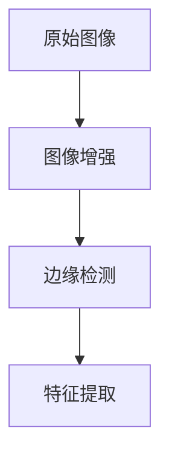
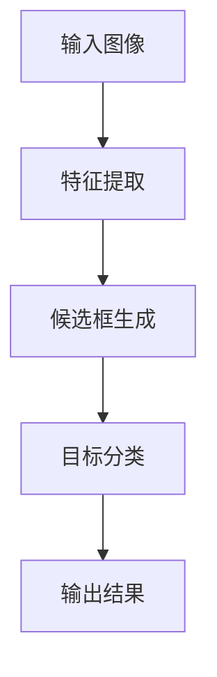
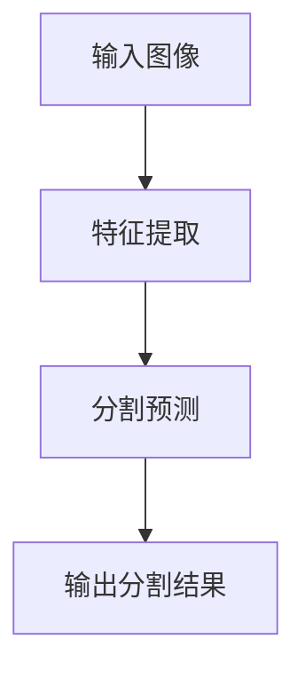
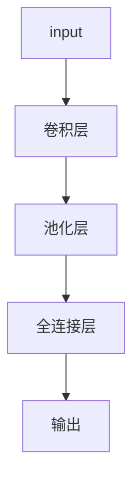
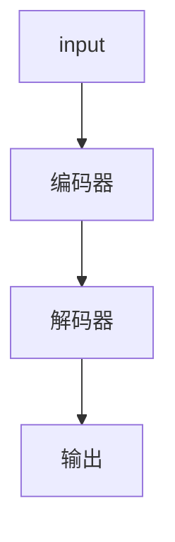
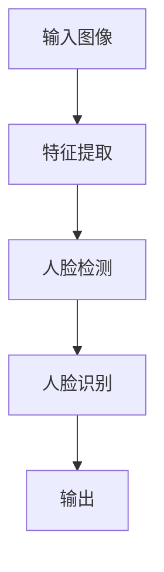
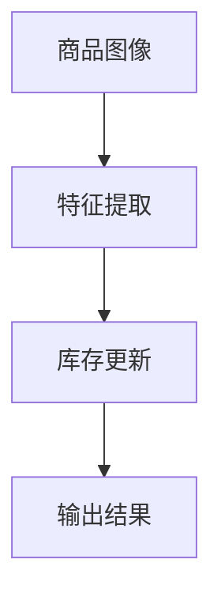
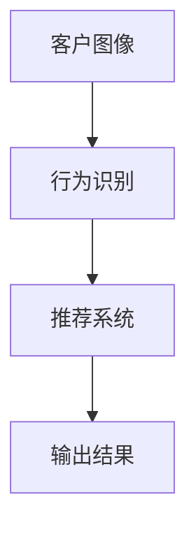
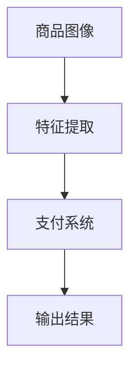

                 

# 计算机视觉技术在零售业的应用与投资机会

> 关键词：计算机视觉，零售业，投资机会，人工智能，数字化转型

> 摘要：本文详细探讨了计算机视觉技术在零售业中的应用及其带来的投资机会。通过分析技术原理、应用场景和商业模式，为技术开发者、投资者和零售业从业者提供深度洞察。

---

## 第1章: 背景介绍

### 1.1 计算机视觉技术的定义与核心概念

#### 1.1.1 问题背景与问题描述
在数字化转型的浪潮中，零售业正面临前所未有的挑战与机遇。传统零售模式依赖人工操作，效率低下且成本高昂。如何通过技术手段提升运营效率、优化客户体验，成为行业痛点。

计算机视觉技术作为一种人工智能的核心技术，能够通过图像处理和模式识别，实现对商品、顾客及场景的智能分析，为零售业带来革命性变革。

#### 1.1.2 计算机视觉技术的核心概念与边界
计算机视觉（Computer Vision）是利用计算机模拟人类视觉系统的学科，旨在通过算法处理图像或视频数据，提取有用信息。其核心概念包括：

1. **图像处理**：对图像进行增强、滤波等操作。
2. **特征提取**：识别图像中的关键特征，如边缘、纹理等。
3. **目标检测与识别**：定位图像中的目标物体并进行分类。
4. **图像分割**：将图像分割为不同区域，识别每个区域的含义。

计算机视觉在零售业中的应用边界主要集中在商品识别、客户行为分析和无人零售等领域。

#### 1.1.3 计算机视觉技术在零售业中的应用价值
计算机视觉技术能够解决以下问题：
- **商品识别**：快速识别商品信息，提升库存管理效率。
- **客户行为分析**：通过分析客户行为，优化营销策略。
- **智能支付**：实现无接触式支付，提升购物体验。

### 1.2 零售业的数字化转型与技术需求

#### 1.2.1 零售业的现状与痛点
传统零售业面临以下痛点：
- **人工成本高昂**：大量依赖人工进行商品陈列、库存管理和客户服务。
- **客户体验不足**：难以提供个性化服务，客户满意度低。
- **运营效率低下**：缺乏数据支持，决策滞后。

#### 1.2.2 数字化转型的核心驱动力
数字化转型的核心驱动力包括：
- **技术进步**：人工智能、大数据等技术的发展为零售业提供了新的工具。
- **客户需求变化**：消费者对个性化、便捷化服务的需求日益增长。
- **市场竞争加剧**：企业需要通过技术创新来获取竞争优势。

#### 1.2.3 计算机视觉技术在零售业中的应用场景
计算机视觉技术在零售业中的应用场景包括：
- **商品识别**：通过图像识别技术快速识别商品信息。
- **客户行为分析**：分析客户的行为模式，优化营销策略。
- **无人零售**：实现无接触式购物体验。

### 1.3 本章小结
本章介绍了计算机视觉技术的核心概念和零售业的数字化转型需求，为后续章节的分析奠定了基础。

---

## 第2章: 计算机视觉技术的核心原理

### 2.1 计算机视觉技术的基本原理

#### 2.1.1 图像处理与特征提取
图像处理是计算机视觉的基础，包括以下步骤：
1. **图像增强**：通过调整亮度、对比度等改善图像质量。
2. **边缘检测**：识别图像中的边缘特征。
3. **特征提取**：提取图像中的关键特征，如SIFT（尺度不变特征变换）。

#### 2.1.2 目标检测与识别
目标检测是计算机视觉的核心任务之一，常用算法包括：
1. **YOLO**：实时目标检测算法，速度快且精度高。
2. **Faster R-CNN**：基于区域建议的目标检测算法。

目标检测的流程如下：

#### 2.1.3 图像分割与语义理解
图像分割是将图像分割为不同区域的过程，常用算法包括：
1. **U-Net**：广泛应用于医学图像分割。
2. **Mask R-CNN**：结合目标检测与实例分割的算法。

图像分割流程如下：

### 2.2 计算机视觉技术的关键算法

#### 2.2.1 基于CNN的目标检测算法
卷积神经网络（CNN）是目标检测的核心算法，其网络结构如下：

CNN的数学模型如下：

$$
f(x) = \sigma(w \cdot x + b)
$$

其中，$\sigma$ 是激活函数，$w$ 是权重，$b$ 是偏置。

#### 2.2.2 图像分割算法（如U-Net）
U-Net的网络结构如下：

U-Net的损失函数为交叉熵损失：

$$
L = -\frac{1}{N}\sum_{i=1}^{N} y_i \log p_i + (1-y_i)\log (1-p_i)
$$

其中，$y_i$ 是真实标签，$p_i$ 是预测概率。

#### 2.2.3 人脸识别与姿态估计
人脸识别的流程如下：

姿态估计通过回归算法实现：

$$
y = w x + b
$$

### 2.3 本章小结
本章详细介绍了计算机视觉技术的核心原理，包括图像处理、目标检测和图像分割等关键技术。

---

## 第3章: 计算机视觉技术在零售业中的应用场景

### 3.1 商品识别与库存管理

#### 3.1.1 商品识别的实现原理
商品识别通过图像匹配实现：

$$
\text{相似度} = \sum_{i=1}^{n} (x_i - x'_i)^2
$$

#### 3.1.2 基于计算机视觉的库存管理解决方案
库存管理流程如下：

#### 3.1.3 实际案例分析
某零售企业通过计算机视觉技术实现了库存管理的自动化，显著降低了人工成本。

### 3.2 客户行为分析与个性化推荐

#### 3.2.1 基于计算机视觉的客户行为分析
客户行为分析流程如下：

#### 3.2.2 个性化推荐系统的实现
推荐系统的实现步骤如下：

1. **数据采集**：采集客户行为数据。
2. **特征提取**：提取客户特征。
3. **模型训练**：训练推荐模型。
4. **结果输出**：输出推荐结果。

#### 3.2.3 案例分析：某零售企业的客户行为分析实践
某零售企业通过计算机视觉技术实现了客户行为分析，显著提升了客户满意度。

### 3.3 无人零售与智能支付

#### 3.3.1 无人零售店的核心技术
无人零售店的核心技术包括：
- **图像识别**：识别商品信息。
- **支付系统**：实现无接触式支付。

#### 3.3.2 基于计算机视觉的智能支付系统
智能支付系统的实现流程如下：

#### 3.3.3 技术实现与实际应用
某无人零售店通过计算机视觉技术实现了智能支付，显著提升了购物体验。

### 3.4 本章小结
本章分析了计算机视觉技术在零售业中的主要应用场景，包括商品识别、客户行为分析和无人零售等。

---

## 第4章: 投资机会分析与商业模式

### 4.1 计算机视觉技术在零售业中的投资价值

#### 4.1.1 技术成熟度与市场潜力
计算机视觉技术在零售业中的市场潜力巨大，预计未来几年市场将快速增长。

#### 4.1.2 投资者的关注点与风险评估
投资者应关注技术成熟度、市场需求和竞争格局。

#### 4.1.3 技术驱动的商业模式创新
技术驱动的商业模式包括：
- **SaaS模式**：提供计算机视觉技术的订阅服务。
- **数据变现模式**：通过数据分析实现商业变现。

### 4.2 投资机会的分析框架

#### 4.2.1 技术驱动型投资机会
技术驱动型投资机会包括：
- **算法优化**：优化目标检测算法。
- **硬件创新**：开发新型计算机视觉硬件。

#### 4.2.2 市场需求驱动型投资机会
市场需求驱动型投资机会包括：
- **垂直行业应用**：专注于特定行业的解决方案。
- **客户定制化服务**：提供定制化的计算机视觉服务。

#### 4.2.3 产业链整合型投资机会
产业链整合型投资机会包括：
- **技术平台建设**：构建计算机视觉技术平台。
- **生态合作**：与产业链上下游企业合作。

### 4.3 成功案例与失败教训

#### 4.3.1 成功案例
某计算机视觉技术公司通过技术创新实现了快速成长。

#### 4.3.2 失败教训
某些公司由于技术不成熟或市场需求不清晰而失败。

### 4.4 本章小结
本章分析了计算机视觉技术在零售业中的投资机会和商业模式，为投资者提供了参考。

---

## 作者：AI天才研究院/AI Genius Institute & 禅与计算机程序设计艺术 /Zen And The Art of Computer Programming

---

本文通过详细分析计算机视觉技术在零售业中的应用场景和投资机会，为技术开发者、投资者和零售业从业者提供了深度洞察。希望本文能够为行业的发展提供有价值的参考和启发。

