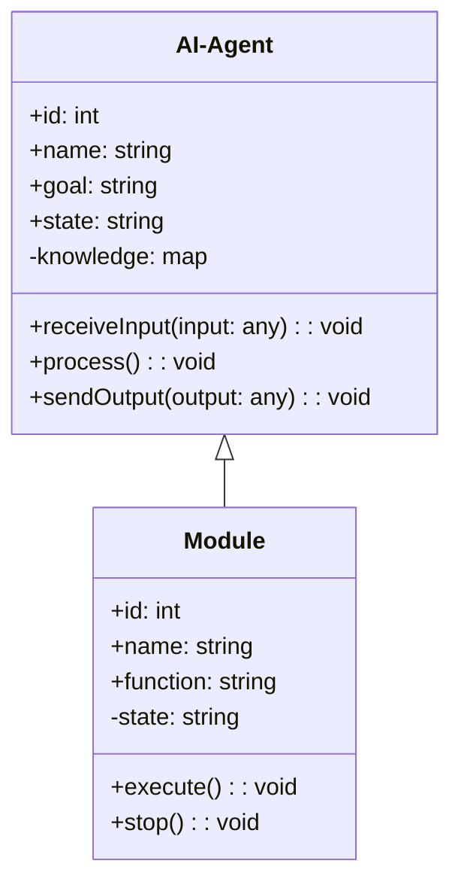
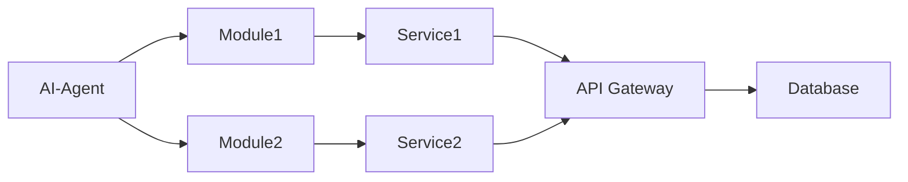
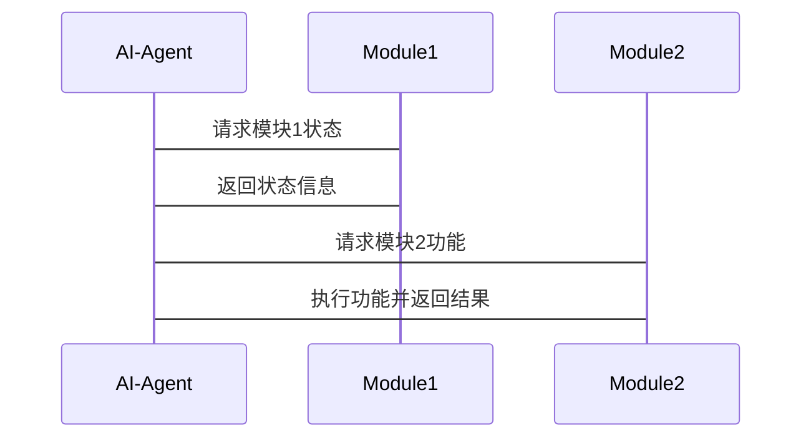

                 


# 设计可扩展的AI Agent架构：模块化与微服务

> 关键词：AI Agent，可扩展性，模块化，微服务，架构设计，系统架构

> 摘要：在AI Agent设计中，可扩展性是关键挑战。模块化和微服务架构通过分解系统功能，提升了系统的灵活性和扩展性。本文将详细探讨AI Agent的背景、模块化与微服务的核心概念、算法原理、系统架构设计以及项目实战，帮助读者掌握设计可扩展AI Agent的方法。

---

## 第一部分：AI Agent的基本概念与背景

### 第1章：AI Agent的定义与特点

#### 1.1 什么是AI Agent
AI Agent（人工智能代理）是能够感知环境并采取行动以实现目标的智能实体。它可以是软件程序、机器人或其他智能系统，通过感知和行动与环境交互。

#### 1.2 AI Agent的核心特点
- **自主性**：AI Agent能够自主决策，无需外部干预。
- **反应性**：能够实时感知环境变化并做出反应。
- **目标导向**：所有行动均以实现特定目标为导向。
- **社会性**：能够与其他AI Agent或人类交互协作。

#### 1.3 AI Agent的分类与应用场景
- **简单反射型Agent**：基于当前输入做出反应，适用于自动门、温度调节系统等。
- **基于模型的反射型Agent**：维护环境模型，适用于自动驾驶汽车。
- **目标驱动型Agent**：根据目标选择行动，如智能助手。
- **实用驱动型Agent**：通过效用函数优化决策，如金融交易系统。

---

### 第2章：可扩展性的重要性

#### 2.1 为什么需要可扩展性
随着AI Agent的应用场景扩大，系统需要处理的数据量和任务复杂度急剧增加。可扩展性确保系统能够应对增长的负载，避免性能瓶颈。

#### 2.2 可扩展性面临的挑战
- **资源分配**：如何高效分配计算资源。
- **通信延迟**：分布式系统中的通信开销。
- **服务发现**：动态发现和调用服务的复杂性。

#### 2.3 可扩展性对AI Agent架构的影响
可扩展性决定了AI Agent能否适应日益增长的任务需求。模块化和微服务架构为可扩展性提供了技术保障。

---

### 第3章：模块化与微服务的必要性

#### 3.1 模块化设计的优势
- **独立性**：每个模块独立开发和测试，降低耦合性。
- **可维护性**：模块化结构便于维护和升级。
- **灵活性**：模块化设计允许轻松替换或增强特定功能。

#### 3.2 微服务架构的特点
- **独立服务**：每个服务独立运行，具备完整的生命周期。
- **松耦合**：服务之间通过API通信，减少直接耦合。
- **可扩展性**：根据需求扩展特定服务，适应负载变化。

#### 3.3 模块化与微服务的结合
- **模块化架构**：将AI Agent功能分解为模块，每个模块实现特定任务。
- **微服务架构**：每个模块作为一个独立的微服务，通过API进行通信。

---

## 第二部分：模块化与微服务的核心概念

### 第4章：模块化架构的设计原则

#### 4.1 模块划分策略
- **功能划分**：根据功能将系统分解为模块。
- **数据划分**：根据数据类型和访问模式划分模块。
- **层次划分**：将模块按层次结构组织，明确模块间的依赖关系。

#### 4.2 模块间通信机制
- **模块接口**：定义模块间的接口和协议。
- **消息传递**：通过消息队列或事件总线实现模块间通信。
- **服务发现**：动态发现可用模块并建立连接。

#### 4.3 模块化与可扩展性的结合
模块化设计允许在不修改其他模块的情况下扩展或升级特定模块，从而提升系统的整体可扩展性。

---

### 第5章：微服务架构的核心要素

#### 5.1 微服务的定义与特点
微服务是一种架构风格，将应用分解为小型、独立的服务，每个服务负责特定功能。服务之间通过轻量级通信机制交互。

#### 5.2 微服务架构的优缺点
- **优点**：独立开发、部署和扩展；服务可选技术栈；容错性高。
- **缺点**：复杂性增加；服务间通信开销；数据一致性挑战。

#### 5.3 微服务与模块化的对比
| 特性 | 模块化 | 微服务 |
|------|--------|---------|
| 独立性 | 高 | 高 |
| 耦合性 | 低 | 松散耦合 |
| 适用场景 | 系统内部功能划分 | 分布式系统功能划分 |

---

## 第三部分：可扩展AI Agent的算法原理

### 第6章：模块划分算法

#### 6.1 贪心算法
贪心算法在模块划分中用于优化资源分配。例如，根据模块的重要性优先分配资源。

**算法步骤**：
1. 按照模块的重要性排序。
2. 为每个模块分配资源，直到资源耗尽。

**数学模型**：
$$ \text{模块重要性} = \sum_{i=1}^{n} w_i \times x_i $$

#### 6.2 分治算法
将问题分解为更小的问题，分别解决，最后合并结果。

**应用场景**：适用于需要处理大量数据的模块划分。

#### 6.3 动态规划算法
通过记录子问题的解来构建最优解。

**应用**：适用于需要多次调整模块划分的动态场景。

---

### 第7章：微服务通信机制

#### 7.1 RESTful API设计
RESTful API基于HTTP协议，定义明确的资源和操作。例如：
- GET /api/users 获取用户列表。
- POST /api/users 创建新用户。

#### 7.2 gRPC通信协议
gRPC基于HTTP/2的双向流通信，效率高，适合微服务间通信。

#### 7.3 消息队列机制
通过队列实现异步通信，如Kafka和RabbitMQ。

---

## 第四部分：系统分析与架构设计

### 第8章：问题场景介绍

#### 8.1 问题背景
设计一个可扩展的AI Agent，用于实时数据分析和决策支持。

#### 8.2 项目介绍
项目目标是构建一个模块化、微服务化的AI Agent，能够处理大量数据并快速响应。

---

### 第9章：系统功能设计

#### 9.1 领域模型设计
通过Mermaid类图展示系统的领域模型。



---

### 第10章：系统架构设计

#### 10.1 系统架构图
通过Mermaid架构图展示系统的整体架构。



---

### 第11章：系统接口设计

#### 11.1 API设计
API接口定义模块间的交互，例如：
- `/api/module/status` 获取模块状态。
- `/api/module/function` 调用模块功能。

#### 11.2 序列图设计
通过Mermaid序列图展示系统的交互流程。



---

## 第五部分：项目实战

### 第12章：环境安装与配置

#### 12.1 开发环境
- 操作系统：Linux/Windows/MacOS
- 开发工具：VS Code、IntelliJ IDEA
- 依赖管理：Maven、npm
- 服务发现：Consul、Eureka
- 消息队列：Kafka、RabbitMQ
- 数据库：PostgreSQL、MongoDB

---

### 第13章：核心代码实现

#### 13.1 模块划分算法实现
```python
def module_partitioning(weights):
    modules = []
    total_weight = sum(weights)
    remaining_resource = 100  # 假设总资源为100
    for weight in weights:
        if remaining_resource >= weight:
            modules.append(weight)
            remaining_resource -= weight
        else:
            break
    return modules
```

#### 13.2 微服务通信实现
```python
import requests

def call_service(service_url, data):
    try:
        response = requests.post(service_url, json=data)
        return response.json()
    except Exception as e:
        print(f"服务调用失败：{e}")
        return None
```

---

### 第14章：代码应用解读与分析

#### 14.1 代码结构
```plaintext
src/
├── main/
│   ├── java/
│   │   └── Module1.java
│   └── Module2.java
└── test/
    └── ModuleTest.java
```

#### 14.2 代码功能分析
- `Module1.java`：实现模块1功能，包括接收输入、处理逻辑和输出结果。
- `Module2.java`：实现模块2功能，依赖于模块1的状态。
- `ModuleTest.java`：测试模块之间的交互和通信。

---

## 第六部分：总结与展望

### 第15章：最佳实践与注意事项

#### 15.1 最佳实践
- **模块划分**：根据功能和数据独立性划分模块。
- **服务设计**：设计轻量级、独立的服务，避免过度耦合。
- **通信机制**：选择合适的通信协议，优化性能。

#### 15.2 注意事项
- **服务发现**：确保服务发现机制的高效性和可靠性。
- **错误处理**：设计完善的错误处理机制，避免系统崩溃。
- **性能优化**：通过缓存、并行处理等技术优化系统性能。

---

### 第16章：小结与展望

#### 16.1 小结
本文详细探讨了设计可扩展AI Agent的模块化与微服务架构，从理论到实践，全面分析了系统的架构设计、算法实现和项目实战。

#### 16.2 展望
未来，随着AI技术的发展，模块化和微服务架构将更加重要。进一步的研究可以集中在服务自治、动态扩展和智能路由等领域。

---

## 结语

通过模块化与微服务架构的设计，AI Agent能够实现高效、灵活和可扩展的系统架构。本文为读者提供了从理论到实践的全面指导，帮助他们在实际项目中应用这些设计理念。

---

作者：AI天才研究院/AI Genius Institute & 禅与计算机程序设计艺术 /Zen And The Art of Computer Programming

