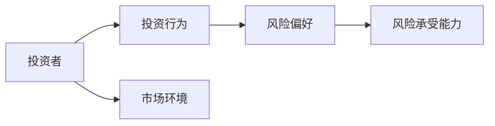
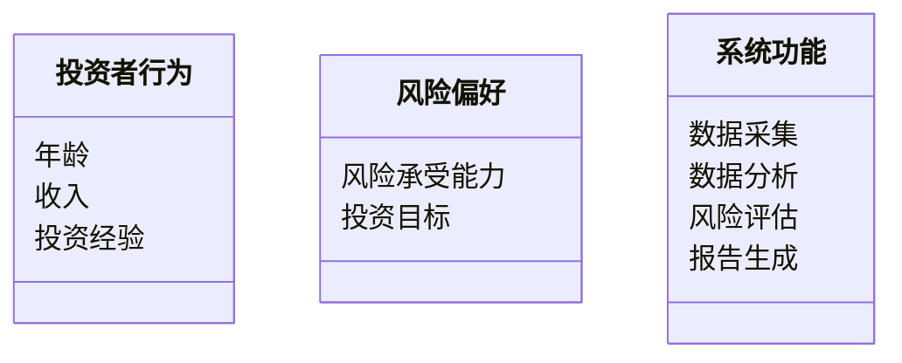
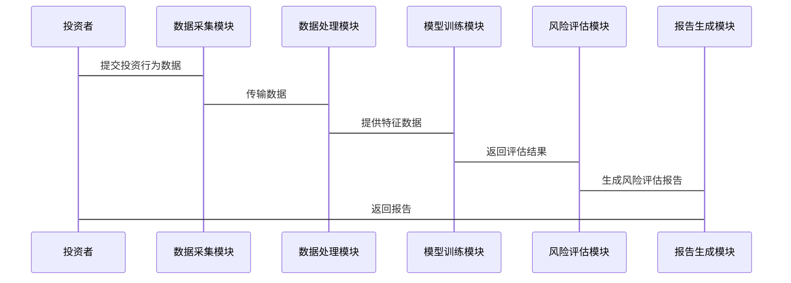

                 


# 设计智能化的个人投资风险承受能力评估工具

## 关键词：个人投资、风险承受能力、智能化评估工具、机器学习、投资者行为分析

## 摘要：  
本文详细探讨了设计智能化的个人投资风险承受能力评估工具的全过程，从问题背景分析到系统架构设计，再到算法实现和项目实战，全面解析了如何利用技术手段提升投资风险评估的智能化水平。文章结合理论与实践，通过具体案例分析，展示了如何利用机器学习算法和数据驱动的方法，构建一个高效、精准的个人投资风险评估系统。

---

# 第一部分: 背景介绍与核心概念

## 第1章: 个人投资风险承受能力评估工具的背景与问题描述

### 1.1 问题背景

#### 1.1.1 投资者风险偏好与风险承受能力的定义
- **风险偏好**：投资者对风险的接受程度，通常分为保守型、稳健型和激进型。
- **风险承受能力**：基于投资者的财务状况、心理承受能力和投资目标，评估其能够承担的最大风险程度。

#### 1.1.2 现有评估工具的局限性
- 传统评估工具多基于问卷调查，难以捕捉投资者的真实心理状态。
- 单一维度的评估方法无法全面反映投资者的风险承受能力。

#### 1.1.3 智能化评估工具的必要性
- 随着人工智能和大数据技术的发展，智能化评估工具能够更精准地分析投资者行为和市场环境。
- 通过多模态数据融合，智能化工具可以提供更个性化的风险评估服务。

### 1.2 问题描述

#### 1.2.1 投资风险的多维度分析
- 风险不仅与市场环境相关，还与投资者的心理预期、行为习惯等因素密切相关。
- 需要从多个维度（如财务状况、投资经验、心理特征）进行综合评估。

#### 1.2.2 个人投资行为与风险承受能力的关系
- 投资者的决策行为反映了其风险承受能力。
- 需要通过行为数据挖掘，揭示投资者的真实风险偏好。

#### 1.2.3 现有评估方法的不足与改进方向
- 传统评估方法多基于静态问卷，缺乏动态数据支持。
- 需要引入实时市场数据和投资者行为数据，构建动态风险评估模型。

### 1.3 问题解决思路

#### 1.3.1 智能化评估的核心目标
- 构建一个基于机器学习的动态评估模型，结合投资者行为数据和市场数据，实时评估风险承受能力。

#### 1.3.2 数据驱动的评估方法
- 利用大数据技术采集和分析投资者的行为数据，提取特征，构建评估模型。

#### 1.3.3 多模态数据融合的评估策略
- 将投资者的行为数据、市场数据和心理数据相结合，构建多维度的评估体系。

---

## 第2章: 核心概念与联系

### 2.1 核心概念原理

#### 2.1.1 风险承受能力的构成要素
- **财务状况**：包括资产规模、收入水平等。
- **心理特征**：包括风险偏好、心理承受能力等。
- **投资行为**：包括投资频率、交易决策等。

#### 2.1.2 投资者行为分析的理论基础
- **行为金融学**：研究投资者心理和行为对金融市场的影响。
- **心理学**：分析投资者的心理特征和决策过程。

#### 2.1.3 智能化评估的算法原理
- 利用机器学习算法，从多源数据中提取特征，构建评估模型。

### 2.2 核心概念属性对比表

#### 表2-1: 风险承受能力与投资行为的属性对比

| 属性 | 风险承受能力 | 投资行为 |
|------|--------------|----------|
| 主体 | 投资者       | 投资者   |
| 影响因素 | 财务状况、心理特征 | 市场环境、心理特征 |
| 评估方法 | 问卷调查、机器学习 | 数据挖掘、行为分析 |

### 2.3 实体关系图



---

# 第二部分: 算法原理与数学模型

## 第3章: 算法原理讲解

### 3.1 评估算法的选择与优化

#### 3.1.1 机器学习在风险评估中的应用
- 线性回归：用于预测风险承受能力。
- 聚类分析：用于将投资者分为不同的风险类别。

#### 3.1.2 算法选择的依据与优化方向
- 根据数据类型和评估目标选择合适的算法。
- 通过交叉验证优化模型参数。

### 3.2 算法流程图


## 第4章: 数学模型与公式

### 4.1 风险承受能力评估模型

#### 4.1.1 线性回归模型
$$ y = \beta_0 + \beta_1x_1 + \beta_2x_2 + \dots + \beta_nx_n + \epsilon $$
其中，$y$ 表示风险承受能力，$x_i$ 表示各特征变量。

#### 4.1.2 聚类分析模型
$$ \text{目标函数} = \sum_{i=1}^{k} \sum_{j=1}^{n_i} \|x_j - c_i\|^2 $$
其中，$k$ 表示聚类数，$c_i$ 表示第 $i$ 类的中心。

### 4.2 举例说明

#### 4.2.1 线性回归示例
假设我们有 $x$ 表示年收入，$y$ 表示风险承受能力：
$$ y = 0.5x + 20 $$

#### 4.2.2 聚类分析示例
将投资者分为高风险、中风险、低风险三类：
$$ \text{类别数} = 3 $$

---

# 第三部分: 系统分析与架构设计

## 第5章: 系统分析与架构设计

### 5.1 问题场景介绍

#### 5.1.1 投资者行为分析场景
- 通过收集投资者的交易数据，分析其行为特征。

#### 5.1.2 多模态数据融合场景
- 将投资者的行为数据、市场数据和心理数据相结合，构建综合评估模型。

#### 5.1.3 智能化评估工具的应用场景
- 为投资者提供个性化的风险评估报告，帮助其做出投资决策。

### 5.2 功能设计

#### 5.2.1 领域模型



### 5.3 系统架构设计

#### 5.3.1 系统架构图


#### 5.3.2 系统交互流程图



---

# 第四部分: 项目实战

## 第6章: 项目实战与分析

### 6.1 环境安装与配置

#### 6.1.1 环境要求
- Python 3.8+
- 安装必要的库：numpy、pandas、scikit-learn、matplotlib。

### 6.2 核心代码实现

#### 6.2.1 数据预处理代码

```python
import pandas as pd
import numpy as np

# 加载数据
data = pd.read_csv('investor_data.csv')

# 数据清洗
data.dropna()
data = pd.get_dummies(data)  # 独热编码
```

#### 6.2.2 模型训练代码

```python
from sklearn.linear_model import LinearRegression
from sklearn.metrics import mean_squared_error

# 构建模型
model = LinearRegression()
model.fit(X_train, y_train)

# 模型评估
y_pred = model.predict(X_test)
print('均方误差:', mean_squared_error(y_test, y_pred))
```

### 6.3 代码解读与分析

#### 6.3.1 数据预处理
- 使用 `pandas` 进行数据加载和清洗。
- 使用 `sklearn` 的 `get_dummies` 进行独热编码，将分类变量转换为数值变量。

#### 6.3.2 模型训练
- 使用线性回归模型进行训练。
- 使用均方误差评估模型性能。

### 6.4 实际案例分析

#### 6.4.1 案例背景
- 一位投资者的年收入为50万元，投资经验为5年，风险偏好为稳健型。

#### 6.4.2 模型评估结果
- 预测该投资者的风险承受能力得分为75分（满分100分）。
- 分类结果为稳健型投资者。

---

# 第五部分: 总结与展望

## 第7章: 总结与展望

### 7.1 最佳实践 tips

#### 7.1.1 数据收集
- 确保数据的全面性和准确性。
- 尽可能收集多模态数据，如行为数据和心理数据。

#### 7.1.2 模型优化
- 使用交叉验证优化模型参数。
- 尝试不同的算法，如随机森林和神经网络，进行对比实验。

### 7.2 小结

#### 7.2.1 核心内容回顾
- 本文详细介绍了设计智能化的个人投资风险承受能力评估工具的全过程。
- 从理论到实践，展示了如何利用机器学习算法和数据驱动的方法，构建一个高效、精准的评估系统。

#### 7.2.2 关键点总结
- 理解投资者行为和心理特征是构建评估模型的基础。
- 数据预处理和特征提取是模型训练的关键步骤。
- 模型评估和结果解读是提升评估工具实用性的保障。

### 7.3 注意事项

#### 7.3.1 数据隐私保护
- 在实际应用中，需注意保护投资者的个人隐私。
- 数据存储和传输需符合相关法律法规。

#### 7.3.2 模型局限性
- 线性回归模型适用于线性关系，对于复杂的非线性关系可能表现不佳。
- 聚类分析需要人工指定类别数，可能存在主观性。

### 7.4 拓展阅读

#### 7.4.1 推荐书籍
- 《机器学习实战》
- 《行为金融学》

#### 7.4.2 推荐论文
- "Predicting Risk Tolerance Using Machine Learning"
- "Behavioral Analysis in Financial Markets"

---

# 作者信息

作者：AI天才研究院/AI Genius Institute & 禅与计算机程序设计艺术 /Zen And The Art of Computer Programming

---

# 结语

通过本文的详细讲解，我们希望能够为读者提供一个清晰的设计智能化个人投资风险承受能力评估工具的方法论。从理论分析到实践实现，从算法选择到系统架构设计，每一个环节都紧密相连，共同构建一个高效、精准的智能化评估系统。未来，随着人工智能和大数据技术的不断发展，智能化评估工具将在金融领域发挥越来越重要的作用。

