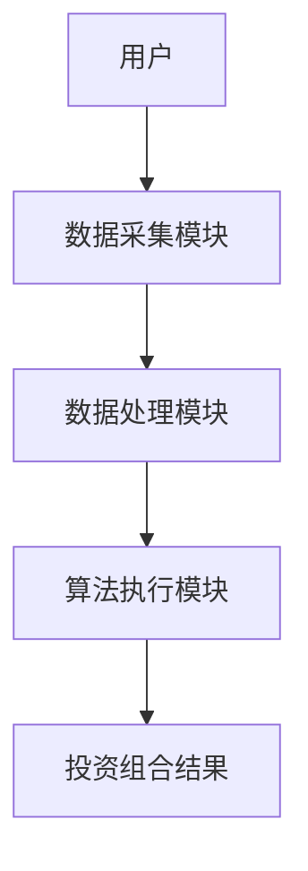

                 


# 货币市场工具：短期资金管理的安全港

## 关键词：
- 货币市场工具
- 短期资金管理
- 安全性
- 流动性
- 收益性

## 摘要：
货币市场工具是短期资金管理的重要组成部分，旨在为投资者提供高流动性、低风险且收益稳定的投资选择。本文将从货币市场工具的基本概念、核心原理、应用场景等方面进行深入分析，探讨其在短期资金管理中的重要性及其作为安全港的特性。

---

# 第一部分: 货币市场工具的背景与概述

## 第1章: 货币市场工具的基本概念

### 1.1 货币市场工具的定义与分类
- **1.1.1 货币市场工具的定义**
  - 货币市场工具是指在货币市场中流通的短期金融工具，主要用于短期资金的融通。
  - 典型的货币市场工具包括：短期国债、商业票据、银行承兑汇票、大额存单等。

- **1.1.2 货币市场工具的分类**
  - 按发行主体分类：
    - 政府发行的工具：短期国债、国库券。
    - 企业发行的工具：商业票据、银行承兑汇票。
    - 金融机构发行的工具：大额存单、同业存单。
  - 按期限分类：
    - 短期工具：1年以内。
    - 中期工具：1-3年。

### 1.2 货币市场工具的市场特点
- **1.2.1 市场流动性高**
  - 货币市场工具的期限短，交易活跃，变现能力强。
- **1.2.2 市场风险较低**
  - 由于期限短，市场波动对短期资金的影响较小。
- **1.2.3 市场收益稳定**
  - 收益相对固定，适合保守型投资者。

### 1.3 货币市场工具的功能与作用
- **1.3.1 资金流动性管理**
  - 为企业和个人提供短期资金周转的渠道。
- **1.3.2 价格发现机制**
  - 通过市场交易，反映短期资金的供需状况。
- **1.3.3 宏观经济调控**
  - 政府通过货币市场工具调节市场资金流动性，影响利率水平。

## 第2章: 短期资金管理的背景与需求

### 2.1 短期资金管理的定义与目标
- **2.1.1 短期资金管理的定义**
  - 短期资金管理是指在较短时间内（通常为一年以内）对资金的分配与使用进行规划和控制。
- **2.1.2 短期资金管理的目标**
  - 保证资金流动性。
  - 提高资金使用效率。
  - 控制资金风险。

### 2.2 短期资金管理的核心原则
- **2.2.1 流动性优先**
  - 确保资金随时可变现，避免流动性风险。
- **2.2.2 收益与风险平衡**
  - 在保证流动性的前提下，追求较高的收益。
- **2.2.3 灵活性与适应性**
  - 根据市场变化调整资金配置。

### 2.3 短期资金管理的挑战
- **2.3.1 市场波动风险**
  - 短期内市场波动可能影响资金价值。
- **2.3.2 利率风险**
  - 利率变化可能影响短期资金的收益。
- **2.3.3 操作风险**
  - 管理不当可能导致资金损失。

---

# 第二部分: 货币市场工具的核心概念与联系

## 第3章: 货币市场工具的流动性分析

### 3.1 流动性与货币市场工具的关系
- **3.1.1 流动性的定义**
  - 资金能够迅速转化为现金而不损失价值的能力。
- **3.1.2 流动性与工具期限的关系**
  - 工具期限越短，流动性越高。

### 3.2 流动性管理策略
- **3.2.1 短期工具的选择**
  - 优先选择高流动性的工具，如短期国债、银行承兑汇票。
- **3.2.2 市场深度分析**
  - 选择交易活跃、市场深度大的工具，确保变现能力。

## 第4章: 货币市场工具的安全性评估

### 4.1 安全性与信用风险
- **4.1.1 信用风险的定义**
  - 债务人或交易对手无法履行合同义务的风险。
- **4.1.2 安全性评估的关键因素**
  - 发行主体的信用评级。
  - 工具的法律保障。

### 4.2 安全性管理策略
- **4.2.1 选择高信用评级的工具**
  - 如选择政府发行的短期国债。
- **4.2.2 分散投资风险**
  - 通过组合投资降低单一工具的信用风险。

## 第5章: 货币市场工具的收益性分析

### 5.1 收益性与市场利率的关系
- **5.1.1 利率波动对收益的影响**
  - 市场利率上升，收益增加；市场利率下降，收益减少。

### 5.2 收益最大化策略
- **5.2.1 合理配置资产**
  - 根据市场预期调整短期工具的组合。
- **5.2.2 关注市场机会**
  - 把握短期市场波动带来的收益机会。

---

# 第三部分: 货币市场工具的算法与数学模型

## 第6章: 短期资金配置算法

### 6.1 短期资金配置的基本原理
- **6.1.1 目标函数**
  - 最大化收益：$$\text{Maximize } \sum_{i=1}^n w_i r_i$$
  - 约束条件：$$\sum_{i=1}^n w_i = 1$$
- **6.1.2 算法步骤**
  1. 确定可选工具及其收益率。
  2. 根据流动性需求分配权重。
  3. 计算组合收益与风险。

### 6.2 算法实现与优化
- **6.2.1 简单平均法**
  - 等权重分配资金到不同工具。
- **6.2.2 风险调整法**
  - 根据工具的风险调整权重，降低整体风险。

---

# 第四部分: 系统架构与实现

## 第7章: 短期资金管理系统的架构设计

### 7.1 系统功能模块
- **7.1.1 数据采集模块**
  - 获取市场利率、工具收益率等数据。
- **7.1.2 风险评估模块**
  - 计算工具的风险指标。
- **7.1.3 算法执行模块**
  - 根据算法生成投资组合。

### 7.2 系统架构图


---

# 第五部分: 项目实战与案例分析

## 第8章: 项目实战

### 8.1 环境安装与配置
- **8.1.1 安装Python环境**
  - 使用Anaconda或虚拟环境。
- **8.1.2 安装相关库**
  - 导入numpy、pandas、matplotlib等库。

### 8.2 核心代码实现
```python
import numpy as np
import pandas as pd

# 示例数据
tools = ['短期国债', '商业票据', '银行承兑汇票']
yields = [0.02, 0.015, 0.018]

# 简单平均法计算
weights = np.array([1/3, 1/3, 1/3])
portfolio_yield = np.dot(weights, yields)

print(f"投资组合收益率为：{portfolio_yield}")
```

### 8.3 案例分析
- **8.3.1 案例背景**
  - 投资者有100万元短期资金，希望配置在不同工具中。
- **8.3.2 投资组合优化**
  - 使用均值-方差模型优化组合。

---

# 第六部分: 总结与展望

## 第9章: 总结与注意事项

### 9.1 本章小结
- 货币市场工具是短期资金管理的重要手段，具有高流动性、低风险的特点。
- 通过合理配置工具，可以实现资金的保值与增值。

### 9.2 投资者的注意事项
- **风险控制**：避免过度集中在低流动性工具。
- **市场监测**：密切关注市场利率变化。
- **策略调整**：根据市场环境及时调整投资策略。

## 第10章: 拓展阅读与深入学习

### 10.1 拓展阅读
- 建议阅读《货币市场工具与金融创新》、《短期资金管理实务》等书籍。

### 10.2 深入学习方向
- 进一步研究货币市场工具的衍生产品。
- 学习更复杂的短期资金配置算法，如马科维茨均值-方差模型。

---

# 作者：AI天才研究院 & 禅与计算机程序设计艺术

