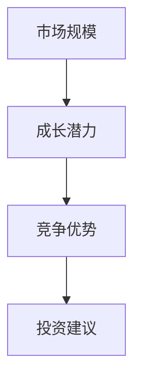
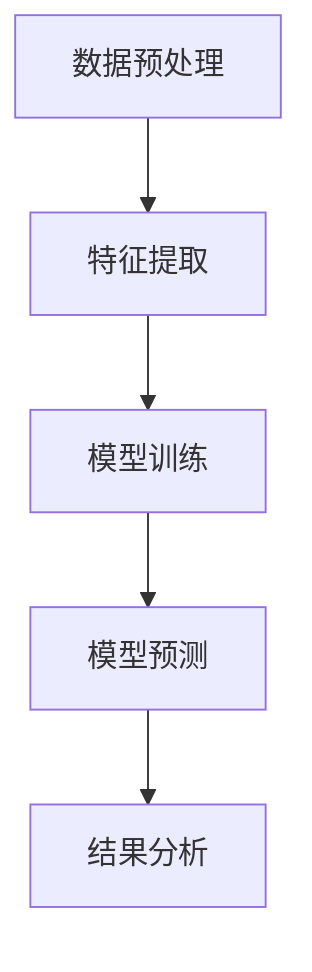
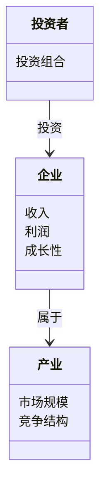
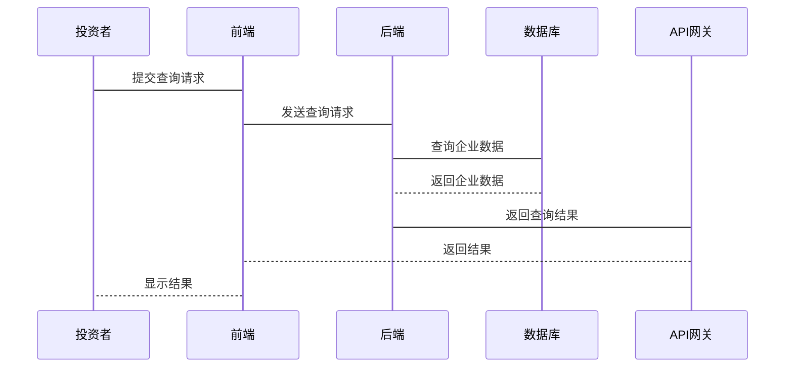

                 


# 费雪的产业发展趋势分析

## 关键词：费雪投资理论，产业发展趋势，价值投资，长期投资，投资分析

## 摘要：本文深入分析了费雪投资理论在现代产业发展趋势分析中的应用，探讨了其核心概念、算法原理和系统架构。通过详细讲解产业发展趋势的分析框架、数学模型和实际案例，为读者提供了从理论到实践的全面指导。

---

## 第1章: 费雪投资理论的背景与起源

### 1.1 费雪投资理论的起源

#### 1.1.1 价值投资的起源与发展
价值投资是一种以基本面分析为基础的投资策略，起源于20世纪初。菲利普·费雪（Philip Fisher）是价值投资的先驱之一，他的理论强调长期投资和对公司的深入研究。费雪的投资理念与本杰明·格雷厄姆（Benjamin Graham）的“廉价投资”不同，他更关注企业的成长性和管理团队的质量。

#### 1.1.2 费雪投资理论的核心思想
费雪认为，投资成功的关键在于选择具有持续增长潜力的优秀公司。他提出了“成长股”的概念，主张投资者应该投资于那些具有强大竞争优势、管理团队优秀且财务状况健康的公司。这种投资策略强调长期持有，而非短期波动。

#### 1.1.3 费雪理论与现代投资理论的联系
现代投资理论，如CAPM和APT，主要关注资产的定价和风险。而费雪的理论则更注重企业的内在价值和成长潜力。尽管两者在方法上有所不同，但都强调了对企业和市场的深入分析。

### 1.2 费雪投资理论的核心观点

#### 1.2.1 费雪的长期投资理念
费雪主张长期投资，认为短期市场波动不应影响投资决策。他认为，优秀的企业会在长期内持续创造价值，而市场的短期波动往往是非理性的。

#### 1.2.2 费雪的内在价值概念
内在价值是企业未来现金流的现值。费雪强调，内在价值的计算需要考虑企业的成长性和盈利能力，而不仅仅是当前的财务数据。

#### 1.2.3 费雪的成长股策略
成长股是指那些收入和利润持续增长的企业。费雪认为，投资于成长股能够在长期内获得超额收益，而不仅仅是市场平均收益。

---

## 第2章: 产业发展趋势分析的核心概念

### 2.1 产业发展趋势分析的基本原理

#### 2.1.1 产业分析的核心要素
产业分析的核心要素包括市场规模、竞争结构、成长潜力和风险因素。这些要素帮助投资者判断产业的健康状况和未来发展趋势。

#### 2.1.2 产业发展趋势的驱动因素
产业发展趋势的驱动因素包括技术进步、政策变化、市场需求和竞争格局。这些因素共同作用，决定了产业的长期发展趋势。

#### 2.1.3 费雪理论与产业分析的结合
费雪的长期投资理念与产业分析相结合，强调选择那些处于上升期且具有强大竞争优势的产业。

### 2.2 核心概念与联系

#### 2.2.1 费雪投资理论的核心概念
- **成长性**：企业的收入和利润持续增长。
- **竞争优势**：企业在市场上具有独特的优势。
- **管理团队**：优秀的企业管理层。

#### 2.2.2 产业发展趋势的核心概念
- **市场规模**：产业的整体规模和增长潜力。
- **竞争结构**：产业内的竞争格局和市场集中度。
- **政策环境**：政府政策对产业的影响。

#### 2.2.3 核心概念的属性对比表

| 概念       | 费雪投资理论 | 产业发展趋势分析 |
|------------|--------------|------------------|
| 成长性     | 企业层面     | 产业层面         |
| 竞争优势   | 企业层面     | 产业层面         |
| 市场规模     | 无           | 产业层面         |

#### 2.2.4 实体关系图（ER图）

```mermaid
erd
    客户
    企业
    产业
    竞争优势
    市场规模

    客户 -[1..n] -> 企业: 投资
    企业 -[1..n] -> 产业: 属于
    产业 -[1..n] -> 竞争优势: 具备
    产业 -[1..n] -> 市场规模: 包含
```

### 2.3 产业发展趋势分析的框架

#### 2.3.1 产业生命周期理论
产业生命周期分为导入期、成长期、成熟期和衰退期。费雪的投资理论强调选择处于成长期的产业，因为这些产业具有更大的增长潜力。

#### 2.3.2 产业发展阶段的划分
- **导入期**：市场规模小，竞争激烈。
- **成长期**：市场规模快速扩大，企业利润增长。
- **成熟期**：市场规模稳定，竞争格局稳定。
- **衰退期**：市场规模缩小，企业利润下降。

#### 2.3.3 产业趋势分析的框架模型


---

## 第3章: 产业发展趋势分析的算法原理

### 3.1 产业发展趋势分析的算法概述

#### 3.1.1 数据预处理与特征提取
数据预处理包括清洗、标准化和特征选择。特征提取需要关注企业的财务指标、市场地位和成长性。

#### 3.1.2 产业发展趋势预测模型
常用的预测模型包括线性回归、时间序列分析和机器学习算法。其中，线性回归模型适用于短期趋势预测，而机器学习算法适用于长期趋势预测。

#### 3.1.3 模型评估与优化
模型评估包括准确率、召回率和F1分数。优化方法包括参数调优和特征选择。

### 3.2 产业发展趋势分析的流程图



### 3.3 线性回归模型

#### 3.3.1 线性回归模型的数学公式
$$ y = \beta_0 + \beta_1x + \epsilon $$

其中，$y$ 是目标变量，$x$ 是自变量，$\beta_0$ 是截距，$\beta_1$ 是回归系数，$\epsilon$ 是误差项。

#### 3.3.2 线性回归模型的应用
以企业的收入增长为例，假设我们有以下数据：

| 年份 | 收入（万元） |
|------|--------------|
| 2018 | 100          |
| 2019 | 120          |
| 2020 | 140          |

我们可以用线性回归模型预测2021年的收入：

$$ y = 100 + 20x $$

其中，$x$ 是年份数（2018年为0，2019年为1，2020年为2）。预测2021年的收入为：

$$ y = 100 + 20 \times 3 = 160 $$

---

## 第4章: 系统分析与架构设计

### 4.1 问题场景介绍

#### 4.1.1 问题背景
我们希望通过费雪投资理论分析某个产业的产业发展趋势，选择具有成长潜力的企业进行投资。

#### 4.1.2 项目介绍
我们开发一个基于费雪投资理论的产业趋势分析系统，帮助投资者识别具有成长潜力的产业和企业。

### 4.2 系统功能设计

#### 4.2.1 领域模型


#### 4.2.2 系统架构设计


### 4.3 系统交互流程

#### 4.3.1 系统交互流程图


---

## 第5章: 项目实战

### 5.1 环境安装

#### 5.1.1 安装Python
```bash
python --version
pip install --upgrade pip
```

#### 5.1.2 安装依赖包
```bash
pip install numpy
pip install pandas
pip install scikit-learn
```

### 5.2 核心代码实现

#### 5.2.1 数据预处理
```python
import pandas as pd
import numpy as np

data = pd.read_csv('data.csv')
data = data.dropna()
data = (data - data.mean()) / data.std()
```

#### 5.2.2 模型训练
```python
from sklearn.linear_model import LinearRegression

model = LinearRegression()
model.fit(X_train, y_train)
```

#### 5.2.3 模型预测
```python
y_pred = model.predict(X_test)
```

### 5.3 案例分析

#### 5.3.1 案例背景
假设我们分析科技产业的产业发展趋势，选择具有成长性的科技企业进行投资。

#### 5.3.2 数据分析
| 年份 | 收入（亿元） | 利润（亿元） |
|------|--------------|--------------|
| 2018 | 50           | 10           |
| 2019 | 60           | 15           |
| 2020 | 70           | 20           |

#### 5.3.3 模型预测
使用线性回归模型预测2021年的收入和利润：

$$ y = 50 + 10x $$

预测2021年的收入为：

$$ y = 50 + 10 \times 3 = 80 $$

---

## 第6章: 结论与展望

### 6.1 结论
费雪投资理论与产业发展趋势分析相结合，能够帮助投资者识别具有成长潜力的企业和产业。通过系统化的分析和算法支持，投资者可以做出更科学的投资决策。

### 6.2 展望
未来，随着人工智能和大数据技术的发展，费雪投资理论在产业发展趋势分析中的应用将更加广泛和深入。投资者可以通过更 sophisticated的模型和工具，实现更精准的投资决策。

---

## 最佳实践 Tips

- **长期投资**：坚持费雪的长期投资理念，避免短期波动的影响。
- **深入分析**：对企业的财务状况、成长性和管理团队进行深入分析。
- **风险管理**：合理分散投资，降低投资风险。

---

## 作者：AI天才研究院/AI Genius Institute & 禅与计算机程序设计艺术 /Zen And The Art of Computer Programming

