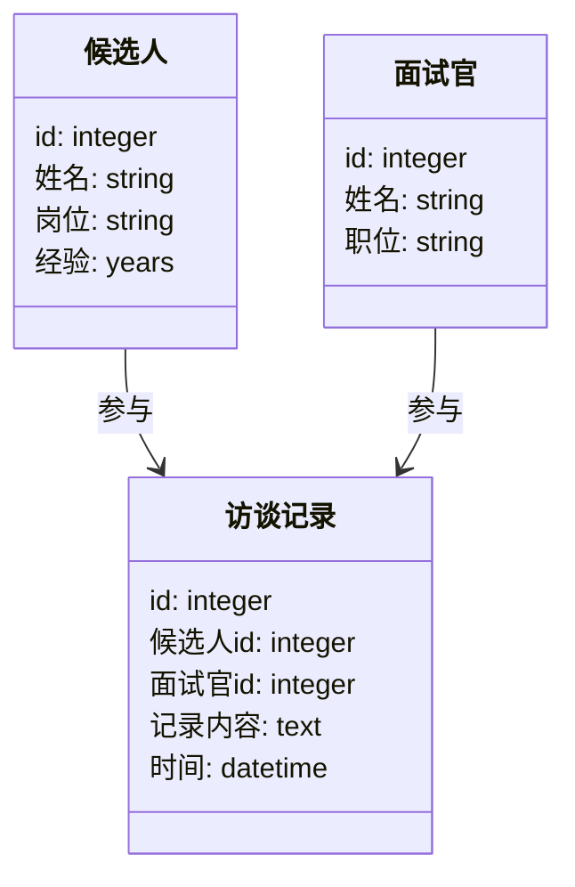
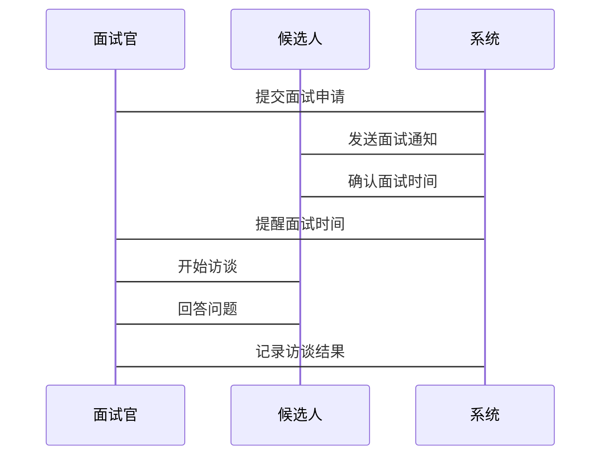

                 


# 费雪的公司访谈技巧

> 关键词：公司访谈，提问技巧，倾听技巧，评估技巧，沟通技巧，访谈结果

> 摘要：公司访谈是一种通过系统化的方法收集信息、评估候选人或项目的关键技巧。本文将详细分析公司访谈的核心概念、技巧和应用场景，包括提问、倾听、评估和沟通技巧，并通过实际案例和系统设计帮助读者掌握这些技巧。

---

# 第一部分: 公司访谈技巧背景与基础

## # 第1章: 公司访谈概述

### 1.1 公司访谈的定义与背景

#### 1.1.1 公司访谈的基本定义
公司访谈是一种通过与相关人员（如候选人、客户或团队成员）进行一对一或一对多的交流，以获取信息、评估能力和解决问题的过程。它在招聘、项目管理、市场调研等领域广泛应用。

#### 1.1.2 公司访谈的背景与重要性
公司访谈在现代商业环境中至关重要。随着市场竞争的加剧，准确评估候选人能力和项目可行性变得尤为重要。通过有效的公司访谈，可以提高决策的准确性和效率。

#### 1.1.3 公司访谈的目标与核心问题
公司访谈的目标是通过系统化的问题设计，收集关键信息并评估相关方的能力或需求。核心问题包括：候选人是否胜任岗位、项目是否可行、客户的真实需求是什么等。

### 1.2 公司访谈的基本流程

#### 1.2.1 访谈前的准备
- 确定访谈目标和问题清单
- 制定访谈计划和时间安排
- 准备背景资料和相关问题

#### 1.2.2 访谈中的实施
- 进行初步交流，建立信任关系
- 按照问题清单逐步提问并记录反馈
- 根据回答调整后续问题

#### 1.2.3 访谈后的总结与反馈
- 整理访谈记录并分析关键信息
- 撰写访谈报告并提出下一步建议
- 反馈给相关人员并跟进后续行动

---

## # 第2章: 公司访谈的核心概念与联系

### 2.1 公司访谈的核心概念

#### 2.1.1 访谈者与被访者的关系
- 访谈者：通常是面试官、项目经理或客户代表
- 被访者：候选人、团队成员或客户
- 关系：基于信任和专业性的互动

#### 2.1.2 访谈目标与内容的对比
| 访谈目标          | 访谈内容          |
|-------------------|-------------------|
| 收集候选人信息    | 岗位职责、经验等   |
| 评估候选人能力    | 技能、团队合作等   |
| 获取项目信息      | 项目需求、目标等   |

#### 2.1.3 访谈技巧与结果的关系
- 技巧直接影响结果的准确性
- 高效的技巧可以显著提高访谈效率

### 2.2 公司访谈的核心要素对比

#### 2.2.1 不同类型访谈的对比分析
| 访谈类型          | 定义与特点          |
|-------------------|-------------------|
| 结构化访谈        | 提前设计好问题，确保一致性 |
| 非结构化访谈      | 根据现场情况灵活提问    |
| 半结构化访谈      | 结合结构化和非结构化的特点 |

#### 2.2.2 访谈目标与内容的对比
- 结构化访谈：目标明确，内容固定
- 非结构化访谈：目标灵活，内容多样

#### 2.2.3 访谈技巧与结果的关系
- 技巧提升结果的准确性和全面性

---

## # 第3章: 公司访谈的核心技巧

### 3.1 提问技巧

#### 3.1.1 提问类型对比
| 提问类型          | 示例问题          |
|-------------------|-------------------|
| 封闭式问题        | 您是否具备相关经验？ |
| 开放式问题        | 您如何处理项目中的冲突？ |
| 引导式提问        | 您认为团队合作的关键是什么？ |
| 探索式提问        | 您能详细描述一下您的项目经验吗？ |

#### 3.1.2 提问顺序与节奏
- 从简单问题开始，逐步深入
- 保持适当的提问节奏，避免信息过载

### 3.2 倾听技巧

#### 3.2.1 积极倾听
- 全神贯注，避免打断
- 通过反馈确认理解（例如：复述和总结）

#### 3.2.2 非语言倾听
- 保持开放的姿态（如微笑、点头）
- 避免分心（如频繁看表或打断）

### 3.3 评估与判断技巧

#### 3.3.1 信息准确性评估
- 对比不同来源的信息一致性
- 结合背景信息进行验证

#### 3.3.2 被访者的可信度分析
- 观察语言表达的逻辑性
- 注意非语言信号（如眼神、手势）

#### 3.3.3 综合判断
- 结合目标和问题进行综合分析
- 考虑被访者的背景和动机

### 3.4 沟通技巧

#### 3.4.1 沟通风格选择
- 专业型：适合技术性岗位
- 亲和型：适合需要建立信任的场合
- 中立型：适合评估阶段

#### 3.4.2 语言技巧
- 使用简洁明了的语言
- 避免专业术语或过于复杂的表达

#### 3.4.3 非语言技巧
- 保持适当的眼神交流
- 使用开放性的肢体语言（如双手摊开）

---

## # 第4章: 公司访谈的实际应用

### 4.1 面试官的访谈技巧

#### 4.1.1 面试前的岗位分析
- 明确岗位需求和关键能力
- 设计与岗位相关的提问

#### 4.1.2 面试中的问题设计
- 结合岗位职责设计问题
- 根据候选人回答调整后续问题

#### 4.1.3 面试后的评估与反馈
- 综合评估候选人能力
- 提供针对性的反馈建议

### 4.2 求职者的应对技巧

#### 4.2.1 提前准备常见问题
- 针对岗位需求准备答案
- 展示与岗位相关的技能和经验

#### 4.2.2 应对压力和挑战
- 保持冷静，清晰表达
- 展示解决问题的能力

### 4.3 项目访谈的技巧

#### 4.3.1 项目需求分析
- 明确项目目标和关键问题
- 设计与项目相关的访谈问题

#### 4.3.2 团队协作中的访谈
- 通过访谈了解团队成员的能力和合作方式
- 发现潜在问题并提出解决方案

---

## # 第5章: 公司访谈的系统分析与架构设计

### 5.1 系统功能设计

#### 5.1.1 领域模型设计


#### 5.1.2 系统架构设计
```mermaid
aws
```

### 5.2 系统接口设计

#### 5.2.1 访谈记录管理接口
- 添加访谈记录
- 查询候选人访谈记录
- 修改访谈记录

#### 5.2.2 面试安排接口
- 创建面试安排
- 查询面试安排
- 取消面试安排

### 5.3 系统交互设计

#### 5.3.1 访谈流程交互


---

## # 第6章: 项目实战

### 6.1 环境安装与配置

#### 6.1.1 安装Python
```bash
python --version
```

#### 6.1.2 安装依赖
```bash
pip install -r requirements.txt
```

### 6.2 核心实现代码

#### 6.2.1 访谈记录管理
```python
class Candidate:
    def __init__(self, id, name, position, experience):
        self.id = id
        self.name = name
        self.position = position
        self.experience = experience

class Interviewer:
    def __init__(self, id, name, role):
        self.id = id
        self.name = name
        self.role = role

class InterviewRecord:
    def __init__(self, id, candidate_id, interviewer_id, content, timestamp):
        self.id = id
        self.candidate_id = candidate_id
        self.interviewer_id = interviewer_id
        self.content = content
        self.timestamp = timestamp

    def save(self):
        # 实现数据存储逻辑
        pass
```

#### 6.2.2 面试安排接口
```python
def schedule_interview(candidate, interviewer):
    # 实现面试安排逻辑
    pass
```

### 6.3 实际案例分析与解读

#### 6.3.1 案例背景
- 公司招聘技术岗位，需评估候选人的技术能力和团队合作能力。

#### 6.3.2 访谈设计
- 技术能力：编码能力、问题解决能力
- 团队合作：过往项目经验、冲突解决能力

#### 6.3.3 访谈结果
- 技术能力优秀，团队合作能力一般
- 进一步考察团队合作能力

### 6.4 项目小结

#### 6.4.1 成功经验
- 提前明确岗位需求
- 根据候选人回答动态调整问题

#### 6.4.2 改进方向
- 提高非结构化访谈的技巧
- 建立更完善的评估体系

---

## # 第7章: 总结与展望

### 7.1 最佳实践 Tips

#### 7.1.1 提问技巧
- 明确目标，设计开放式问题
- 保持中立，避免引导性问题

#### 7.1.2 倾听技巧
- 积极倾听，避免打断
- 非语言信号，增强互动

#### 7.1.3 沟通技巧
- 语言简洁，避免复杂表达
- 保持专业性，建立信任

### 7.2 小结

公司访谈是一种系统化的信息收集和评估过程，通过有效的提问、倾听和沟通技巧，可以显著提高访谈的效率和准确性。掌握这些技巧需要不断的实践和总结。

### 7.3 注意事项

- 避免过于依赖结构化访谈，保持灵活性
- 注意被访者的背景和动机，避免偏见
- 记录和整理访谈内容，确保信息准确

### 7.4 拓展阅读

- 《高效沟通的艺术》
- 《结构化面试与评估》
- 《项目管理中的访谈技巧》

---

作者：AI天才研究院/AI Genius Institute & 禅与计算机程序设计艺术/Zen And The Art of Computer Programming

