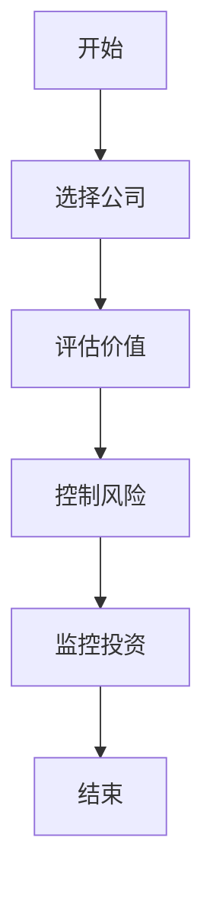
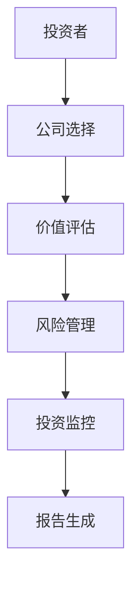

                 


# 费雪的十五个投资原则

## 关键词：
- 费雪投资原则、投资策略、价值投资、风险管理、长期收益

## 摘要：
费雪的十五个投资原则是投资领域的重要理论，本文将从引言、核心概念、算法原理、系统架构、项目实战等方面详细解析这些原则，帮助读者更好地理解和应用。

---

## 第一部分: 费雪的十五个投资原则

### 第1章: 引言

#### 1.1 费雪投资理念的背景
##### 1.1.1 投资领域的现状与挑战
现代投资领域充满了不确定性和复杂性。投资者需要在市场波动中找到稳定的投资策略。费雪的投资原则为这一挑战提供了系统的解决方案。

##### 1.1.2 费雪投资原则的核心思想
费雪的投资原则强调长期价值、深入研究和风险管理。这些原则帮助投资者在不确定的市场中实现稳健收益。

##### 1.1.3 本书的结构与目标
本文将分章节详细解析费雪的十五个投资原则，从核心概念到系统架构，再到实际案例，帮助读者全面掌握这些原则的应用。

#### 1.2 十五个投资原则的概述
##### 1.2.1 原则的分类与特点
费雪的原则分为价值评估、风险控制和长期策略三大类，每个类别包含多个具体原则。

##### 1.2.2 原则之间的相互关系
这些原则不是孤立的，而是相互关联、相互支持的。例如，价值评估与风险管理原则共同确保投资的安全性和收益性。

##### 1.2.3 原则的实际应用范围
这些原则适用于各种投资领域，包括股票、债券和房地产。本文将重点分析股票投资中的应用。

---

### 第2章: 费雪投资原则的核心概念

#### 2.1 费雪投资原则的定义与特点
##### 2.1.1 投资原则的定义
费雪的投资原则是基于长期价值和深入研究的投资策略。这些原则强调选择具有持续盈利能力和良好管理的公司。

##### 2.1.2 投资原则的核心特点
- **长期视角**：关注公司的长期盈利能力。
- **深入研究**：通过详细分析公司基本面做出决策。
- **风险管理**：避免过度风险暴露。

##### 2.1.3 投资原则与其他投资策略的对比
与短期交易策略不同，费雪的原则注重长期价值和稳定性。与价值投资相比，费雪的原则更注重公司的成长性和管理质量。

#### 2.2 投资原则的属性特征对比
##### 2.2.1 投资原则的属性特征表格
以下表格总结了费雪投资原则的核心属性：

| 原则 | 定义 | 核心属性 |
|------|------|----------|
| 价值评估 | 选择具有持续盈利能力的公司 | 长期视角、基本面分析 |
| 风险管理 | 控制投资风险 | 风险厌恶、分散投资 |
| 公司研究 | 深入分析公司基本面 | 深度研究、财务分析 |

##### 2.2.2 投资原则的属性特征分析
通过对比分析，可以看出费雪的原则注重长期、稳健和深度研究，这与激进交易策略形成鲜明对比。

##### 2.2.3 投资原则的属性特征总结
费雪的原则为投资者提供了稳健的投资框架，强调长期价值和风险管理。

---

### 第3章: 费雪投资原则的联系与架构

#### 3.1 投资原则的核心原理
##### 3.1.1 投资原则的核心原理概述
费雪的原则基于价值投资理论，强调选择具有持续盈利能力的公司，同时控制投资风险。

##### 3.1.2 投资原则的核心原理分析
- 价值评估：选择具有持续盈利能力的公司。
- 风险管理：分散投资，避免过度风险暴露。
- 长期策略：关注公司长期发展，而非短期波动。

##### 3.1.3 投资原则的核心原理总结
这些原则共同构建了一个稳健的投资框架，帮助投资者在不确定的市场中实现长期收益。

#### 3.2 投资原则的ER实体关系图
##### 3.2.1 实体关系图的定义
ER实体关系图展示了投资原则中的核心实体及其关系。

##### 3.2.2 实体关系图的绘制
以下是投资原则的ER实体关系图：

```mermaid
erd
    投资者
    ----> [投资] : 投资金额
    投资者
    ----> [持有] : 股票数量
    公司
    <--- [持有] : 股票数量
    公司
    <--- [评估] : 价值评估
    风险
    <--- [管理] : 风险控制
```

##### 3.2.3 实体关系图的分析
该图展示了投资者、公司、风险之间的关系。投资者通过投资和持有股票与公司建立联系，同时通过风险管理控制风险。

---

### 第4章: 投资原则的算法原理

#### 4.1 投资原则的算法流程
##### 4.1.1 算法流程的定义
投资原则的算法流程包括：选择公司、评估价值、控制风险和监控投资。

##### 4.1.2 算法流程的绘制
以下是投资原则的算法流程图：



##### 4.1.3 算法流程的分析
流程包括四个主要步骤：选择公司、评估价值、控制风险和监控投资。每个步骤都需要详细分析和执行。

#### 4.2 投资原则的数学模型与公式
##### 4.2.1 数学模型的定义
投资回报率（ROI）是评估投资价值的重要指标。ROI = (最终价值 - 初始价值) / 初始价值。

##### 4.2.2 数学模型的公式
$$ ROI = \frac{V_f - V_i}{V_i} $$

其中，\( V_f \) 是最终价值，\( V_i \) 是初始价值。

##### 4.2.3 数学模型的分析
通过计算ROI，投资者可以评估不同投资的回报率，从而做出更明智的投资决策。

---

### 第5章: 投资原则的系统分析与架构设计

#### 5.1 投资原则的系统功能设计
##### 5.1.1 系统功能设计的定义
系统功能设计包括：公司选择、价值评估、风险管理、投资监控和报告生成。

##### 5.1.2 系统功能设计的分析
每个功能模块都需要详细设计，确保系统能够高效运行。

##### 5.1.3 系统功能设计的总结
系统功能设计为投资者提供了完整的投资框架，帮助他们实现长期收益。

#### 5.2 投资原则的系统架构图
##### 5.2.1 系统架构图的定义
系统架构图展示了各模块之间的关系。

##### 5.2.2 系统架构图的绘制
以下是系统架构图：



##### 5.2.3 系统架构图的分析
系统架构图展示了从公司选择到报告生成的完整流程，确保各模块协同工作。

---

## 第六章: 项目实战

### 6.1 环境安装
#### 6.1.1 投资分析工具的安装
选择合适的投资分析工具，如Excel或专业的投资软件。

#### 6.1.2 数据源的获取
获取可靠的数据源，如公司财务报表和市场数据。

### 6.2 系统核心实现源代码
#### 6.2.1 价值评估的代码实现
以下是价值评估的Python代码：

```python
def value_assessment(company_financials):
    # 计算市盈率
    pe_ratio = company_financials['市盈率']
    # 计算ROE
    roe = company_financials['ROE']
    # 返回价值评估结果
    return pe_ratio, roe
```

#### 6.2.2 风险管理的代码实现
以下是风险管理的Python代码：

```python
def risk_management(portfolio):
    # 计算波动率
    volatility = portfolio['波动率']
    # 计算VaR
    var = portfolio['VaR']
    # 返回风险管理结果
    return volatility, var
```

### 6.3 代码应用解读与分析
#### 6.3.1 价值评估的代码解读
通过计算市盈率和ROE，投资者可以评估公司的价值。低市盈率和高ROE的公司具有较高的投资价值。

#### 6.3.2 风险管理的代码解读
波动率和VaR是衡量投资风险的重要指标。低波动率和低VaR的投资组合具有较高的安全性。

### 6.4 实际案例分析和详细讲解剖析
#### 6.4.1 投资案例的选择
选择一家公司进行分析，如苹果公司。

#### 6.4.2 投资决策的制定
基于价值评估和风险管理原则，制定投资策略。

#### 6.4.3 投资结果的分析
分析投资结果，总结经验教训。

### 6.5 项目小结
通过实际案例分析，读者可以更好地理解费雪投资原则的应用。

---

## 第七章: 总结

### 7.1 投资原则的小结
费雪的十五个投资原则为投资者提供了稳健的投资框架，帮助他们在不确定的市场中实现长期收益。

### 7.2 投资中的注意事项
- **深入研究**：了解公司的基本面。
- **风险管理**：分散投资，控制风险。
- **长期视角**：关注公司的长期发展。

### 7.3 投资的未来拓展
随着市场的发展，投资者需要不断更新和调整投资策略，以应对新的挑战。

---

## 作者：AI天才研究院 & 禅与计算机程序设计艺术

---

这篇文章详细解析了费雪的十五个投资原则，从核心概念到系统架构，再到实际案例，帮助读者全面掌握这些原则的应用。希望对您有所帮助！

