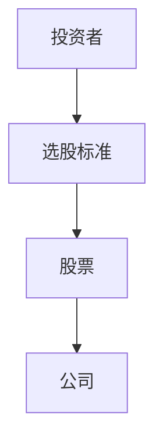
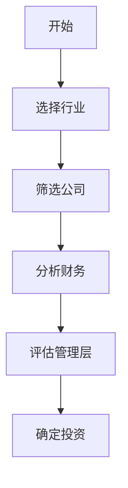
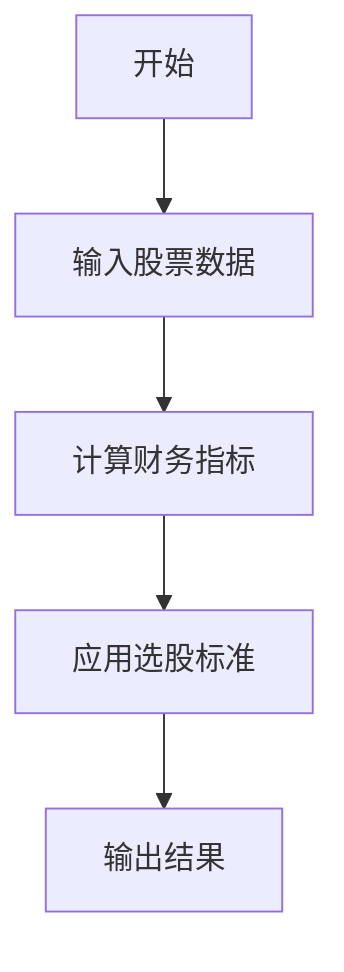
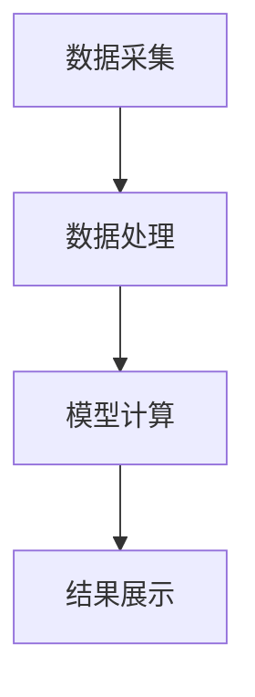

                 


# 《费雪的十五个投资点：选股策略详解》

---

## 关键词：
- 费雪投资理论
- 股票投资策略
- 投资要点分析
- 选股标准
- 股票价值评估

---

## 摘要：
本文详细解析了费雪的十五个投资要点，从背景介绍到数学模型，从系统架构到项目实战，层层剖析，为投资者提供科学的选股策略。文章结合理论与实践，通过 mermaid 图表和 Python 代码，深入探讨了费雪选股模型的原理、算法实现及其在实际投资中的应用。通过本文，读者将能够掌握如何运用费雪的投资理念选择优质股票，提升投资决策的科学性和精准性。

---

## 目录大纲：

### 第一部分: 费雪投资理念概述

#### 第1章: 费雪投资理念的核心思想

##### 1.1 费雪投资理论的背景与起源

###### 1.1.1 费雪投资理论的提出背景
- 费雪投资理论的起源
- 投资理论的发展与演变
- 费雪理论的创新性

###### 1.1.2 费雪投资理论的核心思想
- 长期投资理念
- 价值投资原则
- 股东价值最大化

###### 1.1.3 费雪投资理论的现代意义
- 当代投资环境的变化
- 费雪理论的适应性
- 理论对现代投资的影响

##### 1.2 费雪十五个选股要点的背景

###### 1.2.1 费雪选股要点的提出目的
- 投资者的需求分析
- 选股要点的目标
- 费雪选股要点的核心目标

###### 1.2.2 费雪选股要点的理论基础
- 投资学基础
- 财务分析基础
- 市场分析基础

###### 1.2.3 费雪选股要点的实际应用
- 选股要点的实际案例
- 投资者如何应用
- 费雪选股要点的局限性

---

### 第二部分: 费雪选股要点的核心概念

#### 第2章: 费雪十五个选股要点的核心概念

##### 2.1 费雪选股要点的定义与分类

###### 2.1.1 费雪选股要点的定义
- 选股要点的定义
- 选股要点的分类标准
- 选股要点的核心属性

###### 2.1.2 费雪选股要点的分类
- 财务指标类
- 市场表现类
- 管理层评估类
- 行业地位类
- 未来潜力类

###### 2.1.3 费雪选股要点的特征对比
- 各类要点的对比分析
- 各类要点的重要性排序
- 各类要点的权重分配

##### 2.2 费雪选股要点的实体关系图

###### 2.2.1 费雪选股要点的实体关系图


---

#### 第3章: 费雪选股要点的流程图

##### 3.1 费雪选股要点的流程图

###### 3.1.1 费雪选股流程的步骤分解
- 确定投资目标
- 筛选行业
- 分析公司财务
- 评估管理层
- 确定投资价值
- 投资决策

###### 3.1.2 费雪选股流程的流程图


---

### 第三部分: 费雪选股要点的数学模型与算法原理

#### 第4章: 费雪选股模型的数学基础

##### 4.1 费雪选股模型的数学公式

###### 4.1.1 费雪选股模型的基本公式
$$ P = \frac{E}{(1 + r)^n} $$
其中，P是股票的内在价值，E是未来现金流的总和，r是折现率，n是时间跨度。

##### 4.2 费雪选股模型的算法流程

###### 4.2.1 费雪选股模型的算法流程图


##### 4.3 费雪选股模型的代码实现

###### 4.3.1 费雪选股模型的Python代码实现
```python
import pandas as pd
import numpy as np

def fisher选股模型(股票数据):
    # 计算财务指标
    stock_data = pd.DataFrame(股票数据)
    财务指标 = stock_data[['市盈率', '市净率', '股息率', 'ROE', '净利润增长率']]
    
    # 应用选股标准
    选股结果 = []
    for 指标 in 财务指标:
        if 指标['市盈率'] < 15 and 指标['市净率'] < 2 and 指标['股息率'] > 5 and 指标['ROE'] > 15 and 指标['净利润增长率'] > 10:
            选股结果.append(指标)
    
    return 选股结果
```

---

### 第四部分: 费雪选股模型的系统架构与设计

#### 第5章: 费雪选股模型的系统架构设计

##### 5.1 费雪选股模型的系统功能设计

###### 5.1.1 系统功能模块
- 数据采集模块
- 数据处理模块
- 模型计算模块
- 结果展示模块

##### 5.2 费雪选股模型的系统架构图

###### 5.2.1 费雪选股模型的系统架构图


---

### 第五部分: 费雪选股模型的项目实战与案例分析

#### 第6章: 费雪选股模型的项目实战

##### 6.1 费雪选股模型的环境配置

###### 6.1.1 环境要求
- Python 3.8+
- pandas, numpy库
- Jupyter Notebook

##### 6.2 费雪选股模型的代码实现

###### 6.2.1 费雪选股模型的Python代码实现
```python
import pandas as pd
import numpy as np

def fisher选股模型(股票数据):
    # 计算财务指标
    stock_data = pd.DataFrame(股票数据)
    财务指标 = stock_data[['市盈率', '市净率', '股息率', 'ROE', '净利润增长率']]
    
    # 应用选股标准
    选股结果 = []
    for 指标 in 财务指标:
        if 指标['市盈率'] < 15 and 指标['市净率'] < 2 and 指标['股息率'] > 5 and 指标['ROE'] > 15 and 指标['净利润增长率'] > 10:
            选股结果.append(指标)
    
    return 选股结果
```

##### 6.3 费雪选股模型的案例分析

###### 6.3.1 案例分析：以茅台为例
- 茅台的市盈率和市净率分析
- 茅台的股息率和ROE分析
- 茅台的净利润增长率分析
- 茅台是否符合费雪选股标准

---

### 第六部分: 费雪选股模型的最佳实践与小结

#### 第7章: 费雪选股模型的最佳实践

##### 7.1 费雪选股模型的注意事项

###### 7.1.1 投资者在使用费雪选股模型时需要注意的事项
- 数据的准确性
- 模型的适用性
- 市场环境的变化

##### 7.2 费雪选股模型的优化建议

###### 7.2.1 如何优化费雪选股模型
- 引入更多的财务指标
- 考虑市场波动因素
- 结合技术分析

##### 7.3 费雪选股模型的未来展望

###### 7.3.1 费雪选股模型的未来发展
- 结合人工智能技术
- 大数据驱动的选股模型
- 全球化视角的选股策略

---

## 作者：AI天才研究院 & 禅与计算机程序设计艺术

