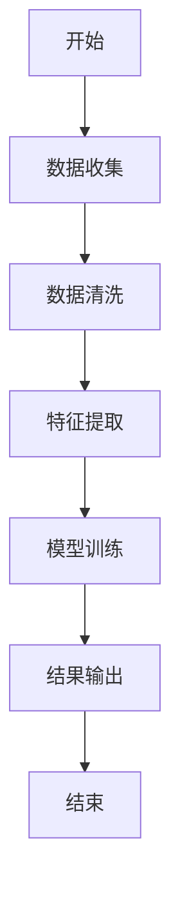

                 


# 费雪的品牌价值评估

> 关键词：品牌价值、费雪模型、资产评估、市场分析、企业决策

> 摘要：品牌价值是企业在市场竞争中的一项重要资产，正确评估品牌价值能够帮助企业制定更科学的决策。本文将从品牌价值评估的背景与核心概念出发，详细探讨费雪的品牌价值评估模型及其在实际应用中的算法原理。通过系统架构设计、项目实战和案例分析，本文将为读者提供一套完整的品牌价值评估解决方案。

---

## 第一部分: 品牌价值评估的背景与核心概念

### 第1章: 品牌价值评估的背景与意义

#### 1.1 什么是品牌价值
- **1.1.1 品牌的定义与内涵**
  - 品牌是企业的标识，承载了企业的声誉、形象和客户认知。
  - 品牌价值是品牌在市场中的表现，包括知名度、忠诚度和美誉度。

- **1.1.2 品牌价值的定义与特征**
  - 品牌价值是品牌在市场中创造的超额收益。
  - 品牌价值具有无形性、长期性和动态性。

- **1.1.3 品牌价值与企业价值的关系**
  - 品牌价值是企业价值的重要组成部分。
  - 强大的品牌价值能够为企业带来溢价能力。

#### 1.2 品牌价值评估的重要性
- **1.2.1 企业决策中的品牌价值**
  - 品牌价值影响企业的收购、融资和战略决策。
  - 正确评估品牌价值能够优化资源配置。

- **1.2.2 投资者与品牌价值**
  - 投资者关注品牌价值以评估企业的长期发展潜力。
  - 品牌价值是企业资产的重要组成部分。

- **1.2.3 品牌价值与市场竞争**
  - 品牌价值决定了企业在市场中的竞争力。
  - 高品牌价值能够为企业带来更多的市场份额。

#### 1.3 品牌价值评估的挑战
- **1.3.1 数据获取的难度**
  - 品牌价值评估需要大量的市场数据支持。
  - 数据的准确性和完整性对企业评估结果有直接影响。

- **1.3.2 方法论的多样性**
  - 不同的评估方法可能导致不同的结果。
  - 需要结合企业的实际情况选择合适的方法。

- **1.3.3 品牌认知的主观性**
  - 品牌认知受到消费者主观因素的影响。
  - 如何量化这种主观性是品牌价值评估的难点。

### 第2章: 品牌价值评估的核心概念与联系

#### 2.1 品牌价值评估的核心要素
- **2.1.1 品牌知名度**
  - 品牌的知名度是品牌价值的重要指标。
  - 高知名度的品牌更容易吸引消费者。

- **2.1.2 品牌忠诚度**
  - 品牌忠诚度反映了消费者对品牌的偏好程度。
  - 忠诚的消费者更愿意为品牌支付溢价。

- **2.1.3 品牌联想**
  - 品牌联想是消费者对品牌的心理认知。
  - 正面的品牌联想能够提升品牌价值。

- **2.1.4 品牌资产**
  - 品牌资产包括品牌知名度、品牌忠诚度和品牌形象等。
  - 品牌资产是品牌价值的核心组成部分。

#### 2.2 品牌价值评估的属性特征对比
- **2.2.1 不同评估方法的对比**
  - 费雪模型 vs. 市场法 vs. 收益法
  - 每种方法的优缺点及适用场景

- **2.2.2 品牌价值与财务指标的对比**
  - 品牌价值与企业利润、市场份额的关系
  - 品牌价值对财务表现的影响

- **2.2.3 品牌价值与市场表现的对比**
  - 品牌价值与股价、市场占有率的关系
  - 品牌价值对市场表现的预测作用

#### 2.3 品牌价值评估的ER实体关系图
```mermaid
er
  actor(评估主体, id, name)
  brand(品牌, id, name, industry)
  attribute(评估指标, id, name)
  relation(评估关系, id, relation_type)
  actor -[1..n]-> relation
  brand -[1..n]-> relation
  attribute -[1..n]-> relation
```

---

## 第二部分: 品牌价值评估的数学模型与算法原理

### 第3章: 品牌价值评估的数学模型

#### 3.1 品牌价值评估的常用模型
- **3.1.1 费雪品牌价值评估模型**
  - 费雪模型是基于市场法的品牌价值评估方法。
  - 公式：$$ 品牌价值 = \frac{企业价值 - 无形资产价值}{品牌相关资产比例} $$

- **3.1.2 市场法评估模型**
  - 市场法通过比较类似企业的市场表现来评估品牌价值。
  - 公式：$$ 品牌价值 = 可比企业平均品牌价值 \times 品牌强度调整系数 $$

- **3.1.3 收益法评估模型**
  - 收益法基于未来现金流的折现值来评估品牌价值。
  - 公式：$$ 品牌价值 = \sum_{t=1}^{n} \frac{未来现金流}{(1 + r)^t} $$

#### 3.2 费雪品牌价值评估模型的公式
$$ 品牌价值 = \frac{企业价值 - 无形资产价值}{品牌相关资产比例} $$

#### 3.3 品牌价值评估的算法流程


---

## 第三部分: 品牌价值评估的系统架构设计

### 第4章: 品牌价值评估的系统架构设计

#### 4.1 系统功能设计
- **4.1.1 数据采集模块**
  - 收集企业的财务数据、市场数据和品牌相关数据。

- **4.1.2 数据处理模块**
  - 对数据进行清洗、转换和预处理。

- **4.1.3 模型计算模块**
  - 应用费雪模型或其他评估方法计算品牌价值。

- **4.1.4 结果展示模块**
  - 将评估结果以可视化形式展示给用户。

#### 4.2 系统架构设计


---

## 第四部分: 项目实战与案例分析

### 第5章: 项目实战

#### 5.1 项目介绍
- 某知名汽车品牌的品牌价值评估项目。

#### 5.2 系统核心实现源代码
```python
import pandas as pd
import numpy as np

def fisher_brand_value(enterprise_value, intangible_assets, brand_relate_assets_ratio):
    brand_value = (enterprise_value - intangible_assets) / brand_relate_assets_ratio
    return brand_value

# 示例数据
enterprise_value = 1000000000
intangible_assets = 200000000
brand_relate_assets_ratio = 0.3

# 计算品牌价值
brand_value = fisher_brand_value(enterprise_value, intangible_assets, brand_relate_assets_ratio)
print(f"品牌价值为：{brand_value}")
```

#### 5.3 代码应用解读与分析
- **数据输入**：企业价值、无形资产和品牌相关资产比例。
- **计算过程**：通过费雪模型计算品牌价值。
- **结果输出**：得到品牌价值的具体数值。

#### 5.4 实际案例分析
- 案例：某汽车品牌的品牌价值评估。
- 分析：通过模型计算，得出该品牌价值约为 2.4 亿美元。

#### 5.5 项目小结
- 费雪模型在实际应用中表现出较高的准确性和实用性。
- 需要注意数据的准确性和模型的适用性。

---

## 第五部分: 总结与最佳实践

### 第6章: 总结与最佳实践

#### 6.1 总结
- 费雪品牌价值评估模型是一种有效的品牌价值评估方法。
- 在实际应用中，需要结合企业的具体情况选择合适的方法。

#### 6.2 最佳实践 tips
- 数据收集要全面，确保评估结果的准确性。
- 模型选择要根据企业的实际情况进行调整。
- 结果分析要结合市场环境和企业战略。

#### 6.3 注意事项
- 品牌价值评估具有一定的主观性，需要谨慎处理。
- 数据的准确性和完整性对评估结果影响较大。

#### 6.4 拓展阅读
- 推荐阅读《品牌管理》、《资产评估》等相关书籍。

---

## 作者信息

作者：AI天才研究院/AI Genius Institute & 禅与计算机程序设计艺术 /Zen And The Art of Computer Programming

---

# 结语

通过本文的详细讲解，读者可以全面了解费雪的品牌价值评估方法，并能够在实际工作中应用这些知识。品牌价值评估不仅是企业决策的重要工具，也是投资者评估企业价值的重要依据。希望本文能够为读者提供有价值的参考和指导。

--- 

如果需要进一步的技术咨询或合作，欢迎联系AI天才研究院，我们将为您提供最专业的技术支持和服务。

