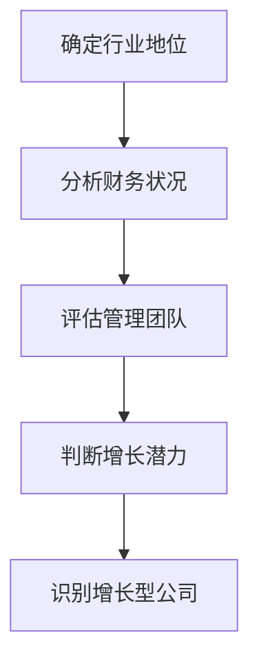

                 


# 费雪的增长型公司识别方法

## 关键词：费雪、增长型公司、投资策略、财务指标、选股标准

## 摘要：本文详细介绍了费雪的增长型公司识别方法，分析了增长型公司的核心要素，探讨了费雪的选股标准，并通过实际案例展示了如何系统化地识别增长型公司。文章还讨论了方法的优化与拓展，为投资者提供了实用的指导。

---

# 第1章: 费雪投资理念与增长型公司概述

## 1.1 费雪投资理念的核心思想

### 1.1.1 费雪投资理念的起源与发展

菲利普·费雪（Philip Fisher）是20世纪著名的投资家和价值投资者，他提出了许多影响深远的投资理念。费雪的投资理念起源于对市场的深入研究和对价值投资的探索。他认为，投资不仅仅是购买股票，更是选择那些具有持续增长潜力的公司，并长期持有它们。

### 1.1.2 费雪对价值投资的贡献

费雪在价值投资领域做出了重要贡献。他强调了深入研究公司的基本面，尤其是公司的管理团队、财务状况和行业地位。他还提出了“成长股”的概念，即那些具有持续增长潜力的公司股票。

### 1.1.3 费雪投资理念的核心原则

费雪的核心原则包括：
- 长期投资：选择具有持续增长潜力的公司，长期持有。
- 深入研究：对公司的财务状况、管理团队和行业地位进行详细分析。
- 避免短期波动：忽略市场的短期波动，专注于公司的长期增长。

### 1.1.4 增长型公司的定义与特征

#### 1.1.4.1 增长型公司的定义

增长型公司是指那些在行业中具有领先地位，能够持续增长并为股东创造价值的公司。这些公司通常具有较高的增长率和较强的市场竞争力。

#### 1.1.4.2 增长型公司的核心特征

- 高增长率：公司收入和利润持续增长。
- 市场领先地位：公司在行业中具有较高的市场份额。
- 强大的管理团队：公司管理层能力强，决策明智。
- 良好的财务状况：公司财务健康，盈利能力强。
- 持续创新能力：公司能够不断推出新产品或服务。

### 1.1.5 费雪增长型公司识别方法的背景

#### 1.1.5.1 费雪方法的提出背景

费雪在20世纪中期提出了增长型公司的识别方法，主要是为了帮助投资者在市场中找到那些能够持续增长并为股东创造价值的公司。

#### 1.1.5.2 费雪方法的应用场景

费雪方法适用于长期投资者，尤其是那些希望投资于具有持续增长潜力的公司的投资者。

#### 1.1.5.3 费雪方法的局限性

费雪方法的局限性在于它过于依赖公司的财务数据和管理团队的质量，而忽略了市场波动和宏观经济因素的影响。

---

# 第2章: 增长型公司的核心要素分析

## 2.1 财务健康状况

### 2.1.1 净利润与增长性

净利润是衡量公司财务健康状况的重要指标。增长型公司通常具有稳定的净利润增长，这表明公司具有较强的盈利能力。

### 2.1.2 营业收入增长率

营业收入增长率是衡量公司业务增长的重要指标。增长型公司通常具有较高的营业收入增长率，这表明公司业务在持续扩大。

### 2.1.3 资产负债表分析

资产负债表分析是评估公司财务健康状况的重要步骤。增长型公司通常具有较低的负债率和较高的资产流动性。

## 2.2 管理层质量

### 2.2.1 管理层的稳定性

管理层的稳定性是评估公司管理能力的重要指标。增长型公司通常具有稳定的管理层，这表明公司能够持续进行有效的管理。

### 2.2.2 管理层的决策能力

管理层的决策能力是评估公司管理能力的重要指标。增长型公司通常具有较强的决策能力，能够应对市场变化和挑战。

### 2.2.3 管理层的道德与诚信

管理层的道德与诚信是评估公司管理能力的重要指标。增长型公司通常具有较高的道德标准和诚信，这有助于公司长期发展。

## 2.3 行业地位与竞争优势

### 2.3.1 行业的生命周期

行业的生命周期是影响公司增长的重要因素。增长型公司通常处于行业的成长期或成熟期，具有较大的市场潜力。

### 2.3.2 市场地位与份额

市场地位与份额是衡量公司行业地位的重要指标。增长型公司通常具有较高的市场份额，能够在行业中占据领先地位。

### 2.3.3 核心竞争优势

核心竞争优势是衡量公司竞争力的重要指标。增长型公司通常具有较强的核心竞争优势，能够在行业中保持领先地位。

## 2.4 创新能力与研发投入

### 2.4.1 创新能力的重要性

创新能力是推动公司增长的重要因素。增长型公司通常具有较强的创新能力，能够不断推出新产品或服务。

### 2.4.2 研发投入与增长的关系

研发投入是衡量公司创新能力的重要指标。增长型公司通常具有较高的研发投入，能够推动公司的技术创新和产品升级。

### 2.4.3 技术创新的案例分析

通过分析一些技术创新的案例，我们可以更好地理解增长型公司的创新能力。例如，苹果公司的持续创新推动了其在全球科技行业的领先地位。

---

# 第3章: 费雪增长型公司识别的核心指标

## 3.1 费雪的选股标准

### 3.1.1 费雪的"检查清单"

费雪提出了一个“检查清单”，用于评估公司的潜力。这个清单包括以下几个方面：
- 公司是否有持续的创新能力？
- 管理层是否诚实可靠？
- 财务状况是否健康？

### 3.1.2 费雪的"十倍股"标准

费雪提出了“十倍股”的概念，即那些能够在未来几年内实现股价增长十倍的公司。这些公司通常具有较高的增长率和较大的市场潜力。

### 3.1.3 费雪的增长型公司筛选流程

费雪的增长型公司筛选流程包括以下几个步骤：
1. 确定公司的行业地位和竞争优势。
2. 分析公司的财务状况和盈利能力。
3. 评估公司的管理团队和道德标准。
4. 确定公司是否具有持续增长的潜力。

## 3.2 财务指标的筛选与分析

### 3.2.1 净利润增长率

净利润增长率是衡量公司盈利能力的重要指标。增长型公司通常具有较高的净利润增长率。

### 3.2.2 营业收入增长率

营业收入增长率是衡量公司业务增长的重要指标。增长型公司通常具有较高的营业收入增长率。

### 3.2.3 净利润率与ROE分析

净利润率和ROE是衡量公司盈利能力的重要指标。增长型公司通常具有较高的净利润率和ROE。

## 3.3 股价与估值的匹配

### 3.3.1 市盈率与增长率匹配

市盈率与增长率的匹配是评估公司股价合理性的关键因素。增长型公司通常具有较高的市盈率，但其增长率也较高，因此市盈率与增长率的匹配是合理的。

### 3.3.2 市净率与公司价值的关系

市净率与公司价值的关系是评估公司股价合理性的重要因素。增长型公司通常具有较低的市净率，但其公司价值较高。

### 3.3.3 股价合理性的判断

通过分析市盈率、市净率和增长率等指标，可以判断公司股价的合理性。增长型公司通常具有较高的股价，但其增长潜力也较大。

---

# 第4章: 费雪增长型公司识别的系统化方法

## 4.1 费雪方法的系统化框架

### 4.1.1 系统化识别的核心步骤

系统化识别的核心步骤包括：
1. 确定公司的行业地位和竞争优势。
2. 分析公司的财务状况和盈利能力。
3. 评估公司的管理团队和道德标准。
4. 确定公司是否具有持续增长的潜力。

### 4.1.2 系统化识别的流程图

以下是系统化识别的增长型公司流程图：



### 4.1.3 系统化识别的注意事项

在系统化识别过程中，需要注意以下几点：
- 数据的准确性和完整性。
- 方法的适用性和灵活性。
- 风险的评估和管理。

## 4.2 费雪方法的量化指标体系

### 4.2.1 增长型公司的量化标准

增长型公司的量化标准包括：
- 净利润增长率 ≥ 15%。
- 营业收入增长率 ≥ 20%。
- 净利润率 ≥ 10%。
- ROE ≥ 20%。

### 4.2.2 财务指标的权重分配

财务指标的权重分配如下：
- 净利润增长率：40%。
- 营业收入增长率：30%。
- 净利润率：20%。
- ROE：10%。

### 4.2.3 指标体系的动态调整

根据市场环境和公司实际情况，需要动态调整量化指标体系。例如，当市场环境发生变化时，可以适当调整增长率和利润率的权重。

## 4.3 费雪方法的案例分析

### 4.3.1 案例选取

以苹果公司为例，分析其是否符合费雪的增长型公司识别标准。

### 4.3.2 案例分析步骤

1. 确定苹果公司的行业地位：苹果是全球领先的科技公司，具有强大的市场竞争力。
2. 分析苹果公司的财务状况：苹果具有较高的净利润增长率和营业收入增长率，财务状况健康。
3. 评估苹果公司的管理团队：苹果的管理团队稳定且能力强。
4. 判断苹果公司的增长潜力：苹果具有较高的增长潜力，符合费雪的增长型公司识别标准。

### 4.3.3 案例分析的结论与启示

通过分析苹果公司，我们可以看到费雪的增长型公司识别方法的有效性。苹果公司符合费雪的选股标准，具有较高的增长潜力。

---

# 第5章: 费雪增长型公司识别方法的实战应用

## 5.1 实战环境的搭建

### 5.1.1 数据来源的选择

可以选择以下数据来源：
- 财务报表数据。
- 行业分析报告。
- 市场研究数据。

### 5.1.2 数据分析工具的安装

可以选择以下数据分析工具：
- Python编程语言。
- Pandas、NumPy等数据分析库。
- Matplotlib或Seaborn等可视化库。

### 5.1.3 数据库的建立与管理

可以使用以下数据库：
- SQL数据库。
- NoSQL数据库。
- 数据仓库。

## 5.2 核心代码实现

### 5.2.1 数据清洗与预处理

```python
import pandas as pd

# 读取数据
df = pd.read_csv('companies.csv')

# 删除缺失值
df.dropna(inplace=True)

# 去重
df = df.drop_duplicates()

# 转换数据类型
df['revenue_growth'] = df['revenue_growth'].astype(float)
```

### 5.2.2 费雪指标的计算与筛选

```python
# 计算费雪指标
def fisher_scores(df):
    scores = []
    for index, row in df.iterrows():
        score = 0
        # 判断净利润增长率是否大于15%
        if row['net_profit_growth'] >= 15:
            score += 1
        # 判断营业收入增长率是否大于20%
        if row['revenue_growth'] >= 20:
            score += 1
        # 判断利润率是否大于10%
        if row['net_profit_margin'] >= 10:
            score += 1
        # 判断ROE是否大于20%
        if row['roe'] >= 20:
            score += 1
        scores.append(score)
    return scores

# 应用费雪指标计算
scores = fisher_scores(df)
df['fisher_score'] = scores

# 筛选增长型公司
growth_companies = df[df['fisher_score'] >= 3]
```

### 5.2.3 数据可视化与结果展示

```python
import matplotlib.pyplot as plt

# 绘制增长型公司分布图
plt.figure(figsize=(10, 6))
plt.hist(growth_companies['fisher_score'], bins=5, edgecolor='black')
plt.title('Fisher Score Distribution of Growth Companies')
plt.xlabel('Fisher Score')
plt.ylabel('Frequency')
plt.show()
```

## 5.3 实战案例分析

### 5.3.1 某行业的增长型公司识别

以科技行业为例，使用费雪方法识别增长型公司。

### 5.3.2 案例分析的详细步骤

1. 收集科技行业的公司数据。
2. 清洗和预处理数据。
3. 计算费雪指标。
4. 筛选增长型公司。
5. 分析结果并得出结论。

### 5.3.3 案例分析的结果与解读

通过分析，我们识别出了一些符合条件的增长型公司，这些公司在未来具有较高的增长潜力。

---

# 第6章: 费雪增长型公司识别方法的优化与拓展

## 6.1 方法的优化与改进

### 6.1.1 费雪方法的局限性

费雪方法的局限性在于它过于依赖财务数据和管理团队的质量，而忽略了市场波动和宏观经济因素的影响。

### 6.1.2 方法的优化方向

优化方向包括：
- 引入更多的指标，如市盈率、市净率等。
- 结合其他投资策略，如技术分析。
- 动态调整指标权重，以适应市场变化。

### 6.1.3 新指标的引入与测试

引入新指标，如市盈率和市净率，并进行测试。

## 6.2 费雪方法的扩展应用

### 6.2.1 在不同行业的应用

费雪方法可以应用于不同行业，如科技、医疗、消费等。

### 6.2.2 在不同市场环境下的应用

费雪方法在不同市场环境下有不同的表现，需要根据具体情况调整。

## 6.3 费雪方法的未来发展趋势

### 6.3.1 数据驱动的投资决策

随着大数据和人工智能的发展，数据驱动的投资决策将越来越重要。

### 6.3.2 智能化投资工具的应用

智能化投资工具可以帮助投资者更高效地识别增长型公司。

### 6.3.3 可持续投资与ESG因素的结合

可持续投资和ESG（环境、社会、治理）因素的结合将成为未来投资的重要方向。

---

# 作者：AI天才研究院/AI Genius Institute & 禅与计算机程序设计艺术 /Zen And The Art of Computer Programming

