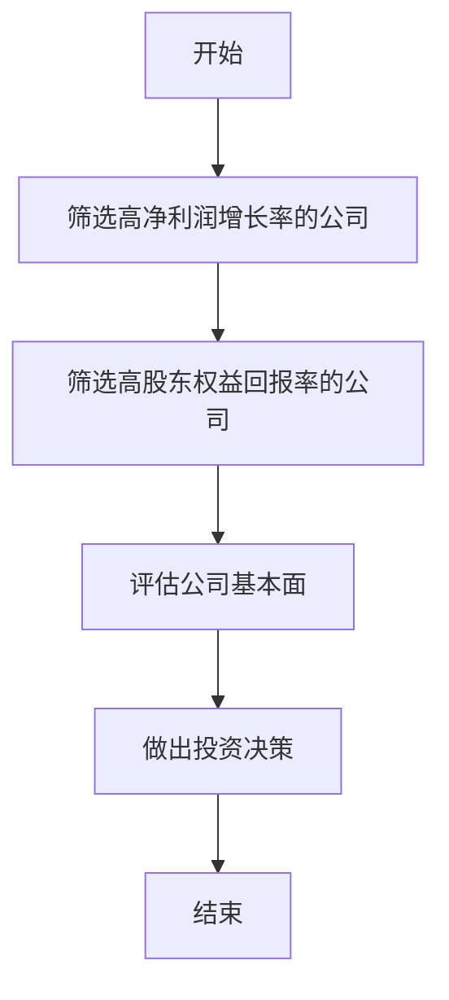

                 


# 费雪的成长型投资策略

## 关键词：成长型投资，费雪，投资策略，净利润增长率，股东权益回报率，投资回报率

## 摘要：费雪的成长型投资策略是一种基于公司基本面分析的投资方法，旨在通过投资于具有持续增长潜力的公司来实现长期资本增值。本文详细阐述了该策略的核心概念、数学模型、系统架构及实际应用，帮助读者全面理解和应用这一投资策略。

---

# 第一部分：成长型投资策略概述

## 第1章：成长型投资的背景与核心理念

### 1.1 投资的基本概念
- 投资的定义与分类
- 投资的基本原则与目标
- 投资在个人财务规划中的重要性

### 1.2 成长型投资的定义与特点
- 成长型投资的核心定义
- 成长型投资与价值投资的区别
- 成长型投资的长期视角

### 1.3 费雪的成长型投资策略
- 费雪的生平与投资理念
- 费雪策略的核心思想：寻找具有持续增长能力的公司
- 费雪策略与其他策略的对比分析

---

# 第二部分：费雪投资策略的核心要素

## 第2章：成长型投资的核心概念与联系

### 2.1 核心概念原理
- 成长型投资的核心要素：净利润增长率、股东权益回报率
- 公司基本面分析的关键指标
- 费雪策略中的关键概念：ROE、净利润增长率

### 2.2 核心概念对比表格
- 不同成长型投资策略的对比分析
- 费雪策略与其他策略的优劣势对比

### 2.3 ER实体关系图
```mermaid
er
    %% 成长型投资策略的 ER 图
    entity 成长型投资策略 {
        id
        投资目标
        策略类型
        关键指标
    }
    
    entity 公司基本面 {
        id
        净利润增长率
        股东权益回报率
        营收增长率
    }
    
    entity 投资决策 {
        id
        投资金额
        投资时间
        投资收益
    }
    
    成长型投资策略 --> 公司基本面: 依据
    公司基本面 --> 投资决策: 决策依据
```

---

# 第三部分：费雪投资策略的数学模型与算法

## 第3章：成长型投资的数学模型与公式

### 3.1 投资回报率的计算
- 投资回报率的公式：$$ ROI = \frac{利润}{投资成本} \times 100\% $$
- 复利计算公式：$$ A = P(1 + r)^n $$

### 3.2 费雪策略中的关键指标计算
- 净利润增长率：$$ 净利润增长率 = \frac{当年净利润 - 上年净利润}{上年净利润} \times 100\% $$
- 股东权益回报率（ROE）：$$ ROE = \frac{净利润}{股东权益} \times 100\% $$

### 3.3 费雪策略的算法流程图


---

# 第四部分：系统分析与架构设计

## 第4章：成长型投资策略的系统分析

### 4.1 问题场景介绍
- 成长型投资的典型应用场景
- 费雪策略在实际投资中的应用案例

### 4.2 系统功能设计
- 数据收集模块：收集公司财务数据
- 筛选标准模块：设定净利润增长率和ROE筛选条件
- 投资决策模块：基于筛选结果做出投资决策

### 4.3 系统架构设计


### 4.4 系统接口设计
- 数据接口：从财务数据库中获取数据
- 筛选接口：根据设定条件筛选公司

---

# 第五部分：项目实战

## 第5章：成长型投资策略的项目实现

### 5.1 环境安装
- 安装必要的Python库：pandas、numpy

### 5.2 系统核心实现源代码
```python
import pandas as pd

def筛选成长股(财务数据):
    # 筛选净利润增长率大于15%的公司
   净利润增长率 = (财务数据['净利润'] - 财务数据['上年净利润']) / 财务数据['上年净利润'] * 100
    筛选条件1 = 净利润增长率 > 15

    # 筛选股东权益回报率大于20%的公司
    ROE = 财务数据['净利润'] / 财务数据['股东权益'] * 100
    筛选条件2 = ROE > 20

    # 同时满足两个条件的公司
    筛选结果 = 财务数据[筛选条件1 & 筛选条件2]
    return 筛选结果

# 示例数据
财务数据 = pd.DataFrame({
    '公司': ['A', 'B', 'C'],
    '净利润': [10, 15, 20],
    '上年净利润': [5, 10, 15],
    '股东权益': [50, 30, 40]
})

# 调用函数
筛选结果 = 筛选成长股(财务数据)
print(筛选结果)
```

### 5.3 代码应用解读与分析
- 代码实现的步骤：数据获取、条件筛选、结果输出
- 筛选逻辑的具体应用：如何通过代码实现费雪策略的核心指标筛选

### 5.4 实际案例分析
- 使用实际的财务数据进行筛选，展示筛选结果
- 分析筛选结果，解释哪些公司符合费雪策略的筛选条件

### 5.5 项目小结
- 项目实现的关键点
- 项目中的问题与解决方案

---

# 第六部分：总结与展望

## 第6章：总结与展望

### 6.1 最佳实践 tips
- 如何选择合适的财务数据源
- 如何避免市场波动对投资决策的影响
- 如何定期评估和调整投资组合

### 6.2 小结
- 费雪成长型投资策略的核心思想
- 该策略在实际投资中的应用价值

### 6.3 注意事项
- 投资有风险，需谨慎
- 避免过度依赖单一指标
- 定期复盘和调整投资策略

### 6.4 拓展阅读
- 推荐书籍：《股票作手回忆录》
- 推荐网站：Morningstar, Yahoo Finance

---

# 作者：AI天才研究院/AI Genius Institute & 禅与计算机程序设计艺术 /Zen And The Art of Computer Programming

