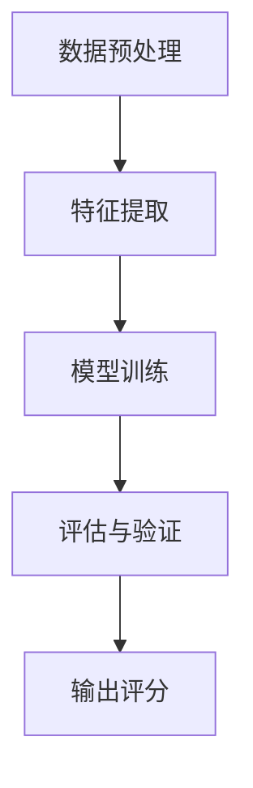
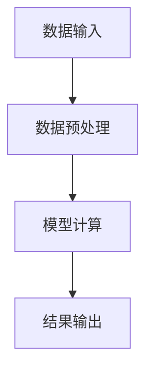
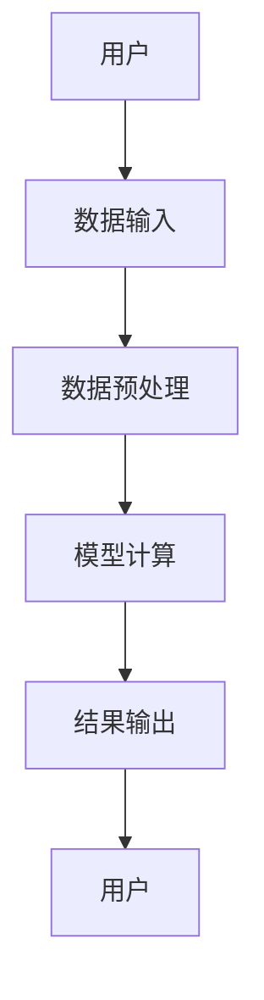

                 

---

# 费雪的技术创新评估

**关键词：** 费雪模型、技术创新评估、算法原理、系统架构、项目实战

**摘要：** 本文详细探讨了费雪的技术创新评估模型，从背景介绍、核心概念、算法原理到系统架构和项目实战，结合实例分析，深入剖析了该模型在实际应用中的优势和挑战。通过详细的步骤分析和图表展示，帮助读者全面理解并掌握如何应用费雪模型进行技术创新评估。

---

# 第一部分: 费雪的技术创新评估背景与核心概念

# 第1章: 技术创新评估的背景与问题背景

## 1.1 技术创新评估的背景

### 1.1.1 技术创新的定义与重要性

技术创新是指在现有技术基础上，通过引入新的技术、方法或理念，以提高产品或服务的性能、质量和效率的过程。在当今快速变化的科技行业中，技术创新是企业保持竞争力的核心驱动力。创新不仅能够带来新的市场机会，还能提高企业的生产效率和产品质量。

### 1.1.2 技术创新评估的重要性

技术创新评估是对技术创新过程中的关键因素进行分析和评价，以确保创新活动的有效性和可持续性。通过评估，企业可以识别出潜在的技术瓶颈，优化资源配置，并制定更科学的技术发展战略。在实际应用中，技术创新评估能够帮助企业规避技术风险，降低研发成本，并提高创新的成功率。

### 1.1.3 费雪模型的基本概念

费雪模型是一种基于技术创新评估的数学模型，它通过量化分析技术创新过程中的关键因素，帮助企业评估技术的可行性和潜在价值。费雪模型的核心在于通过分析技术的可实现性、市场适应性和经济可行性，为企业提供科学的技术评估依据。

## 1.2 技术创新评估的核心问题

### 1.2.1 技术创新评估的主要挑战

技术创新评估面临的主要挑战包括数据获取困难、评估指标的复杂性和评估方法的多样性。由于技术创新涉及多个领域，评估指标的选择和权重分配需要综合考虑技术、市场和经济等多个方面的因素。此外，技术创新评估需要动态调整，以适应快速变化的技术环境。

### 1.2.2 费雪模型的应用场景

费雪模型适用于多种技术创新评估场景，包括新产品开发、技术引进、技术合作和技术战略制定等。由于费雪模型能够量化分析技术创新的多个维度，它特别适合在需要综合考虑技术、市场和经济因素的复杂场景中应用。

### 1.2.3 技术创新评估的边界与外延

技术创新评估的边界在于技术创新的范围和评估的时间范围。外延则包括与技术创新相关的其他领域，如知识产权保护、技术转移和知识管理等。费雪模型通过综合分析技术创新的内外部因素，能够提供全面的技术评估结果。

## 1.3 费雪模型的核心要素

### 1.3.1 费雪模型的构成部分

费雪模型主要包括输入、处理和输出三个部分。输入部分包括技术创新的描述、市场数据和经济指标；处理部分包括数据的预处理、模型的构建和评估指标的计算；输出部分包括技术创新的评分、潜在风险和改进建议。

### 1.3.2 核心要素的定义与属性

技术创新的描述包括技术的功能、技术的实现方式和技术创新的目标；市场数据包括市场规模、市场需求和竞争状况；经济指标包括研发成本、预期收益和投资回报率。

### 1.3.3 费雪模型的数学表达式

费雪模型的数学表达式如下：

$$
\text{技术创新评分} = f(\text{技术可行性}, \text{市场适应性}, \text{经济可行性})
$$

其中，$f$ 是费雪模型的综合评估函数，$技术可行性$、$市场适应性$和$经济可行性$是具体的评估指标。

## 1.4 本章小结

本章介绍了技术创新评估的背景和重要性，详细阐述了费雪模型的基本概念和核心要素。通过分析技术创新评估的核心问题，为后续章节的深入探讨奠定了基础。

---

# 第2章: 费雪模型的核心概念与联系

## 2.1 费雪模型的核心概念

### 2.1.1 技术创新的评估维度

技术创新的评估维度包括技术可行性、市场适应性和经济可行性。技术可行性是指技术创新在技术上的实现难度和可实现性；市场适应性是指技术创新在市场上的需求和接受度；经济可行性是指技术创新的经济成本和预期收益。

### 2.1.2 费雪模型的输入与输出

费雪模型的输入包括技术创新的描述、市场数据和经济指标；输出包括技术创新的评分、潜在风险和改进建议。

### 2.1.3 费雪模型的评估指标

费雪模型的评估指标包括技术创新的评分、潜在风险和改进建议。技术创新评分是对技术创新的整体评估，潜在风险是对技术创新可能面临的问题的预测，改进建议是对技术创新的优化建议。

### 2.1.4 费雪模型与其他技术创新评估方法的对比

费雪模型与传统技术创新评估方法相比，具有更高的科学性和可操作性。传统方法通常基于主观判断，而费雪模型通过量化分析，能够提供更客观的评估结果。此外，费雪模型能够综合考虑技术、市场和经济因素，具有更高的全面性。

### 2.1.5 费雪模型的核心原理

费雪模型的核心原理是通过量化分析技术创新的多个维度，综合评估技术创新的可行性。它通过构建数学模型，将技术创新的各个因素转化为可量化的指标，从而实现对技术创新的科学评估。

### 2.1.6 费雪模型的数学推导

费雪模型的数学推导基于综合评估函数的构建。通过将技术创新的各个因素进行加权，构建综合评分函数：

$$
\text{技术创新评分} = w_1 \cdot \text{技术可行性} + w_2 \cdot \text{市场适应性} + w_3 \cdot \text{经济可行性}
$$

其中，$w_1$、$w_2$和$w_3$是各评估指标的权重，通常通过专家评分或数据分析确定。

## 2.2 费雪模型的核心原理

### 2.2.1 技术创新的评估逻辑

技术创新的评估逻辑包括数据收集、模型构建、评估计算和结果分析四个步骤。数据收集阶段需要获取技术创新的描述、市场数据和经济指标；模型构建阶段需要建立综合评估函数；评估计算阶段需要根据输入数据计算技术创新评分；结果分析阶段需要根据评分结果提出改进建议。

### 2.2.2 费雪模型的数学表达式

费雪模型的数学表达式如下：

$$
\text{技术创新评分} = w_1 \cdot \text{技术可行性} + w_2 \cdot \text{市场适应性} + w_3 \cdot \text{经济可行性}
$$

其中，$w_1$、$w_2$和$w_3$是各评估指标的权重，$技术可行性$、$市场适应性$和$经济可行性$是具体的评估指标。

### 2.2.3 费雪模型的适用范围与限制

费雪模型适用于多种技术创新评估场景，包括新产品开发、技术引进和技术合作等。然而，费雪模型也存在一些限制，如模型的复杂性和数据依赖性。在实际应用中，需要根据具体场景调整模型的参数和评估指标。

## 2.3 费雪模型的核心要素

### 2.3.1 技术创新的评估维度

技术创新的评估维度包括技术可行性、市场适应性和经济可行性。技术可行性是指技术创新在技术上的实现难度和可实现性；市场适应性是指技术创新在市场上的需求和接受度；经济可行性是指技术创新的经济成本和预期收益。

### 2.3.2 费雪模型的输入与输出

费雪模型的输入包括技术创新的描述、市场数据和经济指标；输出包括技术创新的评分、潜在风险和改进建议。

### 2.3.3 费雪模型的评估指标

费雪模型的评估指标包括技术创新的评分、潜在风险和改进建议。技术创新评分是对技术创新的整体评估，潜在风险是对技术创新可能面临的问题的预测，改进建议是对技术创新的优化建议。

## 2.4 本章小结

本章详细探讨了费雪模型的核心概念和评估逻辑，分析了其与其他技术创新评估方法的差异，并通过数学推导展示了费雪模型的评估函数。这些内容为后续章节的深入分析奠定了理论基础。

---

# 第3章: 费雪模型的算法原理与数学模型

## 3.1 费雪模型的算法原理

### 3.1.1 数据预处理与特征提取

数据预处理是费雪模型的关键步骤之一，包括数据清洗、数据转换和数据归一化。特征提取则是从原始数据中提取对技术创新评估有重要影响的特征，如技术复杂度、市场需求和投资回报率。

### 3.1.2 模型的训练与优化

费雪模型的训练过程包括参数估计和模型优化。参数估计通常通过回归分析或专家评分确定各评估指标的权重。模型优化则是通过调整模型参数，提高评估结果的准确性和可靠性。

### 3.1.3 模型的评估与验证

模型的评估与验证是确保费雪模型准确性的关键步骤。评估过程包括计算模型的预测准确率和评估结果的可解释性。验证则是通过实际案例测试，验证模型的适用性和稳定性。

## 3.2 费雪模型的数学模型

### 3.2.1 费雪模型的数学表达式

费雪模型的数学表达式如下：

$$
\text{技术创新评分} = w_1 \cdot \text{技术可行性} + w_2 \cdot \text{市场适应性} + w_3 \cdot \text{经济可行性}
$$

其中，$w_1$、$w_2$和$w_3$是各评估指标的权重，$技术可行性$、$市场适应性$和$经济可行性$是具体的评估指标。

### 3.2.2 模型的参数与变量

费雪模型的参数包括各评估指标的权重，变量包括技术创新的各个评估指标。权重的确定可以通过专家评分或数据分析实现，评估指标则需要根据具体场景进行选择。

### 3.2.3 模型的计算流程

费雪模型的计算流程包括数据预处理、参数估计、模型训练和结果分析四个步骤。数据预处理阶段需要清洗和转换原始数据；参数估计阶段需要确定各评估指标的权重；模型训练阶段需要构建综合评分函数；结果分析阶段需要根据评分结果提出改进建议。

## 3.3 费雪模型的算法流程图

## 3.4 本章小结

本章详细探讨了费雪模型的算法原理和数学模型，通过流程图展示了模型的计算流程。这些内容为后续章节的系统架构设计和项目实战提供了理论支持。

---

# 第4章: 费雪模型的系统架构与实现

## 4.1 费雪模型的系统架构设计

### 4.1.1 系统功能设计

费雪模型的系统功能包括数据输入、模型计算和结果输出。数据输入模块负责接收技术创新的描述、市场数据和经济指标；模型计算模块负责根据输入数据计算技术创新评分；结果输出模块负责展示评估结果和改进建议。

### 4.1.2 系统架构图

### 4.1.3 系统接口设计

费雪模型的系统接口包括数据输入接口、模型计算接口和结果输出接口。数据输入接口负责接收技术创新的描述、市场数据和经济指标；模型计算接口负责根据输入数据计算技术创新评分；结果输出接口负责展示评估结果和改进建议。

### 4.1.4 系统交互图

## 4.2 费雪模型的系统实现

### 4.2.1 环境安装与配置

费雪模型的系统实现需要安装和配置必要的软件和工具，包括Python编程语言、NumPy库、Pandas库和Matplotlib库。环境配置完成后，需要进行必要的参数设置和模型训练。

### 4.2.2 核心代码实现

费雪模型的核心代码实现包括数据预处理、模型训练和结果输出。数据预处理阶段需要清洗和转换原始数据；模型训练阶段需要构建综合评分函数；结果输出阶段需要展示评估结果和改进建议。

## 4.3 本章小结

本章详细探讨了费雪模型的系统架构与实现，通过系统架构图和交互图展示了模型的实现过程。这些内容为后续章节的项目实战提供了技术支持。

---

# 第5章: 费雪模型的项目实战

## 5.1 项目背景与目标

### 5.1.1 项目背景

项目背景包括技术创新的描述、市场数据和经济指标。技术创新的描述包括技术的功能和实现方式；市场数据包括市场规模和市场需求；经济指标包括研发成本和预期收益。

### 5.1.2 项目目标

项目目标是通过费雪模型评估技术创新的可行性，为企业制定技术战略提供科学依据。具体目标包括技术创新评分的计算、潜在风险的预测和改进建议的提出。

## 5.2 项目实战

### 5.2.1 数据准备与处理

数据准备与处理包括数据清洗、数据转换和数据归一化。数据清洗阶段需要去除无效数据；数据转换阶段需要将数据转换为适合模型计算的形式；数据归一化阶段需要对数据进行标准化处理。

### 5.2.2 模型训练与评估

模型训练与评估包括参数估计、模型训练和结果分析。参数估计阶段需要确定各评估指标的权重；模型训练阶段需要构建综合评分函数；结果分析阶段需要根据评分结果提出改进建议。

## 5.3 实例分析与结果解读

### 5.3.1 实例分析

实例分析包括技术创新的描述、市场数据和经济指标的具体数值。技术创新的描述包括技术的功能和实现方式；市场数据包括市场规模和市场需求；经济指标包括研发成本和预期收益。

### 5.3.2 结果解读

结果解读包括技术创新评分、潜在风险和改进建议的具体内容。技术创新评分是对技术创新的整体评估；潜在风险是对技术创新可能面临的问题的预测；改进建议是对技术创新的优化建议。

## 5.4 本章小结

本章通过实例分析展示了费雪模型在技术创新评估中的实际应用，验证了模型的科学性和可操作性。实例分析的结果为企业的技术决策提供了有力支持。

---

# 第6章: 费雪模型的最佳实践与总结

## 6.1 费雪模型的最佳实践

### 6.1.1 数据质量的重要性

数据质量是费雪模型评估结果准确性的关键因素。高质量的数据能够提高模型的预测准确率和评估结果的可解释性。因此，在数据准备阶段，需要进行严格的数据清洗和数据转换。

### 6.1.2 模型调优的技巧

模型调优是提高费雪模型评估结果的重要手段。通过调整各评估指标的权重和优化模型参数，可以提高模型的预测准确率和评估结果的可靠性。在实际应用中，可以采用交叉验证和网格搜索等方法进行模型调优。

### 6.1.3 结果解读的注意事项

结果解读是费雪模型应用的重要环节。在解读评估结果时，需要结合具体的技术创新背景和实际应用场景，全面分析技术创新的可行性。此外，还需要关注潜在风险和改进建议的具体内容，确保评估结果的有效性和可操作性。

## 6.2 费雪模型的总结与展望

### 6.2.1 费雪模型的总结

费雪模型是一种基于技术创新评估的数学模型，通过量化分析技术创新的多个维度，为企业提供科学的技术评估依据。费雪模型的核心在于通过综合考虑技术、市场和经济因素，实现对技术创新的全面评估。

### 6.2.2 费雪模型的展望

随着技术的进步和数据的丰富，费雪模型在技术创新评估中的应用前景广阔。未来的研究方向包括模型的优化与改进、应用场景的拓展以及与其他技术创新评估方法的结合。通过不断的研究和实践，费雪模型将在技术创新评估领域发挥更大的作用。

## 6.3 本章小结

本章总结了费雪模型的最佳实践，分析了其在技术创新评估中的应用前景。通过对数据质量、模型调优和结果解读的讨论，为读者提供了科学的技术评估方法。

---

# 附录: 费雪模型的相关术语表

---

**作者：AI天才研究院/AI Genius Institute & 禅与计算机程序设计艺术 /Zen And The Art of Computer Programming**

