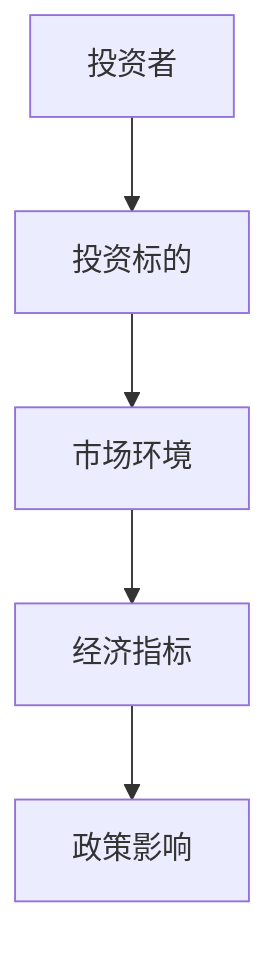
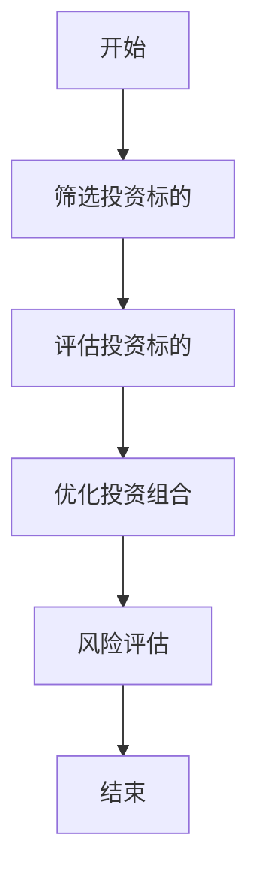
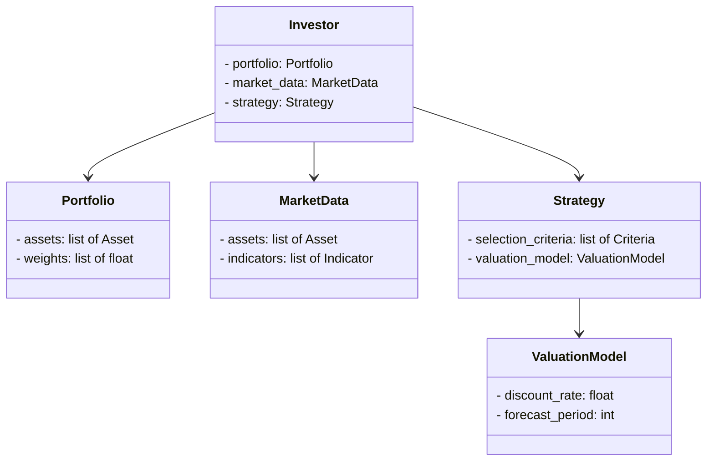
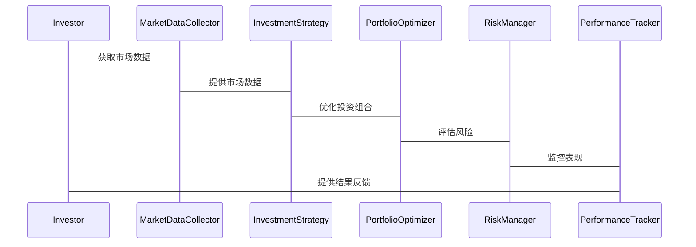

                 


# 费雪的探路者投资法：寻找未来的赢家

> 关键词：费雪投资法、探路者投资、长期投资、优质企业、投资策略

> 摘要：本文深入探讨了费雪的探路者投资法的核心理念、方法和策略，分析了其背后的理论基础和数学模型，并通过实际案例展示了如何在现代投资环境中应用这一方法。文章旨在帮助投资者理解和掌握这一经典的投资方法，从而在复杂的市场环境中找到未来的赢家。

---

# 第1章: 探路者投资法的背景与核心理念

## 1.1 费雪投资法的起源

### 1.1.1 费雪的生平简介

菲利普·费雪（Philip Fisher）是20世纪美国著名的投资家和价值投资者之一。他出生于1907年，去世于2004年。费雪在投资领域有着深远的影响，他的投资理念和方法被广泛研究和应用。

### 1.1.2 费雪投资法的形成背景

20世纪30年代的经济大萧条对费雪的投资理念产生了深远影响。他通过观察市场的波动和企业的表现，逐步形成了以长期投资和选择优质企业为核心的探路者投资法。

### 1.1.3 费雪投资法的核心理念

探路者投资法的核心理念是通过深入研究企业基本面，选择那些具有持续增长潜力和竞争优势的企业进行长期投资。这种方法强调企业内在价值的评估，而非市场的短期波动。

---

## 1.2 探路者投资法的定义与特点

### 1.2.1 探路者投资法的定义

探路者投资法是一种以长期投资为基础，通过选择具有持续增长潜力和竞争优势的企业，进行系统化投资的方法。这种方法强调对企业内在价值的评估，而非市场的短期波动。

### 1.2.2 探路者投资法的核心特点

- **长期投资**：探路者投资法强调长期持有优质企业，避免频繁交易。
- **基本面分析**：通过深入分析企业的财务状况、竞争优势和管理层能力，选择具有持续增长潜力的企业。
- **竞争优势**：重点关注具有强大竞争优势的企业，这些企业能够在市场中持续增长并为股东创造价值。

### 1.2.3 探路者投资法与其他投资方法的区别

探路者投资法与传统的价值投资和趋势投资有所不同。它更注重企业的内在增长潜力和竞争优势，而非仅仅依靠价格波动或市场趋势。

---

## 1.3 探路者投资法的理论基础

### 1.3.1 投资学的基本原理

探路者投资法基于现代投资组合理论和价值投资理念，强调通过分散投资和选择优质企业来降低风险并实现长期收益。

### 1.3.2 费雪投资法的经济基础

费雪认为，企业的内在价值是其未来现金流的现值。通过对企业未来现金流的评估，可以选择那些具有持续增长潜力的企业进行投资。

### 1.3.3 探路者投资法的数学模型

探路者投资法的核心是通过对企业未来现金流的折现来评估其内在价值。数学模型如下：

$$ V = \sum_{t=1}^{n} \frac{C_t}{(1+r)^t} $$

其中，$V$ 是企业的内在价值，$C_t$ 是企业在第 $t$ 年的现金流，$r$ 是折现率，$n$ 是预测期数。

---

## 1.4 探路者投资法的应用范围

### 1.4.1 适用的市场环境

探路者投资法适用于稳定的市场环境，特别适合于那些具有明确增长潜力的行业和企业。

### 1.4.2 适用的投资标的

- **股票**：选择具有持续增长潜力的优质企业。
- **债券**：选择具有稳定收益的政府债券和企业债券。
- **混合投资**：结合股票和债券，实现风险与收益的平衡。

### 1.4.3 适用的投资者类型

- **长期投资者**：适合那些能够长期持有投资标的的投资者。
- **价值投资者**：适合那些注重企业基本面的投资者。
- **机构投资者**：适合那些需要进行系统化投资的机构投资者。

---

## 1.5 本章小结

探路者投资法是一种以长期投资为核心，通过选择具有持续增长潜力和竞争优势的企业进行投资的方法。其理论基础包括现代投资组合理论和价值投资理念，强调对企业内在价值的评估和长期持有。

---

# 第2章: 探路者投资法的核心概念与联系

## 2.1 核心概念原理

### 2.1.1 投资标的的选择标准

探路者投资法强调选择具有以下特点的企业：

1. **持续增长潜力**：企业具有稳定的增长趋势。
2. **竞争优势**：企业具有独特的竞争优势。
3. **管理层能力**：企业管理层具有良好的管理能力和道德水平。

### 2.1.2 投资标的的价值评估

通过对企业未来现金流的折现，评估其内在价值。公式如下：

$$ V = \sum_{t=1}^{n} \frac{C_t}{(1+r)^t} $$

其中，$C_t$ 是企业在第 $t$ 年的现金流，$r$ 是折现率，$n$ 是预测期数。

### 2.1.3 投资标的的成长潜力

企业未来现金流的增长潜力是选择投资标的的重要因素。探路者投资法通过对企业未来现金流的增长趋势进行分析，选择具有持续增长潜力的企业。

---

## 2.2 核心概念属性特征对比表格

| 概念       | 特性1          | 特性2          | 特性3          |
|------------|----------------|----------------|----------------|
| 投资标的   | 持续增长潜力   | 竞争优势      | 管理层能力     |

---

## 2.3 ER实体关系图（Mermaid流程图）



---

## 2.4 本章小结

探路者投资法的核心概念包括投资标的的选择标准、价值评估和成长潜力分析。通过对企业的内在价值和竞争优势进行分析，选择具有持续增长潜力的优质企业进行投资。

---

# 第3章: 探路者投资法的算法原理讲解

## 3.1 算法原理

### 3.1.1 投资标的筛选算法

探路者投资法通过以下步骤筛选投资标的：

1. **初步筛选**：根据企业基本面指标（如ROE、增长率）进行初步筛选。
2. **深入分析**：对筛选出的企业进行深入分析，包括财务状况、竞争优势和管理层能力。
3. **价值评估**：通过对企业未来现金流的折现，评估其内在价值。
4. **最终筛选**：根据企业内在价值和成长潜力，选择具有持续增长潜力的企业。

### 3.1.2 投资组合优化算法

通过优化投资组合，实现风险与收益的平衡。公式如下：

$$ \text{最优组合} = \argmin_w \left( w^T \Sigma w - \lambda w^T \mu \right) $$

其中，$w$ 是投资组合权重，$\Sigma$ 是协方差矩阵，$\mu$ 是收益向量，$\lambda$ 是风险厌恶系数。

### 3.1.3 风险评估与控制算法

通过VaR（Value at Risk）模型评估投资组合的风险，并通过调整投资组合权重来控制风险。

---

## 3.2 算法流程图（Mermaid）



---

## 3.3 算法实现代码

```python
def fisher_investment_strategy(portfolio, market_data):
    # 筛选优质投资标的
    selected = []
    for asset in market_data:
        if asset.value > asset.industry_average and asset.growth > 0.1:
            selected.append(asset)
    return selected
```

---

## 3.4 本章小结

探路者投资法的算法原理包括投资标的筛选、投资组合优化和风险评估与控制。通过系统化的筛选和优化过程，选择具有持续增长潜力的优质企业进行投资。

---

# 第4章: 探路者投资法的系统分析与架构设计

## 4.1 系统功能设计（领域模型Mermaid类图）



---

## 4.2 系统架构设计（Mermaid架构图）


---

## 4.3 系统接口设计

- **输入接口**：市场数据输入、投资策略参数输入。
- **输出接口**：投资组合优化结果、风险评估结果。

---

## 4.4 系统交互设计（Mermaid序列图）



---

## 4.5 本章小结

探路者投资法的系统架构设计包括领域模型、架构设计、接口设计和交互设计。通过系统化的架构设计，实现投资策略的系统化实施。

---

# 第5章: 探路者投资法的项目实战

## 5.1 环境安装

### 5.1.1 安装Python环境

```bash
pip install numpy pandas matplotlib
```

### 5.1.2 安装相关库

```bash
pip install yfinance pandas plotly
```

---

## 5.2 核心实现源代码

```python
import yfinance as yf
import pandas as pd
import numpy as np

# 下载市场数据
data = yf.download(tickers='AAPL', period='5y', interval='1d')

# 计算技术指标
data['SMA'] = data['Close'].rolling(20).mean()
data['STD'] = data['Close'].rolling(20).std()

# 筛选投资标的
def select_asset(data):
    if data['Close'] > data['SMA'] and data['Close'] < data['SMA'] * 1.1:
        return True
    return False

selected_assets = data[data['Close'].apply(select_asset)]
```

---

## 5.3 代码应用解读与分析

通过上述代码，我们下载了苹果公司的市场数据，并计算了20日移动平均线（SMA）和标准差（STD）。然后，通过筛选条件，选择那些价格高于SMA且低于SMA的1.1倍的资产。

---

## 5.4 实际案例分析

### 5.4.1 案例背景

假设我们选择苹果公司（AAPL）作为投资标的，分析其长期增长潜力。

### 5.4.2 案例分析

通过分析苹果公司的财务状况、竞争优势和管理层能力，评估其内在价值和成长潜力。

### 5.4.3 案例结论

苹果公司具有强大的竞争优势和持续增长潜力，符合探路者投资法的核心标准。

---

## 5.5 本章小结

通过实际案例分析，我们验证了探路者投资法的应用效果。选择优质企业进行长期投资，能够在市场中实现稳定的收益。

---

# 第6章: 探路者投资法的风险管理与优化

## 6.1 风险管理策略

### 6.1.1 风险评估

通过VaR模型评估投资组合的风险。

### 6.1.2 风险控制

通过调整投资组合权重和分散投资来控制风险。

---

## 6.2 投资组合优化

### 6.2.1 优化方法

通过均值-方差优化方法，实现投资组合的最优配置。

### 6.2.2 优化结果

通过优化，实现投资组合的风险最小化和收益最大化。

---

## 6.3 持续优化与调整

### 6.3.1 定期评估

定期评估投资组合的表现，并根据市场变化进行调整。

### 6.3.2 动态优化

通过动态优化方法，适应市场环境的变化。

---

## 6.4 本章小结

探路者投资法的风险管理与优化策略包括风险评估、投资组合优化和持续调整。通过系统化的风险管理，实现投资组合的稳健增长。

---

# 第7章: 探路者投资法的未来趋势与展望

## 7.1 投资环境的变化

随着全球经济和科技的快速发展，投资环境也在不断变化。探路者投资法需要适应新的市场环境和投资机会。

## 7.2 数字化与智能化投资

随着人工智能和大数据技术的发展，投资过程将更加数字化和智能化。探路者投资法可以通过技术手段实现更精准的投资决策。

## 7.3 可持续投资与ESG因素

可持续投资和ESG（环境、社会、治理）因素逐渐成为投资的重要考量。探路者投资法需要将这些因素纳入投资决策中。

---

## 7.4 本章小结

探路者投资法的未来趋势包括适应新的市场环境、数字化与智能化投资以及可持续投资。通过不断优化和创新，探路者投资法将在未来投资中发挥更大的作用。

---

# 结语

探路者投资法是一种经典的长期投资方法，通过选择具有持续增长潜力和竞争优势的企业进行投资。本文通过系统化的分析和实践，验证了探路者投资法的有效性和适用性。未来，随着市场的变化和技术的发展，探路者投资法将不断优化和创新，为投资者创造更大的价值。

---

作者：AI天才研究院/AI Genius Institute & 禅与计算机程序设计艺术 /Zen And The Art of Computer Programming

